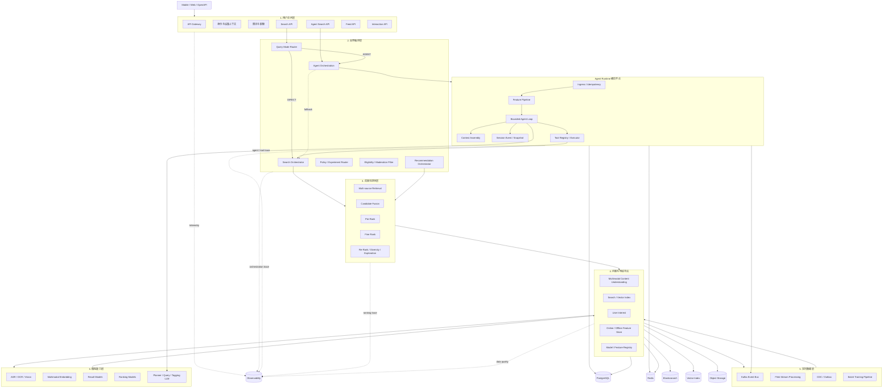
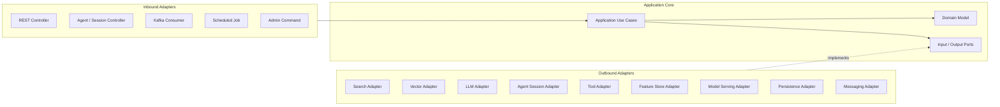
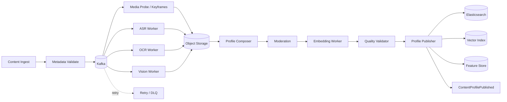
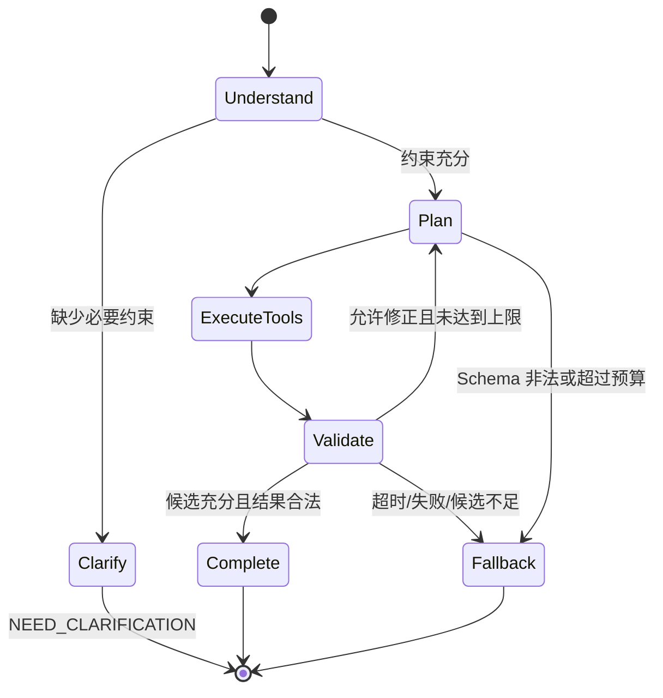
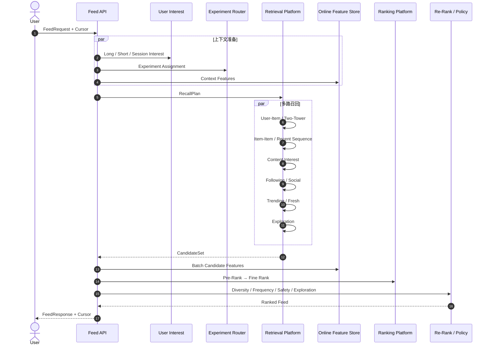

# SeekFlux 系统架构设计

> 面向复杂视频检索的可复用 Agent Runtime 与搜索推荐基础设施

| 属性 | 内容 |
| --- | --- |
| 文档状态 | 架构基线 / v3.0 |
| 目标读者 | Agent 服务端工程师、搜索工程师、后端工程师、算法工程师、SRE、架构师 |
| 核心定位 | 在确定性搜索内核之上自研可复用 Agent Runtime，以短视频复杂搜索作为首个参考应用；推荐与实时反馈作为后续共享能力演进 |
| 首要交付 | Agent Runtime、Direct/Agent 双路径、复杂 Search Agent、结构化执行轨迹和专项评测 |
| 支撑基线 | 当前 6 条固定画像验证 BM25、ANN、融合排序和确定性降级；1 万条作为后续容量基线 |
| 后续演进 | 多实例恢复、模型与策略灰度；按需要扩展 Feed、实时兴趣和更大规模模型 |

> 截至 2026-08-08，Phase 0 与 Phase 1 已由代码、测试、真实链路和版本化 Eval 完成；当前下一步是 Phase 2。Phase 1 使用可复现的确定性决策 Provider 验证内部 Runtime，不代表真实 LLM 或复杂 Search Agent 已完成。唯一开发进度以 [`docs/learning/README.md`](docs/learning/README.md) 为准。

## 目录

- [1. 执行摘要](#1-执行摘要)
- [2. 产品定位与业务边界](#2-产品定位与业务边界)
- [3. 核心业务挑战](#3-核心业务挑战)
- [4. 架构原则](#4-架构原则)
- [5. 总体架构](#5-总体架构)
- [6. 业务领域建模与六边形架构](#6-业务领域建模与六边形架构)
- [7. 核心领域模型](#7-核心领域模型)
- [8. 多模态内容处理与索引构建](#8-多模态内容处理与索引构建)
- [9. 在线搜索与 Search Agent 链路](#9-在线搜索与-search-agent-链路)
- [10. 在线推荐链路](#10-在线推荐链路)
- [11. 统一召回与排序平台](#11-统一召回与排序平台)
- [12. 用户兴趣与特征平台](#12-用户兴趣与特征平台)
- [13. 实时行为数据平台](#13-实时行为数据平台)
- [14. 检索与存储设计](#14-检索与存储设计)
- [15. 缓存与性能架构](#15-缓存与性能架构)
- [16. 模型能力与治理](#16-模型能力与治理)
- [17. API 与事件契约](#17-api-与事件契约)
- [18. 部署、伸缩与高可用](#18-部署伸缩与高可用)
- [19. 可观测性与 SLO](#19-可观测性与-slo)
- [20. 内容安全、隐私与风控](#20-内容安全隐私与风控)
- [21. 质量评测与实验体系](#21-质量评测与实验体系)
- [22. 容量模型与压测](#22-容量模型与压测)
- [23. 分阶段演进路线](#23-分阶段演进路线)
- [24. 推荐技术栈与代码模块](#24-推荐技术栈与代码模块)
- [25. 架构决策、风险与验收](#25-架构决策风险与验收)
- [26. 学习文档与实现同步](#26-学习文档与实现同步)

---

## 1. 执行摘要

SeekFlux 是面向短视频复杂检索的 Agent 在线服务与搜索基础设施。系统保留稳定、低延迟的传统搜索内核，并在其上增加可复用的 Agent Runtime，形成三类请求路径：

1. **Direct Search**：关键词、实体等简单 Query 直接进入 BM25、ANN、融合与排序链路，不承担 LLM 额外延迟。
2. **Agent Search**：复杂自然语言或多轮 Query 由 Agent 完成意图解析、约束维护、缺参追问和工具规划，再调用与 Direct Search 相同的搜索 Use Case；Agent 失败时确定性回退。
3. **Recommendation（后续演进）**：Feed 复用内容、召回、特征和排序能力，但不依赖 Agent Runtime 才能运行。

Agent Runtime 是 `platform` 中的横向技术组件，负责请求准入、有限步执行、上下文组装、会话状态、工具调度和运行事件；`AgentOrchestration` 才是承载搜索目标、查询约束、追问与降级规则的业务限界上下文。DDD 用于复杂业务建模，Runtime 自身采用六边形架构与模块化设计，不把线程池、模型 SDK、Redis 或 Tool Registry 包装成领域对象。

三条路径共享以下底层能力：

- 多模态内容理解与统一内容画像；
- 倒排、向量、协同、热门和关系等召回通道；
- 离线与在线一致的特征平台；
- 多阶段、多目标排序平台；
- 可复用的 BM25、ANN、兴趣和热点召回能力；
- 检索、融合、排序与结果来源追踪；
- 模型、Prompt、Agent、Tool 和策略版本治理；
- 缓存、限流、降级、观测和故障注入等工程能力；
- 可选的曝光、行为反馈和推荐演进能力。

系统的首要技术亮点不是堆叠模型和中间件，而是把“用户意图 → Agent 决策 → Tool 调用 → 候选召回 → 排序结果 → 降级或反馈”构造成可审计、可回放、可评测的闭环。Agent Server 与 Direct Search 保持独立失败边界；搜索、推荐和内容处理仍按真实需求演进，不要求首期同时完成完整 Feed、Flink 实时特征和深度排序平台。

---

## 2. 产品定位与业务边界

### 2.1 目标用户

- 内容消费者：通过搜索快速找到相关、有用、新鲜且符合个人偏好的短视频。
- 内容消费者：在首页 Feed 中持续获得感兴趣但不过度重复的内容。
- 内容创作者：发布内容后能够被准确理解、索引和分发给合适人群。
- 运营人员：配置话题、趋势、分发规则、内容治理策略和实验。
- 搜索推荐工程师：快速接入召回源、特征、模型和重排策略，完成灰度验证。

### 2.2 典型搜索场景

| 场景 | 示例 | 关键能力 |
| --- | --- | --- |
| 精确搜索 | `周杰伦 晴天 现场版` | 实体识别、短语匹配、标题/ASR 检索 |
| 攻略搜索 | `上海周末适合情侣的小众露营地` | 意图与槽位抽取、POI、语义召回、个性化 |
| 教程搜索 | `新手如何练习自由泳换气` | ASR/OCR、知识性质量特征、完播信号 |
| 趋势搜索 | `最近流行的毕业转场` | 热点识别、时间衰减、新鲜度排序 |
| 探索搜索 | `治愈系雨天氛围感视频` | 多模态语义、视觉风格和音乐标签 |
| 本地搜索 | `杭州西湖附近夜景打卡` | POI、地理范围、时间与场景理解 |
| 多轮约束搜索 | `找最近一周三分钟内的新手游泳教程` → `放宽到五分钟` | 搜索目标、约束补丁、缺参追问、会话一致性 |

### 2.3 典型推荐场景（后续演进）

- 首页 For You Feed：综合长期兴趣与最近行为，持续生成个性化内容流。
- 搜索结果相关推荐：围绕当前 Query 推荐相关主题、作者和相似内容。
- 视频播放后推荐：根据当前视频、观看深度和用户序列推荐下一批内容。
- 新用户冷启动：利用显式兴趣选择、地域、设备上下文和全局优质内容兜底。
- 新内容冷启动：依据内容画像匹配潜在受众，以受控探索获取首批反馈。
- 关注 Feed：优先保证关注作者内容的时效性，同时控制重复和刷屏。

### 2.4 系统目标

- 提供 Direct Search 与 Agent Search 两条相互隔离、结果语义一致的在线链路。
- 通过配置化 Agent、动态工具集和可插拔上下文支持新的业务 Agent 接入，而不复制运行时。
- 支持复杂 Query 的意图解析、结构化约束、缺参追问和多轮条件修正。
- Agent 超时、计划失败、工具失败或候选不足时，可以回退传统搜索并给出稳定降级原因。
- 每次请求能够关联 Agent、模型、Prompt、Tool、召回与排序版本及执行轨迹。
- 支持文本、语音、画面、字幕、话题、作者、音乐和 POI 等多模态内容理解。
- 支持关键词、向量、协同、Item-Item、关注、热门和探索等多路召回。
- 支持召回、融合、粗排、精排、重排和策略过滤的多阶段排序。
- 推荐 Feed、实时兴趣和复杂排序作为后续能力，不阻塞 Agent Runtime 首期验收。

### 2.5 非目标

首期明确不做：

- 完整复刻大型短视频 APP；
- 视频拍摄、剪辑、转码播放和 CDN 媒体分发；
- 广告竞价、直播、电商交易和复杂社交网络；
- 依赖超大规模 GPU 集群的端到端推荐大模型；
- 通用 20 轮开放式 ReAct、HITL、子 Agent、Handoff 和任意 MCP 编排；
- 为展示技术栈而首期同时建设完整 Feed、Flink 实时特征和深度精排平台；
- 在没有真实数据的情况下宣称达到大型平台的线上效果；
- 抓取受限制平台的数据或使用来源不明的用户隐私数据。

### 2.6 业务成功指标

搜索与推荐不能只追求点击率，否则容易放大标题党和低质量内容。指标分为用户价值、生态健康和系统效率三组：

| 维度 | 核心指标 |
| --- | --- |
| Agent 任务质量 | 路由准确率、Tool 选择/参数正确率、追问必要性、任务完成率、Fallback Rate |
| 搜索满意度 | Search Success Rate、Query Reformulation Rate、零结果率、有效播放率 |
| 推荐体验 | 有效观看时长、完播率、快速划走率、互动率、次日回访 |
| 内容生态 | 内容覆盖率、作者覆盖率、新内容曝光率、多样性、重复率 |
| 安全与信任 | 违规曝光率、负反馈率、屏蔽命中率、治理生效延迟 |
| 工程效率 | P95/P99 延迟、可用性、特征新鲜度、单请求成本、实验迭代周期 |

北极星指标建议采用“**每次会话的有效观看时长与满意行为**”，而不是单一点击率或无限总时长。满意行为包括完成搜索、长观看、收藏、关注和低负反馈。

---

## 3. 核心业务挑战

### 3.1 视频内容不可直接搜索

短视频的含义分散在标题、作者描述、语音、画面字幕、场景、人物、音乐和评论中。标题可能很短，甚至与真实内容不一致。因此需要通过 ASR、OCR、关键帧、视觉分类和多模态 Embedding 构建统一内容画像。

### 3.2 搜索相关性与推荐兴趣目标不同

- 搜索以 Query 意图为首要约束，个性化只能在相关内容内部发挥作用。
- 推荐没有显式 Query，用户兴趣、上下文和探索策略成为主要信号。
- 两者共享召回和排序基础设施，但不能共享完全相同的目标函数。

### 3.3 用户兴趣快速变化

长期兴趣可能是美食和旅行，最近十分钟却集中观看滑雪教学。系统必须同时维护长期画像、会话兴趣和实时兴趣，并避免短期偶然行为永久污染画像。

### 3.4 多目标排序存在冲突

高点击不等于高质量，高观看时长也可能来自争议内容。相关性、完播、互动、新鲜度、多样性、作者公平、内容安全和长期留存之间需要明确的目标与约束。

### 3.5 反馈数据存在偏差

用户只能对已曝光内容产生行为，日志天然受到旧排序策略影响。训练和评测需要记录曝光、位置、策略版本和实验桶，避免把“没有被展示”误判为“不感兴趣”。

### 3.6 高吞吐与低延迟并存

每次请求可能触发多个召回通道和模型推理，而行为事件数量远高于搜索请求。系统需要隔离在线查询、实时计算、离线训练和内容处理资源，防止某条链路拖垮整体。

### 3.7 Agent 的不确定性与长生命周期

Agent 引入模型输出不确定性、多次工具调用、会话并发和更长延迟。系统必须限制模型轮数、工具数量、Token 与总 Deadline；区分“需要追问”的正常业务状态和“模型/工具失败”的异常状态，并保证重复请求、用户插话、实例失主和恢复执行不会产生同一 Session 双写或重复副作用。

---

## 4. 架构原则

1. **Agent 是增强层，不是唯一入口**：简单 Query 走 Direct Search，复杂 Query 才进入 Agent；Agent 失败不影响传统搜索可用性。
2. **搜索相关性优先**：Agent 负责理解和规划，不直接决定最终排序，也不能绕过相关性与安全规则。
3. **Runtime 与业务语义分离**：Agent Runtime 属于技术平台；搜索目标、约束、追问和业务回退判定属于 AgentOrchestration，确定性检索规则属于 Search。
4. **有界执行**：模型轮数、Tool 数量、Token、成本和 Deadline 都有硬上限，禁止无限 ReAct。
5. **同一能力只实现一次**：规则预处理、Agent Tool 和降级路径通过同一 Search Use Case/Port 执行，不直接访问索引。
6. **状态与过程分离**：可恢复的 Session 状态采用追加事件和快照；仅用于前端进度的过程事件不进入领域投影。
7. **结果来源与执行轨迹分离**：Retrieval/Ranking Trace 是最终结果来源的权威记录；Agent Trace 只描述计划和工具过程。
8. **六边形架构隔离外部依赖**：Runtime Core 通过 Port 接入 LLM、Tool、Session Store、事件和观测实现。
9. **DDD 按需建模业务**：只对复杂业务规则和一致性边界使用聚合、值对象和领域事件，不把技术组件领域化。
10. **至少一次事件、幂等处理**：不把跨 PostgreSQL、Kafka、Redis 和搜索索引的“恰好一次”作为前提。
11. **默认可降级**：模型、向量索引或单一 Tool 故障时，基础相关性仍可服务。
12. **指标先行**：Agent、Tool、召回和模型变更都必须能离线评测、线上灰度和快速回滚。

---

## 5. 总体架构

### 5.1 六层逻辑架构



六层是职责视图，不要求六组独立服务。Agent Runtime 横跨业务编排和执行基础设施，但不拥有搜索、推荐或内容领域规则。它只能通过 Port 调用业务 Tool；`BM25SearchTool`、`ANNRecallTool` 等 Adapter 最终进入 Search Use Case，而不是直接拼接 Elasticsearch/Redis 请求。

### 5.2 四条主数据流

```text
内容流：上传/导入 → 多模态理解 → 内容画像 → 审核 → 索引与特征发布

行为流：曝光/播放/互动 → Kafka → 实时聚合 → 在线特征/短期兴趣

Direct Search：Query → Search Use Case → 多路召回 → 融合/排序 → 结果

Agent Search：Query/Turn → Agent Runtime → Search Tool → Search Use Case → 结果或确定性回退
```

内容流负责“系统知道视频是什么”，行为流负责“系统知道用户此刻想看什么”。Direct Search 提供低延迟基线和兜底，Agent Search 只在复杂理解、多轮约束或缺参追问确有价值时介入。

### 5.3 控制面与数据面

- **控制面**：AgentDef、Prompt、ToolGroup、模型版本、内容状态、召回配置、排序策略、实验和风控。
- **Agent 执行面**：请求准入、Session 投影、上下文组装、有限步循环、工具调度、取消和回退。
- **搜索数据面**：候选召回、在线特征查询、模型推理、融合、重排和事件采集。
- 控制面故障时，数据面使用最后一次已发布配置继续服务；新配置未通过校验不得影响在线请求。

### 5.4 首期物理部署

| 组件 | 职责 | 首期部署方式 |
| --- | --- | --- |
| Agent Server | Agent API、运行时、会话与业务编排 | 独立 Spring Boot 进程；MVP 单实例，Phase 3 完成后多副本 |
| Search Service | Direct Search、召回、融合、排序与回退 | 模块化应用，多副本 |
| Content/Index Worker | 内容画像导入、索引与可选 Embedding | 首期合并 Worker，按需扩缩 |
| PostgreSQL/Redis/Kafka | Session 事件、热投影、租约、Outbox 与评测流 | 本地单实例，生产按 HA 方案部署 |
| Retrieval Model Service | Query Embedding 等可选模型推理 | 可先同进程/离线生成，出现资源隔离需求后拆分 |
| Feed/Stream/Training | 推荐、实时特征和模型深化 | 非首期依赖，后续按验收目标启用 |

`platform/agent-runtime` 是 Agent Server 内可复用的模块，不是远程“框架服务”；`AgentOrchestration` 通过它驱动 Search Tool。Agent Server 由于 LLM 延迟、长连接/取消和独立限流需求具有单独部署价值；Search Service 保持不依赖 Agent Server，确保回退路径始终可用。首期不为每个 Tool 或召回通道建立独立微服务。

---

## 6. 业务领域建模与六边形架构

### 6.1 限界上下文

| 限界上下文 | 主要职责 | 核心领域对象 |
| --- | --- | --- |
| AgentOrchestration | 自然语言搜索目标、结构化约束、缺参追问、版本化条件修正和业务回退判定 | `SearchGoal`、`QueryConstraintSet`、`ConstraintPatch`、`AgentSearchSession`、`ClarificationPolicy`、`FallbackPolicy` |
| Content | 内容身份、元数据、状态、画像版本和发布生命周期 | `Content`、`ContentProfile`、`ContentStatus` |
| Search | 确定性 Query 规范化、过滤、召回计划、候选融合和排序入口 | `SearchRequest`、`QueryIntent`、`SearchPlan` |
| Recommendation | Feed 请求、召回计划、候选集合和推荐结果 | `FeedRequest`、`RecallPlan`、`CandidateSet` |
| UserInterest | 长期、短期和会话兴趣及用户向量 | `InterestProfile`、`InterestSnapshot` |
| Interaction | 曝光、播放、观看、互动和负反馈 | `InteractionEvent`、`ExposureContext` |
| Feature | 特征定义、计算、版本、快照和读取 | `FeatureDefinition`、`FeatureSnapshot` |
| Ranking | 模型、目标、融合、粗排、精排和重排 | `RankingPolicy`、`RankedItem`、`RankingTrace` |
| Experiment | 流量分桶、实验配置、指标和结论 | `Experiment`、`Variant`、`Assignment` |
| Moderation | 内容风险、分发限制、用户屏蔽和审核状态 | `RiskLabel`、`DistributionPolicy` |

限界上下文之间不共享可变实体，也不能直接访问对方数据库。它们通过 Use Case、稳定 ID、版本化 DTO 和领域事件协作。Agent Runtime 不列入限界上下文：它是 `platform` 中的通用执行机制，不拥有“最近一周”“三分钟内”或“候选不足是否降级”等业务语义。

这里的 DDD 不是“把整个搜索系统改造成 DDD”，而是只在短视频复杂搜索这个参考应用中，对有状态、存在一致性规则的部分进行领域建模：`AgentSearchSession` 是聚合根，`SearchGoal` 与 `QueryConstraintSet` 是值对象，`ConstraintPatch` 表达一次有版本前提的条件修改，追问与回退策略封装业务判定。BM25、ANN、Redis 锁、线程池、模型 SDK 和 Tool Registry 都属于应用或基础设施能力，不是领域对象。

首期需要由领域模型守住的不变量包括：

- 已完成、取消或失败的 Session 不再接受新的条件修改；
- `ConstraintPatch` 必须基于当前约束版本，版本冲突不能静默覆盖；
- 用户明确给出的条件不能被模型静默删除，时间、时长等范围必须通过 Schema 与业务校验；
- 缺少完成搜索所必需的信息时进入 `WAITING_CLARIFICATION`，这是正常业务状态而不是执行失败；
- 回退原因必须结构化记录，且 Agent 与回退链路都只能调用 Search Use Case，不能绕过检索和安全规则。

### 6.2 六边形架构



依赖规则：

```text
Inbound Adapter → Application → Domain
Application → Output Port ← Outbound Adapter

Domain 不依赖 Spring、Elasticsearch、Redis、Kafka、Flink 或模型 SDK。
```

Controller 只负责协议、校验、鉴权上下文和 DTO 转换，不直接查询索引、不拼装排序公式、不修改用户画像。Agent Runtime Core 不依赖 Spring、模型厂商 SDK、Redis 或 Elasticsearch；这些能力分别通过 `LlmPort`、`SessionStorePort`、`ToolPort` 和 `ExecutionEventPort` 接入。在线接口采用 Spring MVC 和普通返回值；多路召回、Tool fan-out 和模型流式消费只在明确、有界、可监控的执行器或协议边界中引入异步能力。

### 6.3 聚合与一致性边界

- `Content` 聚合控制发布状态和当前有效画像版本，未审核或画像未就绪的内容不能进入公开分发。
- `Experiment` 聚合保证实验流量范围、互斥层和版本合法。
- `FeatureDefinition` 聚合保证名称、类型、实体键、TTL 和计算逻辑版本稳定。
- 搜索请求、Feed 请求和候选集合是短生命周期对象，不需要作为数据库强一致聚合保存。
- `AgentSearchSession` 聚合控制当前搜索目标、约束版本、等待追问状态和终态；同一 `sessionId` 的状态迁移必须经过乐观版本或执行权校验。
- Agent 执行中的 LLM chunk、实时进度等过程事件不属于聚合状态，不进入 Session 投影。
- 曝光与行为采用追加事件，不在在线请求中跨多个存储执行分布式事务。

### 6.4 事件驱动与 CQRS 风格

内容发布和特征生产属于写侧；搜索索引、向量索引、在线特征和模型服务属于查询侧。`ContentProfilePublished`、`FeatureSnapshotUpdated` 和 `ModelVersionActivated` 是写侧向在线查询模型交付变化的边界事件。

系统采用 CQRS 风格的读写模型分离，但不对全部业务采用 Event Sourcing。PostgreSQL 中的内容、配置、实验和任务状态仍是真相源；仅 Agent Session 使用局部的追加事件 + 快照模型，以支持多轮约束投影、插话取消和恢复执行。Kafka 事件用于异步协作、评测和审计，不能替代 PostgreSQL 的 Session 真相源。

### 6.5 Agent Runtime 与业务层依赖规则

```text
apps/agent-server
  → contexts/agent-orchestration
  → platform/agent-runtime

contexts/agent-orchestration
  → Agent Runtime Input Port
  → Search Use Case Port

platform/agent-runtime
  - 不依赖 AgentOrchestration、Search、Elasticsearch 或具体 LLM SDK
  - 只定义执行循环、上下文、会话、工具和事件等稳定 SPI

Search Tool Adapter
  → Search Use Case Port
  - 禁止绕过 Search 领域直接查询 Elasticsearch/Redis
```

这样可以让后续内容运营 Agent、评测 Agent 等复用 Runtime，同时避免为证明“可复用”而在首期实现多个完整业务项目。

---

## 7. 核心领域模型

### 7.1 ContentProfile

```json
{
  "contentId": "v_10001",
  "authorId": "u_20001",
  "status": "PUBLISHED",
  "title": "上海周末小众露营地",
  "description": "湖边露营和日落路线",
  "hashtags": ["上海露营", "周末去哪儿"],
  "asrText": "今天带大家去上海青浦的一个露营地……",
  "ocrText": "导航：青浦区……",
  "visualLabels": ["tent", "lake", "sunset", "outdoor"],
  "topics": ["露营", "户外", "情侣约会"],
  "musicId": "m_30001",
  "poi": {
    "poiId": "poi_40001",
    "city": "上海",
    "district": "青浦",
    "latitude": 31.15,
    "longitude": 121.12
  },
  "durationMs": 42000,
  "language": "zh-CN",
  "quality": {
    "clarity": 0.91,
    "informationDensity": 0.82,
    "originality": 0.74
  },
  "riskLabels": [],
  "textEmbeddingVersion": "text-embed-v2",
  "visualEmbeddingVersion": "vision-embed-v1",
  "profileVersion": 7,
  "publishedAt": "2026-08-02T08:00:00Z"
}
```

原始媒体、抽取文本、标签、Embedding 和统计特征分开存储。`ContentProfile` 是面向搜索推荐的查询模型，不替代媒体资产和内容主数据。

### 7.2 UserContext 与 InterestProfile

```json
{
  "userId": "u_90001",
  "sessionId": "s_70001",
  "device": "ANDROID",
  "locale": "zh-CN",
  "region": "上海",
  "requestTime": "2026-08-02T10:21:00Z",
  "longTermInterests": {"旅行": 0.8, "美食": 0.7},
  "shortTermInterests": {"露营": 0.92, "户外装备": 0.65},
  "recentContentIds": ["v_1", "v_2", "v_3"],
  "blockedAuthors": [],
  "interestVersion": 156
}
```

长期兴趣由较长窗口的稳定行为形成，短期兴趣由分钟到小时窗口形成，会话兴趣只在当前 Session 内生效。三者分开计算、分开衰减，排序时按场景组合。

### 7.3 Candidate 与 RankedItem

标准候选协议保证所有召回源可以统一融合：

```json
{
  "contentId": "v_10001",
  "source": "SEMANTIC_SEARCH",
  "sourceRank": 3,
  "rawScore": 0.87,
  "reason": "露营+上海+视觉相似",
  "retrievalVersion": "semantic-v4",
  "featureSnapshotId": "fs_881",
  "eligibilityTags": ["PUBLIC", "SAFE"],
  "debugFeatures": {}
}
```

`RankedItem` 在 Candidate 基础上增加粗排分、精排多目标预测、重排调整、展示理由和 Ranking Trace 引用。调试特征只对内部诊断开放，不返回普通客户端。

### 7.4 InteractionEvent

```json
{
  "eventId": "evt_uuid",
  "eventType": "WATCH_PROGRESS",
  "userId": "u_90001",
  "anonymousId": null,
  "sessionId": "s_70001",
  "requestId": "req_80001",
  "contentId": "v_10001",
  "position": 4,
  "watchMs": 21000,
  "contentDurationMs": 42000,
  "eventTime": "2026-08-02T10:21:12.230Z",
  "clientTime": "2026-08-02T10:21:12.100Z",
  "rankingPolicyVersion": "feed-rank-v12",
  "experimentAssignments": ["home_rank_exp:A"],
  "schemaVersion": 2
}
```

所有行为必须尽量关联 `requestId + contentId + position`，否则无法还原曝光上下文和排序偏差。

### 7.5 SearchGoal 与 QueryConstraintSet

Agent 多轮搜索不以“完整聊天文本”作为唯一状态，而是把当前意图投影为可校验、可增量修改的结构化目标：

```json
{
  "goal": "寻找适合通勤观看的新手游泳教程",
  "constraints": {
    "publishedWithinDays": 7,
    "durationMaxSeconds": 300,
    "contentTypes": ["TUTORIAL"],
    "region": null,
    "personalized": true
  },
  "negativeConstraints": ["直播切片"],
  "missingRequiredFields": [],
  "version": 3
}
```

用户说“放宽到五分钟”时生成 `ConstraintPatch`，只修改 `durationMaxSeconds`，不会让 LLM 根据全部历史重新猜测其他条件。每个 Patch 携带 `turnId`、基线版本和修改来源；版本冲突必须重读最新投影后重新判定，不能静默覆盖。

这组对象属于 `AgentOrchestration`，而不是 Agent Runtime。Runtime 只负责把当前会话快照交给已配置的决策步骤并执行返回的结构化动作；约束字段含义、Patch 合法性、是否需要追问以及何时业务回退，均由该业务上下文判定。

### 7.6 AgentSearchSession 与运行记录

`AgentSearchSession` 的状态由追加事件投影：

```text
SessionCreated
→ UserQuerySubmitted / ConstraintPatched
→ ClarificationRequested / ClarificationAnswered
→ PlanCreated
→ ToolCallStarted / ToolCallCompleted
→ FallbackTriggered
→ SearchCompleted / SessionCancelled / SessionFailed
```

Session 事件只保存恢复业务状态所需的信息；LLM 流式 Chunk、线程调度和前端进度属于执行事件。系统记录结构化的计划摘要、Tool 名称与参数、结果状态、候选统计、模型/Prompt/Tool 版本和降级原因，但不持久化或对外暴露自由文本思维链。

`AgentRunTrace`、`RetrievalTrace` 和 `RankingTrace` 通过 `requestId + agentRunId + toolCallId` 关联。最终结果来源以 Retrieval/Ranking Trace 为准，Agent Trace 不能追加或重排结果来源。

---

## 8. 多模态内容处理与索引构建

本章描述 Search Tool 可复用的内容基础设施，不是 Agent Runtime 首期交付的前置条件。首期允许导入已生成的标题、Caption、OCR/ASR 文本和向量画像，先证明 Agent 与 Direct Search 双路径；真实 ASR/OCR/Vision Worker 按数据和资源条件后续接入。

### 8.1 内容处理拓扑



### 8.2 内容状态机

```text
CREATED
  → VALIDATING
  → ENRICHING
  → MODERATING
  → EMBEDDING
  → INDEXING
  → PUBLISHED

任一阶段 → RETRY_WAIT → 原阶段
永久失败 → REJECTED
治理命中 → RESTRICTED | BLOCKED
作者删除 → DELETING → DELETED
```

只有 `PUBLISHED` 且分发策略允许的内容才能进入公开召回。内容被限制或删除时，撤回事件优先级高于普通更新，并同步清理索引、缓存和候选池。

### 8.3 多模态处理阶段

- Metadata：标题、描述、话题、作者、媒体时长、语言、上传时间和显式 POI。
- ASR：语音转写、时间戳片段、语言和置信度。
- OCR：关键帧字幕、贴纸、地点、商品或警示信息及时间范围。
- Vision：场景、物体、人物属性、动作、视觉风格和关键帧向量。
- Audio：音乐、环境声和音频类别；首期可以只使用音乐 ID 和 ASR。
- Profile Compose：实体归一化、话题聚合、噪声去除和跨模态冲突处理。
- Embedding：分别生成文本、视觉和融合向量，模型版本独立管理。
- Moderation：风险标签、年龄限制、地域限制、推荐限制和人工复核状态。

### 8.4 幂等与产物复用

- 内容处理任务键：`content_id + media_digest + pipeline_version`。
- 单阶段产物键：`media_digest + processor_type + model_version`。
- Embedding 键：`normalized_input_digest + embedding_model_version`。
- 索引文档使用确定性 `content_id + profile_version`。
- Worker 执行昂贵任务前先检查产物是否存在，重复消息只做幂等确认。
- 状态迁移使用乐观锁，旧任务不能覆盖新画像版本。
- 任务状态与 Outbox 事件在同一数据库事务中提交。

### 8.5 数据质量门禁

发布前校验：

- 必填元数据和媒体摘要完整；
- ASR/OCR 空结果符合内容类型预期；
- 标签数量、置信度和 Embedding 范数处于合理范围；
- ES、向量索引与 Feature Store 使用相同 `profile_version`；
- 风险标签和分发策略存在；
- 抽样内容能够通过标题、ASR、OCR 和向量通道召回；
- 新模型产生的向量分布没有明显漂移。

失败画像保持在验证失败状态，不能覆盖线上有效版本。

---

## 9. 在线搜索与 Search Agent 链路

在线搜索保留 Direct Search 和 Agent Search 两条路径。Direct Search 是低延迟基线与最终兜底；Agent Search 只处理需要复杂理解、多轮约束或缺参追问的请求。两条路径必须复用相同的 Search Use Case、召回与排序实现。

### 9.1 Direct Search 端到端时序


### 9.2 Query Understanding

确定性预处理优先：

- Unicode、空白、繁简体、大小写和特殊字符规范化；
- 拼音、常见错别字、同义词和缩写处理；
- 短语、Hashtag、作者、音乐、POI、时间和地域识别；
- 成人、危险或违规意图识别；
- Session 中“附近”“同款”“刚才那个”等指代解析。

Direct Search 的 Query Understanding 以规则和轻量模型为主。复杂自然语言查询由 Query Mode Router 转入 Agent Search；若 Agent 未启用、流量未命中或已触发回退，Direct Search 使用原 Query、确定性规范化和客户端显式过滤条件执行。

```json
{
  "intentType": "LOCAL_DISCOVERY",
  "normalizedQuery": "上海 周末 情侣 小众 露营地",
  "entities": ["露营"],
  "location": {"city": "上海"},
  "audience": ["情侣"],
  "preferences": ["小众"],
  "timeIntent": "周末",
  "retrievers": ["LEXICAL", "SEMANTIC", "POI", "BEHAVIOR"],
  "confidence": 0.92
}
```

### 9.3 搜索召回通道

| 通道 | 数据 | 适合问题 |
| --- | --- | --- |
| Lexical | 标题、描述、ASR、OCR、话题、作者 | 专名、歌词、原话、精确需求 |
| Semantic | 文本/多模态向量 | 风格、氛围、开放式自然语言 |
| Entity/Topic | 实体、话题、音乐、作者 | 明确主题与实体搜索 |
| POI/Geo | POI、城市、距离 | 本地生活和附近内容 |
| Behavior | Query-Content 点击、长观看和收藏 | 历史查询反馈与热门意图 |
| Trending | 时间窗口热度 | 新热点和零结果兜底 |

所有召回源实现统一 `Retriever` 协议，并声明超时、TopK、版本和结果解释。Query Router 根据意图决定通道组合，不要求每次查询调用全部通道。

### 9.4 融合与去重

不同召回源分数不可直接比较，首期采用 RRF 或分位数归一化建立稳定基线：

```text
RRF(content) = Σ 1 / (k + rank_source(content))
```

随后加入可解释特征：

```text
recall_score =
    normalized_retrieval_score
  × query_match_factor
  × quality_factor
  × freshness_factor
  × eligibility_factor
```

融合阶段完成内容 ID 去重、重复媒体聚类、同作者限额和候选来源标记。个性化不能把明显不相关的内容提升到搜索前列。

### 9.5 搜索排序目标

搜索精排以相关性为硬约束，在相关候选中优化满意度：

```text
SearchScore =
    w1 × Relevance
  + w2 × P(EffectiveWatch)
  + w3 × P(SaveOrFollow)
  + w4 × Freshness
  + w5 × PersonalPreference
  - w6 × QuickSkipRisk
  - w7 × DuplicatePenalty
```

`Relevance` 权重和最低阈值由 Search Context 控制，推荐模型不能绕过。对于导航型、精确实体型 Query，相关性与权威信号应高于个性化。

### 9.6 Cursor 与结果稳定性

- 使用不透明 Cursor，不使用深分页 Offset。
- Cursor 包含 Query 摘要、排序策略版本、实验桶、快照时间和上页边界。
- 翻页时允许热度变化，但避免已展示内容重复出现。
- 内容被治理或删除时立即过滤，即使 Cursor 来自旧页面。
- Cursor 设置短期有效期，过期后重新执行查询。

### 9.7 搜索降级

| 故障 | 降级行为 |
| --- | --- |
| Query 模型超时 | 使用规则解析和原 Query |
| 向量索引不可用 | 使用关键词、话题和热门召回 |
| 行为召回不可用 | 关闭 Query-Content 行为信号 |
| 在线特征超时 | 使用缓存或匿名默认特征 |
| 精排模型超时 | 使用粗排分和静态质量特征 |
| 个性化服务不可用 | 返回非个性化相关性结果 |
| 部分召回源超时 | 在整体 Deadline 内合并已返回结果 |

### 9.8 Query Mode Router

Query Mode Router 使用确定性规则、轻量分类模型和实验配置选择执行模式：

| 模式 | 典型条件 | 执行路径 |
| --- | --- | --- |
| `DIRECT` | 短关键词、明确实体、已有完整过滤条件 | 直接调用 Search Use Case |
| `AGENT` | 多约束自然语言、指代、多轮修正、缺少必要参数 | 进入 Agent Orchestration |
| `FORCED_DIRECT` | Agent 熔断、预算不足、匿名限额或用户显式关闭 | Direct Search 并标记原因 |

Router 决策本身必须可评测、可灰度、可回放。错误地把简单 Query 送进 Agent 会增加延迟和成本；错误地绕过 Agent 会损失复杂任务完成率，因此同时评估 Route Precision、Route Recall 和 Agent Added Latency。

### 9.9 Agent Runtime 分层

Runtime 使用稳定的执行顺序：

```text
Ingress Router
→ Feature Pipeline
→ Bounded Agent Loop
→ Context Assembly / Tool Execution
→ Execution Outcome
```

- **Ingress Router**：校验 `requestId/turnId/sessionId`，完成幂等准入和执行权判定。
- **Feature Pipeline**：依次完成 Session 加载、AgentDef/实验解析、用户与查询上下文准备；节点列表按场景显式装配。
- **Bounded Agent Loop**：执行理解、计划、Tool 调用和结果校验；首期最多 3 个模型 Turn、2 轮 Tool fan-out，达到上限立即收敛或回退。
- **Context Assembly**：按稳定系统约束、Agent 配置、结构化搜索目标、必要历史和最近 Tool 结果分层组装上下文；长会话优先使用 `SearchGoal` 快照，不重复注入全部原始历史。
- **Tool Registry/Executor**：注册线程安全的 Tool，执行参数校验、权限过滤、超时、缓存、观测和结果归一化。

Runtime 产出 `COMPLETED`、`NEED_CLARIFICATION`、`FALLBACK`、`CANCELLED` 或 `FAILED`，业务层不得用异常字符串推断状态。

### 9.10 有限步 Search Agent 工作流



缺参追问是正常业务状态，不计为 Agent 失败。每次请求最多发起一次关键追问；可从用户偏好或上下文安全推断的字段使用默认值，并在响应中返回 `appliedConstraints`，避免为非必要字段反复询问。

### 9.11 Search Tool 契约与动态工具集

Agent Tool 是现有搜索能力的 Adapter：

| Tool | 实际执行能力 | 适用 Query |
| --- | --- | --- |
| `lexical_search` | BM25/Phrase/Search Use Case | 专名、原话、标题、ASR/OCR |
| `semantic_search` | Query Embedding + ANN | 开放语义、风格和自然语言 |
| `interest_recall` | 用户兴趣召回 Port | 显式允许个性化的复杂查询 |
| `trending_recall` | 时间窗口热点召回 Port | 最近、流行、热点等时效查询 |

```json
{
  "toolCallId": "tc_uuid",
  "tool": "semantic_search",
  "arguments": {
    "query": "新手自由泳换气教程",
    "durationMaxSeconds": 300,
    "publishedWithinDays": 7,
    "topK": 100
  },
  "status": "SUCCESS",
  "candidateCount": 87,
  "retrievalTraceId": "ret_uuid",
  "retrieverVersion": "ann-v3",
  "latencyMs": 74,
  "degraded": false
}
```

Tool 结果使用 `SUCCESS`、`PARTIAL`、`TIMEOUT`、`DENIED`、`FAILED` 等稳定终态。动态工具集按意图只暴露必要 Tool，例如时效 Query 启用 `trending_recall`，精确实体 Query 优先 `lexical_search`；减少 Tool Schema Token、误选和无效调用。多个无依赖 Search Tool 可以并行 fan-out，但每个调用必须复制独立 Tool Context，禁止跨调用串写归因字段。

### 9.12 Session、插话与恢复

- `requestId` 保证一次请求幂等，`turnId` 保证一次会话输入幂等，`toolCallId` 保证可重试 Tool 不重复执行副作用。
- PostgreSQL 保存 Session 追加事件与快照；Redis 保存热投影、短期取消信号和有 TTL 的执行权。
- 同一 Session 通过乐观版本控制；存在长执行或多实例竞争时，再使用带 owner/fencing 信息的 Redis 租约保证单写者。
- 用户在执行中修改条件时，先追加排队消息/`ConstraintPatch`，再取消当前执行，避免“先取消、后写入”造成消息丢失。
- 实例失去执行权或续租失败时，取消整个持权区间，不能在下一 Tool 轮次重新开始写入。
- Session 状态与 Outbox 事件在同一 PostgreSQL 事务中提交；Kafka 消费者按 `eventId` 幂等处理评测、审计和异步投影。

首期若只支持短请求，可以先实现乐观版本与取消；分布式租约、插话 drain 和快照恢复必须在进入多副本、流式或长 Tool 场景前完成。

### 9.13 Agent 回退策略

Agent Search 必须为 Direct Search 预留时间预算。例如整体 P95 目标为 1,200 ms 时，Agent 理解与规划最多使用 650 ms，Tool fan-out 最多使用 300 ms，至少保留 250 ms 给候选复用、Direct Search 或响应收敛。不能让 Agent 先耗尽全部 Deadline 再尝试回退。

| Agent 故障 | 回退行为 |
| --- | --- |
| 模型超时/不可用 | 使用原 Query、确定性规范化和显式过滤条件执行 Direct Search |
| Tool 参数 Schema 非法 | 最多一次确定性修复；仍失败则回退 |
| 单个 Tool 超时 | 合并其他已完成 Tool；达到最低候选数则部分成功 |
| 全部 Tool 失败 | 直接调用传统 Search Use Case |
| 候选不足 | 复用成功候选并补充 BM25/热门兜底，避免重复请求同一通道 |
| 结果解释失败 | 返回检索结果，不阻塞主结果，不生成虚构解释 |
| 重复调用/无进展 | 注入一次收敛提示；再次命中立即结束并回退 |

响应必须携带 `executionMode`、`degraded`、`fallbackReason` 和 `appliedConstraints`。Fallback 是可观察的成功形态，不用 HTTP 500 表示。

### 9.14 可靠性与成本边界

- Deadline 从 Agent Server 传播到 LLM、Tool 和 Search Service；所有超时不得独立叠加成无限总时长。
- 每类模型和 Tool 使用独立 Bulkhead、并发上限和熔断器，避免单一依赖拖垮 Agent Server。
- 重试只用于幂等、瞬态错误并受剩余 Deadline 约束；模型已开始流式输出、Tool 已产生不可逆副作用时禁止透明重试。
- 请求内缓存复用 Query 理解、Embedding 和已成功候选；跨请求只缓存与用户、权限、索引版本和策略版本兼容的结果。
- 记录每次模型 Token、Tool 数、候选数、缓存命中、追加延迟和回退原因，并设置单请求成本上限。
- AgentDef、Prompt、模型、ToolGroup、检索和排序策略均版本化；运行中使用冻结快照，避免热更新导致同一 AgentRun 前后语义漂移。

---

## 10. 在线推荐链路

推荐是 SeekFlux 搜索推荐基础设施的后续复用场景，不是 Agent Runtime 首期交付的前置条件。Feed 继续使用确定性召回和排序，不因 Agent Server 故障而不可用；只有明确存在交互式推荐需求时，才通过新的 Agent 业务上下文接入 Runtime。

### 10.1 Feed 时序



### 10.2 推荐召回通道

| 通道 | 作用 | 冷启动能力 |
| --- | --- | --- |
| User-Item | 用户向量匹配内容向量 | 新用户较弱，新内容可用内容向量 |
| Item-Item | 根据最近观看、收藏或搜索内容扩展 | 新用户有首个行为后可用 |
| Topic Interest | 根据兴趣标签匹配内容 | 显式选择兴趣即可启动 |
| Sequence | 根据最近行为序列预测下一兴趣 | 需要短期行为 |
| Following | 召回关注作者内容 | 需要关注关系 |
| Trending | 地域/时间窗口热门 | 对全部用户可用 |
| Fresh Content | 新内容探索池 | 对全部用户可用 |
| Editorial | 运营精选和公共安全通知 | 全量兜底，可审计 |

召回计划按用户状态和请求场景动态分配 TopK 配额。匿名用户更多依赖上下文、地域和热门；活跃用户提高个性化与序列召回比例。

### 10.3 多阶段推荐排序

```text
内容全集
  → 多路召回：约 2,000 个候选
  → Eligibility/Fusion：约 800 个候选
  → Pre-Rank：约 200 个候选
  → Fine Rank：约 50 个候选
  → Re-Rank：返回 20 个结果
```

具体数量由基准测试决定，文档中的数值是初始预算。每个阶段都记录候选进入、淘汰原因和模型版本，支持诊断“召回了但为什么没有展示”。

### 10.4 多目标排序

后续启用推荐精排时，可以使用 LightGBM/XGBoost 或简单多任务模型预测：

- `P(click/play)`；
- `ExpectedWatchTime`；
- `P(complete)`；
- `P(like/save/comment/follow)`；
- `P(quick_skip)`；
- `P(report/not_interested)`。

组合分不是永久固定公式，而是版本化 Ranking Policy：

```text
FeedScore =
    α × calibrated(P(play))
  + β × normalized(ExpectedWatchTime)
  + γ × calibrated(P(complete))
  + δ × calibrated(P(positiveAction))
  - λ × calibrated(P(quickSkip))
  - μ × calibrated(P(negativeFeedback))
```

模型输出必须校准，否则不同任务的概率和连续值无法稳定组合。长期指标下降时，即使短期观看时长提升，也不能直接全量发布。

### 10.5 重排约束

- 同一作者、话题、音乐和相似媒体的频次控制；
- 已看、明确不感兴趣、拉黑作者和重复内容过滤；
- 新内容、长尾作者和兴趣探索的受控配额；
- 新鲜度、地域和时间敏感内容调整；
- 风险、年龄、地域和版权限制；
- Feed 内相邻内容的主题与视觉多样性；
- 探索流量必须带策略标记，便于归因。

### 10.6 冷启动

**新用户**：

- 显式兴趣选择；
- 地域、语言、时间和设备上下文；
- 经过质量与安全筛选的热门内容；
- 少量多主题探索，快速收集行为但避免连续试探。

**新内容**：

- 依据文本、视觉、话题、作者和 POI 内容特征召回；
- 在匹配人群中获得有限探索曝光；
- 依据完播、长观看、负反馈和互动逐步调整流量；
- 防止低样本波动直接触发大规模分发。

### 10.7 推荐降级

```text
个性化召回故障
  → Item-Item + 地域热门 + 优质新内容

全部模型服务故障
  → 规则质量分 + 热度衰减 + 多样性重排

实时兴趣不可用
  → 最近持久化兴趣快照 + Session 行为

部分候选特征缺失
  → 默认值 + 缺失标志，不静默填充为真实零值
```

---

## 11. 统一召回与排序平台

### 11.1 召回器 SPI

```java
public interface Retriever<C extends RetrievalContext> {
    RetrieverType type();

    CompletionStage<RetrievalResult> retrieve(
        C context,
        RetrievalBudget budget,
        RequestContext requestContext);
}
```

`RetrievalResult` 包含候选、通道版本、耗时、是否截断、降级标志和可观测统计。召回器不得直接决定最终展示顺序。

Retriever SPI 是搜索推荐平台的内部协议，Agent Runtime 不直接依赖它。`SearchToolAdapter` 负责把 Tool 参数转换成版本化的 `SearchRequest/RecallPlan`，调用 Search Use Case 后再把候选统计、Trace ID 和稳定终态映射为 ToolResult。这样 Direct Search、Agent Tool 和 Fallback 复用同一套过滤、Moderation、召回与排序规则。

### 11.2 RecallPlan

RecallPlan 由用例编排层产生：

```json
{
  "scenario": "HOME_FEED",
  "deadlineMs": 80,
  "sources": [
    {"type": "USER_VECTOR", "topK": 500, "timeoutMs": 35},
    {"type": "ITEM_TO_ITEM", "topK": 400, "timeoutMs": 30},
    {"type": "TOPIC_INTEREST", "topK": 300, "timeoutMs": 25},
    {"type": "TRENDING", "topK": 200, "timeoutMs": 15},
    {"type": "EXPLORATION", "topK": 100, "timeoutMs": 15}
  ],
  "minCandidates": 400,
  "maxCandidates": 2000
}
```

每个通道独立 Bulkhead 和超时，编排层受整体 Deadline 约束。达到最小候选数后可以提前结束慢通道，但必须记录被取消的原因。

### 11.3 候选融合

融合平台负责：

- 通道内分数归一化或 Rank-based Fusion；
- 相同 Content ID 合并并保留所有来源；
- 同源配额和召回多样性；
- 资格与硬过滤；
- 提取轻量候选特征；
- 生成可回放的 Fusion Trace。

搜索和推荐使用不同 Fusion Policy，不能让推荐通道的高分破坏搜索相关性。

### 11.4 粗排

粗排面向数百候选，特征必须低成本：

- 召回分和来源；
- 用户/内容向量相似度；
- Query/内容基础相关性；
- 内容质量与时间衰减；
- 作者统计和用户—话题匹配；
- 已缓存的实时热度。

粗排优先保证精排目标候选的 Recall，不能只优化自身 AUC。

### 11.5 精排

精排可以使用更完整的交叉特征和序列特征：

- 用户长期与短期兴趣；
- 最近观看序列与当前内容关系；
- Query 与多模态内容交叉特征；
- 用户—作者、用户—话题、用户—音乐关系；
- 内容时长与用户时长偏好；
- 上下文、地域、时间和网络环境；
- 内容质量、实时热度和负反馈风险。

模型推理支持批量输入，限制最大候选数、特征字节数和推理时间。超时必须返回可识别错误，编排层降级到粗排，而不是卡住整个请求。

### 11.6 Ranking Trace

每个请求保存采样 Trace：

```text
request context
→ experiment assignment
→ recall plan and source results
→ fusion scores
→ feature snapshot/version
→ pre-rank scores
→ rank task predictions
→ re-rank adjustments
→ final positions
```

Trace 默认只保存特征名、版本和必要数值，不保存不必要的原始隐私数据。负反馈请求提高采样率，支持离线回放。

---

## 12. 用户兴趣与特征平台

本章属于搜索个性化和推荐的共享演进能力。Agent Runtime 首期只要求通过 `UserContextPort` 读取可用的简化兴趣快照；完整实时/离线 Feature Store 不作为 Runtime MVP 的前置条件。

### 12.1 特征分类

| 类别 | 示例 | 更新频率 |
| --- | --- | --- |
| 用户静态 | 地域、语言、注册时长 | 小时/天 |
| 用户长期兴趣 | 主题分布、作者偏好、时长偏好 | 小时/天 |
| 用户实时兴趣 | 最近观看主题、短期向量、快速负反馈 | 秒/分钟 |
| 内容静态 | 主题、视觉、时长、作者、发布时间 | 内容版本变化时 |
| 内容实时 | 5 分钟播放、完播、互动、负反馈 | 秒/分钟 |
| 交叉特征 | 用户—话题、用户—作者、Query—内容 | 在线或预聚合 |
| 上下文 | 时间、地域、设备、网络、入口 | 请求时 |

### 12.2 长短期兴趣

短期兴趣使用最近 N 次行为和时间衰减：

```text
weight(event) = action_weight × watch_quality × exp(-decay × age)
```

- 完播、长观看、收藏和关注为强正信号；
- 快速划走、不感兴趣和举报为负信号；
- 曝光但没有播放不能简单等价于负反馈；
- Session 兴趣高权重但短 TTL；
- 长期兴趣更新更平滑，避免短期异常永久影响画像。

### 12.3 在线与离线特征存储

- 在线特征：Redis 或专用 Online Feature Store，按实体 Key 批量读取，低延迟、带 TTL。
- 离线特征：对象存储 Parquet/湖表或分析存储，支持训练、回放和时间点 Join。
- Feature Registry：定义名称、实体、类型、单位、默认值、TTL、Owner、计算逻辑和版本。
- 训练集必须按事件发生时可见的特征快照构建，禁止使用未来信息。

### 12.4 训练服务一致性

- 同一特征变换逻辑尽量复用声明或生成代码；
- 在线请求记录 Feature View 版本；
- 缺失值有显式标志，区分“真实为零”和“没有数据”；
- 对关键特征进行线上/离线分布对比；
- 特征变更需要兼容窗口，旧模型仍能读取其依赖版本；
- Feature Store 故障时使用最近快照或模型默认值。

### 12.5 特征新鲜度

每个实时特征定义最大可接受延迟。例如短期兴趣 P95 小于 10 秒，五分钟内容热度 P95 小于 30 秒。读取时携带 `computed_at`，排序模型可以使用特征 Age 或拒绝过旧特征。

---

## 13. 实时行为数据平台

实时行为平台用于后续兴趣更新、推荐和在线实验。Agent Runtime 首期只生产结构化运行事件与搜索曝光关联，不要求先完成 Flink 全链路；启用实时兴趣后再按本章建设 Kafka/Flink 状态计算。

### 13.1 事件主题

| Topic | Producer | Consumer | 分区键 |
| --- | --- | --- | --- |
| `interaction.raw.v1` | Interaction API | 清洗与会话化 Job | `user_id` 或 `anonymous_id` |
| `interaction.validated.v1` | 清洗 Job | 特征、分析、样本 Job | `user_id` |
| `exposure.logged.v1` | Search/Feed Service | 归因与训练样本 Job | `request_id` |
| `content.profile.published.v1` | Content Pipeline | 索引、特征、候选池 | `content_id` |
| `content.distribution.changed.v1` | Moderation | 在线过滤与缓存失效 | `content_id` |
| `feature.snapshot.updated.v1` | Flink/Batch | Online Feature Writer | `entity_id` |
| `model.version.activated.v1` | Model Registry | Ranking Service | `model_name` |

### 13.2 事件时间与乱序

- `event_time` 表示用户行为发生时间，`ingested_at` 表示服务接收时间。
- Flink 使用 Watermark 处理合理乱序，超出窗口的迟到事件进入补偿流。
- 客户端时间只作为参考，需要检测时钟漂移和伪造。
- 聚合结果带窗口起止、计算版本和最终/临时标志。
- 离线重算可以修正最终统计，但不能静默改变已经发布的实验报表。

### 13.3 幂等、去重和归因

- `event_id` 全局唯一，Consumer 以事件 ID 或业务复合键去重。
- 客户端批量重试可能产生重复事件，不能只依赖 Kafka Offset。
- 播放进度事件按 `session + content + playback` 合并，避免高频心跳放大计数。
- 互动必须关联最近有效曝光；无法归因的事件单独计数。
- 样本生成记录曝光位置、召回源、策略版本和 Propensity 信息。

### 13.4 投递语义

Kafka 与 Flink 内部可启用 Checkpoint 和事务 Sink，但跨 Redis、Elasticsearch、对象存储和数据库仍采用“至少一次 + 幂等写入”。系统不宣称端到端分布式恰好一次。

### 13.5 背压与回放

- 监控 Consumer Lag、Checkpoint 时长、反压比和输出失败率；
- 在线特征 Sink 积压时优先保护 Search/Feed 读取；
- 原始事件保留覆盖故障恢复和实验回放窗口；
- 支持按时间、用户桶、内容桶和 Job 版本重放；
- 回放写入隔离命名空间，校验后再切换，避免污染在线特征。

---

## 14. 检索与存储设计

### 14.1 Elasticsearch 内容索引

建议使用少量版本化索引，而不是按作者或话题拆索引：

- `content_search_vN`：标题、描述、ASR、OCR、话题、实体、作者、音乐和 POI；
- `content_stats_vN`：可过滤和可排序的稳定统计快照；
- `query_suggest_vN`：搜索补全、热门 Query、实体与话题；
- `entity_catalog_vN`：作者、话题、音乐、POI 和规范化实体。

线上通过 Alias 读取，新索引构建和校验后原子切换。内容撤回使用高优先级更新，并在查询层维护实时 Blocklist 兜底。

### 14.2 字段设计

- 标题、描述、ASR、OCR 分字段，保留各自权重和命中解释；
- 中文分词、拼音、同义词和精确 keyword 子字段并存；
- ASR/OCR 保留时间片段，支持命中后跳转到视频时间点；
- 话题、作者、音乐、语言、地域、状态和风险标签使用过滤字段；
- 发布时间和热度快照支持时间衰减；
- POI 支持 geo_point 和距离过滤；
- 只将稳定或低频更新特征放入搜索索引，高频特征从 Feature Store 批量获取。

### 14.3 向量索引

逻辑上维护多个向量空间：

- 文本向量：Query 与标题/描述/ASR/OCR 语义匹配；
- 视觉向量：画面、风格和场景相似；
- 多模态向量：文本和画面融合；
- 内容推荐向量：面向观看行为训练的 Item Embedding；
- 用户向量：面向 User-Item 召回。

不同模型版本的向量不能直接混搜。Collection 或字段带模型版本，重建完成后通过 Alias/配置切换。首期可使用 Elasticsearch 向量能力减少组件；当规模、过滤或独立扩容需求明确后，再拆专用向量数据库。

### 14.4 存储职责

| 存储 | 数据 | 一致性定位 |
| --- | --- | --- |
| PostgreSQL | 内容主数据、任务、特征定义、模型、实验、策略 | 强一致控制面 |
| Elasticsearch | 文本检索、过滤、补全和部分向量 | 可重建查询模型 |
| Vector Index | 多模态、用户和内容向量 | 可重建查询模型 |
| Redis | 在线特征、兴趣快照、缓存、频控、Blocklist | 低延迟，可恢复 |
| Kafka | 行为和领域事件 | 至少一次、可回放 |
| Object Storage | 媒体引用、处理产物、训练集、模型、离线特征 | 不可变对象优先 |
| Analytics Store | 聚合指标、实验分析、数据质量 | 分析查询，不进入强一致事务 |

---

## 15. 缓存与性能架构

### 15.1 多级缓存

| 层级 | 内容 | 介质 | TTL |
| --- | --- | --- | --- |
| 请求内 | 用户上下文、候选特征、策略 | Request Context | 请求结束 |
| 进程内 | AgentDef/Prompt 快照、Tool 定义、模型句柄、热门内容元数据 | Caffeine | 秒到分钟 |
| 分布式 | Session 热投影、Query/Tool 候选、Embedding、用户兴趣 | Redis | 秒到小时 |
| 边缘 | 公共补全、匿名趋势、静态内容元数据 | Gateway/CDN | 短 TTL |

### 15.2 缓存键

```text
query-candidates:{index_version}:{normalized_query_hash}:{filter_hash}:{retrieval_policy}
user-interest:{user_id}:{interest_version}
item-features:{content_id}:{feature_view_version}
feed-pool:{user_bucket}:{policy_version}:{time_bucket}
trending:{region}:{topic}:{window}:{version}
model-handle:{model_name}:{model_version}
agent-def:{agent_id}:{version}
agent-session:{session_id}:{projection_version}
agent-tool:{tool}:{tool_version}:{argument_hash}:{permission_scope}
```

- 个性化结果不能跨用户共享；非个性化候选池可以复用。
- Moderation 变更通过 Blocklist 立即生效，不能等待普通 TTL。
- 热点 Key 使用请求合并和预热，TTL 加随机抖动。
- 零结果只做极短负缓存，防止数据更新后长期不可见。
- Feed 页面只缓存候选池或短期结果，不缓存无限滚动完整序列。
- Agent Tool 只缓存成功且明确可复用的结果；Key 必须包含用户/权限范围、Tool/索引/策略版本，失败、超时与需要追问不得长缓存。

### 15.3 在线延迟预算

Direct Search/Feed 的初始目标预算：

| 阶段 | Search P95 | Feed P95 |
| --- | ---: | ---: |
| 网关、鉴权、实验 | 20 ms | 15 ms |
| Query/用户上下文 | 50 ms | 25 ms |
| 多路召回 | 120 ms | 80 ms |
| 特征批量读取 | 50 ms | 45 ms |
| 融合与粗排 | 50 ms | 35 ms |
| 精排推理 | 100 ms | 65 ms |
| 重排与序列化 | 40 ms | 25 ms |
| 抖动余量 | 110 ms | 85 ms |
| 整体目标 | < 500 ms | < 350 ms |

预算基于并行执行，不能把各阶段最大超时串联相加。下游调用接收剩余 Deadline，并通过 Bulkhead 隔离线程、连接和模型资源。

Agent Search 使用独立 SLO，不与 Direct Search 混算：

| 阶段 | Agent Search P95 预算 |
| --- | ---: |
| 网关、幂等与 Session | 50 ms |
| Query 路由与上下文 | 100 ms |
| LLM 理解/计划 | 450 ms |
| Tool fan-out | 300 ms |
| 结果校验与融合 | 100 ms |
| Direct Fallback 保留 | 200 ms |
| 整体目标 | < 1,200 ms |

预算是首期工程目标，需按实际模型端点和硬件压测修订。Agent 已进入回退阶段后不得继续发起新的模型轮次。

### 15.4 性能策略

- 批量读取候选特征，禁止每个候选单独 RPC；
- Embedding、ASR、OCR 和训练不进入在线请求路径；
- 模型常驻内存并批量推理；
- 限制每阶段候选数量和特征字节数；
- 异步并行召回，达到最低候选数后允许提前返回；
- 在线索引读取和离线批量写入使用独立资源预算；
- 客户端断开时传播取消信号，停止未开始的下游工作。
- Agent Runtime 使用每模型、每 Tool 独立的有界执行器、Bulkhead 和熔断器；禁止将异步任务提交到不可观测的公共线程池。

---

## 16. 模型能力与治理

### 16.1 模型分类

| 模型 | 作用 | 在线关键路径 |
| --- | --- | --- |
| ASR/OCR/Vision | 生成内容理解产物 | 否，异步内容链路 |
| Text/Visual/Multimodal Embedding | 语义索引与内容相似 | Query Embedding 可在线，其余离线 |
| User/Item Recall | User-Item 或 Item-Item 召回 | 是 |
| Pre-Rank | 低成本筛选候选 | 是 |
| Fine-Rank | 多目标行为预测 | 是 |
| Query Understanding | 意图、实体、改写 | 是，但必须低延迟可降级 |
| Agent Planner | 约束抽取、缺参判断、Search Tool 规划和结果收敛 | 仅复杂 Query，严格有界且可回退 |
| Moderation | 风险识别 | 入库为主，在线规则兜底 |

### 16.2 Model Registry

每个模型版本保存：

- 模型名称、任务、框架和 Artifact URI；
- 输入 Feature View 与 Schema；
- 训练数据时间范围和数据版本；
- 离线指标、分桶指标和基线对比；
- 推理资源、延迟和最大 Batch；
- Owner、审批、上线时间和回滚版本；
- 兼容的向量空间或索引版本。

### 16.3 发布流程

```text
训练完成
→ 数据与特征校验
→ 离线评测
→ 模型签名与注册
→ Shadow 推理
→ 小流量实验
→ 指标观察
→ 分阶段放量
→ 全量或回滚
```

Embedding 模型更新需要新向量空间并重建索引，不能只替换在线 Query 模型。排序模型可以在特征契约兼容时灰度切换。

### 16.4 LLM 的边界

LLM 可参与复杂 Query 理解、约束抽取、缺参判断、Search Tool 规划、内容标签补充和结果摘要，但不直接决定最终召回实现或分发顺序，也不在每次 Direct Search/Feed 请求中调用。模型输出必须映射到稳定 Schema；Tool 参数通过类型、枚举、范围、权限和业务规则校验后才可执行。

Agent Runtime 依赖厂商无关的 `LlmPort`，具体 Ark/OpenAI 兼容端点或其他模型 SDK 只存在于 Adapter。若项目独立实现 Runtime，Ark-Leto 只能作为设计参考，不能同时作为运行时依赖和“自研框架”表述；若未来直接基于外部 Runtime，则项目描述改为“扩展/集成”而非自研。

### 16.5 模型安全与成本

- 模型服务按场景设置并发、Token/算力和延迟预算；
- 不把用户敏感原始行为发送给未经批准的外部模型；
- 记录模型版本和调用成本，不记录不必要的隐私正文；
- 推理结果异常、NaN 或分布漂移时自动降级；
- 模型热更新使用双版本加载，确保回滚不依赖重新拉取大文件。
- 每个 AgentRun 冻结 AgentDef、Prompt、模型和 Tool Schema 版本，运行中配置热更新只影响后续 Run。
- 不保存或对外暴露自由文本思维链；审计使用结构化计划摘要、Tool 参数、终态、Trace ID 和降级原因。

### 16.6 Agent 配置治理

每个 AgentDef 版本至少保存：身份与任务边界、最大模型轮数、最大 Tool 调用数、允许的 Tool/ToolGroup、上下文策略、模型端点、超时与成本预算、输出 Schema、回退策略和安全策略。配置发布经过 Schema 校验、离线 Eval、Shadow 和小流量实验；控制面不可用时 Runtime 使用最后一个已验证快照。

---

## 17. API 与事件契约

### 17.1 搜索 API

```http
POST /v1/search
```

```json
{
  "query": "上海周末适合情侣的小众露营地",
  "cursor": null,
  "pageSize": 20,
  "filters": {
    "duration": "ANY",
    "region": "上海",
    "publishedWithinDays": 30
  },
  "options": {
    "personalized": true,
    "includeExplanations": false
  }
}
```

响应：

```json
{
  "requestId": "req_uuid",
  "normalizedQuery": "上海 周末 情侣 小众 露营地",
  "items": [
    {
      "contentId": "v_10001",
      "title": "上海周末小众露营地",
      "author": {"authorId": "u_1", "displayName": "户外小林"},
      "coverUrl": "https://media.example/cover/v_10001",
      "durationMs": 42000,
      "matchedFragments": ["上海青浦……露营地"],
      "reason": "匹配露营、上海和小众偏好"
    }
  ],
  "nextCursor": "opaque_cursor",
  "degraded": false
}
```

### 17.2 Agent Search API

```http
POST /v1/agent/search
```

```json
{
  "requestId": "req_uuid",
  "sessionId": "session_uuid",
  "turnId": "turn_3",
  "query": "放宽到五分钟，还是只看最近一周",
  "options": {
    "personalized": true,
    "allowClarification": true
  }
}
```

响应使用稳定状态而不是依赖自然语言判断：

```json
{
  "requestId": "req_uuid",
  "agentRunId": "run_uuid",
  "sessionId": "session_uuid",
  "state": "FALLBACK_RESULTS",
  "executionMode": "AGENT_TO_DIRECT_FALLBACK",
  "appliedConstraints": {
    "durationMaxSeconds": 300,
    "publishedWithinDays": 7
  },
  "clarification": null,
  "items": [],
  "degraded": true,
  "fallbackReason": "PLANNER_TIMEOUT"
}
```

`state` 取 `RESULTS_READY`、`NEED_CLARIFICATION`、`FALLBACK_RESULTS`、`CANCELLED` 或 `FAILED`。取消接口为 `POST /v1/agent/sessions/{sessionId}:cancel`；调试/内部接口可按 `agentRunId` 查询结构化 Trace，但普通用户无权读取模型、Prompt 和内部候选明细。首期响应使用普通 JSON；只有明确的深度搜索/长任务模式才增加 SSE，不能让流式协议侵入 Search/Domain Port。

### 17.3 Feed API

```http
GET /v1/feed?cursor={opaque_cursor}&page_size=20
```

用户身份从鉴权上下文获取，客户端不能任意指定其他用户 ID。响应包含 `requestId`，客户端后续曝光和行为事件必须携带该 ID。

### 17.4 相似内容 API

```http
GET /v1/contents/{content_id}/similar?cursor={cursor}&page_size=20
```

该接口以当前内容为主要种子，结合用户兴趣进行个性化，但必须保留主题/视觉相似约束。

### 17.5 内容提交 API

```http
POST /v1/contents
GET  /v1/contents/{content_id}
GET  /v1/contents/{content_id}/processing-status
```

提交接口只登记内容和处理任务，不在 HTTP 请求内同步完成 ASR、OCR、视觉理解和索引。处理进度可通过轮询或管理端 SSE 查看，普通 Search/Feed 不使用 SSE。

### 17.6 行为上报 API

```http
POST /v1/interactions:batch
```

```json
{
  "events": [
    {
      "eventId": "evt_uuid",
      "eventType": "EXPOSURE",
      "requestId": "req_uuid",
      "contentId": "v_10001",
      "position": 1,
      "eventTime": "2026-08-02T10:20:00.100Z"
    },
    {
      "eventId": "evt_uuid_2",
      "eventType": "WATCH_END",
      "requestId": "req_uuid",
      "contentId": "v_10001",
      "position": 1,
      "watchMs": 36000,
      "contentDurationMs": 42000,
      "eventTime": "2026-08-02T10:20:36.300Z"
    }
  ]
}
```

服务端限制 Batch 数量、事件时间范围和负载大小。重复 `eventId` 返回幂等成功。

### 17.7 Agent 运行事件

| Topic/Event | 生产者 | 消费者 | 用途 |
| --- | --- | --- | --- |
| `agent.run.completed.v1` | Agent Session Outbox | Eval/Observability | 任务、成本、延迟与结果关联 |
| `agent.fallback.triggered.v1` | Agent Session Outbox | Eval/Alert | 回退原因与影响分析 |
| `agent.session.snapshot.v1` | Session Projector | Cold Storage | 可选的异步归档/恢复 |

高频 LLM Chunk 和 Tool 进度只进入 Trace/实时推送，不为每个 Chunk 写事务 Outbox。Session 状态变化与 Outbox 在同一 PostgreSQL 事务中提交；消费者用 `eventId` 去重。

### 17.8 通用协议规则

- 所有响应携带 `request_id` 和服务版本；
- Cursor 不透明、签名并带有效期；
- 写接口支持 `Idempotency-Key`；
- Agent 写接口同时校验 `requestId + sessionId + turnId`，重复输入返回已提交结果或稳定的处理中状态；
- 错误使用稳定 Error Code，不向客户端暴露内部模型和存储细节；
- 调试解释仅对授权内部用户开放；
- API Schema、事件 Schema 和特征 Schema 分别版本化。

---

## 18. 部署、伸缩与高可用

### 18.1 部署拓扑

```text
gateway                 × 2+
agent-server            × 2+   Agent Runtime、Session、Tool 编排与回退
search-service          × 2+   Direct Search、召回、融合与排序
content-index-worker    × N    内容画像导入、索引、可选 Embedding

optional:
feed-service            × 2+   推荐链路
feature-writer          × N    在线特征写入
ranking-service         × N    独立模型推理
training-runner         Cron/Workflow
flink-jobs              HA

PostgreSQL / Redis / Kafka / Elasticsearch / OpenTelemetry
Object Storage / Vector Index（按需）
```

### 18.2 伸缩维度

- Agent Server：活跃 Session、Agent QPS、LLM/Tool 在途数、Token/成本、P95、执行器和连接池饱和度；
- Search Service：Direct/Fallback QPS、P95、候选数和 Elasticsearch/ANN 等待；
- Ranking Service：推理队列、Batch、CPU/GPU 利用率和模型延迟；
- Enrichment Worker：按任务类型、队列 Lag 和资源类型独立扩缩；
- Flink：按输入速率、背压和 Checkpoint 时长扩缩；
- Feature Writer：按更新吞吐与 Redis 延迟扩缩；
- Elasticsearch/Vector：按文档、向量、查询吞吐、过滤和分片大小规划。

### 18.3 资源隔离

- Agent Server 与 Search Service 分进程部署，使用独立错误预算、线程池、限流器和下游配额；
- Agent 内不同模型和 Tool 使用独立 Bulkhead；高成本或长耗时 Tool 不能占满普通 Query 的执行器；
- Search 和 Feed 即使共享代码模块也保持独立资源预算，Search 回退容量不得被 Agent 流量耗尽；
- 在线检索与离线索引写入设置独立资源预算；
- 模型训练与在线推理不共享无隔离 GPU；
- 内容处理大任务与实时特征任务使用不同 Kafka Topic 和消费者组；
- 匿名流量、登录用户和管理流量分别限流。

### 18.4 高可用

- Search Service 无状态多副本；Agent Server 的权威 Session 事件/快照存 PostgreSQL，Redis 仅保存热投影、租约、取消信号和缓存；
- 同一 Session 的执行权带 owner/fencing 信息并定期续期；失主实例必须取消整个持权区间，接管者恢复前强一致重读最新投影；
- PostgreSQL 主备和时间点恢复；
- Redis Cluster/Sentinel，故障时服务降级到默认特征；
- Kafka 多副本并设置满足恢复窗口的保留期；
- Elasticsearch 跨故障域副本，索引可由内容画像重建；
- Flink Checkpoint 落对象存储，Job 支持从 Savepoint 恢复；
- 模型 Artifact 和特征离线数据使用版本化对象；
- 控制面配置保留最后一个可用版本。
- 优雅停机先拒绝新 AgentRun、取消在途执行，再停止租约续期和执行器，避免无执行权任务继续写状态。

---

## 19. 可观测性与 SLO

### 19.1 Trace

```text
Search:
gateway → query-understanding → retrieval.* → fusion
        → feature-batch-get → pre-rank → fine-rank → re-rank

AgentSearch:
gateway → mode-router → ingress/session → feature-pipeline
        → bounded-agent-loop → context-assemble → llm.turn
        → tool.* → search-use-case → retrieval.* → ranking
        → completed / clarification / fallback

Feed:
gateway → interest-profile → retrieval.* → fusion
        → feature-batch-get → pre-rank → fine-rank → re-rank

Content:
ingest → ASR/OCR/Vision → profile → moderation → embedding → index
```

在线 Trace 记录请求场景、执行模式、Agent/Prompt/模型/Tool/检索/排序版本、候选数、Token、成本和各阶段耗时，不直接记录敏感用户画像或自由文本思维链。异步链路传播 Trace Context，并用 `requestId + agentRunId + toolCallId + retrievalTraceId` 关联 Agent 决策和最终结果。

### 19.2 在线指标

- Direct Search、Agent Search、Feed 各自的 QPS、P50/P95/P99、超时和降级率；
- Query Mode 路由分布、Agent Added Latency、活跃 Session、模型 Turn/Tool 数和单请求 Token/成本；
- Agent 终态分布、追问率、Fallback Rate、取消率、重复请求命中和执行权冲突；
- 每个 Tool 的调用量、Schema 失败、成功/部分成功/超时、缓存命中、候选数和被最终保留率；
- 每个召回通道延迟、候选数、零召回率和被保留率；
- 特征批量读取延迟、缺失率、过期率；
- 模型 Batch、推理延迟、错误、NaN 和分数分布；
- 各阶段候选漏斗、重排调整和重复率；
- 缓存命中、热点 Key、连接池和线程池饱和度。

### 19.3 数据与模型指标

- 行为事件接收量、去重率、无法归因率和端到端延迟；
- Kafka Lag、Flink 背压、Checkpoint 与迟到事件；
- 内容各阶段成功率、处理时间、DLQ 和发布延迟；
- 特征新鲜度、线上/离线偏差和分布漂移；
- 模型预测分布、校准误差、特征缺失和线上效果漂移；
- 实验样本比异常、流量污染和指标延迟。
- Session 事件追加延迟、快照年龄、投影版本差、租约续期失败、失主接管和恢复成功率。

### 19.4 初始 SLO

| 指标 | Runtime/Search Agent MVP | 多实例平台化目标 |
| --- | ---: | ---: |
| 在线服务可用性 | 99.5% | 99.9% |
| Direct Search P95 | < 500 ms | < 350 ms |
| Agent Search P95 | < 1,200 ms | < 800 ms |
| Agent 请求可用性（含成功回退） | > 99.0% | > 99.5% |
| 重复请求产生重复 Tool 副作用 | 0 | 0 |
| Session 失主恢复成功率 | 单实例阶段不适用 | > 99.9% |
| Feed P95 | < 350 ms | < 250 ms |
| 行为到短期兴趣 P95 | < 30 s | < 10 s |
| 内容画像完成 P95 | < 10 min | < 5 min |
| 治理撤回生效 P95 | < 30 s | < 10 s |
| 事件接收成功率 | > 99.9% | > 99.95% |

这些是工程目标，不代表大型平台的生产承诺。完成首批压测后根据硬件和模型基线调整。

### 19.5 告警

告警围绕用户影响：Agent Fallback 突增、Direct Search 兜底容量不足、模型/Tool 全部退化、Session 租约续期失败、投影明显落后、重复副作用、治理撤回失败和事件严重积压。单个 Tool/召回源短时超时优先触发降级与聚合告警，避免告警风暴。

---

## 20. 内容安全、隐私与风控

### 20.1 内容安全

- 入库前完成机器审核，必要时进入人工复核；
- 风险标签、年龄限制、地域限制和推荐限制属于一级字段；
- 在线召回前做 Eligibility Filter，返回前再次检查实时 Blocklist；
- 内容删除、封禁和版权处理事件高优先级传播；
- 运营强插内容必须有来源、有效期、审批和审计。

### 20.2 用户隐私

- 用户 ID、匿名 ID、设备 ID 和行为日志按用途分级；
- 只收集实现搜索推荐所需的数据，设置保留期；
- 日志和 Trace 不记录完整用户画像或不必要的查询正文；
- Agent Trace 默认只保存结构化计划、Tool 参数摘要、版本和终态；原始 Prompt/响应仅在脱敏、采样、授权和短保留期条件下用于排障；
- 数据导出、删除和权限撤销可追踪；
- 训练集使用受控访问、去标识化和最小权限；
- 不将敏感行为发送给未经批准的外部模型服务。

### 20.3 接口与数据安全

- API Gateway 负责鉴权、签名、重放防护和速率限制；
- 行为事件校验请求归属，限制伪造曝光和刷量；
- Cursor 签名，防止篡改用户桶和排序边界；
- Tool 在注册级做可见性/权限过滤，在执行级再次校验用户、场景和参数；模型输出不能直接获得高权限 Tool；
- 管理配置和模型发布使用强权限与双人审批；
- Worker 使用最小权限，不持有生产管理员凭据；
- 模型、特征和实验操作写入独立审计日志。

### 20.4 反作弊

- 检测异常播放、短时高频互动、设备群和作者自刷；
- 作弊风险作为特征和硬过滤输入，但避免单一模型直接永久封禁；
- 训练数据剔除已识别作弊流量；
- 业务指标同时展示原始值和风控过滤值。

---

## 21. 质量评测与实验体系

### 21.1 Agent 专项评测

Agent Eval 数据集至少覆盖：应走 Direct 的简单 Query、多约束复杂 Query、缺参 Query、多轮条件修正、歧义/指代、模型 Schema 非法、单 Tool 超时、全部 Tool 失败和重复请求。指标分四层：

| 层级 | 指标 |
| --- | --- |
| 路由 | Route Precision/Recall、简单 Query 误入 Agent 比例 |
| 理解与规划 | 意图/槽位 F1、约束 Patch 正确率、追问必要性、Tool 选择/参数正确率 |
| 执行 | Task Completion、无进展循环率、Fallback Rate、恢复成功率、重复副作用数 |
| 端到端 | Search Success、Recall/nDCG、零结果率、P95/P99、Agent Added Latency、Token/成本 |

每条 Eval Case 固定输入 Session、AgentDef/Prompt/模型/Tool/索引版本、期望约束、允许 Tool 集和结果断言。Tool 调用正确不代表搜索有效，必须继续关联候选召回和最终排序；检索有效也不代表 Agent 值得上线，必须同时满足延迟、成本和回退护栏。

### 21.2 搜索离线评测

- Recall@K：相关内容是否被召回；
- MRR：第一条高度相关内容的位置；
- nDCG@K：整体相关性排序；
- Zero Result Rate：有内容却返回空结果的比例；
- Query Coverage：不同意图、长度、语言和地域覆盖；
- Personalization Lift：在相关性不下降前提下的个性化收益；
- Safety Precision/Recall：风险内容过滤准确率。

评测集包含精确实体、教程、攻略、热点、视觉风格、POI、歧义和安全查询。每条 Query 标注多级相关性，而不是只有一个标准答案。

若使用 KuaiRand，必须明确它主要提供推荐曝光/交互及补充 Caption、封面文字、类别信息，不等同于原生 Search Query–Video 点击日志，也不包含完整原始画面/音频/ASR。Query–Video 搜索实验需使用获得授权的搜索日志、人工标注 Query，或明确标注为“构造 Query 评测集”；不能把构造数据描述成 KuaiRand 原生搜索日志。

### 21.3 推荐离线评测

- Recall@K、HitRate@K、nDCG@K；
- AUC/LogLoss 与概率校准；
- Expected Watch Time 误差；
- 内容、主题和作者覆盖率；
- Intra-list Diversity、新颖性和重复率；
- 新用户、新内容和低活用户分桶指标；
- 不同人群和地域的效果差异。

离线切分按时间进行，训练数据早于验证和测试数据。随机切分会泄漏未来兴趣和内容热度。

### 21.4 样本生成

- 正样本来自有效观看、完播、收藏、关注等分级行为；
- 快速划走和明确负反馈是强负样本；
- 曝光未播放是弱负或未确定，不能与明确负反馈等价；
- 未曝光内容不能直接作为普通负样本；
- 保留曝光位置、策略和实验信息，支持偏差修正；
- 训练特征必须 Point-in-Time Correct。

### 21.5 在线实验

实验平台支持：

- 用户稳定分桶和匿名到登录身份迁移；
- 互斥实验层，防止多个排序实验相互污染；
- 配置校验、流量上限、停止条件和一键回滚；
- 主指标、护栏指标和分桶指标；
- SRM 检测、显著性和最小实验周期；
- 实验版本写入曝光和行为事件。

护栏指标至少包括错误率、P95/P99、快速划走、负反馈、违规曝光、多样性和作者集中度。

Agent 实验需要稳定分桶 `DIRECT` 与 `AGENT`，同时记录路由决策。对复杂 Query 评估任务完成与检索收益，对简单 Query 重点观察误路由、额外延迟和成本；成功回退计入服务可用性，但必须单独统计，不能掩盖 Agent 本身退化。

### 21.6 基线对比

Agent Search 至少对比：

```text
Direct BM25/ANN Search
单轮 LLM Query Rewrite + Direct Search
有限步 Agent + Search Tools
Agent 故障后的 Direct Fallback
```

搜索至少对比：

```text
BM25
BM25 + 向量融合
混合召回 + 粗排
混合召回 + 粗排 + 精排 + 个性化重排
```

推荐至少对比：

```text
全局热门
内容相似
Item-Item 协同
多路召回 + 规则排序
多路召回 + 学习排序 + 多样性重排
```

项目只有在离线指标、在线模拟指标和延迟成本同时改善时，才能声称效果提升。`Recall@100 相对提升 8.2%`、`长尾零结果率相对下降 12.5%` 等数值只有在数据版本、时间切分、基线、绝对值、相对值、随机种子和结果 Artifact 均可复现后才能写为已完成；在此之前统一标记为目标值。

---

## 22. 容量模型与压测

### 22.1 核心容量变量

```text
C = 可分发内容数
E = 日行为事件数
Q_search = 搜索峰值 QPS
Q_agent = Agent Search 峰值 QPS
Q_feed = Feed 峰值 QPS
S_active = 活跃 Agent Session 数
T_turn = 每 AgentRun 平均模型 Turn 数
T_tool = 每 AgentRun 平均 Tool 调用数
Token_in/out = 每 AgentRun 输入/输出 Token
K_recall = 每请求召回候选数
K_rank = 每请求精排候选数
F_online = 每候选在线特征字节数
D = 向量维度
B = 每个向量元素字节数
R = 存储副本数
```

粗略向量存储：

```text
raw_vector_bytes ≈ C × D × B
effective_vector_storage ≈ raw_vector_bytes × ANN_overhead × R
```

在线特征读取量：

```text
feature_bytes_per_second ≈ (Q_search + Q_feed) × K_rank × F_online
```

Agent 模型调用与 Tool 调用容量：

```text
llm_calls_per_second ≈ Q_agent × T_turn
tool_calls_per_second ≈ Q_agent × T_tool
token_cost_per_second ≈ Q_agent × (Token_in + Token_out)
```

容量规划必须基于活跃 Session、模型/Tool 扇出、候选数、Token/成本和尾延迟，不能只看内容总数。

### 22.2 分阶段数据规模

| 阶段 | 内容 | 行为事件 | 目标 |
| --- | ---: | ---: | --- |
| Phase 0 | 1 万 | 可选 | Direct BM25/ANN、混合召回和可复现搜索基线 |
| Phase 1 | 1～10 万 | Agent Eval 事件 | Agent Runtime、复杂搜索、Trace 与回退 |
| Phase 2 | 10 万+ | 按需接入 | 多实例恢复、灰度、容量与成本验证 |
| Optional | 100 万 | 1 亿 | Feed、实时兴趣、分片与推荐模型深化 |

使用可控公开或合成数据。样例媒体可生成 ASR/OCR/视觉产物；用户行为由明确的兴趣与曝光策略模拟，不能把随机点击数据当成真实推荐效果证明。

### 22.3 压测场景

- 热 Query、长尾 Query、空 Query 和复杂自然语言 Query；
- 简单 Query 误入 Agent、复杂 Query 被错误直搜；
- 同一 Session 重复 `requestId/turnId`、并发条件修正和插话取消；
- LLM 首包超时、Schema 非法、无进展 Tool 循环和 Token 超预算；
- 单 Tool/全部 Tool 持续超时，候选部分成功与 Direct Fallback；
- Agent 实例失主、租约过期、优雅停机、快照恢复和跨实例接管；
- 登录用户、匿名用户、新用户和高活跃用户；
- 热缓存、冷缓存和热点 Key；
- Search 与 Feed 同时峰值；
- 在线查询与内容批量索引并发；
- 某个召回源持续超时；
- Feature Store 延迟和部分缺失；
- Ranking Service 降级和模型切换；
- Kafka 积压、Flink 恢复和历史事件回放；
- 内容紧急撤回传播。

压测报告同时记录 Direct/Agent 吞吐、P95/P99、任务终态、Fallback Rate、恢复成功率、重复副作用、候选质量、资源和单请求成本。

---

## 23. 分阶段演进路线

### Phase 0：Direct Search 基线补齐（已完成）

- 使用 6 条版本化固定画像与 Query 标注完成真实链路评测，1 万条容量验证留到后续基准测试；
- 在 Elasticsearch 关键词基线上补齐 Hashing n-gram ANN、RRF 融合和阻断标签过滤；
- 固定 Query 集、相关性标注、索引/Retriever/策略版本和真实 API Eval Runner；
- 完成同步 `/v1/search`、稳定错误码、共同 Deadline、单路降级和 Search Trace；
- 建立 Agent 不可用时仍能独立运行的确定性搜索基线。

退出条件：Direct Search 能返回可解释、可评测结果；BM25/ANN 单路故障有稳定降级；基线结果可复现。

### Phase 1：Agent Runtime MVP（已完成）

- 建立 `platform/agent-runtime` 的 `Router → FeaturePipeline → SessionExecutor → AgentLoop` 主链路、Context Engine 与 Tool Registry/Executor；
- 建立 `AgentOrchestration` Context：SearchGoal、QueryConstraintSet、追问和 FallbackPolicy；
- 实现两个 AgentDef，冻结 Agent/Prompt/决策 Provider/Tool Schema 版本；
- 实现 PostgreSQL Session 追加事件与独立 RunEvent、Redis owner-CAS 执行权和热投影；
- 实现结构化 Agent/Tool Trace，并通过 linkedTraceId 关联权威 Search Trace；完整 OpenTelemetry 串联后移到 Phase 3；
- 建立 Direct/Agent 对照 Runner、固定结果 Artifact、追问/重复/Session Busy 和回退测试。

退出条件：至少两个配置化 AgentDef 可复用同一 Runtime（其中只有 Search Agent 需要完整业务实现）；Runtime Core 不依赖 Search 或具体模型 SDK；有限步执行、追问和 Trace 通过自动化测试。

### Phase 2：复杂 Search Agent（下一步）

- 实现 Query Mode Router，简单 Query 直搜、复杂 Query 进入 Agent；
- 实现意图解析、Query 改写、缺参追问和多轮 ConstraintPatch；
- 将 BM25、ANN、用户兴趣和热点召回适配为标准化 Search Tool；
- 根据意图动态暴露工具集，支持并行 Tool fan-out、参数校验和无进展检测；
- 实现候选复用和 Agent → Direct Search 确定性回退；
- 评估 Tool 正确率、任务完成率、Recall/零结果率、P95 和单请求成本。

退出条件：复杂 Query 相对 Direct 基线有可复现增益；简单 Query 不因 Agent 获得不可接受的额外延迟；模型或全部 Tool 故障时仍返回可解释的回退结果。

### Phase 3：多实例可靠性与平台化

- 实现 `requestId/turnId/toolCallId` 幂等、Session 执行权/续租、fencing 和实例接管；
- 实现先入队后取消的插话流程、快照恢复、优雅停机和残留任务治理；
- 使用事务 Outbox 发布 Agent 完成/回退事件，消费者幂等处理评测与审计；
- 增加每模型/Tool Bulkhead、熔断、有界重试、多级缓存和成本配额；
- 完成重复请求、实例失主、下游超时、Redis/模型异常等故障注入；
- 实现 Agent/Prompt/Tool 策略 Shadow、小流量实验和快速回滚。

退出条件：多副本下同一 Session 不双写、重复请求不产生重复副作用；失主可恢复；达到 Agent/Direct SLO 和故障注入验收标准。

### Phase 4：可选的搜索推荐深化

- 真实 ASR/OCR/Vision 和 Query–Video 表征学习；
- LightGBM/XGBoost 或深度精排、行为召回与个性化搜索；
- Kafka + Flink 实时兴趣、Feed 和推荐实验；
- 大规模分片、Point-in-Time 特征、模型灰度和成本治理；
- 仅在存在真实业务需求时增加深度搜索 SSE、HITL、子 Agent、Handoff 或 MCP。

退出条件：每项能力有独立业务目标、数据和基线，不因追求技术栈完整而阻塞 Agent Runtime 主线。

---

## 24. 推荐技术栈与代码模块

### 24.1 技术栈

| 领域 | 首期推荐 | 选择依据 |
| --- | --- | --- |
| Agent/搜索在线服务 | Java 21、Spring Boot、Spring MVC | 强类型协议、事务追踪和模块边界；Tool fan-out 使用有界执行器，流式能力停留在 Adapter 边界 |
| Agent Runtime Core | 自研 Java 模块，六边形架构 | 厂商无关地抽象 Session、Loop、Context、Tool、LLM 与事件 Port |
| LLM 访问 | 厂商无关 `LlmPort`；Ark/OpenAI 兼容端点作为 Adapter | 支持模型替换、超时、版本、成本与降级；不依赖 Ark-Leto Runtime |
| 事务与会话真相源 | PostgreSQL | Session 追加事件/快照、Agent 配置、幂等记录与 Outbox 事务 |
| 文本检索 | Elasticsearch | BM25、中文分析、过滤、Geo、补全和 Alias |
| 向量检索 | 首期 ES 向量；规模化评估专用向量库 | 先降低运维面，通过 Port 保持可替换 |
| 事件与异步评测 | Kafka | Outbox Relay、运行事件、回放和幂等消费者 |
| 热状态与缓存 | Redis + Caffeine | Session 热投影、租约/取消信号、Tool/Embedding 缓存 |
| 稳定性 | Resilience4j 或等价组件 | Deadline、Bulkhead、熔断、有界重试和限流 |
| 可观测 | OpenTelemetry、Prometheus、Grafana、集中日志 | 串联 Agent、LLM、Tool、检索、排序和成本 |
| 可选检索模型 | Python/PyTorch、ONNX Runtime | 仅在实际训练/部署 Query Embedding 或多模态检索模型时启用 |
| 后续推荐/实时平台 | LightGBM/XGBoost、Flink、对象存储 | Phase 4 可选能力，不进入首期主技术栈 |
| 部署 | Container、Kubernetes；本地 Compose | Agent/Search 隔离扩缩和可复现实验环境 |

技术选型依赖接口、数据契约和基准测试，不依赖中间件品牌。若独立实现 Agent Runtime，`Ark-Leto` 不列入主技术栈；只有实际以其为运行时依赖时才保留，并把项目口径改成“基于 Ark-Leto 扩展”。Python/PyTorch、LightGBM 和 Flink 同样只在代码、测试和评测确实使用时列入项目技术栈。

### 24.2 模块结构

```text
SeekFlux/
├── apps/
│   ├── agent-server/              # Agent API、Runtime 与 AgentOrchestration 组装
│   ├── online-server/             # Direct Search；后续可选 Feed/Interaction
│   ├── content-server/            # 内容控制面与处理任务
│   ├── worker-runner/             # Enrichment/Index/Feature Worker
│   └── training-runner/           # 可选检索模型训练与注册入口
├── contexts/
│   ├── agent-orchestration-context/
│   ├── content-context/
│   ├── search-context/
│   ├── recommendation-context/    # Phase 4 可选
│   ├── user-interest-context/     # 首期只保留读取 Port/简化快照
│   ├── interaction-context/       # Phase 4 可选
│   ├── feature-context/
│   ├── ranking-context/
│   ├── experiment-context/
│   └── moderation-context/
├── platform/
│   ├── agent-runtime/
│   │   ├── agent-core/            # AgentDef、执行结果和稳定 SPI
│   │   ├── router/                # 幂等准入与 Feature Pipeline
│   │   ├── session/               # 事件、快照、执行权和取消
│   │   ├── loop/                  # 有限步 AgentLoop
│   │   ├── context/               # 上下文分层、预算和压缩
│   │   └── tool/                  # Tool Registry/Executor/Result
│   ├── retrieval/                 # Retriever SPI 和通用融合设施
│   ├── persistence/               # 数据库与 Outbox 基础设施
│   ├── messaging/                 # Kafka 契约和公共配置
│   ├── model-serving/             # LlmPort/检索模型 Adapter、路由和降级
│   └── observability/             # Trace、Metrics、日志和审计
├── adapters/
│   └── search-tools/              # BM25/ANN/Interest/Trending Tool Adapter
├── contracts/                     # Agent/Search OpenAPI、事件和 Schema
├── pipelines/                     # Phase 4 可选 Flink/训练 Pipeline
├── evals/
│   ├── agent/                     # 路由、Tool、任务、恢复与成本 Eval
│   └── retrieval/                 # BM25/ANN/融合基线
├── deploy/                        # Compose、Helm、Dashboard、告警
└── docs/                          # ADR、运行手册和架构文档
```

每个 Context 内部使用：

```text
domain/
application/
port/in/
port/out/
adapter/in/
adapter/out/
```

### 24.3 模块规则

- Domain 不依赖 Spring、Redis、Kafka、Flink、Elasticsearch 或模型 SDK；
- `platform/agent-runtime` 不依赖 `agent-orchestration-context`、Search 领域或任何具体 LLM SDK；
- `agent-orchestration-context` 通过 Runtime Input Port 驱动执行，通过 Search Use Case Port 使用搜索能力；
- Search Tool Adapter 只能调用 Search Use Case/Port，禁止直接访问 Elasticsearch、Redis 或 Ranking Adapter；
- Application 只依赖本上下文 Domain 与 Port；
- Adapter 实现 Port 并完成协议、数据和错误转换；
- 上下文之间通过 Use Case、DTO 或事件协作，禁止共享数据库 Entity；
- `apps` 只负责依赖注入、配置和进程生命周期；
- 使用 ArchUnit 或同类测试强制模块依赖；
- 共享内核只放稳定 ID、时间和分页等极少量抽象。

---

## 25. 架构决策、风险与验收

### 25.1 关键架构决策主题

以下使用 `D-01`～`D-11` 表示本文中的决策主题；正式、可独立演进的编号 ADR 以 `docs/adr/` 为准，避免与仓库中现有 `ADR-001`、`ADR-002` 的实际标题混淆。

#### D-01：搜索与推荐共享平台

- 决策：共享内容、特征、召回、排序、模型和实验设施；Search 与 Recommendation 保持独立用例和目标。
- 原因：减少重复建设，同时防止推荐目标破坏搜索相关性。

#### D-02：多模态画像离线生产

- 决策：ASR、OCR、视觉理解和内容 Embedding 通过异步管道生成，不进入在线请求路径。
- 原因：控制延迟、成本和失败隔离，并支持产物复用。

#### D-03：多路召回与多阶段排序

- 决策：大候选集先经便宜融合/粗排，昂贵精排只处理有限 TopK，最后策略重排。
- 原因：在效果和延迟之间建立可测量边界。

#### D-04：实时与离线特征双存储

- 决策：在线特征进入低延迟 Store，离线特征进入可回放存储，由 Feature Registry 统一定义。
- 原因：同时满足在线延迟和训练时间点正确性。

#### D-05：事件至少一次、消费者幂等

- 决策：不追求跨 Kafka、Redis、搜索索引和对象存储的分布式恰好一次。
- 原因：确定性 ID、Checkpoint、Outbox 和幂等写入更可控。

#### D-06：按需 DDD + 六边形架构

- 决策：仅对 `AgentOrchestration` 中有状态、存在一致性规则的搜索目标与多轮约束按需使用聚合、值对象和领域策略；在线应用与 Runtime 使用六边形边界隔离外部依赖。Agent Runtime 是平台模块而非限界上下文。Agent Server 与 Direct Search Service 分进程装配，但不把每个 Tool/Context 拆成微服务。
- 原因：避免为使用 DDD 而制造领域对象，同时保持业务规则、Runtime 复用性以及 LLM 长延迟/成本风险与确定性搜索兜底容量之间的边界。

#### D-07：首期使用可解释模型基线

- 决策：首期使用 BM25、基础 ANN、RRF/规则排序和可替换的预训练 Embedding；LightGBM、双塔和多任务模型后置。
- 原因：先建立可解释 Direct Search 基线，才能量化 Agent 的独立增益并控制项目范围。

#### D-08：普通 Search/Feed 不使用 SSE

- 决策：Direct Search/Feed 使用低延迟 HTTP + Cursor；普通 Agent Search 首期返回结构化 JSON。SSE 只用于后续明确的深度搜索或长任务模式，并停留在输入 Adapter。
- 原因：搜索列表和缺参追问不需要逐 Token 输出，避免流式协议侵入 Domain/Runtime SPI。

#### D-09：Agent 是可选编排层

- 决策：Query Mode Router 只将复杂 Query 送入 Agent；Agent Tool 与回退路径复用 Search Use Case，Search Service 不依赖 Agent Server。
- 原因：保留低延迟基线、稳定结果语义和独立回退能力，避免 Agent 成为搜索单点。

#### D-10：局部 Session 事件模型

- 决策：仅 Agent Session 使用 PostgreSQL 追加事件 + 快照，Redis 只保存热投影、租约和取消信号；全系统不采用 Event Sourcing。
- 原因：多轮约束、插话和恢复需要因果序列，但内容、索引和搜索请求没有承担全面事件溯源复杂度的必要。

#### D-11：有界 Agent 与结构化轨迹

- 决策：限制模型 Turn、Tool 数、Token、成本和 Deadline；记录结构化计划/Tool/Trace ID，不保存自由文本思维链。结果来源由 Retrieval/Ranking Trace 决定。
- 原因：控制在线不确定性、隐私和成本，同时让 Agent 收益可评测、故障可定位。

### 25.2 主要风险

| 风险 | 表现 | 应对 |
| --- | --- | --- |
| Runtime 过度设计 | 在业务闭环前实现 HITL、子 Agent、MCP、DAG 等通用能力 | 只围绕复杂 Search Agent 纵向切片交付，按真实第二个业务需求扩展 SPI |
| Agent 不确定性 | 误选 Tool、参数幻觉、无进展循环或结果不稳定 | Schema/业务校验、动态工具集、有限步循环、冻结版本和确定性回退 |
| Agent 拖垮搜索 | LLM/Tool 超时耗尽线程和兜底容量 | Agent/Search 分进程、独立 Bulkhead/错误预算、为 Direct Fallback 预留容量与 Deadline |
| Session 双写 | 多实例、租约过期或插话导致两个 Loop 同时写 | 乐观版本、owner/fencing 租约、失主取消、恢复前强一致重读和故障注入 |
| Trace 泄露或失真 | 保存敏感 Prompt/思维链，或用 Tool 过程错误决定最终来源 | 结构化脱敏 Trace、短保留期；Retrieval/Ranking Trace 作为来源权威 |
| 数据过于合成 | 离线指标无法代表真实体验 | 明确数据假设，使用多基线，只证明架构与方法有效 |
| 多目标失衡 | 点击提升但快速划走或负反馈增加 | 校准、多目标护栏、实验和一键回滚 |
| 热门内容垄断 | 长尾和新内容无曝光 | 时间衰减、多样性、新内容探索和作者限额 |
| 兴趣茧房 | 内容越来越单一 | 探索配额、主题多样性、新颖性指标和用户控制 |
| 实时特征污染 | 机器人或偶发行为快速放大 | 反作弊、置信度、平滑和长期/短期画像隔离 |
| 训练服务偏差 | 离线好、线上差 | Point-in-Time 特征、线上/离线对账、Shadow |
| 召回雪崩 | 下游超时拖累请求 | Deadline、Bulkhead、最低候选数和热门兜底 |
| 治理传播延迟 | 被限制内容继续曝光 | 高优事件、实时 Blocklist、返回前二次检查 |
| 组件过多 | 作品集难以部署和维护 | Feed/Flink/LightGBM 后置，首期只保留 Agent/Search 必需依赖 |

### 25.3 首期验收标准

**功能**：

- 简单 Query 直接执行 Direct Search，复杂 Query 可进入 Agent，路由决策可观察；
- Agent 支持意图/约束抽取、缺参追问和至少两轮条件修正；
- BM25、ANN、用户兴趣和热点能力通过标准 Search Tool 接入同一 Search Use Case；
- Agent 返回结果、需要追问、确定性回退、取消和失败等稳定终态；
- 模型或全部 Agent Tool 不可用时，Direct Search 仍能独立返回可解释结果；
- 至少两个配置化 AgentDef 可装配同一 Runtime，其中 Search Agent 完成端到端业务验收。

**工程**：

- 重复 `requestId/turnId/toolCallId` 不产生重复状态或 Tool 副作用；
- 同一 Session 多实例执行不双写，租约失主、实例重启和优雅停机可以恢复或稳定终止；
- Session 状态与 Outbox 同事务提交，Kafka 消费者幂等；
- 每次请求可关联 Agent/Prompt/模型/Tool、Retrieval 与 Ranking Trace；
- Agent/Search 使用独立 Bulkhead、熔断、Deadline、缓存与错误预算；
- Direct Search 和 Agent Search 达到各自 SLO，故障注入报告可复现。

**质量**：

- Agent 路由、Tool 选择/参数、约束 Patch 和追问必要性有版本化 Eval 报告；
- 复杂 Query 相对 Direct 基线提升任务完成率或 Recall/零结果率，同时满足延迟和成本护栏；
- 简单 Query 误入 Agent 的比例和额外延迟在目标范围内；
- Agent Fallback Rate、无进展循环率和单请求成本可观测并有阈值；
- 所有效果数字均包含数据版本、时间切分、基线绝对值和可复现 Artifact。

### 25.4 架构价值总结

SeekFlux 的核心不是“做一个聊天页面”或完整复刻大型搜索推荐中台，而是实现一个可复用、可恢复、可评测的 Agent 在线运行时，并用复杂视频搜索证明它的业务价值：

- 用六边形架构把 LLM、Session Store、Tool、事件和观测隔离在 Runtime Core 之外；
- 用 DDD 建模搜索目标、查询约束、追问与降级，而不把技术组件领域化；
- 用 Direct/Agent 双路径保留低延迟基线和确定性回退；
- 用标准 Search Tool 复用 BM25、ANN、兴趣和热点召回，不复制检索实现；
- 用局部 Session 事件、幂等、执行权和 Outbox 支撑多轮、多实例和恢复；
- 用 Agent → Tool → Retrieval → Ranking 的结构化 Trace 与 Eval 证明增量价值。

项目的可证明优势来自一条做深的纵向闭环和量化基线，而不是组件数量。先完成“复杂 Query → Agent 决策 → Search Tool → 检索排序 → 回退/结果 → Eval”，再按真实需求扩展多模态训练、Feed、Flink 和推荐模型。

---

## 26. 学习文档与实现同步

项目按可运行的纵向切片逐步实现，并在 [`docs/learning/`](docs/learning/README.md) 维护对应的学习路线和实现日志。现有关键词搜索与 Feed 基线保留为历史切片；新的实现优先级调整为：

```text
Direct Search 可复现基线
→ Agent Runtime Core
→ Search Agent 与多轮约束
→ 多实例可靠性、故障注入与 Eval
→ 可选的推荐/实时/模型深化
```

每个切片完成时，学习文档必须同步说明业务目标、架构位置、核心流程、关键代码入口、设计取舍、验证方式和练习；架构决策进入 `docs/adr/`，API/事件变化进入 `contracts/`，Agent/检索效果进入 `evals/`。建议另建 `docs/agent-runtime.md` 保存 Runtime 内核详细设计，本文只维护系统定位、边界和跨模块决策。

学习文档和 README 只能把已由代码、测试、真实链路和评测 Artifact 证明的能力标记为完成；当前 Phase 0～1 已完成，Phase 2～4 仍是目标架构。简历中的“自研”“多实例恢复”和效果指标必须遵循同一完成口径。
