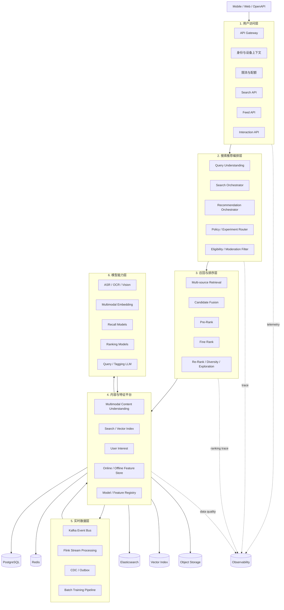
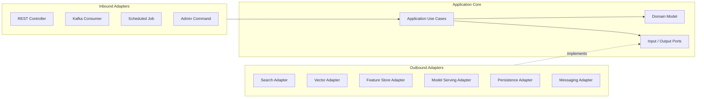
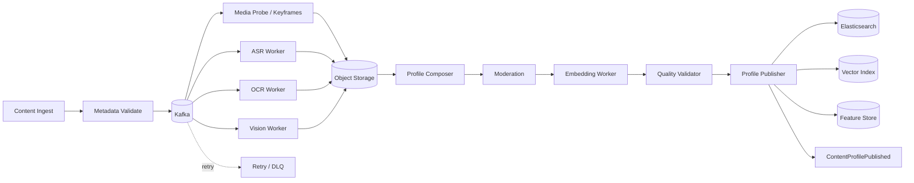
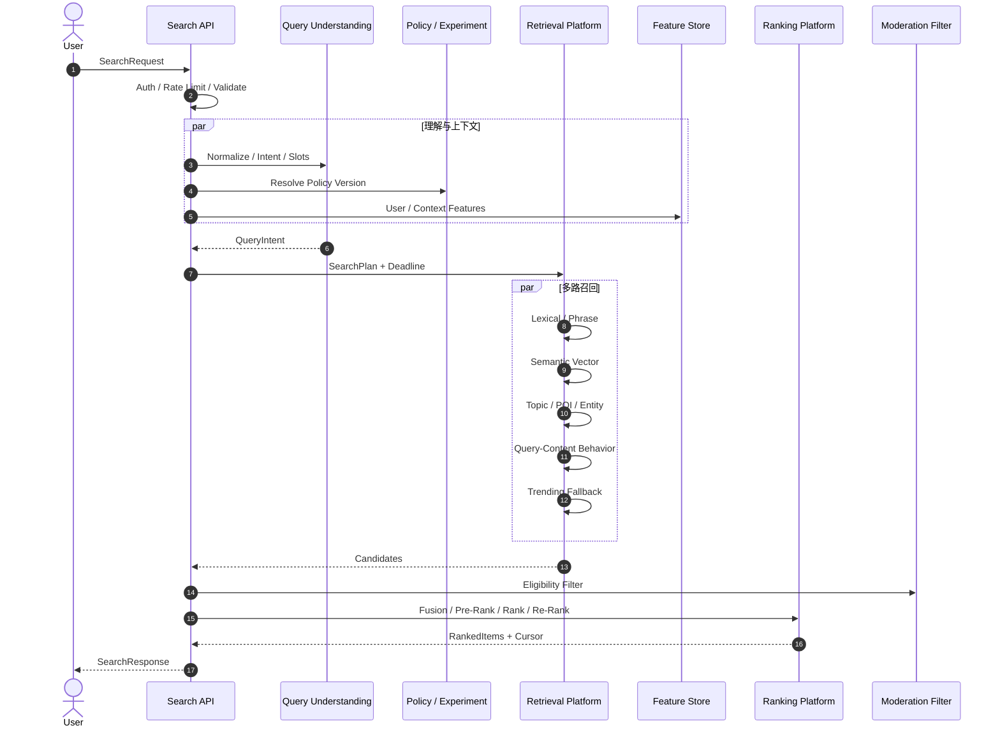
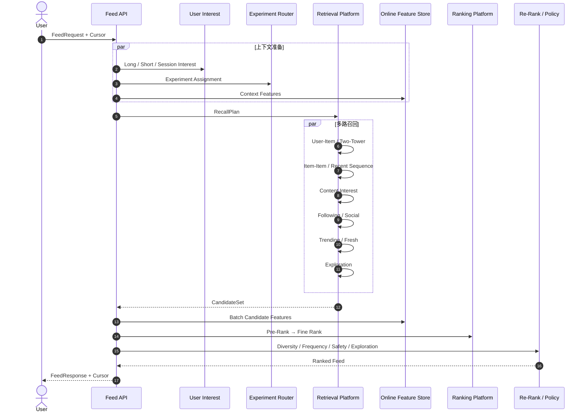

# SeekFlux 系统架构设计

> 面向短视频内容平台的多模态搜索与推荐中台

| 属性 | 内容 |
| --- | --- |
| 文档状态 | 架构基线 / v2.0 |
| 目标读者 | 架构师、搜索推荐工程师、后端工程师、算法工程师、数据工程师、SRE、产品负责人 |
| 核心定位 | 搜索与推荐并重，以统一内容理解、特征、召回、排序和实时反馈平台支撑主动搜索与个性化 Feed |
| 第一阶段 | 1 万条内容、10 万行为事件，跑通端到端闭环 |
| 第二阶段 | 10 万条内容、500 万行为事件，验证实时特征、多阶段排序和高并发 |
| 演进目标 | 100 万条内容、1 亿行为事件，验证分片、回放、模型灰度和成本治理 |

## 目录

- [1. 执行摘要](#1-执行摘要)
- [2. 产品定位与业务边界](#2-产品定位与业务边界)
- [3. 核心业务挑战](#3-核心业务挑战)
- [4. 架构原则](#4-架构原则)
- [5. 总体架构](#5-总体架构)
- [6. DDD 与应用架构](#6-ddd-与应用架构)
- [7. 核心领域模型](#7-核心领域模型)
- [8. 多模态内容处理与索引构建](#8-多模态内容处理与索引构建)
- [9. 在线搜索链路](#9-在线搜索链路)
- [10. 在线推荐链路](#10-在线推荐链路)
- [11. 统一召回与排序平台](#11-统一召回与排序平台)
- [12. 用户兴趣与特征平台](#12-用户兴趣与特征平台)
- [13. 实时行为数据平台](#13-实时行为数据平台)
- [14. 检索与存储设计](#14-检索与存储设计)
- [15. 缓存与性能架构](#15-缓存与性能架构)
- [16. 模型能力与治理](#16-模型能力与治理)
- [17. API 与事件契约](#17-api-与事件契约)
- [18. 部署、伸缩与高可用](#18-部署伸缩与高可用)
- [19. 可观测性与 SLO](#19-可观测性与-slo)
- [20. 内容安全、隐私与风控](#20-内容安全隐私与风控)
- [21. 质量评测与实验体系](#21-质量评测与实验体系)
- [22. 容量模型与压测](#22-容量模型与压测)
- [23. 分阶段演进路线](#23-分阶段演进路线)
- [24. 推荐技术栈与代码模块](#24-推荐技术栈与代码模块)
- [25. 架构决策、风险与验收](#25-架构决策风险与验收)
- [26. 学习文档与实现同步](#26-学习文档与实现同步)

---

## 1. 执行摘要

SeekFlux 不再限定于某一种文本或某一个数据源，而是一套面向短视频内容平台的搜索与推荐基础设施。系统同时支撑两类核心请求：

1. **主动搜索**：用户输入关键词或自然语言问题，系统理解意图，在标题、描述、话题、ASR、OCR、视觉标签、POI 和多模态向量中召回内容，并结合用户兴趣完成个性化排序。
2. **个性化推荐**：用户没有显式 Query，系统依据长期兴趣、实时行为、上下文、关注关系和内容趋势进行多路召回，通过粗排、精排和重排生成首页 Feed。

搜索与推荐不是两个孤立应用，而是共享以下平台能力：

- 多模态内容理解与统一内容画像；
- 倒排、向量、协同、热门和关系等召回通道；
- 离线与在线一致的特征平台；
- 多阶段、多目标排序平台；
- 曝光、播放、观看时长、互动和负反馈的实时行为闭环；
- 模型注册、灰度、实验、回滚和效果评测；
- 缓存、限流、降级、观测和高可用等工程能力。

系统的技术亮点不在于堆叠模型，而在于把“内容理解 → 特征生产 → 多路召回 → 多阶段排序 → 实时反馈 → 实验评估”构造成可度量、可回放、可扩展的闭环。第一阶段采用 **DDD 指导的模块化单体 + 独立 Worker**，逻辑边界完整、物理部署克制；达到独立扩缩容、团队自治或故障隔离条件后，再沿限界上下文拆分服务。

---

## 2. 产品定位与业务边界

### 2.1 目标用户

- 内容消费者：通过搜索快速找到相关、有用、新鲜且符合个人偏好的短视频。
- 内容消费者：在首页 Feed 中持续获得感兴趣但不过度重复的内容。
- 内容创作者：发布内容后能够被准确理解、索引和分发给合适人群。
- 运营人员：配置话题、趋势、分发规则、内容治理策略和实验。
- 搜索推荐工程师：快速接入召回源、特征、模型和重排策略，完成灰度验证。

### 2.2 典型搜索场景

| 场景 | 示例 | 关键能力 |
| --- | --- | --- |
| 精确搜索 | `周杰伦 晴天 现场版` | 实体识别、短语匹配、标题/ASR 检索 |
| 攻略搜索 | `上海周末适合情侣的小众露营地` | 意图与槽位抽取、POI、语义召回、个性化 |
| 教程搜索 | `新手如何练习自由泳换气` | ASR/OCR、知识性质量特征、完播信号 |
| 趋势搜索 | `最近流行的毕业转场` | 热点识别、时间衰减、新鲜度排序 |
| 探索搜索 | `治愈系雨天氛围感视频` | 多模态语义、视觉风格和音乐标签 |
| 本地搜索 | `杭州西湖附近夜景打卡` | POI、地理范围、时间与场景理解 |

### 2.3 典型推荐场景

- 首页 For You Feed：综合长期兴趣与最近行为，持续生成个性化内容流。
- 搜索结果相关推荐：围绕当前 Query 推荐相关主题、作者和相似内容。
- 视频播放后推荐：根据当前视频、观看深度和用户序列推荐下一批内容。
- 新用户冷启动：利用显式兴趣选择、地域、设备上下文和全局优质内容兜底。
- 新内容冷启动：依据内容画像匹配潜在受众，以受控探索获取首批反馈。
- 关注 Feed：优先保证关注作者内容的时效性，同时控制重复和刷屏。

### 2.4 系统目标

- 同时提供搜索和 Feed 两条低延迟在线链路。
- 支持文本、语音、画面、字幕、话题、作者、音乐和 POI 等多模态内容理解。
- 支持关键词、向量、协同、Item-Item、关注、热门和探索等多路召回。
- 支持召回、融合、粗排、精排、重排和策略过滤的多阶段排序。
- 用户行为在秒级到分钟级内影响后续推荐和个性化搜索。
- 训练、离线评测、在线推理和实验使用可追踪的特征与模型版本。
- 任意单一召回源、模型或特征存储故障时，核心服务可以降级运行。

### 2.5 非目标

首期明确不做：

- 完整复刻大型短视频 APP；
- 视频拍摄、剪辑、转码播放和 CDN 媒体分发；
- 广告竞价、直播、电商交易和复杂社交网络；
- 依赖超大规模 GPU 集群的端到端推荐大模型；
- 在没有真实数据的情况下宣称达到大型平台的线上效果；
- 抓取受限制平台的数据或使用来源不明的用户隐私数据。

### 2.6 业务成功指标

搜索与推荐不能只追求点击率，否则容易放大标题党和低质量内容。指标分为用户价值、生态健康和系统效率三组：

| 维度 | 核心指标 |
| --- | --- |
| 搜索满意度 | Search Success Rate、Query Reformulation Rate、零结果率、有效播放率 |
| 推荐体验 | 有效观看时长、完播率、快速划走率、互动率、次日回访 |
| 内容生态 | 内容覆盖率、作者覆盖率、新内容曝光率、多样性、重复率 |
| 安全与信任 | 违规曝光率、负反馈率、屏蔽命中率、治理生效延迟 |
| 工程效率 | P95/P99 延迟、可用性、特征新鲜度、单请求成本、实验迭代周期 |

北极星指标建议采用“**每次会话的有效观看时长与满意行为**”，而不是单一点击率或无限总时长。满意行为包括完成搜索、长观看、收藏、关注和低负反馈。

---

## 3. 核心业务挑战

### 3.1 视频内容不可直接搜索

短视频的含义分散在标题、作者描述、语音、画面字幕、场景、人物、音乐和评论中。标题可能很短，甚至与真实内容不一致。因此需要通过 ASR、OCR、关键帧、视觉分类和多模态 Embedding 构建统一内容画像。

### 3.2 搜索相关性与推荐兴趣目标不同

- 搜索以 Query 意图为首要约束，个性化只能在相关内容内部发挥作用。
- 推荐没有显式 Query，用户兴趣、上下文和探索策略成为主要信号。
- 两者共享召回和排序基础设施，但不能共享完全相同的目标函数。

### 3.3 用户兴趣快速变化

长期兴趣可能是美食和旅行，最近十分钟却集中观看滑雪教学。系统必须同时维护长期画像、会话兴趣和实时兴趣，并避免短期偶然行为永久污染画像。

### 3.4 多目标排序存在冲突

高点击不等于高质量，高观看时长也可能来自争议内容。相关性、完播、互动、新鲜度、多样性、作者公平、内容安全和长期留存之间需要明确的目标与约束。

### 3.5 反馈数据存在偏差

用户只能对已曝光内容产生行为，日志天然受到旧排序策略影响。训练和评测需要记录曝光、位置、策略版本和实验桶，避免把“没有被展示”误判为“不感兴趣”。

### 3.6 高吞吐与低延迟并存

每次请求可能触发多个召回通道和模型推理，而行为事件数量远高于搜索请求。系统需要隔离在线查询、实时计算、离线训练和内容处理资源，防止某条链路拖垮整体。

---

## 4. 架构原则

1. **搜索相关性优先**：主动搜索中先满足 Query，再做个性化和商业目标优化。
2. **搜索推荐共享平台、不共享全部策略**：复用内容、特征、召回和模型设施，保留不同用例的目标函数。
3. **多路召回、分阶段排序**：便宜模型处理大候选集，昂贵模型只处理有限 TopK。
4. **事件时间是真相**：实时特征按业务发生时间计算，处理时间只用于系统观测。
5. **训练与服务特征一致**：同一特征定义具备版本，并支持时间点正确的离线回放。
6. **曝光是反馈前提**：所有点击、观看和互动必须关联曝光、位置、策略和实验上下文。
7. **内容安全前置且纵深校验**：内容入库、召回、排序和返回前都有安全控制。
8. **DDD 划分业务边界**：以内容、搜索、推荐、兴趣、互动、特征、排序和实验划分模块。
9. **领域不依赖中间件**：核心规则通过 Port 接入检索、缓存、消息、特征和模型实现。
10. **至少一次事件、幂等处理**：不把跨多个异构存储的“恰好一次”作为前提。
11. **默认可降级**：模型、向量库或实时特征故障时，热门和基础相关性仍可服务。
12. **指标先行**：每个新召回源、特征和模型都必须能离线评测、线上灰度和快速回滚。

---

## 5. 总体架构

### 5.1 六层逻辑架构



六层是职责视图，不要求六组独立服务。横向基础能力包括配置中心、密钥管理、可观测平台、内容安全、数据治理和实验平台。

### 5.2 三条主数据流

```text
内容流：上传/导入 → 多模态理解 → 内容画像 → 审核 → 索引与特征发布

行为流：曝光/播放/互动 → Kafka → 实时聚合 → 在线特征/短期兴趣

请求流：Search/Feed Request → 多路召回 → 多阶段排序 → 结果 → 新行为反馈
```

内容流负责“系统知道视频是什么”，行为流负责“系统知道用户此刻想看什么”，请求流负责“在延迟预算内组合两者”。

### 5.3 控制面与数据面

- **控制面**：内容状态、特征定义、模型版本、召回配置、排序策略、实验、风控和发布审批。
- **数据面**：候选召回、在线特征查询、模型推理、结果重排和事件采集。
- 控制面故障时，数据面使用最后一次已发布配置继续服务；新配置未通过校验不得影响在线请求。

### 5.4 首期物理部署

| 组件 | 职责 | 首期部署方式 |
| --- | --- | --- |
| Search/Feed Service | API、编排、融合与降级 | 一个模块化应用，多副本 |
| Content Service | 内容元数据与发布状态 | 独立 Spring Boot 应用 |
| Enrichment Worker | ASR/OCR/视觉/Embedding 任务 | 独立 Worker，按任务类型扩缩 |
| Stream Job | 实时统计、兴趣和特征更新 | Flink Job |
| Ranking Service | 粗排/精排模型推理 | 可先与在线服务同进程，后独立 |
| Training Pipeline | 样本生成、训练、评测、注册 | 定时或工作流任务 |

首期不为每个召回通道建立独立微服务。只有当通道需要独立资源、独立发布或故障隔离时，才从统一 Retrieval Platform 中拆出。

---

## 6. DDD 与应用架构

### 6.1 限界上下文

| 限界上下文 | 主要职责 | 核心领域对象 |
| --- | --- | --- |
| Content | 内容身份、元数据、状态、画像版本和发布生命周期 | `Content`、`ContentProfile`、`ContentStatus` |
| Search | Query、意图、过滤、搜索会话和搜索策略 | `SearchRequest`、`QueryIntent`、`SearchPlan` |
| Recommendation | Feed 请求、召回计划、候选集合和推荐结果 | `FeedRequest`、`RecallPlan`、`CandidateSet` |
| UserInterest | 长期、短期和会话兴趣及用户向量 | `InterestProfile`、`InterestSnapshot` |
| Interaction | 曝光、播放、观看、互动和负反馈 | `InteractionEvent`、`ExposureContext` |
| Feature | 特征定义、计算、版本、快照和读取 | `FeatureDefinition`、`FeatureSnapshot` |
| Ranking | 模型、目标、融合、粗排、精排和重排 | `RankingPolicy`、`RankedItem`、`RankingTrace` |
| Experiment | 流量分桶、实验配置、指标和结论 | `Experiment`、`Variant`、`Assignment` |
| Moderation | 内容风险、分发限制、用户屏蔽和审核状态 | `RiskLabel`、`DistributionPolicy` |

限界上下文之间不共享可变实体，也不能直接访问对方数据库。它们通过 Use Case、稳定 ID、版本化 DTO 和领域事件协作。

### 6.2 六边形架构



依赖规则：

```text
Inbound Adapter → Application → Domain
Application → Output Port ← Outbound Adapter

Domain 不依赖 Spring、Elasticsearch、Redis、Kafka、Flink 或模型 SDK。
```

Controller 只负责协议、校验、鉴权上下文和 DTO 转换，不直接查询索引、不拼装排序公式、不修改用户画像。响应式编程用于 I/O 调度，但不渗透领域模型。

### 6.3 聚合与一致性边界

- `Content` 聚合控制发布状态和当前有效画像版本，未审核或画像未就绪的内容不能进入公开分发。
- `Experiment` 聚合保证实验流量范围、互斥层和版本合法。
- `FeatureDefinition` 聚合保证名称、类型、实体键、TTL 和计算逻辑版本稳定。
- 搜索请求、Feed 请求和候选集合是短生命周期对象，不需要作为数据库强一致聚合保存。
- 曝光与行为采用追加事件，不在在线请求中跨多个存储执行分布式事务。

### 6.4 事件驱动与 CQRS 风格

内容发布和特征生产属于写侧；搜索索引、向量索引、在线特征和模型服务属于查询侧。`ContentProfilePublished`、`FeatureSnapshotUpdated` 和 `ModelVersionActivated` 是写侧向在线查询模型交付变化的边界事件。

系统采用 CQRS 风格的读写模型分离，但不采用完整 Event Sourcing。PostgreSQL 中的内容、配置、实验和任务状态仍是真相源；Kafka 事件用于异步协作、回放和审计。

---

## 7. 核心领域模型

### 7.1 ContentProfile

```json
{
  "contentId": "v_10001",
  "authorId": "u_20001",
  "status": "PUBLISHED",
  "title": "上海周末小众露营地",
  "description": "湖边露营和日落路线",
  "hashtags": ["上海露营", "周末去哪儿"],
  "asrText": "今天带大家去上海青浦的一个露营地……",
  "ocrText": "导航：青浦区……",
  "visualLabels": ["tent", "lake", "sunset", "outdoor"],
  "topics": ["露营", "户外", "情侣约会"],
  "musicId": "m_30001",
  "poi": {
    "poiId": "poi_40001",
    "city": "上海",
    "district": "青浦",
    "latitude": 31.15,
    "longitude": 121.12
  },
  "durationMs": 42000,
  "language": "zh-CN",
  "quality": {
    "clarity": 0.91,
    "informationDensity": 0.82,
    "originality": 0.74
  },
  "riskLabels": [],
  "textEmbeddingVersion": "text-embed-v2",
  "visualEmbeddingVersion": "vision-embed-v1",
  "profileVersion": 7,
  "publishedAt": "2026-08-02T08:00:00Z"
}
```

原始媒体、抽取文本、标签、Embedding 和统计特征分开存储。`ContentProfile` 是面向搜索推荐的查询模型，不替代媒体资产和内容主数据。

### 7.2 UserContext 与 InterestProfile

```json
{
  "userId": "u_90001",
  "sessionId": "s_70001",
  "device": "ANDROID",
  "locale": "zh-CN",
  "region": "上海",
  "requestTime": "2026-08-02T10:21:00Z",
  "longTermInterests": {"旅行": 0.8, "美食": 0.7},
  "shortTermInterests": {"露营": 0.92, "户外装备": 0.65},
  "recentContentIds": ["v_1", "v_2", "v_3"],
  "blockedAuthors": [],
  "interestVersion": 156
}
```

长期兴趣由较长窗口的稳定行为形成，短期兴趣由分钟到小时窗口形成，会话兴趣只在当前 Session 内生效。三者分开计算、分开衰减，排序时按场景组合。

### 7.3 Candidate 与 RankedItem

标准候选协议保证所有召回源可以统一融合：

```json
{
  "contentId": "v_10001",
  "source": "SEMANTIC_SEARCH",
  "sourceRank": 3,
  "rawScore": 0.87,
  "reason": "露营+上海+视觉相似",
  "retrievalVersion": "semantic-v4",
  "featureSnapshotId": "fs_881",
  "eligibilityTags": ["PUBLIC", "SAFE"],
  "debugFeatures": {}
}
```

`RankedItem` 在 Candidate 基础上增加粗排分、精排多目标预测、重排调整、展示理由和 Ranking Trace 引用。调试特征只对内部诊断开放，不返回普通客户端。

### 7.4 InteractionEvent

```json
{
  "eventId": "evt_uuid",
  "eventType": "WATCH_PROGRESS",
  "userId": "u_90001",
  "anonymousId": null,
  "sessionId": "s_70001",
  "requestId": "req_80001",
  "contentId": "v_10001",
  "position": 4,
  "watchMs": 21000,
  "contentDurationMs": 42000,
  "eventTime": "2026-08-02T10:21:12.230Z",
  "clientTime": "2026-08-02T10:21:12.100Z",
  "rankingPolicyVersion": "feed-rank-v12",
  "experimentAssignments": ["home_rank_exp:A"],
  "schemaVersion": 2
}
```

所有行为必须尽量关联 `requestId + contentId + position`，否则无法还原曝光上下文和排序偏差。

---

## 8. 多模态内容处理与索引构建

### 8.1 内容处理拓扑



### 8.2 内容状态机

```text
CREATED
  → VALIDATING
  → ENRICHING
  → MODERATING
  → EMBEDDING
  → INDEXING
  → PUBLISHED

任一阶段 → RETRY_WAIT → 原阶段
永久失败 → REJECTED
治理命中 → RESTRICTED | BLOCKED
作者删除 → DELETING → DELETED
```

只有 `PUBLISHED` 且分发策略允许的内容才能进入公开召回。内容被限制或删除时，撤回事件优先级高于普通更新，并同步清理索引、缓存和候选池。

### 8.3 多模态处理阶段

- Metadata：标题、描述、话题、作者、媒体时长、语言、上传时间和显式 POI。
- ASR：语音转写、时间戳片段、语言和置信度。
- OCR：关键帧字幕、贴纸、地点、商品或警示信息及时间范围。
- Vision：场景、物体、人物属性、动作、视觉风格和关键帧向量。
- Audio：音乐、环境声和音频类别；首期可以只使用音乐 ID 和 ASR。
- Profile Compose：实体归一化、话题聚合、噪声去除和跨模态冲突处理。
- Embedding：分别生成文本、视觉和融合向量，模型版本独立管理。
- Moderation：风险标签、年龄限制、地域限制、推荐限制和人工复核状态。

### 8.4 幂等与产物复用

- 内容处理任务键：`content_id + media_digest + pipeline_version`。
- 单阶段产物键：`media_digest + processor_type + model_version`。
- Embedding 键：`normalized_input_digest + embedding_model_version`。
- 索引文档使用确定性 `content_id + profile_version`。
- Worker 执行昂贵任务前先检查产物是否存在，重复消息只做幂等确认。
- 状态迁移使用乐观锁，旧任务不能覆盖新画像版本。
- 任务状态与 Outbox 事件在同一数据库事务中提交。

### 8.5 数据质量门禁

发布前校验：

- 必填元数据和媒体摘要完整；
- ASR/OCR 空结果符合内容类型预期；
- 标签数量、置信度和 Embedding 范数处于合理范围；
- ES、向量索引与 Feature Store 使用相同 `profile_version`；
- 风险标签和分发策略存在；
- 抽样内容能够通过标题、ASR、OCR 和向量通道召回；
- 新模型产生的向量分布没有明显漂移。

失败画像保持在验证失败状态，不能覆盖线上有效版本。

---

## 9. 在线搜索链路

### 9.1 端到端时序



### 9.2 Query Understanding

确定性预处理优先：

- Unicode、空白、繁简体、大小写和特殊字符规范化；
- 拼音、常见错别字、同义词和缩写处理；
- 短语、Hashtag、作者、音乐、POI、时间和地域识别；
- 成人、危险或违规意图识别；
- Session 中“附近”“同款”“刚才那个”等指代解析。

轻量模型或 LLM 只在复杂自然语言查询中补充：意图分类、槽位抽取、语义改写和多查询生成。在线调用必须有严格超时；失败时使用原 Query 和规则结果。

```json
{
  "intentType": "LOCAL_DISCOVERY",
  "normalizedQuery": "上海 周末 情侣 小众 露营地",
  "entities": ["露营"],
  "location": {"city": "上海"},
  "audience": ["情侣"],
  "preferences": ["小众"],
  "timeIntent": "周末",
  "retrievers": ["LEXICAL", "SEMANTIC", "POI", "BEHAVIOR"],
  "confidence": 0.92
}
```

### 9.3 搜索召回通道

| 通道 | 数据 | 适合问题 |
| --- | --- | --- |
| Lexical | 标题、描述、ASR、OCR、话题、作者 | 专名、歌词、原话、精确需求 |
| Semantic | 文本/多模态向量 | 风格、氛围、开放式自然语言 |
| Entity/Topic | 实体、话题、音乐、作者 | 明确主题与实体搜索 |
| POI/Geo | POI、城市、距离 | 本地生活和附近内容 |
| Behavior | Query-Content 点击、长观看和收藏 | 历史查询反馈与热门意图 |
| Trending | 时间窗口热度 | 新热点和零结果兜底 |

所有召回源实现统一 `Retriever` 协议，并声明超时、TopK、版本和结果解释。Query Router 根据意图决定通道组合，不要求每次查询调用全部通道。

### 9.4 融合与去重

不同召回源分数不可直接比较，首期采用 RRF 或分位数归一化建立稳定基线：

```text
RRF(content) = Σ 1 / (k + rank_source(content))
```

随后加入可解释特征：

```text
recall_score =
    normalized_retrieval_score
  × query_match_factor
  × quality_factor
  × freshness_factor
  × eligibility_factor
```

融合阶段完成内容 ID 去重、重复媒体聚类、同作者限额和候选来源标记。个性化不能把明显不相关的内容提升到搜索前列。

### 9.5 搜索排序目标

搜索精排以相关性为硬约束，在相关候选中优化满意度：

```text
SearchScore =
    w1 × Relevance
  + w2 × P(EffectiveWatch)
  + w3 × P(SaveOrFollow)
  + w4 × Freshness
  + w5 × PersonalPreference
  - w6 × QuickSkipRisk
  - w7 × DuplicatePenalty
```

`Relevance` 权重和最低阈值由 Search Context 控制，推荐模型不能绕过。对于导航型、精确实体型 Query，相关性与权威信号应高于个性化。

### 9.6 Cursor 与结果稳定性

- 使用不透明 Cursor，不使用深分页 Offset。
- Cursor 包含 Query 摘要、排序策略版本、实验桶、快照时间和上页边界。
- 翻页时允许热度变化，但避免已展示内容重复出现。
- 内容被治理或删除时立即过滤，即使 Cursor 来自旧页面。
- Cursor 设置短期有效期，过期后重新执行查询。

### 9.7 搜索降级

| 故障 | 降级行为 |
| --- | --- |
| Query 模型超时 | 使用规则解析和原 Query |
| 向量索引不可用 | 使用关键词、话题和热门召回 |
| 行为召回不可用 | 关闭 Query-Content 行为信号 |
| 在线特征超时 | 使用缓存或匿名默认特征 |
| 精排模型超时 | 使用粗排分和静态质量特征 |
| 个性化服务不可用 | 返回非个性化相关性结果 |
| 部分召回源超时 | 在整体 Deadline 内合并已返回结果 |

---

## 10. 在线推荐链路

### 10.1 Feed 时序



### 10.2 推荐召回通道

| 通道 | 作用 | 冷启动能力 |
| --- | --- | --- |
| User-Item | 用户向量匹配内容向量 | 新用户较弱，新内容可用内容向量 |
| Item-Item | 根据最近观看、收藏或搜索内容扩展 | 新用户有首个行为后可用 |
| Topic Interest | 根据兴趣标签匹配内容 | 显式选择兴趣即可启动 |
| Sequence | 根据最近行为序列预测下一兴趣 | 需要短期行为 |
| Following | 召回关注作者内容 | 需要关注关系 |
| Trending | 地域/时间窗口热门 | 对全部用户可用 |
| Fresh Content | 新内容探索池 | 对全部用户可用 |
| Editorial | 运营精选和公共安全通知 | 全量兜底，可审计 |

召回计划按用户状态和请求场景动态分配 TopK 配额。匿名用户更多依赖上下文、地域和热门；活跃用户提高个性化与序列召回比例。

### 10.3 多阶段推荐排序

```text
内容全集
  → 多路召回：约 2,000 个候选
  → Eligibility/Fusion：约 800 个候选
  → Pre-Rank：约 200 个候选
  → Fine Rank：约 50 个候选
  → Re-Rank：返回 20 个结果
```

具体数量由基准测试决定，文档中的数值是初始预算。每个阶段都记录候选进入、淘汰原因和模型版本，支持诊断“召回了但为什么没有展示”。

### 10.4 多目标排序

首期精排可以使用 LightGBM/XGBoost 或简单多任务模型预测：

- `P(click/play)`；
- `ExpectedWatchTime`；
- `P(complete)`；
- `P(like/save/comment/follow)`；
- `P(quick_skip)`；
- `P(report/not_interested)`。

组合分不是永久固定公式，而是版本化 Ranking Policy：

```text
FeedScore =
    α × calibrated(P(play))
  + β × normalized(ExpectedWatchTime)
  + γ × calibrated(P(complete))
  + δ × calibrated(P(positiveAction))
  - λ × calibrated(P(quickSkip))
  - μ × calibrated(P(negativeFeedback))
```

模型输出必须校准，否则不同任务的概率和连续值无法稳定组合。长期指标下降时，即使短期观看时长提升，也不能直接全量发布。

### 10.5 重排约束

- 同一作者、话题、音乐和相似媒体的频次控制；
- 已看、明确不感兴趣、拉黑作者和重复内容过滤；
- 新内容、长尾作者和兴趣探索的受控配额；
- 新鲜度、地域和时间敏感内容调整；
- 风险、年龄、地域和版权限制；
- Feed 内相邻内容的主题与视觉多样性；
- 探索流量必须带策略标记，便于归因。

### 10.6 冷启动

**新用户**：

- 显式兴趣选择；
- 地域、语言、时间和设备上下文；
- 经过质量与安全筛选的热门内容；
- 少量多主题探索，快速收集行为但避免连续试探。

**新内容**：

- 依据文本、视觉、话题、作者和 POI 内容特征召回；
- 在匹配人群中获得有限探索曝光；
- 依据完播、长观看、负反馈和互动逐步调整流量；
- 防止低样本波动直接触发大规模分发。

### 10.7 推荐降级

```text
个性化召回故障
  → Item-Item + 地域热门 + 优质新内容

全部模型服务故障
  → 规则质量分 + 热度衰减 + 多样性重排

实时兴趣不可用
  → 最近持久化兴趣快照 + Session 行为

部分候选特征缺失
  → 默认值 + 缺失标志，不静默填充为真实零值
```

---

## 11. 统一召回与排序平台

### 11.1 召回器 SPI

```java
public interface Retriever<C extends RetrievalContext> {
    RetrieverType type();

    CompletionStage<RetrievalResult> retrieve(
        C context,
        RetrievalBudget budget,
        RequestContext requestContext);
}
```

`RetrievalResult` 包含候选、通道版本、耗时、是否截断、降级标志和可观测统计。召回器不得直接决定最终展示顺序。

### 11.2 RecallPlan

RecallPlan 由用例编排层产生：

```json
{
  "scenario": "HOME_FEED",
  "deadlineMs": 80,
  "sources": [
    {"type": "USER_VECTOR", "topK": 500, "timeoutMs": 35},
    {"type": "ITEM_TO_ITEM", "topK": 400, "timeoutMs": 30},
    {"type": "TOPIC_INTEREST", "topK": 300, "timeoutMs": 25},
    {"type": "TRENDING", "topK": 200, "timeoutMs": 15},
    {"type": "EXPLORATION", "topK": 100, "timeoutMs": 15}
  ],
  "minCandidates": 400,
  "maxCandidates": 2000
}
```

每个通道独立 Bulkhead 和超时，编排层受整体 Deadline 约束。达到最小候选数后可以提前结束慢通道，但必须记录被取消的原因。

### 11.3 候选融合

融合平台负责：

- 通道内分数归一化或 Rank-based Fusion；
- 相同 Content ID 合并并保留所有来源；
- 同源配额和召回多样性；
- 资格与硬过滤；
- 提取轻量候选特征；
- 生成可回放的 Fusion Trace。

搜索和推荐使用不同 Fusion Policy，不能让推荐通道的高分破坏搜索相关性。

### 11.4 粗排

粗排面向数百候选，特征必须低成本：

- 召回分和来源；
- 用户/内容向量相似度；
- Query/内容基础相关性；
- 内容质量与时间衰减；
- 作者统计和用户—话题匹配；
- 已缓存的实时热度。

粗排优先保证精排目标候选的 Recall，不能只优化自身 AUC。

### 11.5 精排

精排可以使用更完整的交叉特征和序列特征：

- 用户长期与短期兴趣；
- 最近观看序列与当前内容关系；
- Query 与多模态内容交叉特征；
- 用户—作者、用户—话题、用户—音乐关系；
- 内容时长与用户时长偏好；
- 上下文、地域、时间和网络环境；
- 内容质量、实时热度和负反馈风险。

模型推理支持批量输入，限制最大候选数、特征字节数和推理时间。超时必须返回可识别错误，编排层降级到粗排，而不是卡住整个请求。

### 11.6 Ranking Trace

每个请求保存采样 Trace：

```text
request context
→ experiment assignment
→ recall plan and source results
→ fusion scores
→ feature snapshot/version
→ pre-rank scores
→ rank task predictions
→ re-rank adjustments
→ final positions
```

Trace 默认只保存特征名、版本和必要数值，不保存不必要的原始隐私数据。负反馈请求提高采样率，支持离线回放。

---

## 12. 用户兴趣与特征平台

### 12.1 特征分类

| 类别 | 示例 | 更新频率 |
| --- | --- | --- |
| 用户静态 | 地域、语言、注册时长 | 小时/天 |
| 用户长期兴趣 | 主题分布、作者偏好、时长偏好 | 小时/天 |
| 用户实时兴趣 | 最近观看主题、短期向量、快速负反馈 | 秒/分钟 |
| 内容静态 | 主题、视觉、时长、作者、发布时间 | 内容版本变化时 |
| 内容实时 | 5 分钟播放、完播、互动、负反馈 | 秒/分钟 |
| 交叉特征 | 用户—话题、用户—作者、Query—内容 | 在线或预聚合 |
| 上下文 | 时间、地域、设备、网络、入口 | 请求时 |

### 12.2 长短期兴趣

短期兴趣使用最近 N 次行为和时间衰减：

```text
weight(event) = action_weight × watch_quality × exp(-decay × age)
```

- 完播、长观看、收藏和关注为强正信号；
- 快速划走、不感兴趣和举报为负信号；
- 曝光但没有播放不能简单等价于负反馈；
- Session 兴趣高权重但短 TTL；
- 长期兴趣更新更平滑，避免短期异常永久影响画像。

### 12.3 在线与离线特征存储

- 在线特征：Redis 或专用 Online Feature Store，按实体 Key 批量读取，低延迟、带 TTL。
- 离线特征：对象存储 Parquet/湖表或分析存储，支持训练、回放和时间点 Join。
- Feature Registry：定义名称、实体、类型、单位、默认值、TTL、Owner、计算逻辑和版本。
- 训练集必须按事件发生时可见的特征快照构建，禁止使用未来信息。

### 12.4 训练服务一致性

- 同一特征变换逻辑尽量复用声明或生成代码；
- 在线请求记录 Feature View 版本；
- 缺失值有显式标志，区分“真实为零”和“没有数据”；
- 对关键特征进行线上/离线分布对比；
- 特征变更需要兼容窗口，旧模型仍能读取其依赖版本；
- Feature Store 故障时使用最近快照或模型默认值。

### 12.5 特征新鲜度

每个实时特征定义最大可接受延迟。例如短期兴趣 P95 小于 10 秒，五分钟内容热度 P95 小于 30 秒。读取时携带 `computed_at`，排序模型可以使用特征 Age 或拒绝过旧特征。

---

## 13. 实时行为数据平台

### 13.1 事件主题

| Topic | Producer | Consumer | 分区键 |
| --- | --- | --- | --- |
| `interaction.raw.v1` | Interaction API | 清洗与会话化 Job | `user_id` 或 `anonymous_id` |
| `interaction.validated.v1` | 清洗 Job | 特征、分析、样本 Job | `user_id` |
| `exposure.logged.v1` | Search/Feed Service | 归因与训练样本 Job | `request_id` |
| `content.profile.published.v1` | Content Pipeline | 索引、特征、候选池 | `content_id` |
| `content.distribution.changed.v1` | Moderation | 在线过滤与缓存失效 | `content_id` |
| `feature.snapshot.updated.v1` | Flink/Batch | Online Feature Writer | `entity_id` |
| `model.version.activated.v1` | Model Registry | Ranking Service | `model_name` |

### 13.2 事件时间与乱序

- `event_time` 表示用户行为发生时间，`ingested_at` 表示服务接收时间。
- Flink 使用 Watermark 处理合理乱序，超出窗口的迟到事件进入补偿流。
- 客户端时间只作为参考，需要检测时钟漂移和伪造。
- 聚合结果带窗口起止、计算版本和最终/临时标志。
- 离线重算可以修正最终统计，但不能静默改变已经发布的实验报表。

### 13.3 幂等、去重和归因

- `event_id` 全局唯一，Consumer 以事件 ID 或业务复合键去重。
- 客户端批量重试可能产生重复事件，不能只依赖 Kafka Offset。
- 播放进度事件按 `session + content + playback` 合并，避免高频心跳放大计数。
- 互动必须关联最近有效曝光；无法归因的事件单独计数。
- 样本生成记录曝光位置、召回源、策略版本和 Propensity 信息。

### 13.4 投递语义

Kafka 与 Flink 内部可启用 Checkpoint 和事务 Sink，但跨 Redis、Elasticsearch、对象存储和数据库仍采用“至少一次 + 幂等写入”。系统不宣称端到端分布式恰好一次。

### 13.5 背压与回放

- 监控 Consumer Lag、Checkpoint 时长、反压比和输出失败率；
- 在线特征 Sink 积压时优先保护 Search/Feed 读取；
- 原始事件保留覆盖故障恢复和实验回放窗口；
- 支持按时间、用户桶、内容桶和 Job 版本重放；
- 回放写入隔离命名空间，校验后再切换，避免污染在线特征。

---

## 14. 检索与存储设计

### 14.1 Elasticsearch 内容索引

建议使用少量版本化索引，而不是按作者或话题拆索引：

- `content_search_vN`：标题、描述、ASR、OCR、话题、实体、作者、音乐和 POI；
- `content_stats_vN`：可过滤和可排序的稳定统计快照；
- `query_suggest_vN`：搜索补全、热门 Query、实体与话题；
- `entity_catalog_vN`：作者、话题、音乐、POI 和规范化实体。

线上通过 Alias 读取，新索引构建和校验后原子切换。内容撤回使用高优先级更新，并在查询层维护实时 Blocklist 兜底。

### 14.2 字段设计

- 标题、描述、ASR、OCR 分字段，保留各自权重和命中解释；
- 中文分词、拼音、同义词和精确 keyword 子字段并存；
- ASR/OCR 保留时间片段，支持命中后跳转到视频时间点；
- 话题、作者、音乐、语言、地域、状态和风险标签使用过滤字段；
- 发布时间和热度快照支持时间衰减；
- POI 支持 geo_point 和距离过滤；
- 只将稳定或低频更新特征放入搜索索引，高频特征从 Feature Store 批量获取。

### 14.3 向量索引

逻辑上维护多个向量空间：

- 文本向量：Query 与标题/描述/ASR/OCR 语义匹配；
- 视觉向量：画面、风格和场景相似；
- 多模态向量：文本和画面融合；
- 内容推荐向量：面向观看行为训练的 Item Embedding；
- 用户向量：面向 User-Item 召回。

不同模型版本的向量不能直接混搜。Collection 或字段带模型版本，重建完成后通过 Alias/配置切换。首期可使用 Elasticsearch 向量能力减少组件；当规模、过滤或独立扩容需求明确后，再拆专用向量数据库。

### 14.4 存储职责

| 存储 | 数据 | 一致性定位 |
| --- | --- | --- |
| PostgreSQL | 内容主数据、任务、特征定义、模型、实验、策略 | 强一致控制面 |
| Elasticsearch | 文本检索、过滤、补全和部分向量 | 可重建查询模型 |
| Vector Index | 多模态、用户和内容向量 | 可重建查询模型 |
| Redis | 在线特征、兴趣快照、缓存、频控、Blocklist | 低延迟，可恢复 |
| Kafka | 行为和领域事件 | 至少一次、可回放 |
| Object Storage | 媒体引用、处理产物、训练集、模型、离线特征 | 不可变对象优先 |
| Analytics Store | 聚合指标、实验分析、数据质量 | 分析查询，不进入强一致事务 |

---

## 15. 缓存与性能架构

### 15.1 多级缓存

| 层级 | 内容 | 介质 | TTL |
| --- | --- | --- | --- |
| 请求内 | 用户上下文、候选特征、策略 | Request Context | 请求结束 |
| 进程内 | 模型句柄、特征定义、热门内容元数据 | Caffeine | 秒到分钟 |
| 分布式 | Query 候选、热门池、用户兴趣、在线特征 | Redis | 秒到小时 |
| 边缘 | 公共补全、匿名趋势、静态内容元数据 | Gateway/CDN | 短 TTL |

### 15.2 缓存键

```text
query-candidates:{index_version}:{normalized_query_hash}:{filter_hash}:{retrieval_policy}
user-interest:{user_id}:{interest_version}
item-features:{content_id}:{feature_view_version}
feed-pool:{user_bucket}:{policy_version}:{time_bucket}
trending:{region}:{topic}:{window}:{version}
model-handle:{model_name}:{model_version}
```

- 个性化结果不能跨用户共享；非个性化候选池可以复用。
- Moderation 变更通过 Blocklist 立即生效，不能等待普通 TTL。
- 热点 Key 使用请求合并和预热，TTL 加随机抖动。
- 零结果只做极短负缓存，防止数据更新后长期不可见。
- Feed 页面只缓存候选池或短期结果，不缓存无限滚动完整序列。

### 15.3 在线延迟预算

初始目标预算：

| 阶段 | Search P95 | Feed P95 |
| --- | ---: | ---: |
| 网关、鉴权、实验 | 20 ms | 15 ms |
| Query/用户上下文 | 50 ms | 25 ms |
| 多路召回 | 120 ms | 80 ms |
| 特征批量读取 | 50 ms | 45 ms |
| 融合与粗排 | 50 ms | 35 ms |
| 精排推理 | 100 ms | 65 ms |
| 重排与序列化 | 40 ms | 25 ms |
| 抖动余量 | 110 ms | 85 ms |
| 整体目标 | < 500 ms | < 350 ms |

预算基于并行执行，不能把各阶段最大超时串联相加。下游调用接收剩余 Deadline，并通过 Bulkhead 隔离线程、连接和模型资源。

### 15.4 性能策略

- 批量读取候选特征，禁止每个候选单独 RPC；
- Embedding、ASR、OCR 和训练不进入在线请求路径；
- 模型常驻内存并批量推理；
- 限制每阶段候选数量和特征字节数；
- 异步并行召回，达到最低候选数后允许提前返回；
- 在线索引读取和离线批量写入使用独立资源预算；
- 客户端断开时传播取消信号，停止未开始的下游工作。

---

## 16. 模型能力与治理

### 16.1 模型分类

| 模型 | 作用 | 在线关键路径 |
| --- | --- | --- |
| ASR/OCR/Vision | 生成内容理解产物 | 否，异步内容链路 |
| Text/Visual/Multimodal Embedding | 语义索引与内容相似 | Query Embedding 可在线，其余离线 |
| User/Item Recall | User-Item 或 Item-Item 召回 | 是 |
| Pre-Rank | 低成本筛选候选 | 是 |
| Fine-Rank | 多目标行为预测 | 是 |
| Query Understanding | 意图、实体、改写 | 是，但必须低延迟可降级 |
| Moderation | 风险识别 | 入库为主，在线规则兜底 |

### 16.2 Model Registry

每个模型版本保存：

- 模型名称、任务、框架和 Artifact URI；
- 输入 Feature View 与 Schema；
- 训练数据时间范围和数据版本；
- 离线指标、分桶指标和基线对比；
- 推理资源、延迟和最大 Batch；
- Owner、审批、上线时间和回滚版本；
- 兼容的向量空间或索引版本。

### 16.3 发布流程

```text
训练完成
→ 数据与特征校验
→ 离线评测
→ 模型签名与注册
→ Shadow 推理
→ 小流量实验
→ 指标观察
→ 分阶段放量
→ 全量或回滚
```

Embedding 模型更新需要新向量空间并重建索引，不能只替换在线 Query 模型。排序模型可以在特征契约兼容时灰度切换。

### 16.4 LLM 的边界

LLM 可参与复杂 Query 理解、内容标签补充、搜索建议和运营辅助，但不直接决定最终分发，也不在每次 Feed 请求中生成内容。所有输出经过 Schema 校验、超时、缓存和安全过滤；失败时规则和轻量模型接管。

### 16.5 模型安全与成本

- 模型服务按场景设置并发、Token/算力和延迟预算；
- 不把用户敏感原始行为发送给未经批准的外部模型；
- 记录模型版本和调用成本，不记录不必要的隐私正文；
- 推理结果异常、NaN 或分布漂移时自动降级；
- 模型热更新使用双版本加载，确保回滚不依赖重新拉取大文件。

---

## 17. API 与事件契约

### 17.1 搜索 API

```http
POST /v1/search
```

```json
{
  "query": "上海周末适合情侣的小众露营地",
  "cursor": null,
  "pageSize": 20,
  "filters": {
    "duration": "ANY",
    "region": "上海",
    "publishedWithinDays": 30
  },
  "options": {
    "personalized": true,
    "includeExplanations": false
  }
}
```

响应：

```json
{
  "requestId": "req_uuid",
  "normalizedQuery": "上海 周末 情侣 小众 露营地",
  "items": [
    {
      "contentId": "v_10001",
      "title": "上海周末小众露营地",
      "author": {"authorId": "u_1", "displayName": "户外小林"},
      "coverUrl": "https://media.example/cover/v_10001",
      "durationMs": 42000,
      "matchedFragments": ["上海青浦……露营地"],
      "reason": "匹配露营、上海和小众偏好"
    }
  ],
  "nextCursor": "opaque_cursor",
  "degraded": false
}
```

### 17.2 Feed API

```http
GET /v1/feed?cursor={opaque_cursor}&page_size=20
```

用户身份从鉴权上下文获取，客户端不能任意指定其他用户 ID。响应包含 `requestId`，客户端后续曝光和行为事件必须携带该 ID。

### 17.3 相似内容 API

```http
GET /v1/contents/{content_id}/similar?cursor={cursor}&page_size=20
```

该接口以当前内容为主要种子，结合用户兴趣进行个性化，但必须保留主题/视觉相似约束。

### 17.4 内容提交 API

```http
POST /v1/contents
GET  /v1/contents/{content_id}
GET  /v1/contents/{content_id}/processing-status
```

提交接口只登记内容和处理任务，不在 HTTP 请求内同步完成 ASR、OCR、视觉理解和索引。处理进度可通过轮询或管理端 SSE 查看，普通 Search/Feed 不使用 SSE。

### 17.5 行为上报 API

```http
POST /v1/interactions:batch
```

```json
{
  "events": [
    {
      "eventId": "evt_uuid",
      "eventType": "EXPOSURE",
      "requestId": "req_uuid",
      "contentId": "v_10001",
      "position": 1,
      "eventTime": "2026-08-02T10:20:00.100Z"
    },
    {
      "eventId": "evt_uuid_2",
      "eventType": "WATCH_END",
      "requestId": "req_uuid",
      "contentId": "v_10001",
      "position": 1,
      "watchMs": 36000,
      "contentDurationMs": 42000,
      "eventTime": "2026-08-02T10:20:36.300Z"
    }
  ]
}
```

服务端限制 Batch 数量、事件时间范围和负载大小。重复 `eventId` 返回幂等成功。

### 17.6 通用协议规则

- 所有响应携带 `request_id` 和服务版本；
- Cursor 不透明、签名并带有效期；
- 写接口支持 `Idempotency-Key`；
- 错误使用稳定 Error Code，不向客户端暴露内部模型和存储细节；
- 调试解释仅对授权内部用户开放；
- API Schema、事件 Schema 和特征 Schema 分别版本化。

---

## 18. 部署、伸缩与高可用

### 18.1 部署拓扑

```text
gateway                 × 2+
search-feed-service     × 2+   在线搜索、推荐与编排
content-service         × 2    内容控制面
enrichment-worker       × N    ASR/OCR/Vision/Embedding
feature-writer          × N    在线特征写入
ranking-service         × N    模型推理
training-runner         Cron/Workflow
flink-jobs              HA

PostgreSQL / Redis / Kafka / Elasticsearch / Object Storage
Vector Index / Analytics Store
```

### 18.2 伸缩维度

- Search/Feed Service：请求 QPS、P95、CPU、下游等待和连接池饱和度；
- Ranking Service：推理队列、Batch、CPU/GPU 利用率和模型延迟；
- Enrichment Worker：按任务类型、队列 Lag 和资源类型独立扩缩；
- Flink：按输入速率、背压和 Checkpoint 时长扩缩；
- Feature Writer：按更新吞吐与 Redis 延迟扩缩；
- Elasticsearch/Vector：按文档、向量、查询吞吐、过滤和分片大小规划。

### 18.3 资源隔离

- Search 和 Feed 可共享进程，但使用独立线程池、限流器和下游配额；
- 在线检索与离线索引写入设置独立资源预算；
- 模型训练与在线推理不共享无隔离 GPU；
- 内容处理大任务与实时特征任务使用不同 Kafka Topic 和消费者组；
- 匿名流量、登录用户和管理流量分别限流。

### 18.4 高可用

- 在线服务无状态多副本，Cursor 和短期状态存 Redis；
- PostgreSQL 主备和时间点恢复；
- Redis Cluster/Sentinel，故障时服务降级到默认特征；
- Kafka 多副本并设置满足恢复窗口的保留期；
- Elasticsearch 跨故障域副本，索引可由内容画像重建；
- Flink Checkpoint 落对象存储，Job 支持从 Savepoint 恢复；
- 模型 Artifact 和特征离线数据使用版本化对象；
- 控制面配置保留最后一个可用版本。

---

## 19. 可观测性与 SLO

### 19.1 Trace

```text
Search:
gateway → query-understanding → retrieval.* → fusion
        → feature-batch-get → pre-rank → fine-rank → re-rank

Feed:
gateway → interest-profile → retrieval.* → fusion
        → feature-batch-get → pre-rank → fine-rank → re-rank

Content:
ingest → ASR/OCR/Vision → profile → moderation → embedding → index
```

在线 Trace 记录请求场景、策略版本、实验、候选数和各阶段耗时，不直接记录敏感用户画像。异步链路传播 Trace Context 并关联内容任务 ID 或事件 ID。

### 19.2 在线指标

- Search/Feed QPS、P50/P95/P99、超时和降级率；
- 每个召回通道延迟、候选数、零召回率和被保留率；
- 特征批量读取延迟、缺失率、过期率；
- 模型 Batch、推理延迟、错误、NaN 和分数分布；
- 各阶段候选漏斗、重排调整和重复率；
- 缓存命中、热点 Key、连接池和线程池饱和度。

### 19.3 数据与模型指标

- 行为事件接收量、去重率、无法归因率和端到端延迟；
- Kafka Lag、Flink 背压、Checkpoint 与迟到事件；
- 内容各阶段成功率、处理时间、DLQ 和发布延迟；
- 特征新鲜度、线上/离线偏差和分布漂移；
- 模型预测分布、校准误差、特征缺失和线上效果漂移；
- 实验样本比异常、流量污染和指标延迟。

### 19.4 初始 SLO

| 指标 | Phase 1 目标 | Phase 2 目标 |
| --- | ---: | ---: |
| 在线服务可用性 | 99.5% | 99.9% |
| Search P95 | < 500 ms | < 350 ms |
| Feed P95 | < 350 ms | < 250 ms |
| 行为到短期兴趣 P95 | < 30 s | < 10 s |
| 内容画像完成 P95 | < 10 min | < 5 min |
| 治理撤回生效 P95 | < 30 s | < 10 s |
| 事件接收成功率 | > 99.9% | > 99.95% |

这些是工程目标，不代表大型平台的生产承诺。完成首批压测后根据硬件和模型基线调整。

### 19.5 告警

告警围绕用户影响：整体错误预算、所有召回源同时退化、特征明显过期、治理撤回失败、模型分布突变和事件严重积压。单个召回源短时超时优先触发降级与聚合告警，避免告警风暴。

---

## 20. 内容安全、隐私与风控

### 20.1 内容安全

- 入库前完成机器审核，必要时进入人工复核；
- 风险标签、年龄限制、地域限制和推荐限制属于一级字段；
- 在线召回前做 Eligibility Filter，返回前再次检查实时 Blocklist；
- 内容删除、封禁和版权处理事件高优先级传播；
- 运营强插内容必须有来源、有效期、审批和审计。

### 20.2 用户隐私

- 用户 ID、匿名 ID、设备 ID 和行为日志按用途分级；
- 只收集实现搜索推荐所需的数据，设置保留期；
- 日志和 Trace 不记录完整用户画像或不必要的查询正文；
- 数据导出、删除和权限撤销可追踪；
- 训练集使用受控访问、去标识化和最小权限；
- 不将敏感行为发送给未经批准的外部模型服务。

### 20.3 接口与数据安全

- API Gateway 负责鉴权、签名、重放防护和速率限制；
- 行为事件校验请求归属，限制伪造曝光和刷量；
- Cursor 签名，防止篡改用户桶和排序边界；
- 管理配置和模型发布使用强权限与双人审批；
- Worker 使用最小权限，不持有生产管理员凭据；
- 模型、特征和实验操作写入独立审计日志。

### 20.4 反作弊

- 检测异常播放、短时高频互动、设备群和作者自刷；
- 作弊风险作为特征和硬过滤输入，但避免单一模型直接永久封禁；
- 训练数据剔除已识别作弊流量；
- 业务指标同时展示原始值和风控过滤值。

---

## 21. 质量评测与实验体系

### 21.1 搜索离线评测

- Recall@K：相关内容是否被召回；
- MRR：第一条高度相关内容的位置；
- nDCG@K：整体相关性排序；
- Zero Result Rate：有内容却返回空结果的比例；
- Query Coverage：不同意图、长度、语言和地域覆盖；
- Personalization Lift：在相关性不下降前提下的个性化收益；
- Safety Precision/Recall：风险内容过滤准确率。

评测集包含精确实体、教程、攻略、热点、视觉风格、POI、歧义和安全查询。每条 Query 标注多级相关性，而不是只有一个标准答案。

### 21.2 推荐离线评测

- Recall@K、HitRate@K、nDCG@K；
- AUC/LogLoss 与概率校准；
- Expected Watch Time 误差；
- 内容、主题和作者覆盖率；
- Intra-list Diversity、新颖性和重复率；
- 新用户、新内容和低活用户分桶指标；
- 不同人群和地域的效果差异。

离线切分按时间进行，训练数据早于验证和测试数据。随机切分会泄漏未来兴趣和内容热度。

### 21.3 样本生成

- 正样本来自有效观看、完播、收藏、关注等分级行为；
- 快速划走和明确负反馈是强负样本；
- 曝光未播放是弱负或未确定，不能与明确负反馈等价；
- 未曝光内容不能直接作为普通负样本；
- 保留曝光位置、策略和实验信息，支持偏差修正；
- 训练特征必须 Point-in-Time Correct。

### 21.4 在线实验

实验平台支持：

- 用户稳定分桶和匿名到登录身份迁移；
- 互斥实验层，防止多个排序实验相互污染；
- 配置校验、流量上限、停止条件和一键回滚；
- 主指标、护栏指标和分桶指标；
- SRM 检测、显著性和最小实验周期；
- 实验版本写入曝光和行为事件。

护栏指标至少包括错误率、P95/P99、快速划走、负反馈、违规曝光、多样性和作者集中度。

### 21.5 基线对比

搜索至少对比：

```text
BM25
BM25 + 向量融合
混合召回 + 粗排
混合召回 + 粗排 + 精排 + 个性化重排
```

推荐至少对比：

```text
全局热门
内容相似
Item-Item 协同
多路召回 + 规则排序
多路召回 + 学习排序 + 多样性重排
```

项目只有在离线指标、在线模拟指标和延迟成本同时改善时，才能声称效果提升。

---

## 22. 容量模型与压测

### 22.1 核心容量变量

```text
C = 可分发内容数
E = 日行为事件数
Q_search = 搜索峰值 QPS
Q_feed = Feed 峰值 QPS
K_recall = 每请求召回候选数
K_rank = 每请求精排候选数
F_online = 每候选在线特征字节数
D = 向量维度
B = 每个向量元素字节数
R = 存储副本数
```

粗略向量存储：

```text
raw_vector_bytes ≈ C × D × B
effective_vector_storage ≈ raw_vector_bytes × ANN_overhead × R
```

在线特征读取量：

```text
feature_bytes_per_second ≈ (Q_search + Q_feed) × K_rank × F_online
```

容量规划必须基于候选数、特征量、模型成本和尾延迟，不能只看内容总数。

### 22.2 分阶段数据规模

| 阶段 | 内容 | 行为事件 | 目标 |
| --- | ---: | ---: | --- |
| Phase 0 | 1 万 | 10 万 | 跑通内容、搜索、推荐和反馈闭环 |
| Phase 1 | 10 万 | 500 万 | 实时兴趣、多阶段排序、模型与实验 |
| Phase 2 | 100 万 | 1 亿 | 分片、回放、压力、模型灰度和成本 |

使用可控公开或合成数据。样例媒体可生成 ASR/OCR/视觉产物；用户行为由明确的兴趣与曝光策略模拟，不能把随机点击数据当成真实推荐效果证明。

### 22.3 压测场景

- 热 Query、长尾 Query、空 Query 和复杂自然语言 Query；
- 登录用户、匿名用户、新用户和高活跃用户；
- 热缓存、冷缓存和热点 Key；
- Search 与 Feed 同时峰值；
- 在线查询与内容批量索引并发；
- 某个召回源持续超时；
- Feature Store 延迟和部分缺失；
- Ranking Service 降级和模型切换；
- Kafka 积压、Flink 恢复和历史事件回放；
- 内容紧急撤回传播。

压测报告同时记录吞吐、P95/P99、错误率、降级率、候选质量、资源和单请求成本。

---

## 23. 分阶段演进路线

### Phase 0：搜索推荐闭环（2～4 周）

- 建立内容、用户、行为和特征核心模型；
- 导入 1 万条内容画像和 10 万行为事件；
- Elasticsearch 关键词检索、内容向量召回；
- 热门、内容相似和简单兴趣推荐；
- 规则融合、基础多样性和 HTTP API；
- 建立搜索/推荐首版离线评测集。

退出条件：搜索和 Feed 均能返回可解释结果，行为可追踪到曝光，所有数据流可以重放。

### Phase 1：工程化 MVP（6～10 周）

- ASR/OCR/视觉标签和多模态画像管道；
- Kafka + Flink 实时行为与短期兴趣；
- BM25、语义、Item-Item、兴趣、热门和探索多路召回；
- 粗排、LightGBM/XGBoost 精排和多样性重排；
- Redis 在线特征、模型注册、实验分桶与 Ranking Trace；
- 10 万内容、500 万事件压测；
- 监控、降级、DLQ、内容撤回和安全基线。

退出条件：Search/Feed 达到 Phase 1 SLO；实时兴趣可观察；模型相对规则基线有量化提升。

### Phase 2：模型与平台深化（8～12 周）

- User-Item 双塔、序列召回和多任务精排；
- 训练服务特征一致性与 Point-in-Time Join；
- 模型 Shadow、灰度、自动回滚和分布漂移；
- 100 万内容、1 亿事件的分片、回放和成本验证；
- 搜索行为召回、个性化搜索和复杂自然语言 Query；
- 更完善的冷启动、探索和作者生态约束。

退出条件：模型、特征、索引和实验均可独立版本化；规模增长后仍满足核心 SLO。

### Phase 3：搜索推荐中台化

- 多业务场景接入和策略模板；
- 统一 Feature SDK、Retrieval SPI、Ranking SDK 和实验平台；
- 多地域部署、灾备、冷热分层和容量自治；
- 图文、音频或本地生活等新内容域；
- 数据治理、模型治理和成本中心。

退出条件：新增业务域主要通过配置、Adapter 和领域扩展接入，不需要重写在线核心。

---

## 24. 推荐技术栈与代码模块

### 24.1 技术栈

| 领域 | 首期推荐 | 选择依据 |
| --- | --- | --- |
| 在线服务 | Java 21、Spring Boot、WebFlux | 低延迟 I/O、清晰 DDD 模块、适合展示 Java 后端能力 |
| 控制面数据库 | PostgreSQL | 内容状态、实验、模型、任务和 Outbox 事务 |
| 文本检索 | Elasticsearch | BM25、中文分析、过滤、Geo、补全和 Alias |
| 向量检索 | 首期 ES 向量；规模化评估专用向量库 | 先降低运维面，通过 Port 保持可替换 |
| 实时消息 | Kafka | 高吞吐、分区顺序、回放和生态成熟 |
| 实时计算 | Flink | 事件时间、状态计算、Checkpoint 和实时特征 |
| 在线缓存/特征 | Redis + Caffeine | 批量低延迟读取、频控和本地热点 |
| 对象存储 | S3 兼容存储 | 内容产物、训练集、模型和离线特征 |
| 模型训练 | Python、LightGBM/XGBoost、PyTorch | 基线模型与后续深度召回/排序演进 |
| 模型服务 | ONNX Runtime 或独立推理服务 | 跨语言部署、Batch 和版本管理 |
| 可观测 | OpenTelemetry、Prometheus、Grafana、集中日志 | 串联在线、异步、特征和模型链路 |
| 部署 | Container、Kubernetes；本地 Compose | Worker 扩缩、资源隔离和可复现实验环境 |

技术选型依赖接口、数据契约和基准测试，不依赖中间件品牌。Phase 0 可以减少物理组件，但必须保留逻辑边界。

### 24.2 模块结构

```text
SeekFlux/
├── apps/
│   ├── online-server/             # Search/Feed/Interaction API 组装
│   ├── content-server/            # 内容控制面与处理任务
│   ├── worker-runner/             # Enrichment/Index/Feature Worker
│   └── training-runner/           # 样本、训练、评测和注册入口
├── contexts/
│   ├── content-context/
│   ├── search-context/
│   ├── recommendation-context/
│   ├── user-interest-context/
│   ├── interaction-context/
│   ├── feature-context/
│   ├── ranking-context/
│   ├── experiment-context/
│   └── moderation-context/
├── platform/
│   ├── retrieval/                 # Retriever SPI 和通用融合设施
│   ├── persistence/               # 数据库与 Outbox 基础设施
│   ├── messaging/                 # Kafka 契约和公共配置
│   ├── model-serving/             # 模型加载、Batch、路由和降级
│   └── observability/             # Trace、Metrics、日志和审计
├── contracts/                     # OpenAPI、事件和特征 Schema
├── pipelines/                     # Flink Job 与训练 Pipeline
├── evals/                         # 评测集、Runner 和基线结果
├── deploy/                        # Compose、Helm、Dashboard、告警
└── docs/                          # ADR、运行手册和架构文档
```

每个 Context 内部使用：

```text
domain/
application/
port/in/
port/out/
adapter/in/
adapter/out/
```

### 24.3 模块规则

- Domain 不依赖 Spring、Redis、Kafka、Flink、Elasticsearch 或模型 SDK；
- Application 只依赖本上下文 Domain 与 Port；
- Adapter 实现 Port 并完成协议、数据和错误转换；
- 上下文之间通过 Use Case、DTO 或事件协作，禁止共享数据库 Entity；
- `apps` 只负责依赖注入、配置和进程生命周期；
- 使用 ArchUnit 或同类测试强制模块依赖；
- 共享内核只放稳定 ID、时间和分页等极少量抽象。

---

## 25. 架构决策、风险与验收

### 25.1 关键 ADR

#### ADR-001：搜索与推荐共享平台

- 决策：共享内容、特征、召回、排序、模型和实验设施；Search 与 Recommendation 保持独立用例和目标。
- 原因：减少重复建设，同时防止推荐目标破坏搜索相关性。

#### ADR-002：多模态画像离线生产

- 决策：ASR、OCR、视觉理解和内容 Embedding 通过异步管道生成，不进入在线请求路径。
- 原因：控制延迟、成本和失败隔离，并支持产物复用。

#### ADR-003：多路召回与多阶段排序

- 决策：大候选集先经便宜融合/粗排，昂贵精排只处理有限 TopK，最后策略重排。
- 原因：在效果和延迟之间建立可测量边界。

#### ADR-004：实时与离线特征双存储

- 决策：在线特征进入低延迟 Store，离线特征进入可回放存储，由 Feature Registry 统一定义。
- 原因：同时满足在线延迟和训练时间点正确性。

#### ADR-005：事件至少一次、消费者幂等

- 决策：不追求跨 Kafka、Redis、搜索索引和对象存储的分布式恰好一次。
- 原因：确定性 ID、Checkpoint、Outbox 和幂等写入更可控。

#### ADR-006：DDD 模块化单体 + 六边形

- 决策：首期按限界上下文组织模块，在线应用保持模块化单体，资源密集 Worker 独立部署。
- 原因：保持业务边界，同时避免过早承担全面微服务复杂度。

#### ADR-007：首期使用可解释模型基线

- 决策：先使用 Item-Item、内容向量、LightGBM/XGBoost 和规则重排，再演进双塔、序列和多任务模型。
- 原因：容易建立基线、解释效果并定位训练/服务问题。

#### ADR-008：普通 Search/Feed 不使用 SSE

- 决策：在线结果使用低延迟 HTTP + Cursor；SSE 仅用于管理端长任务进度。
- 原因：短视频列表需要快速首屏和分页，不需要逐 Token 流式生成。

### 25.2 主要风险

| 风险 | 表现 | 应对 |
| --- | --- | --- |
| 数据过于合成 | 离线指标无法代表真实体验 | 明确数据假设，使用多基线，只证明架构与方法有效 |
| 多目标失衡 | 点击提升但快速划走或负反馈增加 | 校准、多目标护栏、实验和一键回滚 |
| 热门内容垄断 | 长尾和新内容无曝光 | 时间衰减、多样性、新内容探索和作者限额 |
| 兴趣茧房 | 内容越来越单一 | 探索配额、主题多样性、新颖性指标和用户控制 |
| 实时特征污染 | 机器人或偶发行为快速放大 | 反作弊、置信度、平滑和长期/短期画像隔离 |
| 训练服务偏差 | 离线好、线上差 | Point-in-Time 特征、线上/离线对账、Shadow |
| 召回雪崩 | 下游超时拖累请求 | Deadline、Bulkhead、最低候选数和热门兜底 |
| 治理传播延迟 | 被限制内容继续曝光 | 高优事件、实时 Blocklist、返回前二次检查 |
| 组件过多 | 作品集难以部署和维护 | Phase 0 物理合并，按真实瓶颈拆分 |

### 25.3 首期验收标准

**功能**：

- 搜索支持关键词、语义、话题和基础个性化；
- Feed 支持内容相似、Item-Item、兴趣和热门多路召回；
- 内容画像包含标题、描述、ASR/OCR/视觉标签和至少一种向量；
- 曝光、播放、观看时长、点赞和负反馈可以上报与回放；
- 行为能够更新短期兴趣并影响后续 Feed；
- 模型或向量召回不可用时有可观察的降级结果。

**工程**：

- 重复事件和重复内容任务不会产生重复统计或错误版本；
- 内容撤回能够清理索引、缓存和候选结果；
- 每次请求能够关联实验、召回、特征、模型和最终位置；
- Search/Feed 达到 Phase 1 延迟目标；
- Kafka Lag、Flink 状态、特征新鲜度和模型推理有 Dashboard；
- 评测集、基线和版本对比可以自动运行。

**质量**：

- 混合检索相对纯 BM25 提升语义 Query 的 Recall/nDCG；
- 多路推荐相对全局热门提升个性化 Recall/nDCG；
- 重排后重复率下降且核心相关性/满意度不显著退化；
- 冷启动、低活用户和新内容有独立分桶报告；
- 风险内容过滤和内容撤回通过端到端测试。

### 25.4 架构价值总结

SeekFlux 的核心不是“做一个短视频页面”，而是实现内容平台背后的搜索推荐基础设施：

- 用多模态处理把不可直接检索的视频转换为统一内容画像；
- 用搜索和推荐共享的召回、特征和排序平台减少重复建设；
- 用实时行为流和长短期兴趣让用户反馈快速进入下一次决策；
- 用多阶段、多目标排序平衡相关性、兴趣、新鲜度、多样性和安全；
- 用 DDD、事件驱动、缓存、降级、可观测和实验体系保证系统能够持续演进。

项目的可证明优势来自完整闭环和量化基线，而不是对大型平台规模的模仿。先在可控数据上把“内容 → 索引 → 召回 → 排序 → 曝光 → 行为 → 特征 → 再排序”做实，再逐步扩大数据、模型和基础设施复杂度。

---

## 26. 学习文档与实现同步

项目按可运行的纵向切片逐步实现，并在 [`docs/learning/`](docs/learning/README.md) 维护对应的学习路线和实现日志。每个切片完成时，学习文档必须同步说明业务目标、架构位置、核心流程、关键代码入口、设计取舍、验证方式和练习；架构决策进入 `docs/adr/`，API、事件和特征变化进入 `contracts/`。因此学习文档描述的是已经由代码和测试证明的能力，未来规划会明确标记为未实现。
