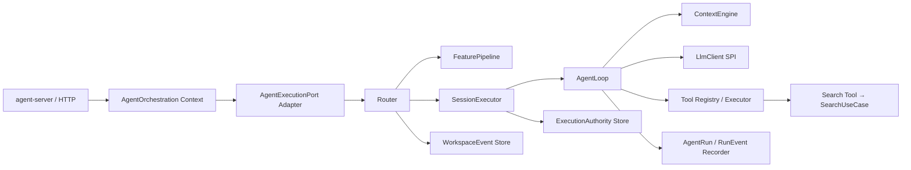

# SeekFlux Agent Runtime 内核设计

本文记录已经实现的 Agent Runtime 细节。系统全局目标见 [`SeekFlux.md`](../SeekFlux.md)，阶段状态见[学习路线](learning/README.md)，长期决策见 [ADR-004](adr/ADR-004-ark-leto-inspired-agent-runtime.md)。

## 1. 实现口径

SeekFlux 没有依赖 Ark-Leto 二进制或源码。当前实现参考《Ark-Leto 框架内核 与 Agentspark 主链路 原理详解》中的主链路、会话事件和执行权思想，自行实现内部 Runtime。类名相似只代表设计映射，不代表复制或集成了未提供的框架。

Phase 1 的目标是证明一个业务无关、有界、可追踪、能稳定回退的运行内核；真实大模型推理、多轮约束和多实例恢复在后续阶段完成。

## 2. 模块职责



| 模块 | 已实现职责 | 禁止拥有的职责 |
| --- | --- | --- |
| `platform/agent-runtime` | Router、Feature、Session 执行、有限步 Loop、上下文、Tool、运行事件 | Search 约束语义、Spring、模型厂商 SDK、Redis/ES 访问 |
| `contexts/agent-orchestration-context` | SearchGoal、QueryConstraintSet、追问与回退业务状态、输入/输出 Port | 线程池、租约实现、HTTP、直接检索索引 |
| `apps/agent-server` | Spring 装配、HTTP、Redis/JDBC/Search Tool/决策 Provider Adapter | 在 Controller 内规划或过滤结果 |
| `platform/persistence` | Session 追加事件、最新投影、Run/RunEvent 持久化 | Agent 业务决策 |

## 3. 主链路

```mermaid
sequenceDiagram
    autonumber
    participant Client
    participant Router
    participant Feature as FeaturePipeline
    participant Authority as ExecutionAuthority
    participant Store as SessionStore
    participant Executor as SessionExecutor
    participant Loop as AgentLoop
    participant LLM as LlmClient
    participant Tool as SearchDirectTool
    participant Search as SearchUseCase

    Client->>Router: AgentRunRequest
    Router->>Feature: process
    Feature-->>Router: frozen RuntimeContext
    Router->>Authority: acquire(sessionId)
    alt session 正在执行
        Authority-->>Router: busy
        Router-->>Client: 409 AGENT_SESSION_BUSY
    else 获得执行权
        Router->>Store: commitIngress(requestId, UserMessage)
        alt requestId 已提交
            Store-->>Router: duplicate
            Router-->>Client: 409 DUPLICATE_AGENT_REQUEST
        else 新请求
            Router->>Executor: run
            Executor->>Store: restoreFresh
            Executor->>Loop: run
            Loop->>LLM: chat(assembled context)
            LLM-->>Loop: CallTool
            Loop->>Tool: validated invocation
            Tool->>Search: SearchUseCase.search
            Search-->>Tool: SearchResult + SearchTrace
            Loop->>LLM: chat(context + observation)
            LLM-->>Loop: Complete
            Executor->>Store: appendOutcome
            Executor->>Authority: release owner
            Loop-->>Client: RESULTS_READY + AgentTrace + SearchTrace
        end
    end
```

最重要的位置约束是“先取得执行权，再提交用户消息”。否则两个实例可能先后提交两条都声称可执行的消息，之后再争抢锁已经无法消除双写。释放时先移除本机 CancellationToken，再按 owner 比较释放租约，避免误删新 owner 的执行权。

## 4. FeaturePipeline

FeatureNode 不依赖 Spring 扫描顺序，装配层明确传入列表，Pipeline 再按 `order()` 排序：

| 顺序 | 节点 | 输出 |
| ---: | --- | --- |
| 100 | SessionLoad | 现有 Session 投影 |
| 200 | AgentResolve | AgentDef、LlmClient 和冻结版本上下文 |
| 300 | ParamInit | 规范化运行参数 |
| 400 | ResumeEval | 当前是否具备继续执行条件 |

持久数据与请求瞬态数据分别放在 `FeatureContext` 和 `RuntimeContext`，避免把线程、连接或临时 Publisher 序列化进 Session。

## 5. Session、Run 与 PushEvent

三类事件职责独立：

| 类型 | 存储/生命周期 | 用途 |
| --- | --- | --- |
| `WorkspaceEvent` | PostgreSQL 追加式事实源 | 重建 Session：Created、UserMessage、RunCompleted/Cancelled/Failed |
| `AgentRunEvent` | PostgreSQL 独立运行表 | 诊断每次 Decision、Tool 和终态，关联版本及 Search Trace ID |
| `PushEvent` | 请求内 Publisher；当前不持久化 | 客户端过程投影；Phase 1 同步响应内按逻辑顺序缓冲 |

PostgreSQL 的 `agent.sessions` 保存最新版本、事件位置和快照，`agent.workspace_events` 以 `(session_id, event_position)` 排序，并以 `(session_id, request_id)` 保证 Ingress 幂等。`agent.runs` 与 `agent.run_events` 不参与 Workspace 重放。Redis 只保存热投影和执行权，不是 Session 真相源。

## 6. 有限步 AgentLoop

`AgentRuntime` 对每次运行建立共同 Deadline，并冻结以下版本：Agent、Planner、Prompt、Decision Provider、Tool Schema。每一步只接受四种结构化 Decision：

- `CallTool`：先校验 Tool 是否允许、参数 Schema、Tool 次数和 Deadline，再由 ToolExecutor 执行；
- `Complete`：结束为 `RESULTS_READY`；
- `Clarify`：结束为 `NEED_CLARIFICATION`；
- `Fallback`：结束为 `FALLBACK_REQUIRED`，由业务 Adapter 决定确定性回退。

执行器是命名、有界线程池；超时会取消 Future，队列饱和产生稳定失败原因。Runtime 不使用公共线程池，也不把异步类型暴露到 Port 或 HTTP。

## 7. Search Agent

当前提供两个 AgentDef：

| Agent | 版本 | 最大步数 | Tool |
| --- | --- | ---: | --- |
| `search-assistant` | `search-assistant-v1` | 3 | `search_direct@search-direct-tool-v1` |
| `search-precise` | `search-precise-v1` | 2 | `search_direct@search-direct-tool-v1` |

二者复用同一 Runtime 和 `DeterministicSearchLlmClient@deterministic-search-decision-v1`。该 Provider 的作用是无需 API Key 即可稳定验证“追问或调用 Search Tool → 观察结果 → 完成”的编排契约；它不代表真实 LLM。接入真实 Provider 时只实现 `LlmClient.chat(AssembledContext)`，并保留现有 AgentDef、Tool、Session 和 Eval 作为回归对照。

`SearchDirectTool` 只调用 `SearchUseCase`。Tool 成功后，Agent Step 中的 `linkedTraceId` 指向权威 Search Trace；Agent Trace 不复制或改写检索来源。模型/Tool/Runtime 无法完成时，Adapter 使用原 SearchGoal 调用同一个 Search Use Case，响应模式为 `AGENT_TO_DIRECT_FALLBACK`。

## 8. API 与运行

Agent Server 默认端口为 `8083`，避免与可选 Flink UI 的 `8082` 冲突：

```bash
./seekflux.sh up
./seekflux.sh status
./seekflux.sh logs agent
```

同步 API：

```http
POST /v1/agent/search
POST /v1/agent/sessions/{sessionId}:cancel
```

搜索响应同时返回稳定业务状态、`AgentTrace` 和可选的 `SearchTrace`。完整请求/响应 Schema 见 [`contracts/openapi/seekflux-v1.yaml`](../contracts/openapi/seekflux-v1.yaml)。

## 9. 验证和当前边界

```bash
mvn -pl platform/agent-runtime,contexts/agent-orchestration-context,apps/agent-server -am test
python3 evals/run_agent_search_eval.py
```

固定 `direct-search-v1` 六 Query 基线上，Agent 与 Direct 的 `Recall@5/MRR@5/nDCG@5` 均为 `1.0`，Top1 Agreement 与 Overlap@5 均为 `1.0`。这证明 Agent 正确复用了 Direct Search，不证明 Agent 已产生质量增益。

Phase 1 尚未完成真实 LLM、复杂 Query 路由、多轮约束补丁、动态/并行工具、多副本恢复、跨实例取消、实时 Push/SSE、HITL、子 Agent、MCP、完整 OTel 和故障注入。这些边界不能因为已经有租约、取消接口或扩展 Port 就提前标记为完成。

