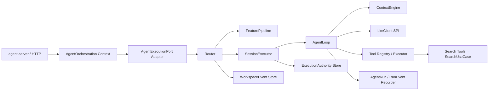

# SeekFlux Agent Runtime 内核设计

本文记录已经实现的 Agent Runtime 细节。系统全局目标见 [`SeekFlux.md`](../SeekFlux.md)，阶段状态见[学习路线](learning/README.md)，后续模块实施与每轮交付证据见 [Agent Runtime 演进路线](../platform/agent-runtime/ROADMAP.md)，长期决策见 [ADR-004](adr/ADR-004-ark-leto-inspired-agent-runtime.md)。

## 1. 实现口径

SeekFlux 没有依赖 Ark-Leto 二进制或源码。当前实现参考《Ark-Leto 框架内核 与 Agentspark 主链路 原理详解》中的主链路、会话事件和执行权思想，自行实现内部 Runtime。类名相似只代表设计映射，不代表复制或集成了未提供的框架。

Phase 1 已证明业务无关、有界、可追踪、能稳定回退的运行内核；Phase 2 完成 Query Mode、多轮约束、动态并行 Tool、OpenAI-compatible Provider Adapter 和复杂 Query Eval；Phase 3 已补齐 fencing、失主接管、跨实例取消、事务 Outbox、故障注入、Shadow 与成本计量边界。后续 AR-1～AR-9A 已进一步完成原因化取消、完整消息历史、精确恢复、`MUTATING` Tool 副作用账本、持久 Steer Queue/Drain、上下文预算/压缩、400/413 与 OutputGuard、真实模型流、实时 Push、跨实例重连、安全 Eager Tool、持久等待/HITL/异步恢复，以及 Skill/ToolGroup 的作用域、版本冻结和动态路由。

## 2. 模块职责


```mermaid
flowchart LR
    API["agent-server / HTTP"] --> AO["AgentOrchestration Context"]
    AO --> ADAPTER["AgentExecutionPort Adapter"]
    ADAPTER --> ROUTER["Router"]
    ROUTER --> PIPE["FeaturePipeline"]
    ROUTER --> EXEC["SessionExecutor"]
    EXEC --> LOOP["AgentLoop"]
    LOOP --> CTX["ContextEngine"]
    LOOP --> LLM["LlmClient SPI"]
    LOOP --> TOOLS["Tool Registry / Executor"]
    TOOLS --> SEARCH["Search Tools → SearchUseCase"]
    ROUTER --> SESSION["WorkspaceEvent Store"]
    LOOP --> RUNS["AgentRun / RunEvent Recorder"]
    EXEC --> AUTH["ExecutionAuthority Store"]
```

| 模块 | 已实现职责 | 禁止拥有的职责 |
| --- | --- | --- |
| `platform/agent-runtime` | Runtime Domain/Application、纯 Java 默认实现，以及 Redis 执行权/取消/Shadow 配置 | SearchGoal、Search Tool、模型厂商协议、HTTP 或 Elasticsearch 业务访问 |
| `contexts/agent-orchestration-context` | SearchGoal/ConstraintPatch、SearchPlan、Query Mode、输入/输出 Port，以及 Runtime/Search/LLM Provider/投影/指标业务 Adapter | Runtime 通用机制、HTTP 接口、直接访问检索索引 |
| `apps/agent-server` | `interfaces/rest`、Spring Boot 启动和最终 Bean 装配 | Runtime/Context/技术 Adapter 的具体实现，在 Controller 内规划或过滤结果 |
| `platform/persistence` | Session 追加事件、最新投影、Run/RunEvent 持久化 | Agent 业务决策 |

### 2.1 Runtime 内部 DDD 分层

`platform/agent-runtime` 已按领域、应用和基础设施三层组织；Domain/Application 不依赖 Spring，具体技术依赖只允许出现在 Infrastructure。接口层位于外层应用模块：

```text
platform/agent-runtime/.../agentruntime/
├── domain/
│   ├── model/
│   │   ├── agent/definition/  # AgentDefinition：版本、工具集和执行限制
│   │   ├── decision/          # AgentDecision 领域决策
│   │   ├── run/               # Run 结果、事件、Trace、终态和 usage
│   │   ├── session/           # Session、WorkspaceEvent、状态补丁与提交结果
│   │   ├── tool/              # Tool Schema、参数、调用、结果和观察
│   │   ├── capability/        # Skill、ToolGroup、激活状态和冻结快照
│   │   ├── sideeffect/        # 写 Tool 账本、状态与对账结论
│   │   ├── feature/           # Feature 与 Runtime 执行上下文
│   │   └── execution/         # 取消令牌等执行期领域状态
│   ├── service/
│   │   ├── runtime/           # Runtime 总编排
│   │   ├── router/            # 请求路由
│   │   ├── execution/         # Session 执行、fencing 与调用保护
│   │   ├── loop/              # 有限步 Agent Loop
│   │   ├── feature/           # Feature Pipeline
│   │   ├── context/           # 上下文组装
│   │   ├── capability/        # 能力作用域解析、权限收缩和恢复校验
│   │   ├── tool/              # Tool 注册与选择
│   │   └── shadow/            # Shadow 控制
│   └── exception/             # 会话冲突、执行 fencing 等领域异常
├── application/
│   ├── api/                   # 业务调用 Runtime 的能力及其 API DTO
│   ├── command/               # AgentRunRequest、FeatureRequest 等输入命令
│   └── spi/
│       ├── business/          # 业务可定制：Planner、Tool、FeatureNode、ContextEngine
│       └── capability/        # Runtime 所需：Session、LLM、执行权、记录与事件
└── infrastructure/
    ├── event/                 # 默认 PushEvent publisher
    ├── llm/                   # Shadow LLM 装饰器
    ├── prompt/                # 内存 Prompt resolver
    ├── tool/                  # 默认 Tool executor
    └── redis/                 # 执行权、取消、Shadow 配置的 Redis 实现

contexts/agent-orchestration-context/
├── domain/                    # Search Agent 领域语义
├── application/、port/        # 用例与输入/输出契约
└── infrastructure/
    ├── runtime/               # AgentExecutionPort → Runtime Router
    ├── search/、tool/         # Direct Search 与 Search Agent Tool
    ├── session/、projection/  # 会话目标和 Redis 热投影
    ├── llm/                   # 确定性决策与 OpenAI-compatible LlmClient Adapter
    └── observability/         # Agent 执行指标

apps/agent-server/.../agentserver/
├── interfaces/rest/          # HTTP Controller、DTO 和异常映射
├── bootstrap/                # Spring Bean 组合装配
└── AgentServerApplication    # 可独立部署的进程入口
```

`application` 是 Runtime 的纯契约面，不保存业务编排：业务通过 `application/api` 调用 Runtime，通过 `application/command` 传入请求；Runtime 通过 `application/spi` 调用由业务或运行环境提供的能力。API/SPI 专属 DTO 与对应契约就近放置，不再建立笼统的 `application/model`、`application/port` 或 `application/service`。

`spi/business` 承载 Agent Planner、Tool、Feature 和上下文组装等业务扩展；`spi/capability` 承载 LLM、Session、执行权、记录和事件发布等运行能力。`domain/model` 保存各组件自身的状态与规则，`domain/service` 保存 Runtime、Router、Loop、Feature、Context、Tool、执行权和 Shadow 之间的编排。Runtime 的 `infrastructure` 只提供由 Runtime 拥有且与具体 Agent 业务无关的默认实现；模型厂商协议及其到业务 Decision 的转换由 Context Infrastructure 实现对应 SPI。

具体调用关系是：`业务/interfaces → Context 输入 Port → Context 应用服务 → Context 输出 Port ← Context infrastructure → Runtime application/api`；Runtime 的 `domain/service → application/spi ← Runtime infrastructure`。Domain/Application 不依赖具体 Infrastructure，实现依赖由组合根注入。`apps/agent-server` 只是可部署宿主和组合根，不是第三层业务逻辑；它选择实现并管理 Spring/线程池生命周期。此次调整改变了 Java 包名和仓库内调用方，但没有改变方法体、HTTP/OpenAPI 契约、事件 Schema 或运行语义。

## 3. 主链路

```mermaid
sequenceDiagram
    autonumber
    participant Client
    participant Router
    participant Feature as FeaturePipeline
    participant Authority as ExecutionAuthority
    participant Store as SessionStore
    participant Executor as SessionExecutor
    participant Loop as AgentLoop
    participant LLM as LlmClient
    participant Tool as Search Tools
    participant Search as SearchUseCase

    Client->>Router: AgentRunRequest
    Router->>Feature: process
    Feature-->>Router: frozen RuntimeContext
    Router->>Authority: acquire(sessionId)
    alt session 正在执行
        Authority-->>Router: busy
        Router-->>Client: 409 AGENT_SESSION_BUSY
    else 获得执行权
        Router->>Store: commitIngress(requestId, UserMessage)
        alt requestId 已完成或正在由有效 owner 处理
            Store-->>Router: duplicate
            Router-->>Client: 409 DUPLICATE_AGENT_REQUEST
        else 崩溃中的同 requestId 被更高 fencing token 接管
            Store-->>Router: recovered
            Router->>Executor: 强一致恢复并创建新 attempt
        else 新请求
            Router->>Executor: run
            Executor->>Store: restoreFresh
            Executor->>Loop: run
            Loop->>LLM: chat(assembled context)
            LLM-->>Loop: CallTool / CallTools
            Loop->>Tool: validated bounded invocation(s)
            Tool->>Search: SearchUseCase.search
            Search-->>Tool: SearchResult + SearchTrace
            Loop->>LLM: chat(context + observation)
            LLM-->>Loop: Complete
            Executor->>Authority: final renew / fence check
            Executor->>Store: appendOutcome + Outbox in one transaction
            Executor->>Authority: release owner
            Loop-->>Client: RESULTS_READY + AgentTrace + SearchTrace
        end
    end
```

最重要的位置约束是“先取得执行权，再提交用户消息”。否则两个实例可能先后提交两条都声称可执行的消息，之后再争抢锁已经无法消除双写。Redis 原子分配单调 fencing token，PostgreSQL 只接受当前 token 的终态；释放时先移除本机 CancellationToken，再按 owner 比较释放租约，避免误删新 owner 的执行权。

## 4. FeaturePipeline

FeatureNode 不依赖 Spring 扫描顺序，装配层明确传入列表，Pipeline 再按 `order()` 排序：

| 顺序 | 节点 | 输出 |
| ---: | --- | --- |
| 100 | SessionLoad | 现有 Session 投影 |
| 200 | AgentResolve | AgentDef、LlmClient 和冻结版本上下文 |
| 250 | CapabilityResolve | Session + request 能力解析与不可变快照 |
| 300 | ParamInit | 规范化运行参数并装入能力快照 |
| 400 | ResumeEval | 当前是否具备继续执行条件 |

持久数据与请求瞬态数据分别放在 `FeatureContext` 和 `RuntimeContext`，避免把线程、连接或临时 Publisher 序列化进 Session。

## 5. Session、Run 与 PushEvent

三类事件职责独立：

| 类型 | 存储/生命周期 | 用途 |
| --- | --- | --- |
| `WorkspaceEvent` | PostgreSQL 追加式事实源 | 重建 Session：Created、StatePatched、CapabilitiesChanged、User/Assistant/ToolResult、Wait、Run 终态 |
| `AgentRunEvent` | PostgreSQL 独立运行表 | 诊断每次 Decision、Tool 和终态，关联版本及 Search Trace ID |
| `PushEvent` | 有界内存 history + Redis Pub/Sub relay；不持久化 | 客户端过程投影；SSE 按 Session sequence 增量消费和断线重连 |

PostgreSQL 的 `agent.sessions` 保存最新版本、状态版本、事件位置、快照和当前 fencing token，`agent.workspace_events` 以 `(session_id, event_position)` 排序。UserMessage 的 `(session_id, request_id)` 部分唯一索引保证 Ingress 幂等，同一 request 下允许追加多个 Assistant/ToolResult；每条消息还有全局唯一 `message_id`、Schema 版本和可选 `tool_call_id`。状态补丁和 UserMessage 在同一事务中提交，旧 `baseVersion` 不能覆盖新目标。本轮 Assistant/ToolResult、终态 WorkspaceEvent 与 `outbox.events` 在同一 fencing 事务中按连续 position 提交，外部不会看到半轮历史。Worker 按确定性 `eventId` 幂等写入 `agent.audit_events`。`agent.runs` 与 `agent.run_events` 记录每个失主/接管 attempt，但不参与 Workspace 重放。Redis 只保存热投影、执行权、取消信号和 Shadow 开关，不是 Session 真相源。

`ChatChunk` 把 Provider 流统一为 content/reasoning/usage/finish/tool-call delta；Tool Call 按 index 严格组装，chunk sequence 不连续会失败关闭。`DefaultPushEventStream` 把 Runtime 事件包装成 `PushFrame`，Redis `INCR` 分配跨实例 Session sequence，Pub/Sub frame 使用 `sourceId` 防回环。内存 history、每订阅者队列、Session 数量和 SSE 执行器均有硬上限；慢消费者溢出即断开。`POST /v1/agent/search:stream` 仅在没有 `Last-Event-ID` 时创建执行，重连只 replay/订阅，避免重复请求。逻辑契约见 [`agent-push-frame-v1.schema.json`](../contracts/events/agent-push-frame-v1.schema.json)，安全边界见 [ADR-011](adr/ADR-011-agent-streaming-push-and-eager-tool-safety.md)。

STEER/QUEUE 的接收事实同样写入 `workspace_events`，事件类型为 `QUEUED_USER_MESSAGE`。V12 以 `(message_id, event_type)` 保证排队与正式 UserMessage 各自唯一，并以 `(session_id, event_type, event_position)` 支持 FIFO 读取；相同 request 在 pending 和 consumed 两个生命周期都保持幂等。队列默认每个 Session 最多 32 条，可用 `seekflux.agent.steer.queue-max-depth` 调整。逻辑契约见 [`agent-steer-queue-v1.schema.json`](../contracts/events/agent-steer-queue-v1.schema.json)。

`agent.runtime_checkpoints` 和 `agent.tool_call_journal` 是执行恢复事实，不替代 Workspace。Checkpoint 使用 Workspace `messageCutoff` 防止旧运行态覆盖新历史；journal 使用稳定 Tool Call ID、参数 SHA-256 摘要、effect、attempt 和状态判断一次调用是否从未提交、正在进行、结果已知或状态不明。Outcome/Outbox 成功提交后，这两类临时恢复事实在同一数据库事务删除。

`agent.tool_side_effect_ledger` 是长期保留的写副作用事实，不随 Session Outcome 清理。它只服务 `MUTATING` Tool：以稳定 Tool Call ID 派生全局唯一幂等键，在外部请求前依次持久化 `PREPARED` 和 `EXECUTING`，外部返回后先保存 `SUCCEEDED/FAILED`、结果摘要和外部回执，再推进 Tool journal、Checkpoint 与 Session。接管或取消把遗留 `EXECUTING` 收敛为 `UNKNOWN`；Runtime 不会重放该写操作，而是调用 Tool 的 `AgentToolReconciler` 查询外部状态或执行 Tool 自己定义的补偿，成功判定后写 `RECONCILED`。无 reconciler 或外部仍无法判定时抛出 `MUTATING_TOOL_STATE_UNKNOWN` 并保留账本，交由人工处理。逻辑契约见 [`agent-tool-side-effect-ledger-v1.schema.json`](../contracts/events/agent-tool-side-effect-ledger-v1.schema.json)。

Assistant 正文、reasoning 和 tool calls 分字段持久化；当前 Provider reasoning 默认不可重放，只有事件显式允许时 ContextEngine 才把它加入后续模型输入。ToolResult 以 toolCallId 与 Assistant 调用一一对应，状态覆盖 `SUCCEEDED/FAILED/CANCELLED/TIMED_OUT/WAITING`，同时保存不可变 raw contents、模型文本、UI display contents、structured data、resources 和错误/Trace 信息。Session 重放拒绝孤立、重复或缺失的 ToolResult，并把 Clarification 终态投影为 `SUSPENDED`。逻辑契约见 [`agent-workspace-message-v1.schema.json`](../contracts/events/agent-workspace-message-v1.schema.json)。

## 6. 有限步 AgentLoop

`AgentRuntime` 对每次运行建立共同 Deadline，并冻结以下版本：Agent、Planner、Prompt、Decision Provider、请求级 Tool Schema 子集。每一步接受以下结构化 Decision：

- `CallTool`：先校验 Tool 是否允许、参数 Schema、Tool 次数和 Deadline，再由 ToolExecutor 执行；
- `CallTools`：在同一总预算下把多个调用提交给有界执行器；部分成功继续，全部失败回退；
- `Complete`：结束为 `RESULTS_READY`；
- `Clarify`：结束为 `NEED_CLARIFICATION`；
- `Fallback`：结束为 `FALLBACK_REQUIRED`，由业务 Adapter 决定确定性回退。

Tool 参数校验失败后只做一次不改变业务意图的确定性修复；相同规范化 Tool 指纹再次出现时返回 `NO_PROGRESS_DETECTED`。执行器是命名、有界线程池；超时会取消 Future，队列饱和产生稳定失败原因。Runtime 不使用公共线程池，也不把异步类型暴露到 Port 或 HTTP。

每个模型 Decision 都形成 AssistantMessage；Tool Decision 先记录按 index 排序的稳定 Tool Call，随后为每个调用形成唯一 ToolResultMessage，最后的 Complete/Clarify/Fallback 再形成 AssistantMessage。消息同时关联 request、turn、segment、agentRun/attempt 和 call；STEER drain 后使用新请求的稳定身份形成下一 segment，所有被批量提升的 UserMessage 都按 FIFO 保留在历史中。消息 ID 和 Tool Call ID 由 session/request/turn/step/index 等稳定输入确定，接管重跑不会随机改变关联键。`DefaultContextEngine` 下一轮只读取 Workspace 事件，按 position 还原 User → Assistant → Tool 历史；本轮内存 observation 只用于尚未提交的当前 Loop。

取消使用同一棵 Session → batch → individual Tool token 传播。`USER_CANCEL`、`STEER`、`AUTHORITY_LOST` 和 `SHUTDOWN` 采用 first-cause-wins，Redis 信号一次读出时间与原因并过滤旧任务残留；Runtime 在步骤边界以及模型/Tool 调用前后检查 token，等待 Future 时每 10ms 检查一次并在取消后发出线程中断。模型或 Tool 即使晚到返回也不能继续推进 Loop。取消结果固定为 `CANCELLED`，不会转成 `FAILED` 或 `FALLBACK_REQUIRED`，并在 Run、Trace、Push、HTTP 响应和 PostgreSQL `agent.runs.cancellation_reason` 中使用同一个 `cancellationReason`。Runtime 产出 Outcome 是取消与正常完成的线性化点，Session 提交前的 fencing 校验仍是防止旧 owner 晚到写入的最终屏障。

### 6.1 Steer Queue/Drain

请求用 `ingressMode` 显式选择 `NEW_EXECUTION`、`STEER` 或 `QUEUE`。普通请求在已有 owner 时返回 BUSY；STEER 先原子提交排队事件，成功后才以相同时间戳写 Redis `STEER`，因此取消写失败或实例退出都不会丢消息；QUEUE 只接受 `SUSPENDED` Session，不中断任务，其他状态返回 `SESSION_NOT_WAITING`。队列达到上限返回 `STEER_QUEUE_FULL`，重复的 pending 请求幂等返回 QUEUED，已经消费的重复请求返回 DUPLICATE。

当前 owner 在一个 segment 提交 Outcome 后继续持权 drain：强读 Session，以 fencing token 原子提升当前所有排队事件，逐条形成正式 UserMessage，并由最后一条请求的身份、请求上下文和状态补丁驱动下一 segment；agent/model/prompt/eval/manifest/chained/LLM 等请求级 override 会在 segment 边界清理。提升后先清除不晚于批次 cutoff 的旧 STEER，再建立从该 cutoff 开始的新取消 token，所以更晚 STEER 和真实 `USER_CANCEL` 不会被误删。提升后崩溃通过已提升 Workspace 事实恢复；drain 边界失权则由后续 owner 接管。typed wait 恢复成终态后复用同一 drain 机制消费等待期间积压的 QUEUE；等待未解决时不会提前提升消息。

模型和 Tool 还受两个独立 Bulkhead 保护，分别返回 `MODEL_BULKHEAD_FULL` 和 `TOOL_BULKHEAD_FULL`；故障注入只存在于 Runtime 调用边界，不要求业务 Tool 编写测试分支。Tool Call ID 由 request/step/tool/规范化参数确定性生成，Tool 同时声明副作用类型。`READ_ONLY/IDEMPOTENT` 使用稳定 Call ID 安全重试；`MUTATING` 还要求注册权限、运行时 `ALLOW/MODIFY/DENY/NEED_APPROVAL` 策略、持久账本和稳定幂等键。每次调用建立独立不可变 `AgentToolContext`，before/after/failure 观察携带 source、effect、attempt 和耗时。

### 6.2 Checkpoint 与恢复协议

Runtime 在每次模型调用前保存 `PRE_TURN`，完成一批 Tool 后保存 `POST_TURN`，返回 Outcome 前保存 `COMPLETED` 或 `SUSPENDED`。Checkpoint 只包含可序列化状态：request/turn/attempt、fencing token、Workspace cutoff、冻结定义和 Tool Schema 版本、下一 Step、Tool 次数、剩余预算、持久 features、observations、当前消息、调用指纹、usage 与 Step Trace；LLM client、Publisher、线程对象、临时参数和请求级瞬态 override 不进入 Checkpoint。序列化失败会阻止安全点提交，不会静默保存半份状态。

Tool 决策与对应 Assistant 在 journal 中先落为 `DECIDED`；真正提交执行器前变为 `EXECUTING`；结果按单个 call 落为 `SUCCEEDED/FAILED/CANCELLED/TIMED_OUT`。新 owner 在续租和 `restoreFresh` 后，通过受 fencing 保护的 `commitResume` 把遗留执行态原子改为 `UNKNOWN`，再得到有限 `ResumeAction`。已完成 Tool 直接复用 observation；`READ_ONLY/IDEMPOTENT` 可用原 Tool Call ID 重试；`MUTATING` 则按账本的 `PREPARED` 首次执行、已知终态复用或 `UNKNOWN` 对账三条路径恢复，绝不从 `UNKNOWN` 重放原写请求。

当前统一内部入口由版本化 `ResumeIngress` 表达。用户消息、崩溃接管和 `WaitResolution` 都先在 execution authority/fencing 下提交持久事实，再 dispatch 到同一恢复主链；外部回调不能直接调用 Loop。恢复逻辑契约见 [`agent-recovery-v1.schema.json`](../contracts/events/agent-recovery-v1.schema.json)。

### 6.3 上下文治理与输出保护

`ContextLayer` 显式区分稳定前缀、Agent 运行指令、动态能力与完整 Tool Schema、Workspace、压缩摘要、历史消息和本轮 recall；无状态 `ContextRenderer` 展平这些层并按完整消息估算 Token。System、当前 User、最近完整 turn 和本轮 recall 不参与无摘要截断；历史只在完整 turn 边界推进 cutoff，因此 Assistant Tool Call 与对应 ToolResult 不会被拆开。

`DefaultContextEngine` 每次 assemble 只读取一次最新 `CompactionSummary`，并依据 `ContextWindowPolicy` 选择 `NONE/ASYNC/SYNC`。ASYNC 使用有界单线程执行器和 Session single-flight；硬限额或 Provider overflow 使用确定性 Skeleton 强压缩。摘要先追加到 PostgreSQL `agent.context_compactions`，以 `fromExclusive → inclusiveCutoff` 连续推进，当前没有另设 Redis 热投影。压缩不能继续时保留受保护上下文并发出 `COMPACTION_NOOP/COMPACTION_EXHAUSTED`，禁止用删除原文但不产摘要的截断伪装成功。逻辑契约见 [`agent-context-compaction-v1.schema.json`](../contracts/events/agent-context-compaction-v1.schema.json)。

同步 OpenAI-compatible Adapter 把无模型输出的 HTTP 413，以及带已知上下文超长 marker 的 HTTP 400 映射为 `ContextOverflowException`。`DefaultAgentLoop` 最多按配置以 `OVERFLOW_FALLBACK` 重组并重试，耗尽后稳定映射为 `LLM_CONTEXT_OVERFLOW_EXHAUSTED`；同步协议不存在已发 chunk 后重试。结构化 Decision 的 OutputGuard 支持 accept、有限 repair、degrade 和 fail；repair 使用原请求 Deadline 与 CancellationToken，降级不会把非法原始文本写进 Assistant 历史。格式保护与业务内容安全分层，内容安审应通过独立策略 Adapter 接入。生命周期契约见 [`agent-context-event-v1.schema.json`](../contracts/events/agent-context-event-v1.schema.json)。

### 6.4 持久等待、HITL 与异步恢复

Runtime 用独立 `WAITING` 结果表示当前 segment 已挂起，Session 将 `WAIT_SUSPENDED` 投影为
`SUSPENDED`。`WaitState` 区分 HITL、Async Task、Waitpoint、Handoff 和 Child Agent，并保存
wait/session/request/turn/checkpoint/tool call、创建时间和 deadline。普通新请求和 STEER 不能越过
typed wait；只有 `QUEUE` 可以可靠积压，外部恢复只能调用 `Router.resume`。

Tool 策略返回 `NEED_APPROVAL` 时，Runtime 在执行 Tool 前保存原 Assistant/Tool 决策；审批通过
后按原 call ID 恢复一次，拒绝、超时和取消形成稳定 ToolResult。Tool 本身也可返回
`WaitRequest.AsyncTask/Waitpoint/Handoff/ChildAgent`；其中 `COMPLETED` 回调直接补 observation 和
ToolResult，不重新派发原异步 Tool。HITL 只接受 approve/deny，其他 wait 只接受 completed，关闭类
决议两边都可用，防止绕过审批或误重派。

`JdbcAgentRecoveryStore` 在同一事务保存 suspended Checkpoint、`WAITING` journal 和
`agent.runtime_waits` pending 行。决议通过行锁、Session fencing 和唯一 pending/resolution 索引执行
first-writer-wins；相同 resolution ID、内容与 actor 的重试忽略服务端接收时间差异并返回 duplicate，
不同晚到结论返回 conflict。HITL/Waitpoint/Handoff 丢失 pending 时 fail-fast；Async/Child 可以从
仍存在的 suspended Checkpoint 重建后接纳 callback。resolved wait 在恢复状态清理后继续保留审计。

执行预算在挂起时冻结，等待时间由审批策略或 Tool WaitRequest 独立声明；`needApproval(reason)`
默认 15 分钟，也可显式传入 Duration。后台 worker 有界扫描
过期 wait 并提交确定性 timeout resolution；人工回调、异步完成、超时和 Session cancel 都使用同一
竞态仲裁。当前 `DelegatedAgentLauncher/ParentChildAgentCoordinator` 只定义子执行的深度、预算、
身份传播和结果回填协议；没有真实产品 launcher、持久父子关系、自动取消级联或 Fork promotion，
Fork 明确返回 `FORK_PROMOTION_UNSUPPORTED`。完整决策见
[ADR-012](adr/ADR-012-agent-durable-wait-and-resume.md)，事件契约见
[`agent-wait-lifecycle-v1.schema.json`](../contracts/events/agent-wait-lifecycle-v1.schema.json)。

### 6.5 Skill、ToolGroup 与能力快照

`CapabilityCatalog` 保存版本化 `SkillDefinition` 和 `ToolGroupDefinition`；`AgentDefinition.skillRefs`
只声明可引用范围，`allowedTools` 始终是不可扩大的最大权限。FeaturePipeline 在每次 execution 开始
时用 Session 激活投影和 `CapabilityRequest` 生成 `CapabilitySnapshot`，冻结 Catalog hash、Skill /
Group / Tool Schema 版本、active/ephemeral 集合、请求限制与最终 Tool 集。快照及其内容指纹进入
Checkpoint、Trace 和 Context，因此一次 execution 内不会因配置变化而混用定义；恢复时缺少同一
Catalog 或 Tool Schema 版本会失败关闭。

Session 激活由 `PUT /v1/agent/sessions/{sessionId}/capabilities` 修改，并以带 actor、operationId、
baseVersion 和完整 delta 的 `CAPABILITIES_CHANGED` Workspace 事实投影。数据库在 Session 行锁下
仲裁严格幂等和版本冲突；执行中或持久等待的 Session 不可修改，IDLE/上一轮 COMPLETED 是安全
边界。请求级 ephemeral Skill 必须声明 `REQUEST`
来源并满足数量/内容上限，同名时完整 shadow 全局版本，但不会进入 Session 投影；Queue drain 会
在安全边界按最新 Session 状态和被提升请求重新解析。

有效 Tool 每个模型轮都从冻结快照读取。普通组受激活集和请求限制约束，未归组 Tool 保持 AgentDef
默认可见，`alwaysActive` 控制组不被业务缩减隐藏。内置 `switch_tool_groups` 只接受 Catalog 中的
group，并在当前 Tool batch 结束后更新快照，因此只影响下一模型轮；实际调用仍需经过注册表、
Schema、执行策略和副作用安全检查。Context 分别渲染 ephemeral、active 和 lazy Skill，能力事件
通过 RunEvent、Push 和低基数 Micrometer 指标观察。完整决策见
[ADR-013](adr/ADR-013-agent-capability-snapshot-and-routing.md)，持久事件契约见
[`agent-capability-lifecycle-v1.schema.json`](../contracts/events/agent-capability-lifecycle-v1.schema.json)。

### 6.6 MCP Tool 来源与连接治理

MCP 以 Agent Orchestration Infrastructure Adapter 接入，不改变 Loop。`McpConnectionManager` 只实现
协议版本 `2025-11-25` 的 Streamable HTTP Tool 子集，启动时尽力发现、断线后懒重连，并按
`mcp:{serverId}` 原子替换或摘除来源；远端 Tool 映射为 `{serverId}__{remoteToolName}`，跨来源冲突
直接拒绝。本地 Search Tool 和其他 MCP server 不受单一 server 故障影响。

远端 Schema 是不可信输入：`McpSchemaTranslator` 限制字节、深度、节点、字段和可用类型；effect、
审批、tenant/user allowlist、响应上限和可选 reconciliation Tool 由本地配置决定。凭据配置只保存
`env:NAME` 引用，每次请求即时解析，不进入 Workspace、Checkpoint、Trace、事件或日志。Agent API
把网关认证后的 `X-Tenant-Id/X-User-Id` 传播到 ToolContext 做本地授权，但 ContextEngine 会在模型
可见属性中剔除这两个字段。

`AgentToolRegistry` 现在支持按来源原子热更和有限旧版本索引。`CapabilitySnapshot` v2 冻结 execution
开始时实际已注册的 Tool 集；MCP Schema version 同时覆盖 server config、本地 policy、远端输入
Schema 和 status Tool Schema hash。断线或热更后旧 execution 不会静默调用新定义：只有当前连接仍
提供同一版本才执行，否则返回版本不可用；v1 能力快照继续按旧指纹恢复。

每 server 有独立 connect/request timeout、bulkhead、连续失败熔断、在途 client 退役和响应读取上限。
本地取消会取消 HTTP Future 并尽力发送 MCP `notifications/cancelled`。`MUTATING` MCP Tool 继续使用
AR-4 ledger；未知结果不因重连重放原调用，只能通过显式配置且经过 Schema 校验的只读 status Tool
按 `idempotencyKey/toolCallId` 对账，否则保持 `UNKNOWN`。Actuator health 和
`seekflux.agent.mcp.*` Metrics 只暴露受控状态/版本/原因。完整取舍见
[ADR-014](adr/ADR-014-mcp-tool-source-and-trust-boundary.md)，事件契约见
[`agent-mcp-lifecycle-v1.schema.json`](../contracts/events/agent-mcp-lifecycle-v1.schema.json)。

最小配置示例（默认 `enabled=false`）：

```yaml
seekflux:
  agent:
    mcp:
      enabled: true
      servers:
        - id: docs
          config-version: docs-v1
          endpoint: https://mcp.example.com/rpc
          credential-ref: env:DOCS_MCP_TOKEN
          request-timeout: 5s
          max-concurrent-calls: 4
          max-response-bytes: 1048576
          tools:
            - remote-name: lookup
              policy-version: lookup-policy-v1
              effect: READ_ONLY
              approval-required: false
              allowed-tenant-ids: [tenant-a]
              allowed-user-ids: [user-a]
```

## 7. Search Agent

当前提供两个 AgentDef：

| Agent | 版本 | 最大步数 | Tool |
| --- | --- | ---: | --- |
| `search-assistant` | `search-assistant-v2` | 4 | `search_direct@v1`、`search_filtered@v1`、`switch_tool_groups@v1` |
| `search-precise` | `search-precise-v2` | 3 | `search_direct@v1`、`search_filtered@v1`、`switch_tool_groups@v1` |

二者复用同一 Runtime。默认 `DeterministicSearchLlmClient@deterministic-complex-search-decision-v2` 无需 API Key，可以稳定验证“并行 Search Tool → 观察结果 → 选择候选集 → 完成”。Context Infrastructure 中的 `OpenAiCompatibleLlmClient` 实现 Runtime 的 `LlmClient` SPI，负责真实 Chat Completions 兼容协议、结构化 Decision、usage 解析和配置价格换算；协议测试不等同于真实模型质量或付费成本评测，确定性 Provider 的 Trace 会明确 `usageMeasured=false`。

启用 `seekflux.agent.mcp.enabled=true` 后，配置中显式列出的 namespaced MCP Tool 会加入两个 AgentDef
的最大权限，但只有启动发现成功且进入 execution 冻结注册集的 Tool 才会暴露给模型。默认配置关闭
MCP 且 server 列表为空，因此现有 Search Agent 行为不变。

`ShadowingLlmClient` 在独立有界线程池运行候选策略，只同步返回 primary。候选结果、延迟、错误和一致性写入 `agent.shadow_evaluations`；Redis 共享的开关/采样率使任一实例关闭后其他实例下一次请求生效。Shadow 拒绝或失败不会影响主链。

`SearchDirectTool` 和 `SearchFilteredTool` 都只调用 `SearchUseCase`。复杂 Query 同时执行原 Query 宽搜与改写 Query + 派生标签精搜，最终原样复用一个 Search Tool 候选集；Agent 不二次重排。Tool 成功后，Agent Step 中的 `linkedTraceId` 指向权威 Search Trace；模型/全部 Tool/Runtime 无法完成时，Adapter 使用原 SearchGoal 调用同一个 Search Use Case，响应模式为 `AGENT_TO_DIRECT_FALLBACK`。

`AUTO` Query Mode 在进入 Runtime 前分流：简单 Query 直接调用 Search Use Case，返回 `executionMode=DIRECT` 且不创建 AgentRun；复杂 Query 或 ConstraintPatch 才进入 Agent。响应返回 `routeReason`、`SearchPlan`、`goalVersion`、所选 Tool 和候选复用证据。

## 8. API 与运行

Agent Server 默认端口为 `8083`，避免与可选 Flink UI 的 `8082` 冲突：

```bash
./seekflux.sh up
./seekflux.sh status
./seekflux.sh logs agent
```

同步 API：

```http
POST /v1/agent/search
POST /v1/agent/sessions/{sessionId}:cancel
POST /v1/agent/sessions/{sessionId}/waits/{waitId}:resolve
GET  /v1/agent/sessions/{sessionId}/capabilities
PUT  /v1/agent/sessions/{sessionId}/capabilities
GET  /v1/agent/runtime/shadow
PUT  /v1/agent/runtime/shadow
```

同步和 SSE Search 入口可接收可选 `X-Tenant-Id/X-User-Id`；生产环境必须由可信网关注入，Runtime
只把它们用于本地 MCP Tool policy，不把请求头本身当成认证实现。

搜索请求可传 `ingressMode`；排队成功返回 `state=QUEUED` 和当前 `queueDepth`，不执行 Agent 投影或 Direct Search fallback。挂起返回独立 `state=WAITING`、`waitId` 和 `waitType`。wait resolve API 要求 `X-User-Id` 并把它写入决议 actor；宿主仍须在调用 Controller 前完成真实身份认证和租户授权。普通搜索响应同时返回稳定业务状态、`AgentTrace` 和可选的 `SearchTrace`；取消响应的顶层和 Trace 都返回枚举化 `cancellationReason`，且不会执行 Direct Search fallback。完整请求/响应 Schema 见 [`contracts/openapi/seekflux-v1.yaml`](../contracts/openapi/seekflux-v1.yaml)。

## 9. 验证和当前边界

```bash
mvn -pl platform/agent-runtime,contexts/agent-orchestration-context,apps/agent-server,apps/worker-runner -am test
python3 evals/run_agent_search_eval.py
python3 evals/run_complex_agent_eval.py
python3 evals/run_agent_reliability_eval.py
```

固定 `direct-search-v1` 六 Query 基线上，强制 Agent 与 Direct 的 `Recall@5/MRR@5/nDCG@5` 均为 `1.0`，证明基础复用没有回归。`complex-search-v1` 的六条关键词陷阱 Query 中，Direct `MRR@1/Recall@1=0.0`，Agent `MRR@1/Recall@1=1.0`；Tool 选择、任务完成、简单 Direct 路由和多轮版本测试全部通过。

`agent-reliability-v1` 固定评测证明单写者、fencing 单调、重复请求无额外 Tool 事件、事务 Outbox、幂等审计、Shadow 主结果隔离和快速关闭；12 次样本可用性 `1.0`，P95 `226.402 ms`，Fallback `0.0`。旧 owner、跨实例取消、停机取消、模型/Tool 在途取消、取消后禁止下一轮、OpenAI 调用中断、模型/Tool 故障和 Bulkhead 另有自动化测试。AR-3 增加 PRE/POST/终态 Checkpoint、模型后、Tool 提交/结果和未知写 Tool 的固定崩溃测试；AR-4 增加请求前、外部成功未确认、账本成功未推进 Session 和重复恢复测试；AR-5 增加 STEER/QUEUE、容量、FIFO 批量提升、最后意图、幂等、崩溃恢复和 drain 失权测试；AR-6 增加长上下文完整轮次、摘要 no-gap、ASYNC single-flight、400/413 有界重试、OutputGuard 和 repair 取消测试；AR-8A/8B 增加审批只执行一次、Async 不重派、决议类型、幂等/冲突、timeout/callback、等待中取消和投影恢复测试；AR-9A 增加 auto-activate 持久化、ephemeral shadow、越权拒绝、下一轮切组、真实 Search ToolGroup、快照自校验、Context 分层和低基数指标测试；AR-9B 增加协议级 Streamable HTTP/SSE、取消通知、响应上限、source 热更/注销、断线重连、Schema 拒绝、身份隔离、bulkhead、熔断和未知写结果测试。2026-09-19 全仓 67 个测试报告、224 个测试通过；隔离 PostgreSQL 仍为 V1～V15，本阶段没有新增持久表。

对照 Ark-Leto 后仍未完成的是产品化 Handoff/子 Agent/Fork、Chained/Graph 和完整 OTel；AR-8C 当前只有通用协议，不计为能力完成。MCP 当前只覆盖 Streamable HTTP Tool 子集，没有 Resources/Prompts/Sampling、OAuth 协商、在线配置发布或第三方 server 的业务级 effect/审批/对账验收。Capability Catalog 当前静态装配，在线发布和旧版本制品仓库仍由未来配置平台负责。当前压缩器是确定性 Skeleton，不包含模型摘要器或 Redis 热投影。写 Tool 已有持久账本与 reconciliation 协议，但每个真实写 Tool（包括 MCP）仍必须依据其外部系统能力实现状态查询或补偿，框架不能把不支持查询/幂等的外部接口变安全。真实付费 Provider 基线也需要部署方端点与密钥；当前报告不伪造 Token/成本。完整取舍见 [ADR-006](adr/ADR-006-agent-reliability-fencing-outbox-shadow.md)、[ADR-012](adr/ADR-012-agent-durable-wait-and-resume.md)、[ADR-013](adr/ADR-013-agent-capability-snapshot-and-routing.md) 和 [ADR-014](adr/ADR-014-mcp-tool-source-and-trust-boundary.md)。
