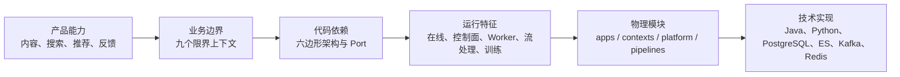
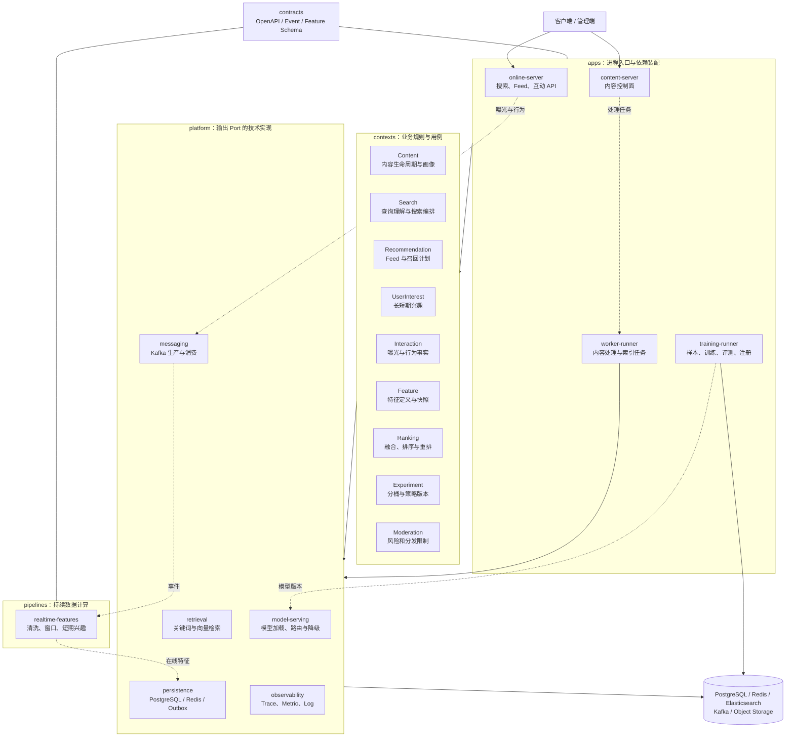
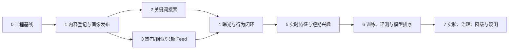

# 00：架构选择与实现路线

## 1. 这套框架是怎样确定的

SeekFlux 的目录结构不是先选择 Spring Boot、Kafka 或 Elasticsearch，再为工具寻找用途。
它是从业务闭环逐层推导出来的：



推导过程包含五个判断：

1. **先闭环**：系统必须完成“内容进入 → 被召回和排序 → 产生曝光与行为 → 行为影响下一次结果”，否则只能展示孤立算法。
2. **按业务语言划边界**：内容生命周期、搜索意图、推荐计划、用户兴趣、互动事实、特征、排序、实验和审核的规则变化原因不同，因此拆为九个 Context。
3. **让领域规则远离中间件**：领域层依赖 JDK；数据库、搜索引擎、消息和模型通过输出 Port 接入，因此技术可以替换，核心规则仍可单测。
4. **按运行特征拆进程**：低延迟 HTTP、内容控制面、耗时 Worker、Flink 流任务和 Python 训练任务的扩容方式及故障模式不同，所以拥有不同 Runner。
5. **暂不全面微服务化**：首期规模和团队协作复杂度不足以抵消九个微服务的运维成本，在线链路先采用模块化单体；边界成熟且确有独立扩缩容、发布或隔离需求后再拆。

完整业务假设见 [`SeekFlux.md`](../../SeekFlux.md)，这个具体决策见
[`ADR-001`](../adr/ADR-001-modular-monolith.md)。

## 2. 工程架构图

下面这张图对应当前仓库，而不是只描述未来概念。实线表示主要调用或装配方向，虚线表示异步数据流。



最重要的依赖约束是：`apps → contexts → Port ← platform adapter`。图中为了表达运行时调用而画成
`contexts → platform`，代码里 Context 不应直接依赖某个中间件 SDK，而应依赖自己的输出 Port，由应用装配具体 Adapter。

## 3. 每个部分要实现什么

### 3.1 `contexts/`：业务能力

| Context | 首个可交付功能 | 后续演进 |
| --- | --- | --- |
| Content | 登记内容、推进处理状态、发布画像、撤回内容 | 多模态产物版本、重试和重处理 |
| Search | 接收 Query、构造搜索计划、过滤并返回分页结果 | 意图识别、混合召回和个性化搜索 |
| Recommendation | 生成 Feed 请求与多路召回计划、合并候选 | 探索、冷启动、场景化推荐 |
| UserInterest | 根据行为维护主题偏好和最近兴趣 | 长短期向量、时间衰减和会话兴趣 |
| Interaction | 幂等接收曝光、播放、互动和负反馈 | 校验曝光关联、反作弊和回放 |
| Feature | 定义、版本化、读写内容/用户/上下文特征 | 在线离线一致性和时间点回放 |
| Ranking | 规则打分、融合、去重、多样性重排 | 粗排、精排、多目标和 Ranking Trace |
| Experiment | 稳定分桶并绑定策略版本 | 指标、灰度、显著性和自动回滚 |
| Moderation | 发布前审核状态和返回前阻断 | 风险标签、策略分级和紧急撤回 |

每个 Context 内部采用相同的学习顺序：

```text
domain       先写不依赖框架的业务概念和不变量
port/in      定义外部能够发起的用例
application  编排用例、事务和跨 Port 协作
port/out     声明需要的数据库、检索、消息、时钟或模型能力
adapter/in   把 HTTP、Kafka 或 Job 输入转换成用例参数
adapter/out  把输出 Port 映射到具体中间件
```

### 3.2 `platform/`：可替换的技术能力

| 模块 | 要实现的能力 | 不应承载的内容 |
| --- | --- | --- |
| retrieval | BM25、向量、热门等 Retriever Adapter，超时与结果标准化 | 搜索/推荐业务策略 |
| persistence | Repository、Redis 特征读写、事务与 Outbox | 领域规则和跨 Context Entity |
| messaging | 事件 Envelope、生产者、消费者公共配置、重试与 DLQ | 具体业务事件的决策逻辑 |
| model-serving | 模型加载、批推理、版本路由、超时和降级 | 某场景最终排序目标 |
| observability | Trace、指标、结构化日志和审计基础设施 | 用监控代码改变业务结果 |

### 3.3 `apps/`、`pipelines/`、`contracts/` 与其他目录

| 目录 | 功能 |
| --- | --- |
| `apps/online-server` | 装配在线 Context 和 Adapter，对外提供 Search、Feed、Interaction API |
| `apps/content-server` | 提供内容登记、状态查询、发布、撤回等控制面 API |
| `apps/worker-runner` | 消费异步任务，执行内容理解、索引和特征写入 |
| `apps/training-runner` | Python 样本生成、训练、离线评测和模型注册入口 |
| `pipelines/realtime-features` | Flink 行为清洗、事件时间窗口、短期兴趣和在线特征更新 |
| `contracts` | 外部 API、跨进程事件和特征定义的版本化事实来源 |
| `evals` | 固定评测数据、指标计算和版本对比结果 |
| `deploy` | 本地依赖、容器/Kubernetes 配置、Dashboard 和告警 |

## 4. 为什么按这个顺序实现

项目采用“纵向切片”，每一步都增加一个可观察、可测试的闭环，而不是先把所有 Domain 写完，再写所有 Adapter。



### 步骤 0：工程基线（已完成）

建立构建、模块边界、契约位置和本地基础设施。学习重点是多模块 Maven、模块化单体、六边形架构和环境可复现性。

### 步骤 1：内容登记与画像发布（已完成）

实现最小 Content 纵向切片：REST → Use Case → Domain → PostgreSQL/Outbox → Kafka → Worker → 发布画像事件。它建立了搜索和推荐共同依赖的稳定内容输入；写入 Elasticsearch 留在步骤 2，由 Search/Retrieval 边界负责。

### 步骤 2：关键词搜索基线（已完成）

已实现发布事件驱动的 Elasticsearch 索引、字段加权关键词检索、中文问题双字补召回、基础分页，以及画像管理和搜索页面。Cursor、专业中文分词和完整降级继续作为搜索基线的后续演进项；当前可解释结果为后续语义召回和模型提供对照。

### 步骤 3：Feed 基线（已完成）

已实现热门、内容相似、简单兴趣三路召回，以及 RRF 融合、内容去重、同作者限额、相邻主题多样性、签名 Cursor 和部分召回源降级。当前热门由发布时间新鲜度代理，兴趣由显式标签提供；真实行为热度和最近兴趣在步骤 4～5 接入。

### 步骤 4：曝光与行为闭环

实现幂等批量上报、曝光上下文、Kafka 事件和可回放存储。没有曝光事实，就不能正确解释点击或构造训练负样本。

### 步骤 5：实时特征与短期兴趣

用 Flink 按事件时间清洗、去重和窗口聚合，将在线特征写入 Redis，并让它影响下一次 Feed。重点验证乱序、重复、Checkpoint 和特征新鲜度。

### 步骤 6：训练、评测与模型排序

固定数据切分与规则基线，再训练可解释排序模型，完成模型注册、加载、Shadow 和降级。只有离线指标和线上链路均可追踪，模型才算交付。

### 步骤 7：实验、治理、降级与观测

增加稳定分桶、安全拦截、内容撤回、超时预算、指标与 Trace，最后用故障注入和容量测试验收系统闭环。

## 5. 学习时如何使用这张地图

学习一个切片时按以下顺序阅读和操作：

1. 在本页确认它解决闭环中的哪一段，以及依赖哪些前置切片；
2. 打开对应阶段学习文档，先阅读业务例子和核心流程；
3. 沿“输入 Adapter → 输入 Port → Application → Domain → 输出 Port → 输出 Adapter”跟一遍代码；
4. 运行文档中的单元测试、集成测试和手工验收命令；
5. 完成文档里的练习，再通过 ADR 理解替代方案和取舍。

这套方法的目标不是记住目录名称，而是能够回答：规则属于哪里、依赖为何朝这个方向、失败时在哪里降级、结果如何被验证。
