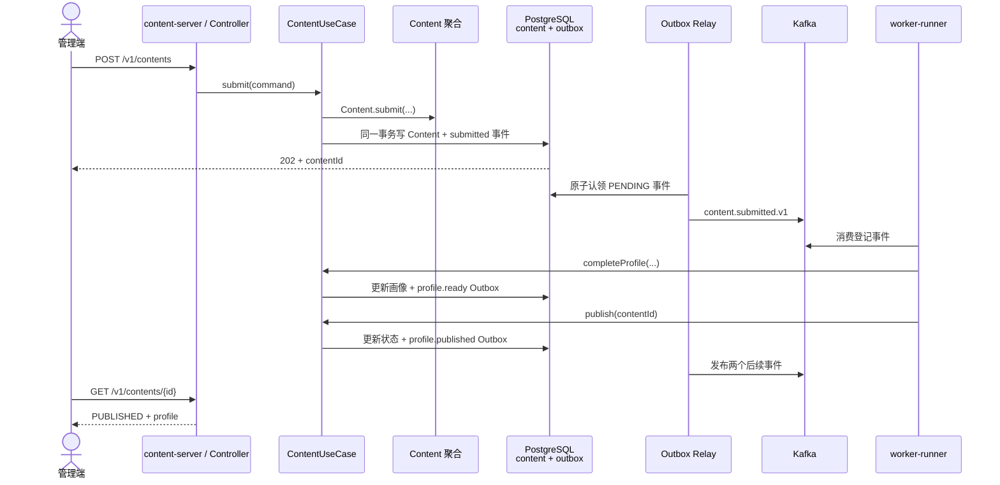
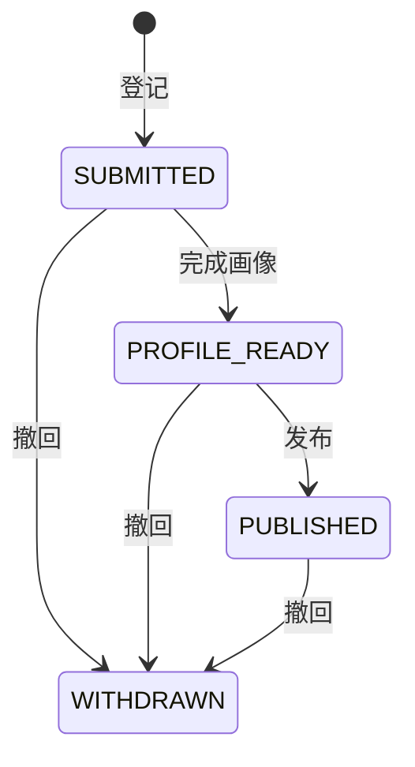

# Step 1：内容登记与画像发布

## 1. 这一部分完成了什么

本切片把一条内容从 HTTP 请求推进到可供下游消费的已发布画像：

- 登记内容并返回内容 ID；
- 查询内容及处理状态；
- 生成、更新和发布画像，支持撤回；
- 内容状态与待发送事件在 PostgreSQL 的同一事务中提交；
- Outbox Relay 将事件投递到 Kafka；
- Worker 消费登记事件，根据标题、描述和来源标签生成基础画像并自动发布；
- OpenAPI、四种事件 Payload Schema、领域测试和应用测试同步交付。

当前“画像”是确定性的元数据画像，用来先跑通可靠的数据闭环。ASR、OCR、视觉理解、审核和模型服务尚未实现；Elasticsearch 建索引属于 Step 2。

## 2. 架构位置与完整流程



代码依赖仍遵循六边形架构：

```text
HTTP / Kafka Adapter
        ↓
ContentUseCase（输入 Port）
        ↓
ContentApplicationService
        ↓
Content 聚合 ──→ ContentRepository（输出 Port）
                              ↑
                 R2dbcContentRepository
```

领域层不知道 Spring、PostgreSQL 或 Kafka；替换数据库实现不会改变状态机。

## 3. 状态机和关键规则



关键不变量放在 `Content` 聚合中：画像未完成不能发布；已撤回内容不能补画像或发布；画像版本不能倒退；同版本同内容及重复发布按幂等成功处理；同版本不同内容会被拒绝。

数据库更新使用 `aggregate_version` 乐观锁：

```sql
UPDATE content.contents
SET aggregate_version = :newVersion, ...
WHERE content_id = :contentId
  AND aggregate_version = :expectedVersion
```

受影响行数为 0 表示期间已有其他请求更新，应用返回并发冲突，而不是静默覆盖。

## 4. SQL 由什么连接和更新

本项目对同一个 PostgreSQL 使用两条职责不同的连接链路：

| 场景 | 技术 | 连接协议 | 作用 |
| --- | --- | --- | --- |
| 运行时查询和更新 | Spring R2DBC `DatabaseClient` + PostgreSQL R2DBC Driver | `r2dbc:postgresql://...` | 非阻塞 CRUD、响应式事务、Outbox Relay |
| 表结构升级 | Flyway + PostgreSQL JDBC Driver | `jdbc:postgresql://...` | 启动时按版本执行 `db/migration` SQL |

业务 SQL 位于 `R2dbcContentRepository` 和 `KafkaOutboxRelay`；建表 SQL 位于 `V1__content_and_outbox.sql`。`TransactionalOperator` 保证内容行和 Outbox 事件一起成功或一起回滚，因此不会出现“数据库成功但忘记发事件”的窗口。

### MyBatis 和 MyBatis-Plus 能不能用

能用，但当前切片有意没有采用。MyBatis/MyBatis-Plus 基于阻塞式 JDBC，而 `content-server` 使用 Spring WebFlux，持久化链路使用响应式 R2DBC。把阻塞 JDBC 直接放到事件循环会降低并发能力；同时混用 JDBC 与 R2DBC 事务管理器，也无法自然组成同一个本地事务。

如果项目决定走传统阻塞式技术栈，可以整体调整为 `Spring MVC + JDBC + MyBatis-Plus + JDBC TransactionManager`，并继续保留领域层、Port、状态机和事务 Outbox。两条路线都成立，选择标准是运行模型的一致性，不是某个框架“能不能写 SQL”。当前继续选择 WebFlux/R2DBC，所以 SQL 通过 `DatabaseClient` 显式编写。

## 5. 为什么需要事务 Outbox

直接执行“提交数据库，再发送 Kafka”存在两个独立系统之间的双写问题：数据库成功后进程崩溃，Kafka 就永远收不到事件。这里先在同一个 PostgreSQL 事务中写业务表和 `outbox.events`，再由 Relay 异步发送。

Relay 使用 `FOR UPDATE SKIP LOCKED` 原子认领批次，允许多个实例竞争而不重复处理同一轮任务；发送失败会回到 `PENDING` 并延迟重试。Kafka 发送与数据库标记之间仍可能发生崩溃，所以交付语义是至少一次，不是精确一次。消费者必须以事件 ID 或业务状态实现幂等；当前 Worker 依靠画像版本与聚合状态做到重复消费不产生重复状态变更。

## 6. 关键代码入口

| 想学习的内容 | 入口 |
| --- | --- |
| HTTP 请求和响应转换 | `apps/content-server/.../api/ContentController.java` |
| 用例定义 | `contexts/content-context/.../port/in/ContentUseCase.java` |
| 用例编排和事件创建 | `contexts/content-context/.../application/ContentApplicationService.java` |
| 状态机与业务不变量 | `contexts/content-context/.../domain/Content.java` |
| Repository 抽象 | `contexts/content-context/.../port/out/ContentRepository.java` |
| R2DBC SQL、事务和乐观锁 | `platform/persistence/.../content/R2dbcContentRepository.java` |
| Flyway 建表升级 | `platform/persistence/src/main/resources/db/migration/V1__content_and_outbox.sql` |
| Outbox 到 Kafka | `platform/messaging/.../outbox/KafkaOutboxRelay.java` |
| Kafka 消费和基础画像 | `apps/worker-runner/.../content/BasicContentProfileWorker.java` |
| HTTP 契约 | `contracts/openapi/seekflux-v1.yaml` |
| 事件契约 | `contracts/events/content-*-v1.schema.json` |

## 7. API 与事件契约

已实现的 API：

- `POST /v1/contents`：登记，返回 `202 Accepted`；
- `GET /v1/contents/{contentId}`：查询状态和画像；
- `PUT /v1/contents/{contentId}/profile`：内部画像回写；
- `POST /v1/contents/{contentId}/publish`：内部发布；
- `DELETE /v1/contents/{contentId}`：撤回。

已定义的 Kafka Topic/事件类型：`content.submitted.v1`、`content.profile.ready.v1`、`content.profile.published.v1` 和 `content.distribution.changed.v1`。事件使用统一 Envelope，Payload 各自使用 JSON Schema v1；新增字段应保持向后兼容，不兼容修改应发布 v2。

## 8. 如何验证

自动化测试：

```bash
mvn test
jq empty contracts/events/*.json
```

启动 PostgreSQL 和 Kafka 后，先安装本地模块，再分别运行（两个启动命令使用不同终端）：

```bash
mvn install -DskipTests
mvn -f apps/content-server/pom.xml spring-boot:run
mvn -f apps/worker-runner/pom.xml spring-boot:run
```

登记内容：

```bash
curl -i -X POST http://localhost:8081/v1/contents \
  -H 'Content-Type: application/json' \
  -d '{"creatorId":"learner-1","mediaUri":"s3://seekflux-media/demo.mp4","title":"杭州周末露营路线","description":"从市区出发的一日露营与日落路线","sourceTags":["露营","杭州","周末"]}'
```

使用响应中的 ID 查询，状态会从 `SUBMITTED` 最终推进到 `PUBLISHED`：

```bash
curl http://localhost:8081/v1/contents/{contentId}
```

本次实现已经在本地 PostgreSQL/Kafka 上完成真实验收：Flyway 应用 V1；内容成功登记；Worker 生成画像并发布；三条生命周期 Outbox 记录均进入 `PUBLISHED`；查询接口返回 HTTP 200 和 `PUBLISHED` 状态。

## 9. 可以继续做的练习

1. 修改相同画像版本但更换 summary，观察领域层拒绝冲突。
2. 并发提交两次画像更新，观察乐观锁如何避免覆盖。
3. 暂停 Kafka 后登记内容，再恢复 Kafka，观察 Outbox 重试并最终发布。
4. 为 Worker 增加独立的事件去重表，比较它与当前“业务状态幂等”的适用边界。
5. 在 Step 2 消费 `content.profile.published.v1` 写入 Elasticsearch，并消费撤回事件删除或屏蔽文档。

下一步进入 [架构路线中的 Step 2](00-architecture-and-roadmap.md#步骤-2关键词搜索基线)：让已发布画像真正可被关键词检索。
