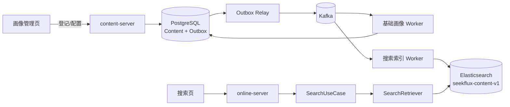

# Step 2：已发布画像的关键词检索

## 1. 这一部分完成了什么

Step 2 将 Step 1 的内容发布事件接到 Elasticsearch，并提供一套可以直接操作的最小产品界面：

- `worker-runner` 消费 `content.profile.published.v1`，将画像幂等写入搜索索引；
- 内容撤回事件会删除对应搜索文档；
- `online-server` 提供 GET/POST `/v1/search` 关键词检索 API；
- 内容画像管理页支持登记、演示数据导入、状态查询、画像调整和重新发布；
- 搜索页支持输入关键词或自然问题并展示标题、摘要、标签、相关度和媒体链接；
- OpenAPI、搜索用例测试和真实发布—索引—检索实验同步更新。

统一前端地址为 `http://localhost:3001/`：搜索位于“发现”，内容画像管理位于“内容工作台”。

## 2. 端到端架构



这里有意采用异步索引：PostgreSQL 是内容生命周期事实源，Elasticsearch 是可以重建的搜索读模型。搜索服务不读取 Content 表，内容服务也不直接调用 Elasticsearch。

## 3. 两个页面分别做什么

### 画像管理页

管理页调用真实 Content API，而不是直接修改数据库。它包含三个最小工作区：

1. 登记一条内容，或者一次导入 5 条演示内容；
2. 根据内容 ID 查询 `SUBMITTED → PROFILE_READY → PUBLISHED` 状态和当前画像；
3. 以更高的画像版本修改摘要、标签、转写文本，再重新发布。

为了支持管理配置，状态机增加 `PUBLISHED → PROFILE_READY → PUBLISHED` 的显式再画像路径。相同画像版本仍然不能写入不同内容，防止不受控覆盖。

### 搜索页

搜索页将文本框内容提交到 GET `/v1/search?q=...`，并根据 Search API 返回值渲染结果。页面本身不包含搜索数据或前端过滤逻辑，因此刷新页面、换客户端或直接调用 API 都会得到相同的后端结果。

## 4. 索引写入如何工作

`ContentSearchIndexWorker` 有两个消费者：

- 发布事件转换为 `SearchDocument`，使用内容 ID 作为 Elasticsearch `_id` 执行 upsert；
- 撤回事件按内容 ID 删除文档，重复删除也视为成功。

使用固定 `_id` 使 Kafka 至少一次投递不会生成重复搜索文档。新消费者组从 `earliest` 开始时，还能回放已有的发布事件重建索引。

当前 Mapping 包含标题、描述、画像摘要、标签、转写、画像版本、发布时间和一个聚合 `searchable` 字段。索引名称带版本 `seekflux-content-v1`，未来不兼容 Mapping 应创建 v2 并通过别名切换，而不是原地破坏旧索引。

## 5. 关键词和中文问题如何匹配

检索 Adapter 使用两路 `should` 查询：

- `multi_match` 对标题、标签、摘要、描述和转写执行相关度检索，并按 `title > tags > summary > description > transcript` 加权；
- 对聚合字段执行大小写不敏感的通配符补召回。中文连续问题会额外产生有限数量的双字片段，例如“杭州哪里可以露营”包含“杭州”和“露营”。

命中任意一路即可进入候选，匹配更多、高权重字段的内容得分更高；最终按 `_score` 和发布时间排序。这是适合教学与小数据演示的可解释基线。通配符在大索引上成本较高，生产演进应引入中文分词器、规范化词典、BM25 调参和查询分析，而不是无限扩大通配符范围。

## 6. 关键代码入口

| 学习目标 | 代码入口 |
| --- | --- |
| Search 输入 Port 与结果模型 | `contexts/search-context/.../port/in/` |
| Search 用例编排 | `contexts/search-context/.../application/SearchApplicationService.java` |
| 搜索和索引输出 Port | `contexts/search-context/.../port/out/` |
| Elasticsearch Mapping、upsert、delete、query | `platform/retrieval/.../ElasticsearchSearchAdapter.java` |
| 发布/撤回事件消费者 | `apps/worker-runner/.../ContentSearchIndexWorker.java` |
| Search HTTP API | `apps/online-server/.../api/SearchController.java` |
| C 端搜索与 B 端画像工作台 | `apps/web/app/SeekFluxApp.tsx` |
| 前端到后端的同源 Bridge | `apps/web/app/api/bridge/[service]/[...path]/route.ts` |
| API 契约 | `contracts/openapi/seekflux-v1.yaml` |

## 7. 启动与验证

```bash
./deploy/local/infra.sh start
mvn test
mvn install -DskipTests
```

再使用三个终端启动：

```bash
mvn -f apps/content-server/pom.xml spring-boot:run
mvn -f apps/worker-runner/pom.xml spring-boot:run
mvn -f apps/online-server/pom.xml spring-boot:run
```

打开 `http://localhost:3001/`，在“内容工作台”登记内容并等待它变为 `PUBLISHED`，然后回到“发现”输入“杭州骑行”或“咖啡教程”。也可以直接调用：

```bash
curl --get http://localhost:8080/v1/search \
  --data-urlencode 'q=杭州哪里可以露营' \
  --data 'size=10'
```

检查索引：

```bash
curl http://localhost:9200/seekflux-content-v1/_count
```

本次真实验收登记了“杭州亲子露营新手路线”：三条 Outbox 生命周期事件均发布成功，内容最终为 `PUBLISHED`，Elasticsearch 文档包含画像 v1。查询“杭州哪里适合亲子露营”返回 2 条结果，新内容以 23.89 的相关度排第一，历史露营内容排第二；管理页和搜索页均返回 HTTP 200。

## 8. 失败语义和当前边界

- PostgreSQL 提交成功后，Kafka 或 Elasticsearch 暂时不可用不会丢失内容；Outbox/消费者恢复后会继续处理。
- 当前 Kafka Listener 失败会由容器重试，但尚未补充专用 DLQ 和可视化重放控制台。
- 管理页是内部学习工具，尚无登录、权限、审核、批量分页和操作审计，不能直接作为生产后台。
- 当前搜索只有页码分页，小数据够用；深分页应改成 `search_after` Cursor。
- 当前媒体只展示链接，上传、转码、封面和播放器属于后续内容平台能力。

## 9. 与 Agent 主线的关系

Step 2 提供了未来 Search Tool 的确定性 Direct Search 雏形。它的价值是：输入、字段权重、结果和失败都能在没有大模型与 Agent Loop 的情况下独立验证，未来 Agent 失败时也可以回退到这条路径。

本切片当时还不能称为“Agent-ready”：它缺少版本化 Query—相关性数据集、统一评测 Runner、语义向量召回、跨通道融合与单路降级、完整 Search Trace、查询约束和内容安全过滤。这些能力现在已经由 [Step 4](step-04-agent-ready-direct-search.md) 补齐；Agent Runtime 仍从 Step 5 创建。

## 10. 练习

1. 修改画像标签并重新发布，比较搜索得分和结果顺序。
2. 撤回一条内容，确认 Elasticsearch 文档被删除且搜索不再返回。
3. 停止 Elasticsearch 后发布内容，再恢复并观察消费者重试。
4. 给标题、标签、摘要设计一组固定 Query—结果评测集，比较不同字段权重。
5. 将通配符补召回替换为中文分词 Mapping，并用索引别名完成 v1 到 v2 的无停机切换。

从历史实现顺序看，本切片之后完成了 [Step 3 Feed 基线](step-03-feed-baseline.md)。当前真实下一步和完成门槛始终以[学习路线首页](README.md)为准。
