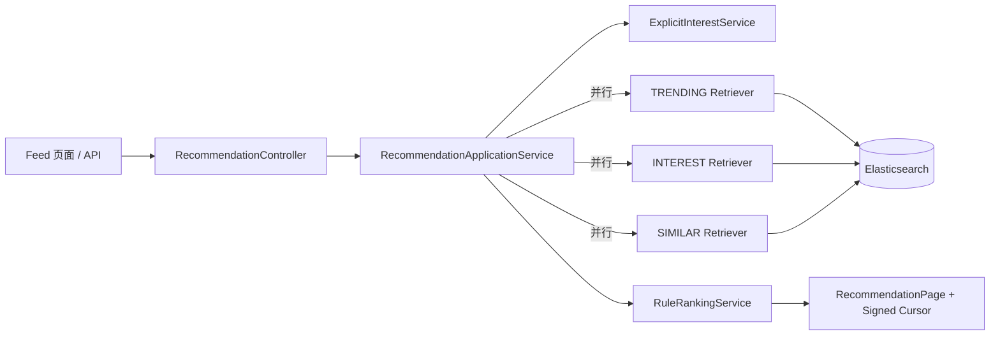

# Step 3：热门、兴趣与相似内容 Feed

## 1. 这一部分完成了什么

Step 2 让已发布内容能够被主动搜索，但项目还没有无 Query 的推荐入口。Step 3 复用同一份 Elasticsearch 内容读模型，补齐第一版可运行、可解释的推荐链路：

- `TRENDING`：按发布时间召回全局新鲜内容，作为没有行为数据时的热门代理；
- `INTEREST`：依据客户端显式选择的兴趣标签检索标题、标签、摘要、描述和转写；
- `SIMILAR`：依据最近内容或指定内容的标签与文本画像召回相似内容；
- 相同内容由 RRF 合并，保留全部召回来源；
- 规则排序加入兴趣匹配和时间衰减，再限制同作者数量并避免相同主题连续出现；
- 每个召回源有独立超时，单路故障时返回剩余结果和明确的降级状态；
- Feed 和相似内容接口使用绑定请求上下文、带有效期且经过 HMAC 签名的不透明 Cursor；
- `feed.html` 可以直接配置兴趣、最近内容种子、加载下一页并查看每条推荐的来源和原因。

这里没有把“新鲜内容”冒充真实热门：互动事件尚未接入，因此还没有播放、完播和互动热度。Step 4～5 建立反馈闭环后，`TRENDING` Retriever 会替换为时间窗口热度，显式兴趣也会与短期兴趣合并。

## 2. 架构位置



模块依赖保持为 `apps → contexts ← platform adapter`。`Recommendation` 只依赖 `RecommendationRetriever` 输出 Port；具体 Elasticsearch 查询位于 `platform/retrieval`。推荐编排通过 `UserInterestUseCase` 和 `RankingUseCase` 与另外两个 Context 协作，不访问它们的存储 Entity。

## 3. 三路召回如何工作

### 热门代理

在没有行为统计的阶段，`TRENDING` 返回最新发布的前 200 条内容。它是冷启动兜底，也是兴趣源或相似源失败时仍能服务的基础。真正的热门分应该使用带时间衰减的曝光、有效播放、完播、互动和负反馈窗口，不能只靠发布时间。

### 显式兴趣

请求参数 `interests=露营,亲子` 会先在 `UserInterest` Context 中去空、规范化和去重，再进入 Elasticsearch：标签精确命中权重最高，标题、摘要、描述和转写提供补召回。这个设计让新用户在还没有行为历史时也能获得可解释的个性化结果。

### 内容相似

Feed 的 `seed_content_id` 和 `/v1/contents/{contentId}/similar` 都调用同一个相似召回 Port。Adapter 先读取种子内容画像，再组合标签 Terms、字段加权 Multi Match 和 More-Like-This，同时排除种子本身。相似接口优先只返回满足相似约束的候选；没有候选时才使用热门兜底。

## 4. 融合、排序与多样性

不同召回源的原始 Elasticsearch 分数不能直接相加。规则排序先按通道内名次计算 RRF：

```text
score(content) = Σ source_weight / (60 + rank_in_source)
```

同一内容被多路召回时只保留一条，并记录 `TRENDING / INTEREST / SIMILAR` 全部来源。随后加入显式兴趣命中和 30 天线性时间衰减。最终贪心重排遵守两个基线约束：

1. 同一作者一页最多出现两条；
2. 存在替代候选时，不让主标签相同的内容相邻。

API 返回 `score`、`sources` 和 `reason`，因此可以解释一条内容为什么进入 Feed，而不需要猜测隐藏模型。

## 5. Cursor 和故障语义

Cursor 包含版本、下一页偏移、过期时间和请求指纹，并使用 HMAC-SHA256 签名。指纹绑定场景、用户、兴趣和种子内容，所以不能把 A 用户或 A 兴趣下的 Cursor 用到另一请求；默认 15 分钟过期。当前候选规模固定为 200，适合基线实验；后续规模化时应下推为各 Retriever 的 `search_after` 边界。

三个召回源分别应用 250 ms 超时。单路错误或超时不会中断整个 Feed，而是在响应中返回：

```json
{
  "degraded": true,
  "unavailableSources": ["INTEREST"]
}
```

这样客户端、测试和监控都能区分“正常但结果少”和“下游故障后的降级结果”。全部数据仍来自已发布索引，内容撤回后会由 Step 2 的消费者删除，因此不会继续进入推荐候选。

## 6. 关键代码入口

| 学习目标 | 代码入口 |
| --- | --- |
| Feed / Similar 输入 Port 与响应 | `contexts/recommendation-context/.../port/in/` |
| 多路并行、超时、降级和分页 | `RecommendationApplicationService.java` |
| 签名 Cursor | `SignedRecommendationCursorCodec.java` |
| 显式兴趣规范化 | `ExplicitInterestService.java` |
| RRF、兴趣/新鲜度、去重和多样性 | `RuleRankingService.java` |
| 三路 Elasticsearch 查询 | `ElasticsearchSearchAdapter.java` |
| HTTP Adapter | `RecommendationController.java` |
| 可操作页面 | `apps/online-server/src/main/resources/static/feed.html` |
| API 契约 | `contracts/openapi/seekflux-v1.yaml` |

## 7. 启动与验证

复用 Step 2 的基础设施和三个进程：

```bash
./deploy/local/infra.sh start
mvn test
mvn install -DskipTests
mvn -f apps/content-server/pom.xml spring-boot:run
mvn -f apps/worker-runner/pom.xml spring-boot:run
mvn -f apps/online-server/pom.xml spring-boot:run
```

在画像管理页导入演示数据并等待发布，然后打开 `http://localhost:8080/feed.html`。也可以调用：

```bash
curl --get http://localhost:8080/v1/feed \
  -H 'X-User-Id: demo-user' \
  --data-urlencode 'interests=露营,亲子' \
  --data 'page_size=3'

curl --get http://localhost:8080/v1/contents/{contentId}/similar \
  -H 'X-User-Id: demo-user' \
  --data 'page_size=10'
```

响应中的 `requestId` 为下一步曝光归因预留，`nextCursor` 可直接传回下一次请求。修改兴趣标签或种子内容后旧 Cursor 会返回 `400 INVALID_RECOMMENDATION_REQUEST`，防止混用分页上下文。

自动化测试覆盖兴趣规范化、跨源去重、RRF 与兴趣提升、同作者限额、主题多样性、单路故障降级、Cursor 生成与请求绑定。

## 8. 当前边界与下一步

- 还没有曝光和互动事实，`requestId` 暂时只返回给客户端，没有进入事件表；
- `TRENDING` 是发布时间代理，不代表真实人气；
- `SIMILAR` 使用文本和标签，不是 Item-Item 协同，也没有多模态向量；
- 兴趣来自显式输入，没有用户长期画像和 Session 短期兴趣；
- Cursor 在固定 Top 200 候选内分页，规模化深分页需要 Retriever 原生 Cursor；
- 规则分是模型排序的可解释对照，不声称具有训练模型效果。

下一步进入 Step 4：实现曝光、播放、观看时长、互动和负反馈的幂等批量上报，把 `requestId + contentId + position` 变成可回放的曝光事实。

## 9. 练习

1. 给相同内容配置多个相关标签，观察它被多源召回后的 `sources` 和排序变化。
2. 连续发布同一作者的三条内容，验证一页最多保留两条。
3. 将 `RECOMMENDATION_SOURCE_TIMEOUT_MS` 调得很小，观察 `degraded` 和 `unavailableSources`。
4. 获取第一页 Cursor，改变兴趣后复用它，确认服务拒绝跨上下文分页。
5. 在 Step 4 后用 5 分钟有效播放与负反馈窗口替换新鲜度热门代理，并保留当前结果作为对照基线。
