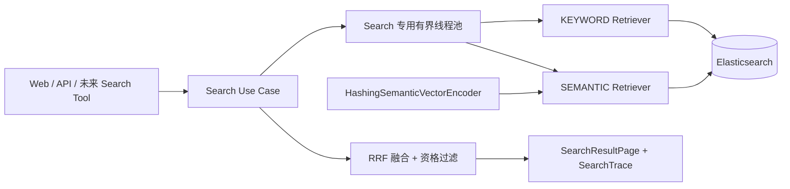
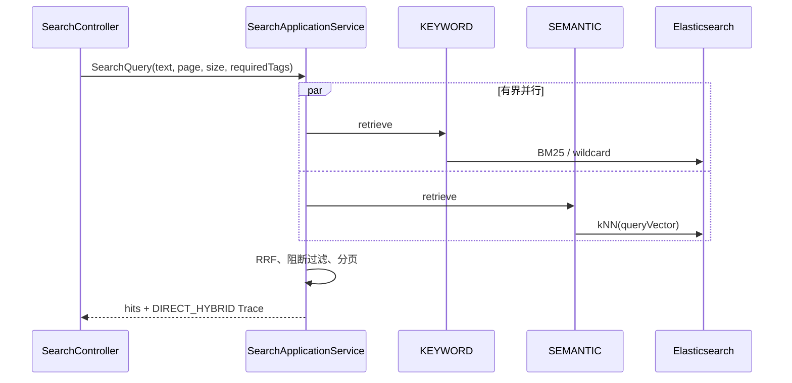

# Step 4：Agent-ready Direct Search

## 本阶段状态

- 状态：已完成
- 完成日期：2026-08-08
- 对应 Agent Phase：完成 Agent Phase 0
- 对应决策：[ADR-003：Agent-ready Direct Search 采用双路检索与确定性回退](../adr/ADR-003-agent-ready-direct-search.md)
- 对应契约：[`contracts/openapi/seekflux-v1.yaml`](../../contracts/openapi/seekflux-v1.yaml)
- 评测证据：[`evals/results/direct-search-v1-baseline.json`](../../evals/results/direct-search-v1-baseline.json)

## 要解决的问题

未来 Search Agent 需要调用稳定的 Search Use Case，而不是直接访问 Elasticsearch。Step 4 把原来的单路关键词查询升级为可复现、可评测、可追踪、可降级的 Direct Search，使 Agent 尚未实现或不可用时仍有确定性结果。

本阶段当时不创建 Agent Server、Agent Loop、LLM Adapter 或 Session；这些基础能力后来由 [Step 5](step-05-agent-runtime-mvp.md) 实现，多轮约束仍属于 Step 6。

## 架构位置



Search Context 只依赖 `SearchRetriever` 输出 Port；Adapter 返回候选、通道版本和耗时，最终融合、分页、资格过滤和失败语义属于应用层。

## 完成了什么

- `KEYWORD` 通道保留字段加权 BM25、中文双字补召回和确定性排序；
- `SEMANTIC` 通道新增 64 维 Hashing n-gram Encoder、`dense_vector` Mapping 和 Elasticsearch kNN；
- Worker v2 索引消费组回放历史发布事件，为已有文档幂等补写向量；
- 两路候选使用加权 RRF 融合，同一内容保留 `KEYWORD/SEMANTIC` 来源；
- Search 专用线程池有固定大小和有界队列，两路共享 1200 ms Deadline，超时任务会取消；
- 单路失败返回 `DIRECT_KEYWORD_FALLBACK` 或 `DIRECT_SEMANTIC_FALLBACK`，双路失败返回 `503 SEARCH_UNAVAILABLE`；
- Search Trace 返回请求 ID、执行模式、索引/策略/Retriever 版本、通道耗时、候选数和降级状态；
- Query 执行 NFKC 规范化、长度、页大小和 200 候选窗口校验，并支持最多 10 个 `requiredTags`；
- 返回前过滤 `moderation:blocked`、`distribution:blocked`、`违规`、`下架` 等阻断标签；
- C 端发现页在搜索通道降级时显示简短状态，不在前端实现任何匹配或降级逻辑。

## 核心流程和失败路径



如果一个 Future 失败、被拒绝或超过共同 Deadline，应用取消该任务并使用另一通道；两个通道都不可用时不返回伪造空结果，而是稳定的 503。通道正常但没有候选属于成功的零结果，不标记故障。

## 关键代码入口

| 入口 | 作用 | 建议阅读顺序 |
| --- | --- | --- |
| `SearchQuery.java` | Query 规范化和约束 | 1 |
| `SearchRetriever.java` 及候选/结果模型 | 可替换检索输出 Port | 2 |
| `SearchApplicationService.java` | 并行、Deadline、RRF、安全过滤和 Trace | 3 |
| `HashingSemanticVectorEncoder.java` | 可复现向量基线 | 4 |
| `ElasticsearchSearchAdapter.java` | Mapping、BM25、kNN 和候选映射 | 5 |
| `SearchConfiguration.java` | 有界线程池和策略配置 | 6 |
| `SearchController.java` / `SearchExceptionHandler.java` | HTTP 与稳定错误 | 7 |
| `evals/run_direct_search_eval.py` | 真实 API 评测闭环 | 8 |

## 设计取舍

Hashing Encoder 不需要外部模型、下载或 API Key，适合先验证 ANN、索引回放、融合和故障边界；它只能利用 token 与 n-gram 重叠，不能代表真正的跨模态语义理解。后续替换预训练 Embedding 时保持 `SemanticVectorEncoder`、Search Use Case、Trace 与 Eval 契约不变。

不同通道的原始 Elasticsearch 分数不可直接比较，因此应用使用 RRF。线程池采用拒绝策略而非调用方执行，防止队列饱和时 HTTP 线程绕过 Deadline 执行阻塞检索。

## 如何验证与完成证据

自动化验证：

```bash
mvn test
npm --prefix apps/web test
ruby -e 'require "yaml"; YAML.safe_load(File.read("contracts/openapi/seekflux-v1.yaml"), permitted_classes: [], permitted_symbols: [], aliases: true)'
```

真实评测：

```bash
python3 evals/run_direct_search_eval.py --require-hybrid --min-recall 1.0
```

`direct-search-v1` 使用 6 条固定内容和 6 个分级 Query，通过 `requiredTags=seekflux-eval-v1` 与共享本地索引隔离。Runner 真实经过 Content API、Outbox、Kafka、Worker、Elasticsearch 和 Search API，结束后撤回临时内容。

2026-08-08 基线结果：`Recall@5 = 1.0`、`MRR@5 = 1.0`、`nDCG@5 = 1.0`、零结果率 `0`。每个 Query 均为 `DIRECT_HYBRID`，报告记录 `seekflux-content-v1`、`direct-hybrid-v1`、`elasticsearch-bm25-v2` 和 `elasticsearch-knn-hashing-char-ngram-v1`。`Precision@5 = 0.2` 是因为当前每个 Query 只标注一个相关内容，理论上限即为 `1/5`，不能用它单独比较排序质量。

单元测试另覆盖：跨通道去重与 RRF、阻断标签、单路异常、共同 Deadline 取消、双路失败、查询窗口以及稳定 HTTP 错误。真实索引已有 14 条历史内容完成 64 维向量回填。

## 当前边界

- Encoder 不是预训练文本/视频模型，不能证明语义效果提升；
- 只有发布内容和阻断标签，没有完整 Moderation Policy/审计链；
- 候选和页码窗口上限为 200，尚无搜索 Cursor；
- Search Trace 已在 Step 5 通过 `linkedTraceId` 接入 Agent Trace，但尚未完成统一 OpenTelemetry 链路；
- 在 Step 4 完成时，Agent Server、Agent Runtime、Session、LLM Port、Search Tool Adapter 和 Agent Eval 尚未创建；这些现在已由 Step 5 的 Phase 1 MVP 补齐。

## 下一步

本阶段完成时的下一步是 Step 5“Agent Runtime MVP”，该切片现在已经完成。当前下一步是 Step 6“复杂 Search Agent”，具体范围和门槛始终以[学习路线首页](README.md)为准。
