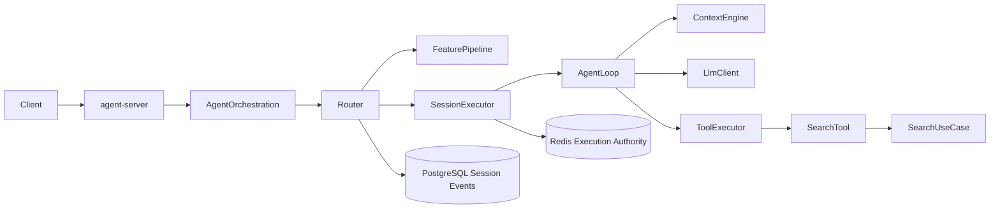

# Step 5：Agent Runtime MVP

## 本阶段状态

- 状态：已完成
- 完成日期：2026-08-08
- 对应开发 Step：Step 5
- 对应 Agent Phase：Phase 1
- 参考实现：《Ark-Leto 框架内核 与 Agentspark 主链路 原理详解》
- 对应决策：[ADR-004：参考 Ark-Leto 主链路自研 Agent Runtime](../adr/ADR-004-ark-leto-inspired-agent-runtime.md)
- 对应契约：[`contracts/openapi/seekflux-v1.yaml`](../../contracts/openapi/seekflux-v1.yaml)
- 评测证据：[`evals/results/agent-search-v1-baseline.json`](../../evals/results/agent-search-v1-baseline.json)

## 要解决的问题

用户提交“杭州亲子露营”后，系统需要由一个有界 Agent 决定是否追问、调用标准 Search Tool，并把结果、Agent 轨迹和权威 Search Trace 一起返回；Agent 超时或失败时仍要走独立 Direct Search。相同 Session 不能并发双写，相同 requestId 不能重复执行 Tool。

本阶段刻意不证明真实大模型效果，也不实现复杂 Query 自动路由、多轮约束修改、动态工具、多实例失主恢复、HITL 或子 Agent。

## 架构位置



Runtime Core 位于 `platform`，SearchGoal 和回退映射位于 AgentOrchestration，外部 Adapter 与装配位于独立 `agent-server`。Direct Search 不依赖 Agent 模块。

## 完成了什么

- 自研通用 Runtime 主链路：`Router → FeaturePipeline → SessionExecutor → AgentLoop`；
- 四个显式排序 FeatureNode：SessionLoad、AgentResolve、ParamInit、ResumeEval；
- Redis owner-CAS 执行权、续租和释放，并保证先 acquire 后 commit ingress；
- PostgreSQL WorkspaceEvent 事实源、Session 最新投影、独立 AgentRun/RunEvent；
- 有限步 AgentLoop、共同 Deadline、取消、Tool 次数与参数 Schema 校验、稳定终态；
- 每轮 ContextEngine 组装与厂商无关 `LlmClient` SPI；
- AgentDef/Prompt/决策 Provider/Tool Schema 版本冻结并写入 Trace；
- `PushEvent` 与 WorkspaceEvent/RunEvent 分离；当前同步请求内缓冲，不冒充实时流；
- `SearchDirectTool` 只调用现有 `SearchUseCase`，并把 Tool Step 关联到 Search Trace ID；
- 两个 AgentDef 复用同一 Runtime：`search-assistant` 和 `search-precise`；
- 确定性决策 Provider 支持模糊 Query 追问与 Search Tool 两步完成；
- Agent 失败映射为同一 Search Use Case 的稳定 Direct Fallback；
- 同步 `/v1/agent/search`、取消接口、稳定 409/503 错误和 Agent/Search 双 Trace；
- 固定 Direct/Agent 对照 Runner 与版本化结果 Artifact。

## 与参考文档的关系

参考文档决定了三个不能简化掉的不变量：

1. 执行权的位置必须早于用户消息提交；
2. Session 事实事件、执行轨迹和前端过程事件必须分离；
3. FeaturePipeline 和 AgentLoop 必须是可替换、显式装配的内核边界。

SeekFlux 没有 Ark-Leto 源码或依赖，因此没有声称“使用 Ark-Leto”。当前是按这些原理自行实现的内部 Runtime。参考文档中的 HITL、子 Agent、Steer Queue、MCP、跨实例恢复和流式 Push 没有在 Phase 1 假装完成。

## 核心流程与失败路径

正常路径：

1. AgentOrchestration 把 Query 与结构化约束转换为 AgentExecutionRequest；
2. FeaturePipeline 加载 Session、解析 AgentDef 并冻结运行版本；
3. Router 获得 Session 执行权，随后幂等提交 UserMessage；
4. SessionExecutor 续租、恢复最新 Session，再运行有限步 Loop；
5. LlmClient 返回 `CallTool(search_direct)`，Tool 经过 Schema 校验后调用 Search Use Case；
6. Search Trace ID 写入 Agent Tool Step，第二次 Decision 返回 Complete；
7. WorkspaceEvent 追加终态，运行事件独立落库，HTTP 返回同步 JSON。

失败路径：Session 忙或重复请求在进入 Loop 前返回 409；模型/步骤超时得到 `FALLBACK_REQUIRED`，Agent Adapter 用原 Query 和约束执行 Direct Search，并返回 `FALLBACK_RESULTS + AGENT_TO_DIRECT_FALLBACK`；Direct Search 本身仍按 Step 4 的单路/双路失败语义处理。

## 关键代码入口

| 入口 | 作用 | 建议阅读顺序 |
| --- | --- | --- |
| `platform/agent-runtime/.../router/DefaultRouter.java` | acquire-before-commit、幂等与入口分派 | 1 |
| `platform/agent-runtime/.../feature/` | 显式 Feature Pipeline 和 RuntimeContext | 2 |
| `platform/agent-runtime/.../execution/SessionExecutor.java` | 续租、取消、恢复和释放 | 3 |
| `platform/agent-runtime/.../loop/DefaultAgentLoop.java` | Context、Decision、Tool 与 PushEvent | 4 |
| `platform/agent-runtime/.../AgentRuntime.java` | 有限步、Deadline、版本冻结和稳定终态 | 5 |
| `platform/agent-runtime/.../session/` | WorkspaceEvent 与 Session 重放 | 6 |
| `platform/persistence/.../agent/` | JDBC Session/Run Event Adapter | 7 |
| `contexts/agent-orchestration-context/` | SearchGoal、约束和 Agent 用例 Port | 8 |
| `apps/agent-server/.../SearchDirectTool.java` | Search Use Case 唯一 Tool 入口 | 9 |
| `apps/agent-server/.../AgentRuntimeExecutionAdapter.java` | Runtime/业务状态映射与 Direct Fallback | 10 |
| `evals/run_agent_search_eval.py` | Direct/Agent 真实对照 | 11 |

## 设计取舍

使用同步 Spring MVC 是为了保持断点、异常和事务语义一致；模型与 Tool 只在 Runtime 内部有界执行，避免 `Mono/Flux` 再次贯穿接口。PostgreSQL 是 Session 真相源，Redis 只承担租约和热投影，避免缓存丢失变成状态丢失。

首期决策 Provider 是本地确定性实现，因为当前验收对象是 Runtime 架构与 Search Tool 契约。直接接入厂商 SDK会让测试依赖 API Key、网络和非确定输出；后续通过 `LlmClient` Adapter 接入真实模型并做独立 Eval。

## 如何验证

自动化测试：

```bash
mvn -pl platform/agent-runtime,contexts/agent-orchestration-context,apps/agent-server -am test
ruby -e 'require "yaml"; YAML.safe_load(File.read("contracts/openapi/seekflux-v1.yaml"), permitted_classes: [], permitted_symbols: [], aliases: true)'
```

真实启动与评测：

```bash
./seekflux.sh up
./seekflux.sh status
python3 evals/run_agent_search_eval.py
```

也可以手工请求：

```bash
curl -X POST http://localhost:8083/v1/agent/search \
  -H 'Content-Type: application/json' \
  -d '{"requestId":"demo-request-1","sessionId":"demo-session-1","turnId":"turn-1","agentId":"search-assistant","query":"杭州亲子露营","size":5}'
```

预期返回 `RESULTS_READY`、`AGENT`、`CALL_TOOL → COMPLETE`，且 Agent Tool Step 的 `linkedTraceId` 等于响应 Search Trace ID。再次提交同一 requestId 返回 409；“随便看看”返回 `NEED_CLARIFICATION`。

## 完成证据

- Runtime 自动化测试覆盖有限步成功、追问、Tool 参数非法、Deadline、Feature 顺序、acquire-before-commit、重复和 Session busy；
- 真实服务健康检查通过：Content、Worker、Online、Agent、Web 与全部中间件均为 UP；
- 真实 Agent 请求返回 5 条结果，Step 为 `CALL_TOOL → COMPLETE`；
- PostgreSQL 验收时记录 1 个 Session、3 个 WorkspaceEvent、1 个 Run、5 个 RunEvent，Redis 热投影存在；
- `agent-search-v1` 六 Query 结果：Direct/Agent 的 `Recall@5 = MRR@5 = nDCG@5 = 1.0`，Top1 Agreement 与 Overlap@5 均为 `1.0`；
- 重复 requestId 返回 `409 DUPLICATE_AGENT_REQUEST`，模糊 Query 返回追问，第二个 AgentDef 也完成同一路径。

这些结果证明 Agent 完整复用 Direct Search；没有证明确定性 Agent 比 Direct Search 提升了相关性。

## 本阶段可以学到什么

- 锁的位置属于一致性设计：先写事件再抢锁与先抢锁再写事件不是等价实现；
- Event Sourcing 的 Session 真相与每次运行的诊断 Trace 有不同保留和重放语义；
- Runtime Core 应只解释 Decision/Tool/Deadline，不应知道“最近一周”或 Elasticsearch；
- Agent Fallback 是一种可观察的成功终态，不应统一变成 HTTP 500；
- 冻结版本与关联 Search Trace，才能让非确定系统具备可回放、可评测的工程边界。

## 练习与自检问题

1. 读 `DefaultRouter` 测试，解释为什么 duplicate 分支也必须释放 owner 对应的租约。
2. 新增一个无副作用的 `echo` Tool，补全 Schema 失败与成功测试，但不要让 Runtime 依赖该业务 Tool。
3. 设计 `LlmClient` 的真实 Provider Adapter：哪些超时、Token 和模型版本必须进入 Trace？
4. 如果两台 Agent Server 同时执行同一 Session，仅有 Redis 租约还缺少哪些 fencing/恢复证据？

## 常见问题与排查

- Agent Server 不健康：先确认 `8083` 未占用，再看 `./seekflux.sh logs agent`；`8082` 保留给可选 Flink UI。
- 返回 `AGENT_SESSION_BUSY`：检查同一 sessionId 是否仍在执行以及 Redis execution key 的 TTL/owner。
- 返回重复请求：requestId 已进入 WorkspaceEvent；应使用新 requestId，不要在前端盲重试原请求。
- 有 Agent Trace 没有 Search Trace：追问终态属于正常；若是结果终态，检查 Tool Step 和 `linkedTraceId`。
- Eval 结果不一致：确认 Content/Worker/Online/Agent 全部健康，并使用 Runner 的 `requiredTags=seekflux-eval-v1` 隔离固定数据。

## 下一步

本阶段完成时的下一步是 Step 6“复杂 Search Agent”，该切片现在已经完成。当前下一步是 Step 7“Agent 可靠性与平台化”，具体范围和门槛始终以[学习路线首页](README.md)为准。
