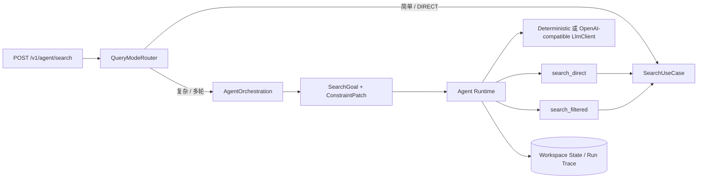

# Step 6：复杂 Search Agent

## 本阶段状态

- 状态：已完成
- 完成日期：2026-08-08
- 对应开发 Step：Step 6
- 对应 Agent Phase：Phase 2
- 对应决策：[ADR-005：复杂 Search Agent 的路由、状态与候选复用](../adr/ADR-005-complex-search-agent-routing-and-state.md)
- 对应契约：[`contracts/openapi/seekflux-v1.yaml`](../../contracts/openapi/seekflux-v1.yaml)
- 评测数据：[`evals/datasets/complex-search-v1.json`](../../evals/datasets/complex-search-v1.json)
- 评测结果：[`evals/results/complex-search-v1-baseline.json`](../../evals/results/complex-search-v1-baseline.json)
- 基础回归：[`evals/results/agent-search-v2-regression.json`](../../evals/results/agent-search-v2-regression.json)

## 要解决的问题

Phase 1 的 Agent 能调用 Direct Search，却没有证明 Agent 比 Direct 有增量，并且简单 Query 也要经过 Agent。这个切片让“猫咪护理”直接搜索，让“只看新手猫咪宠物护理知识，不要户外旅行”进入 Agent；复杂请求从自然语言提取正向约束，并行执行宽搜和标签精搜，最后原样复用一个权威 Search 候选集。

同一 Session 还必须支持带版本前提的条件修改。旧页面或并发请求不能用过期版本覆盖已经提交的新目标。

## 架构位置



Direct Search 仍不依赖 Agent。Query Mode 和 SearchGoal 语义属于 AgentOrchestration；有限步、并行 Tool、参数修复和无进展检测属于 Runtime；两个 Search Tool 只是 Search Use Case Adapter。

## 完成了什么

- `AUTO | DIRECT | AGENT` Query Mode 与可解释 `routeReason`；
- 确定性 `SearchIntentAnalyzer` 和结构化 `SearchPlan`；
- 版本化 SearchGoal、原子 `STATE_PATCHED + USER_MESSAGE`、乐观冲突 409；
- 请求级动态 Tool 子集和版本冻结；
- `CallTools` 并行 fan-out、共同 Deadline、总 Tool 次数限制和部分成功语义；
- Tool Schema 一次确定性参数修复、调用指纹去重与 `NO_PROGRESS_DETECTED`；
- `search_direct` 宽搜与 `search_filtered` 标签精搜，最终候选原样复用；
- 可配置 OpenAI-compatible Provider Adapter、版本化 Prompt，以及默认确定性回归 Provider；
- 响应中的 SearchPlan、目标版本、所选 Tool、成功 Tool 数与候选复用证据；
- 12 条对抗内容、6 条复杂 Query、简单路由和多轮冲突的真实评测 Runner；
- Worker 对“内容已撤回但 submitted 事件晚到”的幂等跳过，避免评测清理造成 Kafka 分区重试阻塞。

## 核心流程与失败语义

1. Application Service 读取已有 SearchGoal，创建新版本或应用 `ConstraintPatch`；
2. Analyzer 生成改写 Query 与派生标签，Mode Router 决定 Direct 或 Agent；
3. Direct 路由同步调用 Search Use Case，不创建 AgentRun，`goalVersion=0`；
4. Agent 路由先取得执行权，再原子提交状态补丁与用户消息；
5. Runtime 为复杂 Query 动态冻结两个 Tool，并行执行宽搜与精搜；
6. 任一 Tool 成功即可继续，精搜有结果时复用精搜候选；不在 Agent 层过滤或重排；
7. 全部 Tool、模型、Deadline 或无进展失败时进入 `AGENT_TO_DIRECT_FALLBACK`；
8. 多轮补丁版本过期返回 `409 AGENT_CONSTRAINT_VERSION_CONFLICT`，不提交事件。

## 关键代码入口

| 入口 | 作用 |
| --- | --- |
| `contexts/agent-orchestration-context/.../QueryModeRouter.java` | Direct/Agent 模式判定 |
| `contexts/agent-orchestration-context/.../SearchIntentAnalyzer.java` | 结构化 SearchPlan 基线 |
| `contexts/agent-orchestration-context/.../SearchGoal.java` | 目标版本与 ConstraintPatch |
| `platform/agent-runtime/.../AgentRuntime.java` | 动态 Tool、fan-out、修复、无进展检测 |
| `platform/persistence/.../JdbcAgentSessionStore.java` | 状态补丁与消息原子提交 |
| `apps/agent-server/.../OpenAiCompatibleLlmClient.java` | 真实 Provider 协议 Adapter |
| `apps/agent-server/.../SearchFilteredTool.java` | 标签精搜 Tool Adapter |
| `evals/run_complex_agent_eval.py` | 真实复杂 Query、多轮和路由评测 |

## 设计取舍与边界

默认 Provider 仍是确定性实现，使回归不依赖 API Key、网络和非确定输出；`AGENT_LLM_PROVIDER=openai-compatible` 可切换到真实 Chat Completions 兼容端点。Adapter 已用本地协议服务器验证请求、鉴权和结构化 Decision 解析，本阶段没有伪造一次真实付费模型评测，因此没有真实 Token/成本结论。

宽搜和精搜是同一 Search Use Case 的不同结构化调用，不是把 Elasticsearch 通道伪装成 Agent Tool。当前确定性 Analyzer 使用有限标签词表；地理解析、时间表达标准化、用户兴趣 Tool、真实模型效果、跨实例恢复、HITL、子 Agent、MCP 和 SSE 仍未完成。

## 如何验证

```bash
mvn -pl platform/agent-runtime,contexts/agent-orchestration-context,apps/agent-server,apps/worker-runner -am test
python3 -m py_compile evals/run_agent_search_eval.py evals/run_complex_agent_eval.py
./seekflux.sh up
python3 evals/run_agent_search_eval.py
python3 evals/run_complex_agent_eval.py
```

OpenAI-compatible Adapter 的本地协议测试：

```bash
mvn -pl apps/agent-server -am -Dtest=OpenAiCompatibleLlmClientTest -Dsurefire.failIfNoSpecifiedTests=false test
```

若使用真实兼容端点，在 `.env` 设置 `AGENT_LLM_PROVIDER`、`AGENT_LLM_ENDPOINT`、`AGENT_LLM_API_KEY` 和 `AGENT_LLM_MODEL` 后重启 Agent Server。密钥不进入仓库或 Trace。

## 完成证据

- Runtime/Orchestration/Agent Server 单测覆盖并行 fan-out、一次参数修复、重复调用无进展、路由与版本冲突；Worker 补充撤回竞态测试；
- 真实服务链路创建内容、经 Outbox/Kafka/Worker 发布并进入 Elasticsearch，再调用 8080/8083；
- `complex-search-v1` 的 6 条对抗 Query：Direct `MRR@1/Recall@1=0.0`，Agent `MRR@1/Recall@1=1.0`；
- Tool Selection Accuracy、Task Completion Rate、Simple Direct Rate 均为 `1.0`，Fallback Rate 为 `0.0`；
- 本机评测 Direct P95 为 `24.622 ms`，Agent P95 为 `159.344 ms`，Agent Added P95 为 `136.214 ms`，简单 AUTO 直达 P95 为 `35.329 ms`；确定性 Provider 不虚构 Token/成本；
- 多轮 SearchGoal 从版本 1 原子更新到版本 2，旧 `baseVersion=1` 返回 `AGENT_CONSTRAINT_VERSION_CONFLICT`；
- PostgreSQL 对应 Session 投影为 `state_version=2`，事件顺序包含两组 `STATE_PATCHED → USER_MESSAGE → RUN_COMPLETED`；
- Agent Trace 冻结 `search-assistant-v2`、两个 Tool Schema 和 Provider 版本，并通过 `linkedTraceId` 关联最终采用的 Search Trace。

## 本阶段可以学到什么

- Mode Router 是成本与延迟边界，不只是一个 if；
- 多轮自然语言修改必须先转成有版本前提的领域补丁，不能直接覆盖 Session JSON；
- 并行 Tool 的价值来自互补召回和部分成功，必须受同一预算约束；
- Agent 可以选择 Search 候选集，但不能悄悄复制一套不可追踪的排序逻辑；
- 评测数据要包含关键词陷阱，否则“Agent 与 Direct 都命中”无法证明增量。

## 练习与自检问题

1. 为什么简单 AUTO 请求不提交 SearchGoal，而多轮补丁必须提交？
2. 如果宽搜成功、精搜超时，当前终态和 Trace 应是什么？
3. 为什么参数修复只允许一次？哪些修复会改变业务语义而不应自动进行？
4. 把确定性 Analyzer 替换成真实模型时，如何固定 Prompt/模型版本并避免 Eval 污染？

## 下一步

Step 7 是 Agent 可靠性与平台化：补齐 fencing、多实例失主接管、跨实例取消、事务 Outbox、故障注入、Shadow、成本与 SLO 证据。当前唯一进度与完成门槛始终以[学习路线首页](README.md)为准。
