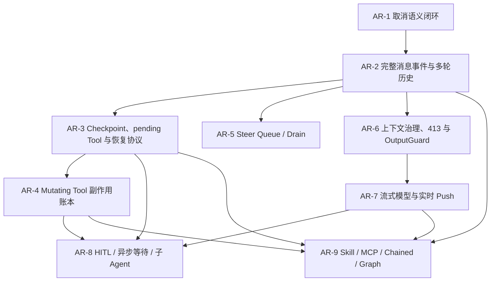

# Agent Runtime 演进路线与交付记录

> 文档状态：**AR-1 取消语义闭环已完成**；当前实施目标为 **AR-2 完整消息事件与多轮历史**。
>
> 本文只记录 `platform/agent-runtime` 后续演进的实施顺序、完成门槛和交付证据。写进计划不代表已经实现；只有代码、自动化测试以及必要的真实验收或固定评测共同证明后，阶段状态才能改为“已完成”。

## 1. 文档职责

本文是 Agent Runtime 模块内唯一的演进跟踪文档，用来持续回答：

1. 下一阶段要解决什么问题，为什么按这个顺序实施；
2. 每个阶段的明确范围、前置依赖和完成门槛是什么；
3. 本轮实际改了哪些入口，验证了哪些成功、失败和恢复语义；
4. 哪些边界仍未完成，下一轮从哪里继续。

本文不替代以下事实来源：

- [全局学习路线](../../docs/learning/README.md)：全仓唯一的当前 Step 与总体进度入口；
- [Agent Runtime 内核设计](../../docs/agent-runtime.md)：已经实现的 Runtime 结构与运行语义；
- [ADR-004](../../docs/adr/ADR-004-ark-leto-inspired-agent-runtime.md) 与 [ADR-006](../../docs/adr/ADR-006-agent-reliability-fencing-outbox-shadow.md)：长期架构决定和 Ark-Leto 差距矩阵；
- [Ark-Leto 框架内核与 Agentspark 主链路原理详解](<../../Ark-Leto 框架内核 与 Agentspark 主链路 原理详解.md>)：目标能力的参考材料，不是 SeekFlux 当前实现证明。

状态只使用：`已完成`、`下一步`、`未开始`、`后置可选`。阶段文档或接口草图不能作为完成证据。

## 2. 当前实现基线

建立本文时，Runtime 已经具备以下能力：

- 主链路：`Router → FeaturePipeline → SessionExecutor → AgentLoop`；
- Session Ingress 幂等、Redis 执行权、单调 fencing token、owner-CAS 释放和失主接管；
- PostgreSQL Workspace 追加事件、独立 Run/RunEvent、终态与 Outbox 同事务提交；
- 有限轮 Loop、共同 Deadline、结构化 Decision、动态 Tool 集、Tool Schema 校验、并行 fan-out 和确定性回退；
- 模型与 Tool 独立 Bulkhead、固定故障注入、Shadow 隔离和 Token/成本记录；
- 原因化的进程内/Redis 取消信号、Session → batch → Tool 分层传播、同步取消入口和优雅停机；
- 真实 Loop 在模型与 Tool 调用期间响应取消，并把 `USER_CANCEL`、`STEER`、`AUTHORITY_LOST`、`SHUTDOWN` 一致映射为独立 `CANCELLED` 终态；
- Run、Trace、Push、HTTP 响应和 PostgreSQL Run 记录均携带 `cancellationReason`，取消不再触发 Direct Fallback。

目前关键缺口是：

- Workspace 事实主要覆盖用户消息、状态和运行终态，缺少可重放的 `AssistantMessage`、`ToolResultMessage` 及完整多轮历史；
- 接管恢复仍以重跑当前轮为主，没有 pending Tool Checkpoint；
- `MUTATING` Tool 已有副作用元数据和稳定 Call ID，但没有持久化副作用账本与回执；
- 没有 Steer Queue/Drain、上下文压缩、413 溢出修复、OutputGuard、实时流式 Push；
- HITL、异步等待点、Handoff、子 Agent、MCP 和 Graph 尚未实现。

## 3. 实施顺序与依赖



| 阶段 | 目标 | 状态 | 相对工作量 | 主要前置 |
| --- | --- | --- | --- | --- |
| AR-1 | 真实 Loop 取消终态和在途调用取消 | 已完成 | 中 | 当前基线 |
| AR-2 | 消息事件、Session 投影与 Tool 结果契约 | 下一步 | 大 | AR-1 |
| AR-3 | Checkpoint、pending Tool 与恢复协议 | 未开始 | 大 | AR-2 |
| AR-4 | Mutating Tool 副作用账本 | 未开始 | 大 | AR-3 |
| AR-5 | Steer Queue/Drain | 未开始 | 中到大 | AR-1、AR-2 |
| AR-6 | 上下文压缩、413 重试和 OutputGuard | 未开始 | 大 | AR-2 |
| AR-7 | 流式调用、实时 Push 与跨实例订阅 | 未开始 | 大 | AR-6 |
| AR-8 | HITL、异步等待点、Handoff 与子 Agent | 未开始 | 多个独立大阶段 | AR-3、AR-4、AR-7 |
| AR-9 | Skill/ToolGroup、MCP、Chained/Graph | 后置可选 | 多个独立大阶段 | AR-2/3/4/7，按子阶段区分 |

这里的工作量只表示相对复杂度，不是工期承诺。表格中的“主要前置”表示技术依赖，不等于实际交付顺序：AR-5 技术上只依赖 AR-1/AR-2，但仍可按产品优先级排在 AR-4 之后。AR-8 和 AR-9 必须继续拆成独立子阶段，不能用一个“大功能完成”状态掩盖其中的缺口。

### 3.1 本次详细反查后的计划修正

对照参考文档第 3～16 章后，原计划需要补齐七处：

| 原计划不足 | 调整结果 |
| --- | --- |
| 把 Checkpoint 近似等同于精确恢复 | AR-3 拆成 RuntimeContext Checkpoint、pending Tool journal、恢复动作协议；明确 Session snapshot 也不是 Checkpoint |
| Steer 被写成依赖 Checkpoint | 改为只硬依赖 AR-1 取消语义和 AR-2 队列消息事实；Checkpoint 只是增强 drain 崩溃恢复能力 |
| Assistant/ToolResult 只强调“补事件” | AR-2 同时覆盖事件 Envelope、状态投影、历史重放、reasoning 可重放性和 Tool 结果多视图 |
| 缺少统一恢复入口 | AR-3 增加 `ResumeAction`/Internal Ingress；HITL、异步回调和子 Agent 完成都必须复用 commit + dispatch 主路径 |
| 流式 Push 与 eager dispatch 混成一件事 | AR-7 拆为流式模型、Push/订阅、eager dispatch；eager 必须晚于参数完整性与副作用安全 |
| HITL、子 Agent、MCP、Graph 体量过大 | 拆成 AR-8“挂起与父子执行”和 AR-9“动态能力与编排引擎” |
| 缺少横切完成标准与模块边界 | 增加事件兼容、因果 ID、持久/瞬态状态、观测、资源上限、安全策略和 Runtime/业务输出边界 |

### 3.2 所有阶段都必须满足的横切护栏

以下内容不单独排到最后补，而是跟随每个阶段一起实现和验收：

1. **事件与状态机兼容**：WorkspaceEvent 与 PushEvent 严格分责；持久事件包含稳定类型、Schema 版本、幂等键和 set-once position；新增事件必须有旧 Session 重放与未知字段兼容测试。
2. **统一因果标识**：明确 `sessionId → requestId → attemptId → segmentId → turn → messageId/toolCallId/checkpointId/eventId` 的生成、关联和重试稳定性，不能让不同层各自随机生成无法对账的 ID。
3. **持久状态与瞬态状态隔离**：只有可序列化且恢复后仍合法的数据进入 Workspace/Checkpoint；请求级 override、Publisher、线程对象和临时密钥不能泄漏到 drain 或恢复执行。
4. **观测随功能交付**：每阶段同步增加低基数的 Agent/Tool/Context 事件、时延、错误、取消来源、恢复决策和降级指标；所有有界异步执行必须传播 Trace/MDC 上下文。
5. **资源有界**：线程池、队列、缓存、流式 buffer、并发 Tool 和重试次数都必须有硬上限、拒绝语义和关闭顺序。
6. **策略双防线**：Tool 至少具备注册/暴露级过滤和执行级拦截；`Allow/Modify/Deny/NeedApproval` 的决策不可只依赖 LLM 自律。
7. **版本冻结**：AgentDef、Prompt、模型端点、Tool Schema、Skill 和 Context 配置在单次执行/恢复中的版本必须可追溯；热更新只能影响新的安全边界。
8. **结果语义封闭**：`Completed/Waiting/Cancelled/Failed/Fallback` 等 Outcome 与 Session、Run、Push/HTTP 映射唯一；maxTurns、Tool loop、Provider 错误和权限拒绝都有稳定收敛结果，不能依靠异常文本猜测状态。

### 3.3 不照搬到 Runtime 的 Agentspark 业务特例

参考文档第 12、14、15 章包含大量 Agentspark 产品协议。SeekFlux 只吸收其中的分层原则，不把以下内容直接塞进 `platform/agent-runtime`：

- `SegmentType`、`FragmentDraft`、BFF `content_type`、端侧卡片和 deeplink 属于应用/协议 Adapter；
- DQA、ThinkingTrace、IdIndex 的具体业务字段和来源排序属于对应业务 Context；
- HTTP SSE、WebSocket/长连 envelope、输出安审服务和消息落库属于外层应用或基础设施；
- Runtime 只提供中立的消息内容、多视图 ToolResult、PushEvent、策略 Hook、因果 ID 和订阅 SPI。

## 4. 阶段定义与完成门槛

### AR-1：取消语义闭环

状态：**已完成（2026-09-13）**。

目标：让用户取消、Steer 打断、执行权丢失和停机都有明确来源，并能在模型或 Tool 正在执行时尽快停止，最终不会被误写成普通失败或 Fallback。Deadline/单次调用超时必须有独立稳定语义，不能伪装成用户取消。

实施范围：

- 建立稳定的取消原因，例如 `USER_CANCEL`、`STEER`、`AUTHORITY_LOST`、`SHUTDOWN`；另行定义 `DEADLINE_EXCEEDED`、模型超时和 Tool 超时的 Outcome 映射；
- 建立 Session → batch → individual Tool 的分层取消传播，子级取消不能错误反向取消整个 Session；
- 远程取消信号一次读取同时得到 cancelled/cause，结合 `taskStartedAt` 过滤上一轮残留信号，不能分两次读取造成语义撕裂；
- 在 Loop 步骤边界、模型调用前后和 Tool 调用前后检查同一个取消状态；后续 OutputGuard repair、eager dispatch 和子 Agent 必须复用同一检查协议；
- `LlmClient`、`AgentToolExecutor` 和底层 HTTP/Future 必须提供可取消句柄；取消后的晚到 chunk/result 不可继续推进状态或提交终态；
- `Cancelled` 成为真实 Loop 的独立结果，Session、Run、Push/响应和 Trace 对同一次取消表达一致；
- 保持 fencing 为最终写屏障：丢失执行权的旧 owner 即使取消不及时，也不能提交结果；
- 为“取消与正常完成同时发生”定义线性化点，覆盖 Tool 超时、租约丢失、停机和晚到结果之间的竞态测试。

完成门槛：默认真实 Loop 的自动化测试证明模型前、模型中、Tool 前、Tool 中和 Runtime 终态线性化前取消后不会启动新的模型/Tool 调用，晚到输出与结果不会推进 Session；当前只读 Tool 可以安全结束，`MUTATING` Tool 在 AR-4 前不得据此宣称可安全中断；用户取消不会落成 `FAILED`/`FALLBACK_REQUIRED`，且旧 owner 无法晚到提交。

实现说明：本轮将 Runtime 产出终态设为取消与正常完成的线性化点。该点之前已经被 token 观察到的取消优先，模型/Tool Future 会被中断且晚到结果被丢弃；Runtime 已产出终态之后才到达的取消不反向改写该结果。Session 提交前仍执行最终 authority 校验，失权 owner 无法提交。此阶段只证明现有 `READ_ONLY` Tool 的进程内停止与结果隔离，不承诺外部 `MUTATING` 副作用可撤销。

### AR-2：消息事件、Session 投影与 Tool 结果契约

目标：让下一轮上下文从持久化事实重建，而不是只依赖本次 Loop 的内存 observation。

实施范围：

- 先定义 WorkspaceEvent Envelope 和演进规则，再增加 `AssistantMessage`、`ToolResultMessage`；根据取消与排队语义补充 `QueuedUserMessage`、`UserMessageCancelled`；
- 每条消息拥有稳定 ID、Schema 版本、session 内单调且 set-once 的 position、request/attempt/segment/turn/call 关联信息；
- Assistant 的正文、reasoning 和 tool calls 分字段保存，明确 reasoning 是否允许重放；
- ToolResult 与 Tool Call 一一对应，至少区分成功、失败、超时、取消和未来等待类结果；保存模型文本视图、原始 contents、UI displayContents、错误和必要 structuredData/resources；
- Tool Call AssistantMessage 必须先于对应 ToolResultMessage；并行结果按稳定 call/index 归并，不按线程完成顺序破坏历史；
- Session 状态由事件投影，至少能表达 `IDLE/EXECUTING/SUSPENDED/COMPLETED`；排队消息用 messageId 升格并幂等出队；
- Session 投影能按 position 重建 User/Assistant/Tool 完整历史，模型输入保持 provider 无关；Snapshot 与增量事件恢复遵循高水位，不允许旧快照覆盖新事件；
- Tool 结果渲染明确“原始事实 → 模型文本 → 展示视图”的单向派生关系，渲染失败可降级且不篡改原始事实；
- 明确并测试“事件已写、终态未写”“部分 Tool 完成”“取消发生在消息追加前后”等恢复边界。

完成门槛：跨进程恢复后的第二轮请求能仅凭 Workspace 事实得到与原执行一致的有序消息历史；Tool Call/Result 不孤悬、不重复，原始/模型/UI 三种视图职责明确，历史兼容旧 Session，未知新字段不会导致旧事件无法重放。

### AR-3：Checkpoint、pending Tool 与恢复协议

目标：把“接管后整轮重跑”升级为从安全边界继续，尤其避免重复发起已完成或状态未知的 Tool Call。

先区分三个概念：Session snapshot 用于加速 Workspace 重放；Checkpoint 保存可恢复的 RuntimeContext；pending Tool journal 判断一次具体 Tool 是否已开始、已完成或状态未知。三者不能共用一个模糊的“快照”模型。

分三个可独立验收的子阶段：

1. **AR-3A RuntimeContext Checkpoint**：在 `PRE_TURN`、`POST_TURN`、`COMPLETED` 和挂起前保存版本化快照；记录 request/attempt/turn、消息 cutoff、冻结版本、预算、持久 features 和 fencing 信息。含不可序列化请求级 override 时必须拒绝或显式跳过，不能产出半份 Checkpoint。
2. **AR-3B pending Tool journal**：为 Tool Call 记录稳定 call ID、assistant message、参数摘要、effect、状态和结果引用；模型已决策、Tool 未开始、Tool 进行中、Tool 已完成分别可判定。
3. **AR-3C Resume 协议**：建立有限的 `ResumeAction` 与 Internal Ingress，用户消息、崩溃接管、HITL/Async/Waitpoint/Child 回调最终都收敛到同一条“幂等 commit → dispatch”路径；恢复前必须 `restoreFresh` 并重新校验 authority。

Checkpoint、journal、Workspace/Run 事件的事务边界和写入顺序必须清晰，禁止出现无法判定先后关系的双写；每个安全边界都加入固定崩溃注入点。

完成门槛：在模型完成、Tool 提交前、Tool 进行中、Tool 完成后和 Checkpoint 写入前后等固定崩溃点接管时，系统能确定恢复位置；AR-3 只承诺 `READ_ONLY/IDEMPOTENT` Tool 的自动恢复，`MUTATING` Tool 在 AR-4 完成前必须拒绝自动重试。

### AR-4：Mutating Tool 副作用账本

目标：在允许发布、通知、支付或其他写 Tool 进入生产前，为外部副作用建立可查询、可幂等、可对账的事实记录。

实施范围：

- 为 `READ_ONLY`、`IDEMPOTENT`、`MUTATING` 建立不同执行策略；
- 以稳定 Tool Call ID 和幂等键记录 `PREPARED`、`EXECUTING`、`SUCCEEDED`、`FAILED`、`UNKNOWN`、`RECONCILED` 等状态；
- 保存外部系统回执、请求摘要、结果摘要、attempt 和对账信息；
- Checkpoint、账本和 Session 事件之间建立明确的提交/恢复顺序；
- 状态为 `UNKNOWN` 时禁止自动重复执行不可幂等写操作，转为查询外部状态、补偿或人工处理；
- Tool 注册级权限过滤与执行级策略形成两道防线；执行决策至少支持 allow/modify/deny，并为后续 need-approval 预留稳定契约；
- before/after/failure Tool 观测事件必须携带 call/source/effect/attempt/耗时等低基数字段，并在并行执行时复制独立 ToolContext；
- Runtime 在账本能力未配置时拒绝注册或调用 `MUTATING` Tool。

完成门槛：固定故障测试覆盖“请求发出前崩溃、外部已成功但本地未确认、账本成功但 Session 未推进、重复恢复”，并证明不会产生未受控的重复副作用。

### AR-5：Steer Queue/Drain

目标：运行中的新用户消息先可靠入队，再打断当前段，并由持有执行权的实例按顺序 drain，形成同一 Session 内的连续交互。

实施范围：

- 产品入口显式区分普通新执行、Steer 插话和等待态排队；
- `commitSteerInterrupt` 遵循“先写 `QueuedUserMessage`/`MessageQueued`，后发带时间戳的 STEER 取消信号”；
- 当前 Loop 以 `STEER` 终止当前 segment，不把它混同于普通用户取消；
- drain 每次重新 `restoreFresh`，在 authority/fencing 保护下幂等提升队列消息；
- 只清理触发本轮 drain 的旧 Steer 信号，保留其后到达的真实取消或新插话；
- drain 重建身份和持久 features，但必须清除 agent/模型/评测等 per-request override，防止一次请求配置泄漏到后续消息；
- 覆盖“终态写入到 drain 启动之间”的窗口，无活 Loop 时由受控兜底主动 drain；
- 实施前由产品明确：busy 与 steer 的入口规则、队列上限、批量/合并策略、最后意图者身份规则、同卡续段展示和等待态是否只排队不打断。

完成门槛：并发插话、插话后立即取消、多条连续插话、owner 丢失和 drain 中崩溃的测试均证明消息不丢失、不乱序、不重复执行。

### AR-6：上下文治理、413 重试和 OutputGuard

目标：在长会话和不稳定模型输出下仍保持输入有界、消息语义完整、失败可解释。

分三个可独立验收的子阶段：

1. **AR-6A 上下文分层与预算**：定义稳定前缀、Agent 指令、动态能力、历史消息和本轮 recall 等层级；Renderer/Layer 必须无状态且线程安全。按完整消息和 Tool Schema 估算 token，保护 system、当前 User、首轮关键消息和 tool call/result 配对。
2. **AR-6B 压缩与降级**：assemble 入口原子读取一次 compaction meta；新增版本化 `CompactionSummary` 和 inclusive cutoff；支持 `NONE/ASYNC/SYNC`、single-flight、超时、Skeleton hard fallback 和 no-gap 验证。摘要必须先 append 共享事件日志，再更新热投影；禁止用不产摘要的截断作为 hard fallback。
3. **AR-6C 溢出与输出保护**：仅在首个 chunk/输出产生前识别 Provider 400/413 上下文溢出，进入 `OVERFLOW_FALLBACK` 强压缩后有界重试；OutputGuard 支持 accept/repair/degrade/稳定失败并限制 repair 次数，repair 全程响应取消。业务安审/合规过滤与 OutputGuard 分层，前者通过 Hook/Adapter 接入，不能混成模型格式修复。

完成门槛：固定长会话证明压缩前后 Tool 语义和关键约束不丢失，摘要没有断层且 token 估算包含 Tool Schema；413 最多按配置重试且不会重复输出或副作用；非法最终输出经过有限修复后得到合规结果或稳定错误。每种触发、noop、fallback、exhausted 都有独立 ContextEvent/指标可排查。

### AR-7：流式模型与实时 Push

目标：把当前同步响应内的逻辑事件缓冲升级为真实增量输出，同时保持 Workspace 事实、Push 投影和最终响应一致。

分四个可独立验收的子阶段：

1. **AR-7A 流式 LLM**：定义 provider 无关的 `ChatChunk`、文本/reasoning 增量、usage 和按 index 组装的 Tool Call delta；只有格式兼容的 reasoning 才能进入历史。首 chunk 超时、空流和流中异常使用不同重试语义。
2. **AR-7B Push 与订阅**：Push 覆盖 segment、LLM turn、内容、Tool、取消/Steer、Checkpoint、Control 和终态；publisher 分配单调 seq，单个 listener 失败不拖垮主链。建立请求级 sink、session 级订阅、断线/重连、背压、缓冲硬上限和防回环跨实例 relay。
3. **AR-7C Eager Dispatch**：Tool 参数 JSON 完整、Schema 与权限校验通过后才允许派发；`MUTATING` Tool 还必须先准备副作用账本。eager 结果按 tool index 合并，超时/取消可追踪，线程池有界并传播 Trace Context。
4. **AR-7D Provider 韧性**：补齐请求级 timeout/tracing/model override、细分 usage、端点版本追踪和有界 client cache；Failover/重试必须区分“尚未产生输出”和“已经产生 chunk”，不能造成重复吐字或 Tool 副作用。会话粘性和多模态协议转换按实际 Provider 需要放在 Adapter 层。

WorkspaceEvent 仍是恢复事实，PushEvent 只是过程投影；外部 SSE/WebSocket envelope、页面组件和落库协议属于应用 Adapter/契约，不进入 Runtime Domain。同步 JSON 能力或兼容层是否保留由产品契约决定。

完成门槛：首 token、断线重连、慢消费者、空流、首 chunk 超时、流中取消、Tool Call 分片和跨实例执行都有自动化或集成证据，缓冲不会无界增长。

### AR-8：挂起、恢复与父子执行

该阶段复用 AR-3 的 Resume 协议，并按实际产品场景分别立项：

- **AR-8A 等待状态基础**：`SUSPENDED`、类型化 WaitState、挂起事件、恢复事件、超时器、Checkpoint 与 Internal Ingress；
- **AR-8B HITL/Async/Waitpoint**：need-approval、人工结论、异步任务回调、超时/取消幂等和恢复后 ToolResult 渲染补偿；
- **AR-8C Handoff/子 Agent/Fork**：父子/源目标 Session 关联、预算和身份传播、等待/取消级联、结果回填、fork/promote 幂等和失败隔离。

不同等待类型必须明确 pending 状态丢失时是 fail-fast 还是容错恢复，不能统一吞掉。挂起前 Checkpoint 失败、重复回调、回调与超时竞态、父取消和子完成竞态均需固定测试。

完成门槛不能共用。每个子阶段都要有独立产品用例、契约、故障模型、测试和验收证据；没有真实需求的子阶段保持“后置可选”。

### AR-9：动态能力与编排引擎

该阶段不应继续膨胀 `DefaultAgentLoop`，按三类扩展分别设计：

- **AR-9A Skill/ToolGroup/版本路由**：区分全局配置、Session 持久激活和请求级 ephemeral 注入；配置版本在一次执行内冻结；工具组动态切换后下一轮重算可见 Tool，注册级权限过滤与执行级拦截保持双防线；
- **AR-9B MCP**：协议适配为普通 Tool，但增加 server/source 命名空间、连接生命周期、懒连接/重连、来源级批量注销、鉴权、超时和故障隔离；远端声明不能绕过本地 Schema、权限和副作用策略；
- **AR-9C Chained/Graph**：Chained 是 Loop 级编排，Graph 是节点/拓扑执行引擎，两者与默认 ReAct Loop 解耦；分别定义预算、路由、并行、Checkpoint、节点事件和确定性重放。

完成门槛不能共用。MCP 连通不等于能力安全，Graph 能跑 DAG 不等于可恢复；每个子阶段都必须由真实产品用例、自动化测试和故障验收独立证明。

## 5. 每轮交付后的更新规则

以后每完成一个实际切片，在结束前按以下顺序更新：

1. 先读本文和[全局学习路线](../../docs/learning/README.md)，确认本轮属于哪个 AR 阶段和全局 Step；
2. 只更新本轮实际涉及的阶段，写清已实现事实、关键入口和没有覆盖的边界；
3. 记录成功、失败、取消、超时、恢复和降级语义，不能只写正常路径；
4. 同步检查事件兼容、因果 ID、持久/瞬态状态、资源上限、权限策略、Trace 传播和低基数指标这些横切护栏；
5. 记录可复现的验证命令、测试名称、真实验收或固定评测结果；
6. 满足该阶段全部完成门槛后，才把状态改成“已完成”，并把下一阶段改成“下一步”；
7. 若全局阶段状态变化，同步 `docs/learning/README.md` 和对应唯一 `step-NN-*.md`；长期决定同步 `docs/adr/`，契约/事件同步 `contracts/`，效果基线同步 `evals/`；
8. 检查 Markdown 链接、状态用词、`git diff --check` 以及与代码事实的一致性。

每条交付记录使用以下字段：

```text
日期：YYYY-MM-DD
阶段：AR-N（状态）
本轮范围：
实现事实与关键入口：
失败/取消/恢复语义：
验证命令与结果：
剩余边界：
下一步：
关联文档/ADR/契约/Eval：
```

## 6. 交付记录

### 2026-09-13：建立演进跟踪基线

- 阶段：AR-1（下一步）。
- 本轮范围：确定后续实施顺序、依赖、完成门槛和持续记录规范。
- 实现事实与关键入口：本轮未修改 Runtime 代码、契约或测试，未改变任何既有能力状态。
- 失败/取消/恢复语义：尚未实现新的运行语义。
- 验证：Markdown 相对链接检查；`git diff --check`。
- 剩余边界：AR-1 至 AR-9 均按本文状态推进。
- 下一步：从真实 `AgentLoop` 的取消结果模型、在途模型/Tool 调用响应和竞态测试开始 AR-1。

### 2026-09-13：按参考文档完整主链复核路线

- 阶段：AR-1（下一步）。
- 本轮范围：对照 Router、SessionExecutor、WorkspaceEvent、AgentLoop、ContextEngine、LlmClient、Tool、PushEvent、动态配置和 Agentspark 输出边界，修订阶段划分与完成门槛。
- 实现事实与关键入口：本轮未修改 Runtime 代码、契约或测试；计划新增 AR-9，并补充横切护栏，不改变现有能力状态。
- 主要调整：Checkpoint/恢复拆为三个子问题；Steer 去除对 Checkpoint 的硬依赖；高级能力拆分为 AR-8/AR-9；流式模型、Push 和 eager dispatch 分开验收；明确 Runtime 与业务输出协议边界。
- 验证：Markdown 相对链接检查；`git diff --check`。
- 剩余边界：各阶段尚未实施；实际编码时仍需以 SeekFlux 当前源码和产品契约为准，不能机械复制 Ark-Leto/Agentspark 的类名、默认参数或业务组件。
- 下一步：AR-1 先定义取消原因、传播层级、在途调用取消协议和终态线性化点，再进入代码实现。

### 2026-09-13：完成 AR-1 取消语义闭环

- 阶段：AR-1（已完成）；AR-2 调整为下一步。
- 本轮范围：完成真实 `DefaultAgentLoop` 的原因化取消、在途模型/Tool 调用停止、独立终态、跨层契约和持久化闭环。
- 实现事实与关键入口：新增 `CancellationCause`、`AgentCancellationException` 与父子 `CancellationToken`；`AgentRuntime` 以 10ms 有界轮询等待 Future，取消时中断模型和全部 pending Tool；`LlmClient`、`AgentToolContext`、默认 ToolExecutor 和 OpenAI-compatible Adapter 传播同一 token；`AgentRunResult`、Trace、Push、Search 响应、OpenAPI 与 `agent.runs.cancellation_reason` 统一记录原因。
- 失败/取消/恢复语义：`USER_CANCEL`、`STEER`、`AUTHORITY_LOST`、`SHUTDOWN` 均收敛为 `CANCELLED`，`fallbackReason=null`、`degraded=false`，不会触发 Direct Fallback；Deadline 仍是独立的 `AGENT_DEADLINE_EXCEEDED` 失败/回退；首个取消原因胜出；停机先固化本地 `SHUTDOWN` 再广播，避免旧存储兼容路径覆盖原因；fencing 继续作为最终提交屏障。
- 验证命令与结果：JDK 21 下 `mvn -q -pl platform/agent-runtime test` 通过 31 个测试；`mvn -q -pl contexts/agent-orchestration-context -am test` 通过；`mvn -q -pl platform/persistence,apps/agent-server -am test` 通过。覆盖模型前取消、模型中取消、Tool 中取消、禁止下一模型轮、跨实例取消、停机原因、失权禁止提交和 OpenAI 调用中断。
- 剩余边界：Steer 目前只有取消原因，没有消息入队/drain；Workspace 尚无 Assistant/ToolResult 完整历史；Checkpoint 和 `MUTATING` Tool 副作用账本仍未实现；非协作式外部 Tool 只能丢弃其晚到结果，不能撤销已经发生的外部副作用。
- 下一步：AR-2 只实现版本化消息事件、Session 投影、ToolResult 多视图和仅凭 Workspace 事实重建的完整多轮历史。
- 关联文档/ADR/契约：[`docs/agent-runtime.md`](../../docs/agent-runtime.md)、[ADR-006](../../docs/adr/ADR-006-agent-reliability-fencing-outbox-shadow.md)、[`contracts/openapi/seekflux-v1.yaml`](../../contracts/openapi/seekflux-v1.yaml)、`V8__agent_cancellation_reason.sql`。

---

维护原则：本文会随着代码事实持续调整阶段内部设计，但不会通过改文档提前宣布能力完成。历史交付记录保留当时证据；若后续设计发生变化，新增记录说明原因并链接对应 ADR，而不是静默改写历史。
