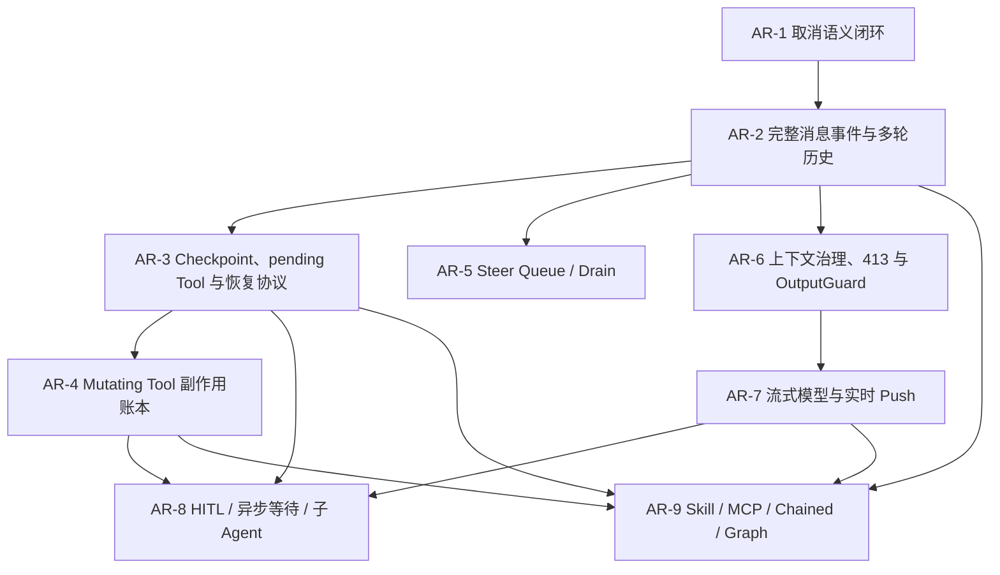

# Agent Runtime 演进路线与交付记录

> 文档状态：**AR-1～AR-9B 中除 AR-8C 外已完成**；当前没有必须继续的 Agent Runtime 阶段；**AR-8C 与 AR-9C 后置可选**。
>
> 本文只记录 `platform/agent-runtime` 后续演进的实施顺序、完成门槛和交付证据。写进计划不代表已经实现；只有代码、自动化测试以及必要的真实验收或固定评测共同证明后，阶段状态才能改为“已完成”。

## 1. 文档职责

本文是 Agent Runtime 模块内唯一的演进跟踪文档，用来持续回答：

1. 下一阶段要解决什么问题，为什么按这个顺序实施；
2. 每个阶段的明确范围、前置依赖和完成门槛是什么；
3. 本轮实际改了哪些入口，验证了哪些成功、失败和恢复语义；
4. 哪些边界仍未完成，下一轮从哪里继续。

本文不替代以下事实来源：

- [全局学习路线](../../docs/learning/README.md)：全仓唯一的当前 Step 与总体进度入口；
- [Agent Runtime 内核设计](../../docs/agent-runtime.md)：已经实现的 Runtime 结构与运行语义；
- [ADR-004](../../docs/adr/ADR-004-ark-leto-inspired-agent-runtime.md)、[ADR-006](../../docs/adr/ADR-006-agent-reliability-fencing-outbox-shadow.md)、[ADR-011](../../docs/adr/ADR-011-agent-streaming-push-and-eager-tool-safety.md)、[ADR-012](../../docs/adr/ADR-012-agent-durable-wait-and-resume.md)、[ADR-013](../../docs/adr/ADR-013-agent-capability-snapshot-and-routing.md) 与 [ADR-014](../../docs/adr/ADR-014-mcp-tool-source-and-trust-boundary.md)：长期架构决定和 Ark-Leto 差距矩阵；
- [Ark-Leto 框架内核与 Agentspark 主链路原理详解](<../../Ark-Leto 框架内核 与 Agentspark 主链路 原理详解.md>)：目标能力的参考材料，不是 SeekFlux 当前实现证明。

状态只使用：`已完成`、`下一步`、`未开始`、`后置可选`。阶段文档或接口草图不能作为完成证据。

## 2. 当前实现基线

建立本文时，Runtime 已经具备以下能力：

- 主链路：`Router → FeaturePipeline → SessionExecutor → AgentLoop`；
- Session Ingress 幂等、Redis 执行权、单调 fencing token、owner-CAS 释放和失主接管；
- PostgreSQL Workspace 追加事件、独立 Run/RunEvent、终态与 Outbox 同事务提交；
- 有限轮 Loop、共同 Deadline、结构化 Decision、动态 Tool 集、Tool Schema 校验、并行 fan-out 和确定性回退；
- 模型与 Tool 独立 Bulkhead、固定故障注入、Shadow 隔离和 Token/成本记录；
- 原因化的进程内/Redis 取消信号、Session → batch → Tool 分层传播、同步取消入口和优雅停机；
- 真实 Loop 在模型与 Tool 调用期间响应取消，并把 `USER_CANCEL`、`STEER`、`AUTHORITY_LOST`、`SHUTDOWN` 一致映射为独立 `CANCELLED` 终态；
- Run、Trace、Push、HTTP 响应和 PostgreSQL Run 记录均携带 `cancellationReason`，取消不再触发 Direct Fallback。
- Workspace 已持久化版本化 User/Assistant/ToolResult 消息；下一轮可仅凭按 position 重放的事实恢复完整历史；
- Tool Call 与 ToolResult 使用稳定 ID 一一配对，ToolResult 保存 raw/model/display/structured/resources 多视图，`NEED_CLARIFICATION` 投影为 `SUSPENDED`。

目前关键缺口是：

- Checkpoint、pending Tool journal 与有限 ResumeAction 已支持从安全边界继续；`MUTATING` Tool 通过持久副作用账本、稳定幂等键和 Tool 专属 reconciliation 恢复；
- `MUTATING` Tool 已有注册/执行双层策略、外部回执、请求/结果摘要及 `PREPARED → EXECUTING → SUCCEEDED/FAILED/UNKNOWN/RECONCILED` 状态机；
- Steer 已支持有界持久队列、先入队后取消、fencing drain、批量升格、旧信号精确清理和崩溃恢复；
- 上下文已按显式 Layer 组装并计量完整消息/Tool Schema，支持 `NONE/ASYNC/SYNC` 压缩、持久增量摘要、400/413 强压缩重试与有界 OutputGuard repair；
- 已有真实模型 SSE、Session 单调 Push sequence、有界 replay/背压、Redis 跨实例 relay 和 Last-Event-ID 重连；
- 类型化持久等待、HITL、Async/Waitpoint、超时扫描和幂等恢复已经实现；Handoff/子 Agent
  仅有通用协调协议，真实 launcher、持久父子关系、取消级联和 Fork promotion 尚未实现；
- 类型化 Skill/ToolGroup Catalog、Session 持久激活、请求级 ephemeral shadow、冻结
  CapabilitySnapshot、下一模型轮切组以及 Context/Trace/Push/Metrics 已实现；
- MCP Streamable HTTP Tool 来源、受限 Schema、本地策略、连接隔离、取消、版本冻结和写操作
  UNKNOWN 对账边界已实现；Resources/Prompts/Sampling 不在当前范围；
- Chained 和 Graph 尚未实现。

## 3. 实施顺序与依赖


```mermaid
flowchart TD
    AR1["AR-1 取消语义闭环"] --> AR2["AR-2 完整消息事件与多轮历史"]
    AR2 --> AR3["AR-3 Checkpoint、pending Tool 与恢复协议"]
    AR3 --> AR4["AR-4 Mutating Tool 副作用账本"]
    AR2 --> AR5["AR-5 Steer Queue / Drain"]
    AR2 --> AR6["AR-6 上下文治理、413 与 OutputGuard"]
    AR6 --> AR7["AR-7 流式模型与实时 Push"]
    AR3 --> AR8["AR-8 HITL / 异步等待 / 子 Agent"]
    AR4 --> AR8
    AR7 --> AR8
    AR2 --> AR9["AR-9 Skill / MCP / Chained / Graph"]
    AR3 --> AR9
    AR4 --> AR9
    AR7 --> AR9
```

| 阶段 | 目标 | 状态 | 相对工作量 | 主要前置 |
| --- | --- | --- | --- | --- |
| AR-1 | 真实 Loop 取消终态和在途调用取消 | 已完成 | 中 | 当前基线 |
| AR-2 | 消息事件、Session 投影与 Tool 结果契约 | 已完成 | 大 | AR-1 |
| AR-3 | Checkpoint、pending Tool 与恢复协议 | 已完成 | 大 | AR-2 |
| AR-4 | Mutating Tool 副作用账本 | 已完成 | 大 | AR-3 |
| AR-5 | Steer Queue/Drain | 已完成 | 中到大 | AR-1、AR-2 |
| AR-6 | 上下文压缩、413 重试和 OutputGuard | 已完成 | 大 | AR-2 |
| AR-7 | 流式调用、实时 Push 与跨实例订阅 | 已完成 | 大 | AR-6 |
| AR-8A | 类型化等待、挂起与恢复基础 | 已完成 | 大 | AR-3、AR-7 |
| AR-8B | HITL、Async、Waitpoint 与超时/取消竞态 | 已完成 | 大 | AR-4、AR-8A |
| AR-8C | Handoff、子 Agent 与 Fork promotion | 后置可选 | 大 | AR-8A、真实产品用例 |
| AR-9A | Skill/ToolGroup 与版本路由 | 已完成 | 大 | AR-2/3/6/7 |
| AR-9B | MCP Tool 来源与连接治理 | 已完成 | 大 | AR-4、AR-9A、真实 MCP 用例 |
| AR-9C | Chained 与 Graph 引擎 | 后置可选 | 多个独立大阶段 | AR-3/4/7，真实编排用例 |

这里的工作量只表示相对复杂度，不是工期承诺。表格中的“主要前置”表示技术依赖，不等于实际交付顺序：AR-5 技术上只依赖 AR-1/AR-2，但仍可按产品优先级排在 AR-4 之后。AR-8 和 AR-9 必须继续拆成独立子阶段，不能用一个“大功能完成”状态掩盖其中的缺口。

### 3.1 本次详细反查后的计划修正

对照参考文档第 3～16 章后，原计划需要补齐七处：

| 原计划不足 | 调整结果 |
| --- | --- |
| 把 Checkpoint 近似等同于精确恢复 | AR-3 拆成 RuntimeContext Checkpoint、pending Tool journal、恢复动作协议；明确 Session snapshot 也不是 Checkpoint |
| Steer 被写成依赖 Checkpoint | 改为只硬依赖 AR-1 取消语义和 AR-2 队列消息事实；Checkpoint 只是增强 drain 崩溃恢复能力 |
| Assistant/ToolResult 只强调“补事件” | AR-2 同时覆盖事件 Envelope、状态投影、历史重放、reasoning 可重放性和 Tool 结果多视图 |
| 缺少统一恢复入口 | AR-3 增加 `ResumeAction`/Internal Ingress；HITL、异步回调和子 Agent 完成都必须复用 commit + dispatch 主路径 |
| 流式 Push 与 eager dispatch 混成一件事 | AR-7 拆为流式模型、Push/订阅、eager dispatch；eager 必须晚于参数完整性与副作用安全 |
| HITL、子 Agent、MCP、Graph 体量过大 | 拆成 AR-8“挂起与父子执行”和 AR-9“动态能力与编排引擎” |
| 缺少横切完成标准与模块边界 | 增加事件兼容、因果 ID、持久/瞬态状态、观测、资源上限、安全策略和 Runtime/业务输出边界 |

### 3.2 所有阶段都必须满足的横切护栏

以下内容不单独排到最后补，而是跟随每个阶段一起实现和验收：

1. **事件与状态机兼容**：WorkspaceEvent 与 PushEvent 严格分责；持久事件包含稳定类型、Schema 版本、幂等键和 set-once position；新增事件必须有旧 Session 重放与未知字段兼容测试。
2. **统一因果标识**：明确 `sessionId → requestId → attemptId → segmentId → turn → messageId/toolCallId/checkpointId/eventId` 的生成、关联和重试稳定性，不能让不同层各自随机生成无法对账的 ID。
3. **持久状态与瞬态状态隔离**：只有可序列化且恢复后仍合法的数据进入 Workspace/Checkpoint；请求级 override、Publisher、线程对象和临时密钥不能泄漏到 drain 或恢复执行。
4. **观测随功能交付**：每阶段同步增加低基数的 Agent/Tool/Context 事件、时延、错误、取消来源、恢复决策和降级指标；所有有界异步执行必须传播 Trace/MDC 上下文。
5. **资源有界**：线程池、队列、缓存、流式 buffer、并发 Tool 和重试次数都必须有硬上限、拒绝语义和关闭顺序。
6. **策略双防线**：Tool 至少具备注册/暴露级过滤和执行级拦截；`Allow/Modify/Deny/NeedApproval` 的决策不可只依赖 LLM 自律。
7. **版本冻结**：AgentDef、Prompt、模型端点、Tool Schema、Skill 和 Context 配置在单次执行/恢复中的版本必须可追溯；热更新只能影响新的安全边界。
8. **结果语义封闭**：`Completed/Waiting/Cancelled/Failed/Fallback` 等 Outcome 与 Session、Run、Push/HTTP 映射唯一；maxTurns、Tool loop、Provider 错误和权限拒绝都有稳定收敛结果，不能依靠异常文本猜测状态。

### 3.3 不照搬到 Runtime 的 Agentspark 业务特例

参考文档第 12、14、15 章包含大量 Agentspark 产品协议。SeekFlux 只吸收其中的分层原则，不把以下内容直接塞进 `platform/agent-runtime`：

- `SegmentType`、`FragmentDraft`、BFF `content_type`、端侧卡片和 deeplink 属于应用/协议 Adapter；
- DQA、ThinkingTrace、IdIndex 的具体业务字段和来源排序属于对应业务 Context；
- HTTP SSE、WebSocket/长连 envelope、输出安审服务和消息落库属于外层应用或基础设施；
- Runtime 只提供中立的消息内容、多视图 ToolResult、PushEvent、策略 Hook、因果 ID 和订阅 SPI。

## 4. 阶段定义与完成门槛

### AR-1：取消语义闭环

状态：**已完成（2026-09-13）**。

目标：让用户取消、Steer 打断、执行权丢失和停机都有明确来源，并能在模型或 Tool 正在执行时尽快停止，最终不会被误写成普通失败或 Fallback。Deadline/单次调用超时必须有独立稳定语义，不能伪装成用户取消。

实施范围：

- 建立稳定的取消原因，例如 `USER_CANCEL`、`STEER`、`AUTHORITY_LOST`、`SHUTDOWN`；另行定义 `DEADLINE_EXCEEDED`、模型超时和 Tool 超时的 Outcome 映射；
- 建立 Session → batch → individual Tool 的分层取消传播，子级取消不能错误反向取消整个 Session；
- 远程取消信号一次读取同时得到 cancelled/cause，结合 `taskStartedAt` 过滤上一轮残留信号，不能分两次读取造成语义撕裂；
- 在 Loop 步骤边界、模型调用前后和 Tool 调用前后检查同一个取消状态；后续 OutputGuard repair、eager dispatch 和子 Agent 必须复用同一检查协议；
- `LlmClient`、`AgentToolExecutor` 和底层 HTTP/Future 必须提供可取消句柄；取消后的晚到 chunk/result 不可继续推进状态或提交终态；
- `Cancelled` 成为真实 Loop 的独立结果，Session、Run、Push/响应和 Trace 对同一次取消表达一致；
- 保持 fencing 为最终写屏障：丢失执行权的旧 owner 即使取消不及时，也不能提交结果；
- 为“取消与正常完成同时发生”定义线性化点，覆盖 Tool 超时、租约丢失、停机和晚到结果之间的竞态测试。

完成门槛：默认真实 Loop 的自动化测试证明模型前、模型中、Tool 前、Tool 中和 Runtime 终态线性化前取消后不会启动新的模型/Tool 调用，晚到输出与结果不会推进 Session；当前只读 Tool 可以安全结束，`MUTATING` Tool 在 AR-4 前不得据此宣称可安全中断；用户取消不会落成 `FAILED`/`FALLBACK_REQUIRED`，且旧 owner 无法晚到提交。

实现说明：本轮将 Runtime 产出终态设为取消与正常完成的线性化点。该点之前已经被 token 观察到的取消优先，模型/Tool Future 会被中断且晚到结果被丢弃；Runtime 已产出终态之后才到达的取消不反向改写该结果。Session 提交前仍执行最终 authority 校验，失权 owner 无法提交。此阶段只证明现有 `READ_ONLY` Tool 的进程内停止与结果隔离，不承诺外部 `MUTATING` 副作用可撤销。

### AR-2：消息事件、Session 投影与 Tool 结果契约

状态：**已完成（2026-09-13）**。

目标：让下一轮上下文从持久化事实重建，而不是只依赖本次 Loop 的内存 observation。

实施范围：

- 先定义 WorkspaceEvent Envelope 和演进规则，再增加 `AssistantMessage`、`ToolResultMessage`；`QueuedUserMessage`、`UserMessageCancelled` 随 AR-5 的真实 Queue/Drain 一起交付，避免只有事件空壳而没有状态机；
- 每条消息拥有稳定 ID、Schema 版本、session 内单调且 set-once 的 position、request/attempt/segment/turn/call 关联信息；
- Assistant 的正文、reasoning 和 tool calls 分字段保存，明确 reasoning 是否允许重放；
- ToolResult 与 Tool Call 一一对应，至少区分成功、失败、超时、取消和未来等待类结果；保存模型文本视图、原始 contents、UI displayContents、错误和必要 structuredData/resources；
- Tool Call AssistantMessage 必须先于对应 ToolResultMessage；并行结果按稳定 call/index 归并，不按线程完成顺序破坏历史；
- Session 状态由事件投影，至少能表达 `IDLE/EXECUTING/SUSPENDED/COMPLETED`；排队消息的升格与幂等出队仍属于 AR-5；
- Session 投影能按 position 重建 User/Assistant/Tool 完整历史，模型输入保持 provider 无关；Snapshot 与增量事件恢复遵循高水位，不允许旧快照覆盖新事件；
- Tool 结果渲染明确“原始事实 → 模型文本 → 展示视图”的单向派生关系，渲染失败可降级且不篡改原始事实；
- 明确并测试“事件已写、终态未写”“部分 Tool 完成”“取消发生在消息追加前后”等恢复边界。

完成门槛：跨进程恢复后的第二轮请求能仅凭 Workspace 事实得到与原执行一致的有序消息历史；Tool Call/Result 不孤悬、不重复，原始/模型/UI 三种视图职责明确，历史兼容旧 Session，未知新字段不会导致旧事件无法重放。

实现说明：本阶段选择在 `appendOutcome` 的同一 fencing 事务内按连续 position 写入本轮 Assistant/ToolResult 和终态，因此外部观察不到“消息已提交、终态未提交”的半轮历史；崩溃发生在该事务前时仍按 AR-3 之前的既有语义重跑整轮。并行 Tool 在内存中并发执行，但消息按稳定 call index 写入。Provider 返回的 reasoning 单独保存，只有显式标记 `reasoningReplayable=true` 才进入下一轮模型上下文；当前 OpenAI-compatible Adapter 固定为不可重放。

### AR-3：Checkpoint、pending Tool 与恢复协议

状态：**已完成（2026-09-14）**。

目标：把“接管后整轮重跑”升级为从安全边界继续，尤其避免重复发起已完成或状态未知的 Tool Call。

先区分三个概念：Session snapshot 用于加速 Workspace 重放；Checkpoint 保存可恢复的 RuntimeContext；pending Tool journal 判断一次具体 Tool 是否已开始、已完成或状态未知。三者不能共用一个模糊的“快照”模型。

分三个可独立验收的子阶段：

1. **AR-3A RuntimeContext Checkpoint**：在 `PRE_TURN`、`POST_TURN`、`COMPLETED` 和挂起前保存版本化快照；记录 request/attempt/turn、消息 cutoff、冻结版本、预算、持久 features 和 fencing 信息。含不可序列化请求级 override 时必须拒绝或显式跳过，不能产出半份 Checkpoint。
2. **AR-3B pending Tool journal**：为 Tool Call 记录稳定 call ID、assistant message、参数摘要、effect、状态和结果引用；模型已决策、Tool 未开始、Tool 进行中、Tool 已完成分别可判定。
3. **AR-3C Resume 协议**：建立有限的 `ResumeAction` 与 Internal Ingress，用户消息、崩溃接管、HITL/Async/Waitpoint/Child 回调最终都收敛到同一条“幂等 commit → dispatch”路径；恢复前必须 `restoreFresh` 并重新校验 authority。

Checkpoint、journal、Workspace/Run 事件的事务边界和写入顺序必须清晰，禁止出现无法判定先后关系的双写；每个安全边界都加入固定崩溃注入点。

完成门槛：在模型完成、Tool 提交前、Tool 进行中、Tool 完成后和 Checkpoint 写入前后等固定崩溃点接管时，系统能确定恢复位置；AR-3 只承诺 `READ_ONLY/IDEMPOTENT` Tool 的自动恢复，`MUTATING` Tool 在 AR-4 完成前必须拒绝自动重试。

实现说明：`RuntimeCheckpoint` 保存 `PRE_TURN/POST_TURN/COMPLETED/SUSPENDED` 四类边界、Workspace cutoff、冻结定义、剩余预算、持久 features、observation、消息、调用指纹、usage 和 Step Trace；终态 Checkpoint 保存完整 Outcome，接管后可直接提交而不重复调用模型。`tool_call_journal` 在模型决策事务中写 `DECIDED`，提交 Tool 前写 `EXECUTING`，接管时原子转为 `UNKNOWN`，结果成功落为终态。当前 Step 的已完成结果直接复用；`READ_ONLY/IDEMPOTENT` 的 `DECIDED/UNKNOWN` 调用使用原 Tool Call ID 恢复，未知 `MUTATING` 调用返回 `FAIL_UNSAFE_PENDING_TOOL`，不进入 Loop。Workspace Outcome/Outbox 提交成功时在同一事务清理 Checkpoint 与 journal。

### AR-4：Mutating Tool 副作用账本

状态：**已完成（2026-09-15）**。

目标：在允许发布、通知、支付或其他写 Tool 进入生产前，为外部副作用建立可查询、可幂等、可对账的事实记录。

实施范围：

- 为 `READ_ONLY`、`IDEMPOTENT`、`MUTATING` 建立不同执行策略；
- 以稳定 Tool Call ID 和幂等键记录 `PREPARED`、`EXECUTING`、`SUCCEEDED`、`FAILED`、`UNKNOWN`、`RECONCILED` 等状态；
- 保存外部系统回执、请求摘要、结果摘要、attempt 和对账信息；
- Checkpoint、账本和 Session 事件之间建立明确的提交/恢复顺序；
- 状态为 `UNKNOWN` 时禁止自动重复执行不可幂等写操作，转为查询外部状态、补偿或人工处理；
- Tool 注册级权限过滤与执行级策略形成两道防线；执行决策至少支持 allow/modify/deny，并为后续 need-approval 预留稳定契约；
- before/after/failure Tool 观测事件必须携带 call/source/effect/attempt/耗时，并在并行执行时复制独立 ToolContext；Micrometer 标签只使用 tool/effect/source/phase/outcome 等低基数字段，不使用 call/attempt；
- 默认注册策略拒绝暴露 `MUTATING` Tool；宿主显式放行后，Runtime 在账本能力未配置时仍拒绝调用。

完成门槛：固定故障测试覆盖“请求发出前崩溃、外部已成功但本地未确认、账本成功但 Session 未推进、重复恢复”，并证明不会产生未受控的重复副作用。

实现说明：默认 `AgentToolRegistry` 拒绝 `MUTATING` 注册，只有宿主显式授予注册权限后才可暴露；Runtime 仍在每次调用前校验当前恢复存储是否提供副作用账本。执行策略先做 Schema 修复和 `ALLOW/MODIFY/DENY/NEED_APPROVAL` 策略判定，再以稳定 Tool Call ID 派生幂等键。写调用按 journal `DECIDED` → 账本 `PREPARED` → journal `EXECUTING` → 账本 `EXECUTING` → 外部请求 → 账本结果/回执 → journal 结果 → Checkpoint → Session Outcome 的顺序推进。接管和取消把遗留写调用标成 `UNKNOWN`；`AgentToolReconciler` 只能查询外部事实或执行 Tool 自己定义的补偿，不能重复原写请求，结论落为 `RECONCILED`。无 reconciler 或仍不确定时持续抛出 `MUTATING_TOOL_STATE_UNKNOWN`，保留账本供人工处理。`NEED_APPROVAL` 目前是稳定的失败关闭结论，真实挂起/回调属于 AR-8。

### AR-5：Steer Queue/Drain

状态：**已完成（2026-09-15）**。

目标：运行中的新用户消息先可靠入队，再打断当前段，并由持有执行权的实例按顺序 drain，形成同一 Session 内的连续交互。

实施范围：

- 产品入口显式区分普通新执行、Steer 插话和等待态排队；
- `commitSteerInterrupt` 遵循“先写 `QueuedUserMessage`/`MessageQueued`，后发带时间戳的 STEER 取消信号”；
- 当前 Loop 以 `STEER` 终止当前 segment，不把它混同于普通用户取消；
- drain 每次重新 `restoreFresh`，在 authority/fencing 保护下幂等提升队列消息；
- 只清理触发本轮 drain 的旧 Steer 信号，保留其后到达的真实取消或新插话；
- drain 重建身份和持久 features，但必须清除 agent/模型/评测等 per-request override，防止一次请求配置泄漏到后续消息；
- 覆盖“终态写入到 drain 启动之间”的窗口，无活 Loop 时由受控兜底主动 drain；
- 产品语义固定为：普通请求忙时返回 busy；显式 `STEER` 进入持久队列并打断当前 segment；显式 `QUEUE` 只允许等待态且不打断；默认上限 32、当前 drain 批量提升所有已提交消息、最后一条消息决定本段身份/运行上下文，所有消息仍按 FIFO 进入历史；`Steered` Push 供同卡续段展示。

完成门槛：并发插话、插话后立即取消、多条连续插话、owner 丢失和 drain 中崩溃的测试均证明消息不丢失、不乱序、不重复执行。

实现说明：`AgentIngressMode` 在 API/Router 显式区分 `NEW_EXECUTION/STEER/QUEUE`。`JdbcAgentSessionStore.enqueue` 在 Session 行锁事务中写 `QUEUED_USER_MESSAGE`，提交后 `SessionExecutor` 才以同一时间点写 STEER；V12 把消息唯一约束调整为 `(message_id,event_type)`，因此升格时可用同一逻辑 message ID 追加 `USER_MESSAGE`。持权 owner 每次强读后批量升格当前 FIFO 队列，最终状态补丁按“最后意图胜出”重建，排队 request/features 会剔除 agent/model/prompt/eval 等瞬态 override。drain token 从队列时间点开始，Redis 只 compare-delete 不晚于该点的 STEER，随后到达的 `USER_CANCEL` 或新 STEER 保留。promotion 后崩溃由 `promotedQueuedExecution` 和既有 Checkpoint/Resume 协议接管；owner 失权时停止整个 drain，队列留给新 owner。

### AR-6：上下文治理、413 重试和 OutputGuard

状态：**已完成（2026-09-16）**。

目标：在长会话和不稳定模型输出下仍保持输入有界、消息语义完整、失败可解释。

分三个可独立验收的子阶段：

1. **AR-6A 上下文分层与预算**：定义稳定前缀、Agent 指令、动态能力、历史消息和本轮 recall 等层级；Renderer/Layer 必须无状态且线程安全。按完整消息和 Tool Schema 估算 token，保护 system、当前 User、首轮关键消息和 tool call/result 配对。
2. **AR-6B 压缩与降级**：assemble 入口原子读取一次 compaction meta；新增版本化 `CompactionSummary` 和 inclusive cutoff；支持 `NONE/ASYNC/SYNC`、single-flight、超时、Skeleton hard fallback 和 no-gap 验证。摘要必须先 append 共享事件日志，再更新热投影；禁止用不产摘要的截断作为 hard fallback。
3. **AR-6C 溢出与输出保护**：仅在首个 chunk/输出产生前识别 Provider 400/413 上下文溢出，进入 `OVERFLOW_FALLBACK` 强压缩后有界重试；OutputGuard 支持 accept/repair/degrade/稳定失败并限制 repair 次数，repair 全程响应取消。业务安审/合规过滤与 OutputGuard 分层，前者通过 Hook/Adapter 接入，不能混成模型格式修复。

完成门槛：固定长会话证明压缩前后 Tool 语义和关键约束不丢失，摘要没有断层且 token 估算包含 Tool Schema；413 最多按配置重试且不会重复输出或副作用；非法最终输出经过有限修复后得到合规结果或稳定错误。每种触发、noop、fallback、exhausted 都有独立 ContextEvent/指标可排查。

实现说明：`ContextLayer/ContextRenderer` 显式区分稳定前缀、运行指令、动态 Tool Schema、Workspace、增量摘要、完整历史和本轮 recall；Renderer 无状态，以完整消息估算预算。`DefaultContextEngine` 在 assemble 入口只读一次摘要元数据，按完整 turn 移动 inclusive cutoff，保留最近完整轮次和 Tool Call/Result 配对，并用有界执行器执行 ASYNC single-flight。V13 的 `agent.context_compactions` 是追加式共享摘要事实，`JdbcContextCompactionStore` 在 Session 行锁下拒绝断层；当前读取直接查询 PostgreSQL，没有另设可能先于事实写入的热投影。硬限额和 `OVERFLOW_FALLBACK` 使用确定性 Skeleton 摘要，不做无摘要截断。同步 OpenAI-compatible 调用只有在收到任何模型输出前的 HTTP 400 marker 或 413 才进入强压缩，默认最多重试一次；非法结构化 Decision 最多 repair 一次，再按配置返回稳定 fallback 或 `LLM_OUTPUT_GUARD_EXHAUSTED`，repair 调用复用同一 CancellationToken。业务内容安审未混入 OutputGuard，仍应由外层策略 Adapter 单独实现。

### AR-7：流式模型与实时 Push

目标：把当前同步响应内的逻辑事件缓冲升级为真实增量输出，同时保持 Workspace 事实、Push 投影和最终响应一致。

分四个可独立验收的子阶段：

1. **AR-7A 流式 LLM**：定义 provider 无关的 `ChatChunk`、文本/reasoning 增量、usage 和按 index 组装的 Tool Call delta；只有格式兼容的 reasoning 才能进入历史。首 chunk 超时、空流和流中异常使用不同重试语义。
2. **AR-7B Push 与订阅**：Push 覆盖 segment、LLM turn、内容、Tool、取消/Steer、Checkpoint、Control 和终态；publisher 分配单调 seq，单个 listener 失败不拖垮主链。建立请求级 sink、session 级订阅、断线/重连、背压、缓冲硬上限和防回环跨实例 relay。
3. **AR-7C Eager Dispatch**：Tool 参数 JSON 完整、Schema 与权限校验通过后才允许派发；`MUTATING` Tool 不能越过 Decision journal 和副作用账本。eager 结果按 tool index 合并，超时/取消可追踪，线程池有界并传播 request/run/trace 上下文。
4. **AR-7D Provider 韧性**：补齐请求级 timeout/tracing/model override、细分 usage、端点版本追踪和受控 client 生命周期；Failover/重试必须区分“尚未产生输出”和“已经产生 chunk”，不能造成重复吐字或 Tool 副作用。会话粘性、多端点有界 client cache 和多模态协议转换只在实际 Provider 路由需要时放在 Adapter 层。

WorkspaceEvent 仍是恢复事实，PushEvent 只是过程投影；外部 SSE/WebSocket envelope、页面组件和落库协议属于应用 Adapter/契约，不进入 Runtime Domain。同步 JSON 能力或兼容层是否保留由产品契约决定。

完成门槛：首 token、断线重连、慢消费者、空流、首 chunk 超时、流中取消、Tool Call 分片和跨实例执行都有自动化或集成证据，缓冲不会无界增长。

实现说明：`ChatChunk/ChatStreamAssembler` 对 content、reasoning、usage、finish 和 Tool delta 执行严格 sequence/index 组装；OpenAI-compatible Adapter 使用 SSE，并以首个可见输出为重试线性化点，空流、首包超时、输出前失败和输出后中断分别编码。`DefaultPushEventStream` 对 history、subscriber queue 和 Session 数设置硬上限，Redis Lua 原子完成 Session sequence 分配与 Pub/Sub 发布，`sourceId` 防回环。`POST /v1/agent/search:stream` 没有 `Last-Event-ID` 时启动执行，携带时只 replay/订阅，历史缺口发 `REPLAY_GAP`。完整参数后的 `READ_ONLY/IDEMPOTENT` Tool 可提前进入同一有界执行器，最终 Decision 必须以稳定 Tool Call ID 精确匹配才能复用；不匹配、取消或超时会中断 Future。`MUTATING` 明确不做流内 eager，继续执行 AR-4 的 journal/ledger 顺序。当前产品是单端点 Provider，一个共享 HttpClient 即为完整 client 集合；动态多端点 cache 不提前引入。

### AR-8：挂起、恢复与父子执行

该阶段复用 AR-3 的 Resume 协议，并按实际产品场景分别立项：

- **AR-8A 等待状态基础（已完成）**：`WAITING → SUSPENDED` 投影、类型化 WaitState、挂起/恢复事件、独立超时器、Checkpoint 与 Internal Ingress；
- **AR-8B HITL/Async/Waitpoint（已完成）**：need-approval、人工结论、异步任务回调、合法决议类型、超时/取消幂等和恢复后 ToolResult 渲染补偿；
- **AR-8C Handoff/子 Agent/Fork（后置可选）**：已有通用 launcher SPI、深度/预算/身份传播、Child/Handoff Wait 与结果回填协调器；真实父子/源目标 Session 关系、父取消级联、产品 launcher 和 fork/promote 幂等尚未开始，Fork 显式失败关闭。

#### AR-8C 详细实施计划（后置可选）

AR-8C 只在出现至少一个真实产品用例后立项，例如“搜索 Agent 委派研究 Agent 并等待结果”、“当前会话移交给客服 Agent”或“在分支 Session 上试跑后提升完整 turn”。通用 SPI 和可构造的 Wait 不是开始该阶段的证据。

先固定三类语义，不共用一个模糊的“启动另一个 Agent”接口：

| 类型 | 控制权 | 源 Session 状态 | 结果如何返回 | 默认取消方向 |
| --- | --- | --- | --- | --- |
| Child Agent / `as_tool` | 父 Agent 保留主导权 | 等待或在明确的并行窗口继续 | 投影为原 Tool Call 的 ToolResult | 父取消级联到未终态子执行；子失败不反向取消父 |
| Handoff | 将当前任务处理权移交给目标 Agent | 挂起，不再调用新的模型/Tool | 目标完成后恢复源 Session，或按产品契约直接收敛 | 源取消尝试取消未终态目标，但不撤销已发生的外部副作用 |
| Fork / Promote | 源与分支独立执行 | 源 Session 继续存在 | 只能以完整 turn 原子提升，不拷贝半轮事件 | 双向默认不级联；只由显式 promotion/cancel 命令改变 |

实施拆分：

1. **AR-8C1 持久父子关系与预算树**
   - 建立不可变 `executionLinkId`，关联 parent/child Session、Request、Run、Wait、Tool Call 和关系类型；
   - 持久化关系状态、乐观版本、创建/终态时间、发起人和幂等 operationId，不从两个 Session 的文本消息反推关系；
   - 子执行必须得到父剩余 Deadline、Token/成本、Tool Call 数、并发数和最大深度的真子集；每个用户/Session 的活跃子执行总数有硬上限；
   - 委派身份、租户和权限只能缩减，不允许子 Agent 通过自报身份扩权。
2. **AR-8C2 真实 Child Agent launcher**
   - 选择一个真实产品 Child Agent，明确输入/输出 Schema、允许的 AgentDef/Skill/Tool、超时和降级语义；
   - launch 与 parent suspend 必须通过同一个幂等 operationId 协调；重复派发只能返回同一 child，不能重复创建；
   - child 的 Completed/Waiting/Cancelled/Failed 结果转换为稳定的父 ToolResult，原 callId 不变；大结果使用持久引用，不无界写入 Workspace 事件。
3. **AR-8C3 Handoff 移交协议**
   - 定义 `REQUESTED → ACCEPTED/REJECTED → ACTIVE → COMPLETED/CANCELLED/FAILED` 的持久状态机，只有目标接受后才视为控制权已移交；
   - 源 Session 在 Handoff Wait 期间不得再发起新模型/Tool，目标回填仍复用 Internal Ingress、authority 和 fencing；
   - 拒绝、目标不可用、启动超时、执行超时和目标部分产生输出后失败使用不同的错误码与降级策略。
4. **AR-8C4 取消、超时与终态竞态**
   - 父取消通过持久关系查找未终态后代并逐层传播，有深度/数量上限；传播失败可重试且可观测；
   - child completion、parent cancel、wait timeout 和执行权转移由持久 first-writer-wins 仲裁，晚到结果只记审计，不重写父终态；
   - 已进入外部系统的 `MUTATING` 子 Tool 继续由 AR-4 账本对账，“取消子 Agent”不等于撤销副作用。
5. **AR-8C5 Fork 基线与原子 Promotion**
   - Fork 以源 Session 某个明确 position 的完整投影作为独立基线，不复制或共享源事件流；基线携带 AgentDef/Prompt/Skill/Tool Schema/Context 版本；
   - 分支与源自创建后独立获得 execution authority、Checkpoint 和副作用账本，禁止共用内存 RuntimeContext；
   - Promotion 只接受完整、连续、已终态的 turn，校验源 basePosition 未发生冲突后，用 operationId 一次性追加自包含的 `ForkTurnPromoted`；
   - promotion 重试幂等，不允许部分消息提升、位置重排、覆盖源 Session 已发生的新 turn，也不重放分支中已发生的外部副作用。

数据与契约交付物：

- 新增父子/移交/Fork 关系的持久模型和 migration，关系事件与 Workspace 消息事件分责；
- 为 launch、accept/reject、child completion、cascade cancel、fork、promote 定义幂等 API/事件 Schema；
- Push 增加 parent/child/handoff/fork 过程投影，但持久关系仍是恢复事实；
- Trace 携带 relationId、parentRunId、depth、budget allocation 和稳定 outcome；Metrics 不使用 Session/Run/relation ID 作标签。

验收矩阵：

- 成功路径：child 结果回填、handoff 接受并恢复、fork 与完整 turn promotion；
- 幂等：launch/callback/cancel/promote 重复提交不重复创建子执行、不重复追加消息、不重复副作用；
- 崩溃：覆盖“关系已写/子未派发”、“子已完成/父未恢复”、“promotion 事件提交前后”等固定故障点；
- 竞态：parent cancel vs child complete、handoff timeout vs target accept、source new turn vs promotion 都有唯一可重放结果；
- 安全：身份/权限不扩大，子执行无法越过 AgentDef/Tool/租户限制，所有跨 Session 操作受 authority/fencing 或对等 CAS 保护；
- 资源：证明深度、总后代数、并发数、等待时长、Token/成本和结果大小均有硬上限。

AR-8C 只能按 `AR-8C1 → AR-8C2 → AR-8C3 → AR-8C4 → AR-8C5` 逐片验收；Child 完成不代表 Handoff 或 Fork 完成。Fork 在 AR-8C5 前继续显式返回 `FORK_PROMOTION_UNSUPPORTED`，不用内存复制伪装支持。

不同等待类型必须明确 pending 状态丢失时是 fail-fast 还是容错恢复，不能统一吞掉。挂起前 Checkpoint 失败、重复回调、回调与超时竞态、父取消和子完成竞态均需固定测试。

完成门槛不能共用。每个子阶段都要有独立产品用例、契约、故障模型、测试和验收证据；没有真实需求的子阶段保持“后置可选”。

实现说明：`AgentRuntime` 在 `NEED_APPROVAL` 前保存原 Assistant/Tool 决策并挂起，审批通过后
复用原 Tool Call ID；Tool 也可返回 `WaitRequest.AsyncTask/Waitpoint/Handoff/ChildAgent`。
`agent.runtime_waits` 在 PostgreSQL 中以行锁、fencing token 和唯一 pending 索引仲裁
first-writer-wins；同一 `resolutionId` 的同一决议忽略服务端接收时间差异并幂等返回，改变
outcome/output/actor 则冲突。HITL 与异步类等待的合法结论不同，防止绕过审批或重复派发异步
任务。执行预算在挂起时冻结，等待使用策略/Tool 声明的独立 deadline；定时扫描、人工/API
回调和 Session cancel 最终都调用 `Router.resume`。恢复后补齐 ToolResult，并在终态后继续 drain
等待期间的 QUEUE。缺失 pending 时 HITL/Waitpoint/Handoff fail-fast，Async/Child 可从 suspended
Checkpoint 重建。长期取舍见 [ADR-012](../../docs/adr/ADR-012-agent-durable-wait-and-resume.md)。

### AR-9：动态能力与编排引擎

该阶段是 Agent Runtime 主链路完成后的平台扩展，不是当前 Search Agent 上线的阻断项。不继续膨胀 `DefaultAgentLoop`：Skill/ToolGroup 是能力解析层，MCP 是 Tool 来源 Adapter，Chained 是 Loop 级编排，Graph 是独立节点引擎。

子阶段状态与顺序：

| 子阶段 | 交付目标 | 状态 | 启动条件 |
| --- | --- | --- | --- |
| AR-9A | Skill/ToolGroup/版本路由 | 已完成 | 一个 Agent 的 Tool 数量或指令集已需按任务动态缩减 |
| AR-9B | MCP Tool 来源与连接治理 | 已完成 | 已选择 Streamable HTTP Tool 子集、环境凭据引用和本地安全分类 |
| AR-9C1 | Chained Loop | 后置可选 | 出现可证明单 ReAct Loop 不足的 plan → execute → summarize 用例 |
| AR-9C2 | Graph 内存执行引擎 | 后置可选 | 出现需拓扑、分支/聚合和受控并行的非会话工作流 |
| AR-9C3 | Graph 持久恢复与副作用安全 | 后置可选 | AR-9C2 已有真实使用，且业务需要跨进程恢复 |

AR-9A/9B 已完成；AR-9C 只保留扩展计划，不提前引入 Graph DSL 或空引擎。

#### AR-9A Skill / ToolGroup / 版本路由（已完成）

目标：在不改变 AgentDef 最大权限边界的前提下，按 Session 和当前请求缩减指令与 Tool Schema，并让动态切换可持久、可恢复、可审计。

先定义三层动态性：

| 层级 | 作用域 | 可持久 | 可扩大 AgentDef 权限 | 热更生效边界 |
| --- | --- | --- | --- | --- |
| 全局 Skill/ToolGroup Catalog | AgentDef 可引用的版本化能力 | 配置事实 | 否 | 新执行；恢复继续使用冻结快照 |
| Session 激活投影 | 跨 turn 的已激活 Skill/工具组 | 是，使用 Workspace 事件投影 | 否 | 在下一个安全模型 turn 重算 |
| Request ephemeral Skill/override | 当次 execution | 不进入 Session 激活投影 | 否 | 请求开始时冻结，终态后销毁 |

实施拆分：

1. **AR-9A1 类型化能力契约**
   - `SkillDefinition` 至少包含 skillId、version、类型（prompt/lazy 等）、instruction/reference、requiredTools、toolGroups、autoActivate 和内容摘要；
   - `ToolGroupDefinition` 包含 groupId、version、description、toolIds、alwaysActive；`CapabilityCatalog` 有唯一 configVersion 和内容 hash；
   - 加载时拒绝重复 ID、缺失 Tool、循环引用、AgentDef 未授权 Tool 和不可序列化配置；运行时不用 Map/string key 猜契约。
2. **AR-9A2 能力解析与版本冻结**
   - execution 开始时生成不可变 `CapabilitySnapshot`，记录 catalog/Skill/ToolGroup/Tool Schema/AgentDef/Prompt 版本及 hash，进入 Trace 和 Checkpoint；
   - 恢复时优先按冻结版本继续；版本不再可用时显式 `CAPABILITY_SNAPSHOT_UNAVAILABLE`，不静默套用新配置；
   - Catalog 热更仅影响新 execution；同一 execution 可改变激活集，但不改变其引用的 Skill/Group 定义版本。
3. **AR-9A3 Session 持久激活**
   - 新增版本化 `SkillActivated/SkillDeactivated/ToolGroupsChanged` Workspace 事实，用 operationId 幂等、position 有序投影；
   - 只有明确 Control/API 或受策略保护的内置 Tool 可修改持久激活；普通模型文本不能直接改状态；
   - 无效 Skill/Group、版本冲突、越权 Tool 和正在执行/等待的 Session 返回稳定拒绝，不产生半份事件；当前 `COMPLETED` 表示上一轮已收敛、仍可开始下一 turn，因此是允许修改的安全边界。
4. **AR-9A4 ephemeral Skill 与 shadow 隔离**
   - ephemeral Skill 必须有请求级 ID/version/schema、大小上限和来源，只能引用 AgentDef 已允许的 Tool；
   - 同 ID 的 ephemeral Skill 显式 shadow 全局 Skill，同时从 auto-activate 和 requiredTools 解析中移除被遮蔽全局版本，防止指令或 Tool 泄漏；
   - 不含密钥的规范化 ephemeral 快照可进入当次 Checkpoint 以便崩溃恢复，但不进入 Session 投影；含 secret/不可序列化值时在首个副作用前拒绝可恢复执行。
5. **AR-9A5 动态 ToolGroup 与可见 Tool 重算**
   - 每个模型 turn 的有效 Tool 按固定顺序计算：`AgentDef allowedTools ∪ 已激活 Skill requiredTools`，再经 ToolGroup 过滤、本地注册表/Schema 校验、权限过滤和执行策略；任何一层都不能扩大 AgentDef 上界；
   - 未归组 Tool 与 `alwaysActive` 组的可见规则显式固定；内置 `switch_tool_groups` 只接受 Catalog 中合法 group；
   - 切组只影响下一个模型 turn，不撤回已 dispatch 的 Tool，也不允许 eager call 利用旧可见集跨越安全边界；
   - Tool 实际执行前再用当前 permission/policy 校验；已暴露给模型不等于必然允许执行。
6. **AR-9A6 Context 与观测**
   - Context Layer 分开 ephemeral instruction、active Skill instruction 和 lazy Skill catalog，按冻结版本组装；Tool Schema token 仍进入 AR-6 预算；
   - 记录 Skill 可见/激活/遮蔽原因、Tool 被 group/permission/registry 过滤的原因、snapshot version 和切组结果；
   - Metrics 只用 agent/capabilityVersion/reason/outcome 等受控枚举，不使用用户注入的 Skill ID 或指令文本作标签。

AR-9A 完成门槛：使用一个真实 Agent 和至少两个 ToolGroup 证明 Session 激活跨 turn 保留、ephemeral 不污染后续请求、同名 shadow 不泄漏全局 Tool、切组后下一 turn 的 Tool Schema 真实改变；热更/崩溃恢复继续使用冻结版本，缺版本明确失败；模型伪造 Tool 名、越权 Skill、失效 group 和执行前权限变更都被两道防线拦截。同步交付 migration、事件/API Schema、旧 Session 重放兼容、固定故障测试和真实产品验收。

完成说明：上述切片已经由 `CapabilityResolver`、`CapabilitySnapshot`、
`CAPABILITIES_CHANGED` Workspace 投影、`SwitchToolGroupsTool`、V15、Control API 和 Search
Agent 三组 ToolGroup 装配实现。冻结快照完整进入 Checkpoint/Trace；Queue drain 使用最新 Session
投影和被提升请求重新解析；旧 Checkpoint 走 legacy 快照兼容。Catalog/Tool Schema 缺版本时恢复
失败关闭，不会套用新定义。长期边界与配置制品责任见 [ADR-013](../../docs/adr/ADR-013-agent-capability-snapshot-and-routing.md)。

#### AR-9B MCP（已完成）

目标：将 MCP server 发现的能力适配为普通 `AgentTool`，让 Loop 无感知，但不信任远端名称、Schema、副作用声明或输出。

实施拆分：

1. **AR-9B1 Server 配置与连接生命周期**：定义 serverId/configVersion/transport/endpoint/credentialRef/超时/并发/健康策略；凭据只保存引用，不进 Workspace、Checkpoint、Trace 或日志；先为一种产品需要的 transport 交付，不同时铺开所有传输。
2. **AR-9B2 发现、命名与注销**：使用 `{serverId}__{remoteToolName}` 或等价确定性命名空间，`source=mcp:{serverId}`；名称冲突默认拒绝而非静默覆盖；连接失效按 source 原子摘除可见定义，不影响其他 server/本地 Tool。
3. **AR-9B3 本地信任边界**：远端 Schema 解析为受限本地 Schema，设置字段深度/数量/大小上限；Tool 的 effect、allowlist、租户/用户权限、是否需审批由本地配置决定，远端不能自证 `READ_ONLY`。
4. **AR-9B4 Proxy 执行与故障隔离**：懒连接、有界建连/请求超时、每 server bulkhead、熔断/重连和输出大小上限；取消传到 transport；server 断线不拖垮本地 Tool 或其他 server。
5. **AR-9B5 恢复与副作用**：CapabilitySnapshot 冻结 server config version、远端 Tool Schema hash 和本地策略版本；连接恢复后 Schema 改变只影响新 execution；未知状态的 `MUTATING` MCP Tool 进入 AR-4 ledger/reconciler，不因重连自动重放。
6. **AR-9B6 可观测与运维**：健康、发现版本、在途请求、重连、schema rejection、policy denial 和调用结果可查；日志脱敏，Metrics 仅使用受控 serverId/tool/outcome，远端错误文本不作标签。

AR-9B 完成门槛：一个真实 MCP server 和一个可控 fake server 共同验证发现、调用、取消、断线、重连、批量注销、Schema 热更、命名冲突、租户隔离、恶意超大输出和未知写结果；MCP 连通或能列出 Tool 不构成完成。

完成说明：`StreamableHttpMcpClient` 已实现 MCP `2025-11-25` Tool 子集，协议级本机 server
覆盖 initialize/session、SSE 发现、JSON 调用、取消通知和超大响应中止；受控 `McpClient` fake
覆盖断线/懒重连、按 source 批量注销、Schema 热更、命名冲突、tenant/user allowlist、每 server
bulkhead、熔断及无 status Tool 的写结果 UNKNOWN。`McpSchemaTranslator`、`McpProxyTool` 和
`McpConnectionManager` 分别固定远端 Schema 信任边界、本地 effect/审批/对账规则和连接故障域；
CapabilitySnapshot v2 与 RunDefinition 冻结实际注册集及 config/policy/schema hash，v1 快照继续兼容。
默认配置关闭 MCP；每个第三方业务 server 的 effect、凭据、审批和对账仍须单独配置验收。长期决策见
[ADR-014](../../docs/adr/ADR-014-mcp-tool-source-and-trust-boundary.md)。

#### AR-9C Chained / Graph（后置可选）

Chained 与 Graph 是两个引擎，不共用“AR-9C 已完成”。默认 ReAct Loop 保持不变，Router 根据冻结 AgentDef 的 `loopType` 显式选择，不在运行中猜测切换。

**AR-9C1 Chained Loop**

1. 定义版本化 `ChainedAgentDefinition`，包含有序 leaf agents、入口、总预算、单 leaf 预算、路由/退出策略和允许的数据传递 Schema；
2. 实现 `Stay/Advance/JumpTo/Exit` 有限路由决策，限制 maxTotalSteps、单 leaf 重入次数和 jump 次数，禁止不可证明收敛的隐式循环；
3. 跨 leaf 数据传递使用有大小上限、可序列化的类型化 attribute bag，敏感或请求级值显式标记不持久；
4. 每个 leaf 复用现有 Context、Tool policy、Checkpoint、Wait、Push 和副作用账本，但有独立 segment/turn 因果标识；子预算总和不得超过 chain 剩余预算；
5. 终态只能是 Completed/Waiting/Cancelled/Failed 或内部 `ExitWithLabel`；对外前将 label 映射为稳定产品 Outcome，不泄漏表达式或类名。

AR-9C1 完成门槛：真实 plan → execute → summarize 链路证明路由、预算、等待/恢复、取消、leaf 失败降级和热更版本冻结；固定测试覆盖 jump 循环、总步数耗尽、中间挂起、崩溃后不重跑已完成 leaf 和写 Tool 不重复。

**AR-9C2 Graph 内存执行引擎**

1. 建立与 AgentLoop 无依赖或单向依赖的 Graph Domain，版本化 GraphDef 包含 nodeId、operator type、输入/输出 Schema、edge、route 和资源限制；
2. 加载时验证唯一 node、无环、边端点、Schema 兼容、必达终点和可控 fan-out；路由表达式只访问 allowlist 变量/函数，不能执行任意代码；
3. 先实现真实用例需要的最小 operator 集，例如 MAP、BRANCH、FAN_OUT、FAN_IN、REDUCE；不为对齐参考框架一次性复制全部 DSL；
4. 调度使用有界执行器、Graph/node 共同 Deadline、最大活跃节点、fan-out 宽度、队列大小和中间结果大小限制；
5. 并行结果按 node/edge/index 稳定排序后聚合，不用线程完成顺序决定输出；Push 包含 graph start/end、superstep boundary 和 node start/end，但不作恢复事实。

AR-9C2 完成门槛：一个非会话的真实 DAG 用例通过固定输入证明拓扑、分支、有界并行、确定聚合、取消和部分失败策略。该阶段只能宣称“内存 Graph 执行已完成”，不宣称跨进程恢复。

**AR-9C3 Graph 持久恢复与副作用安全**

1. 持久 GraphRun、冻结 GraphDef/code/config version、node attempt、输入/输出引用、路由决定、已完成边和剩余预算；
2. 以 superstep/node 安全边界 Checkpoint，接管后从持久调度状态继续，不根据 Push 或日志推测；
3. READ_ONLY/IDEMPOTENT 节点可按稳定 nodeAttemptId 恢复；MUTATING 节点必须进入 AR-4 ledger/reconciler，UNKNOWN 时不自动重放；
4. GraphDef 或 operator code 的冻结版本缺失时 fail-fast；新版本只接收新 GraphRun，不在恢复中静默迁移。

AR-9C3 完成门槛：固定故障点覆盖节点启动前后、输出持久前后、fan-in 前后、写节点外部已成功但本地未确认，并证明接管不丢节点、不重复聚合、不盲目重放副作用。

AR-9 的完成门槛不能共用：AR-9A、9B、9C1、9C2、9C3 各自只在其代码、契约、自动化测试、故障注入和真实产品验收都成立后标记“已完成”。Skill 能解析不等于 MCP 安全，MCP 能连通不等于写 Tool 可恢复，Chained 能串行不等于 Graph，Graph 能跑 DAG 不等于可持久恢复。

## 5. 每轮交付后的更新规则

以后每完成一个实际切片，在结束前按以下顺序更新：

1. 先读本文和[全局学习路线](../../docs/learning/README.md)，确认本轮属于哪个 AR 阶段和全局 Step；
2. 只更新本轮实际涉及的阶段，写清已实现事实、关键入口和没有覆盖的边界；
3. 记录成功、失败、取消、超时、恢复和降级语义，不能只写正常路径；
4. 同步检查事件兼容、因果 ID、持久/瞬态状态、资源上限、权限策略、Trace 传播和低基数指标这些横切护栏；
5. 记录可复现的验证命令、测试名称、真实验收或固定评测结果；
6. 满足该阶段全部完成门槛后，才把状态改成“已完成”，并把下一阶段改成“下一步”；
7. 若全局阶段状态变化，同步 `docs/learning/README.md` 和对应唯一 `step-NN-*.md`；长期决定同步 `docs/adr/`，契约/事件同步 `contracts/`，效果基线同步 `evals/`；
8. 检查 Markdown 链接、状态用词、`git diff --check` 以及与代码事实的一致性。

每条交付记录使用以下字段：

```text
日期：YYYY-MM-DD
阶段：AR-N（状态）
本轮范围：
实现事实与关键入口：
失败/取消/恢复语义：
验证命令与结果：
剩余边界：
下一步：
关联文档/ADR/契约/Eval：
```

## 6. 交付记录

### 2026-09-13：建立演进跟踪基线

- 阶段：AR-1（下一步）。
- 本轮范围：确定后续实施顺序、依赖、完成门槛和持续记录规范。
- 实现事实与关键入口：本轮未修改 Runtime 代码、契约或测试，未改变任何既有能力状态。
- 失败/取消/恢复语义：尚未实现新的运行语义。
- 验证：Markdown 相对链接检查；`git diff --check`。
- 剩余边界：AR-1 至 AR-9 均按本文状态推进。
- 下一步：从真实 `AgentLoop` 的取消结果模型、在途模型/Tool 调用响应和竞态测试开始 AR-1。

### 2026-09-13：按参考文档完整主链复核路线

- 阶段：AR-1（下一步）。
- 本轮范围：对照 Router、SessionExecutor、WorkspaceEvent、AgentLoop、ContextEngine、LlmClient、Tool、PushEvent、动态配置和 Agentspark 输出边界，修订阶段划分与完成门槛。
- 实现事实与关键入口：本轮未修改 Runtime 代码、契约或测试；计划新增 AR-9，并补充横切护栏，不改变现有能力状态。
- 主要调整：Checkpoint/恢复拆为三个子问题；Steer 去除对 Checkpoint 的硬依赖；高级能力拆分为 AR-8/AR-9；流式模型、Push 和 eager dispatch 分开验收；明确 Runtime 与业务输出协议边界。
- 验证：Markdown 相对链接检查；`git diff --check`。
- 剩余边界：各阶段尚未实施；实际编码时仍需以 SeekFlux 当前源码和产品契约为准，不能机械复制 Ark-Leto/Agentspark 的类名、默认参数或业务组件。
- 下一步：AR-1 先定义取消原因、传播层级、在途调用取消协议和终态线性化点，再进入代码实现。

### 2026-09-13：完成 AR-1 取消语义闭环

- 阶段：AR-1（已完成）；AR-2 调整为下一步。
- 本轮范围：完成真实 `DefaultAgentLoop` 的原因化取消、在途模型/Tool 调用停止、独立终态、跨层契约和持久化闭环。
- 实现事实与关键入口：新增 `CancellationCause`、`AgentCancellationException` 与父子 `CancellationToken`；`AgentRuntime` 以 10ms 有界轮询等待 Future，取消时中断模型和全部 pending Tool；`LlmClient`、`AgentToolContext`、默认 ToolExecutor 和 OpenAI-compatible Adapter 传播同一 token；`AgentRunResult`、Trace、Push、Search 响应、OpenAPI 与 `agent.runs.cancellation_reason` 统一记录原因。
- 失败/取消/恢复语义：`USER_CANCEL`、`STEER`、`AUTHORITY_LOST`、`SHUTDOWN` 均收敛为 `CANCELLED`，`fallbackReason=null`、`degraded=false`，不会触发 Direct Fallback；Deadline 仍是独立的 `AGENT_DEADLINE_EXCEEDED` 失败/回退；首个取消原因胜出；停机先固化本地 `SHUTDOWN` 再广播，避免旧存储兼容路径覆盖原因；fencing 继续作为最终提交屏障。
- 验证命令与结果：JDK 21 下 `mvn -q -pl platform/agent-runtime test` 通过 31 个测试；`mvn -q -pl contexts/agent-orchestration-context -am test` 通过；`mvn -q -pl platform/persistence,apps/agent-server -am test` 通过。覆盖模型前取消、模型中取消、Tool 中取消、禁止下一模型轮、跨实例取消、停机原因、失权禁止提交和 OpenAI 调用中断。
- 剩余边界：Steer 目前只有取消原因，没有消息入队/drain；Workspace 尚无 Assistant/ToolResult 完整历史；Checkpoint 和 `MUTATING` Tool 副作用账本仍未实现；非协作式外部 Tool 只能丢弃其晚到结果，不能撤销已经发生的外部副作用。
- 下一步：AR-2 只实现版本化消息事件、Session 投影、ToolResult 多视图和仅凭 Workspace 事实重建的完整多轮历史。
- 关联文档/ADR/契约：[`docs/agent-runtime.md`](../../docs/agent-runtime.md)、[ADR-006](../../docs/adr/ADR-006-agent-reliability-fencing-outbox-shadow.md)、[`contracts/openapi/seekflux-v1.yaml`](../../contracts/openapi/seekflux-v1.yaml)、`V8__agent_cancellation_reason.sql`。

### 2026-09-13：完成 AR-2 完整消息事件与多轮历史

- 阶段：AR-2（已完成）；AR-3 调整为下一步。
- 本轮范围：补齐版本化 User/Assistant/ToolResult Workspace 事实、ToolResult 多视图、Session 状态投影和跨进程多轮历史恢复。
- 实现事实与关键入口：新增 `AgentMessage`/`AgentAssistantContent`；消息关联 request/turn/segment/agentRun-attempt/call，当前无 Steer 时 `segmentId=turnId`；`AgentRuntime` 产出稳定 message/toolCall ID，并按 `Assistant(tool_calls) → ToolResult → Assistant(final)` 收敛成功、失败、超时和取消；`LlmCallResult` 保留正文与 reasoning；`DefaultContextEngine` 按 Workspace position 重建 provider-neutral User/Assistant/Tool 历史；`JdbcAgentSessionStore` 在同一 fencing 事务追加消息与终态，V9 增加 schema/message/tool-call 列、消息唯一索引和仅约束 UserMessage 的 request 幂等索引。
- 失败/取消/恢复语义：Tool Call 必须且只能有一个后继 ToolResult，Session 重放拒绝孤立、重复或缺失结果；并行结果按 call index 归并；取消和 Deadline 分别写 `CANCELLED`/`TIMED_OUT`；`NEED_CLARIFICATION` 投影为 `SUSPENDED`；事务前崩溃仍整轮重跑，pending Tool 的精确恢复留给 AR-3。
- 验证命令与结果：JDK 21 下 Runtime 36 个、Persistence 3 个、Agent Orchestration 12 个测试均无失败，Agent Server 编译通过；跨 JSON 序列化恢复测试证明第二轮只依赖 Workspace 事实；旧 UserMessage 构造、未知 payload 字段、稳定重试 ID、并行顺序、孤立/缺失 ToolResult 均有覆盖；隔离 PostgreSQL 17 顺序执行 V1–V9 成功并确认三列落库。
- 剩余边界：消息只在本轮 Outcome 事务中落库，尚不能从模型后/Tool 前等中间安全点恢复；Queue/Drain、Checkpoint、pending Tool journal 和 `MUTATING` 副作用账本未实现；当前 display/structured 视图默认由 Tool 原始输出派生，业务专用渲染器后续可在 Adapter 扩展但不得改写 raw facts。
- 下一步：AR-3A 先定义可序列化 RuntimeContext Checkpoint 与安全边界，再实现 AR-3B pending Tool journal 和 AR-3C 统一 ResumeAction/Internal Ingress。
- 关联文档/ADR/契约：[`docs/agent-runtime.md`](../../docs/agent-runtime.md)、[ADR-004](../../docs/adr/ADR-004-ark-leto-inspired-agent-runtime.md)、[`agent-workspace-message-v1.schema.json`](../../contracts/events/agent-workspace-message-v1.schema.json)、`V9__agent_workspace_messages.sql`。

### 2026-09-14：完成 AR-3 Checkpoint、pending Tool 与恢复协议

- 阶段：AR-3（已完成）；AR-4 调整为下一步。
- 本轮范围：增加可序列化 Runtime Checkpoint、pending Tool journal、有限 `ResumeAction`/`ResumeIngress`，并把接管从整轮重跑升级为安全边界恢复。
- 实现事实与关键入口：`AgentRuntime` 在模型轮次前后及终态保存 `PRE_TURN/POST_TURN/COMPLETED/SUSPENDED`；`JdbcAgentRecoveryStore` 在 fencing 下提交恢复入口、把失联 `EXECUTING` Tool 转成 `UNKNOWN`、保存 Tool 决策/开始/结果；`SessionExecutor` 先续租、`restoreFresh`、校验 Workspace cutoff，再执行 `commitResume → dispatch`；终态 Workspace/Outbox 事务同时清理恢复状态。V10 新增 `agent.runtime_checkpoints` 与 `agent.tool_call_journal`。
- 失败/取消/恢复语义：模型后但 Tool 前的 `DECIDED` 不重复模型；进行中的安全 Tool 以原 call ID 重试；已经提交结果的 Tool 不重复执行；POST_TURN 从下一模型步继续；终态 Checkpoint 直接提交 Outcome；恢复到 `CANCELLED/TIMED_OUT` Tool 不继续模型；状态不明的 `MUTATING` Tool 在 Loop 前以 `MUTATING_TOOL_STATE_UNKNOWN` 失败关闭并保留恢复事实。
- 验证命令与结果：JDK 21 下 Agent Runtime 48 个、Persistence 5 个、Agent Orchestration Context 12 个测试无失败，Agent Server 编译通过；新增固定故障测试覆盖 PRE_TURN 写入前后、模型决策提交后、Tool EXECUTING 提交后、Tool 结果提交后、POST_TURN 后、终态写入前后、取消恢复和未知写 Tool；Checkpoint/journal 经真实 JSON 序列化边界往返；隔离 PostgreSQL 17 按版本顺序执行 V1～V10 成功并确认两张表和唯一约束。
- 剩余边界：AR-3 不提供写 Tool 外部回执、对账、补偿或人工 reconciliation；`MUTATING` 的 `UNKNOWN` 会持续失败关闭。HITL/Async/Waitpoint/Child 只预留了 ResumeSource，真实状态机和回调入口仍属 AR-8；Steer Queue/Drain 属 AR-5。
- 下一步：AR-4 建立 `MUTATING` Tool 副作用账本、稳定幂等键、外部回执和 `UNKNOWN → RECONCILED` 对账协议。
- 关联文档/ADR/契约：[`docs/agent-runtime.md`](../../docs/agent-runtime.md)、[ADR-006](../../docs/adr/ADR-006-agent-reliability-fencing-outbox-shadow.md)、[`agent-recovery-v1.schema.json`](../../contracts/events/agent-recovery-v1.schema.json)、`V10__agent_runtime_checkpoints.sql`。

### 2026-09-15：完成 AR-4 Mutating Tool 副作用账本

- 阶段：AR-4（已完成）；AR-5 调整为下一步。
- 本轮范围：实现写 Tool 的注册/执行双层策略、fencing 持久账本、稳定幂等键、外部回执、UNKNOWN 对账和 Tool 调用观察。
- 实现事实与关键入口：`AgentToolRegistry` 默认只允许安全 Tool，显式注册权限才能暴露 `MUTATING`；`ToolExecutionPolicy` 支持 `ALLOW/MODIFY/DENY/NEED_APPROVAL`；`AgentRuntime` 为每个调用创建独立 `AgentToolContext` 并携带稳定 idempotency key；`AgentRecoveryExecution/JdbcAgentRecoveryStore` 在 fencing 下维护 `SideEffectLedgerEntry`；V11 新增 `agent.tool_side_effect_ledger`，保存 request/result digest、attempt、外部 receipt 和 reconciliation 事实；`ToolExecutionObserver` 提供 before/after/failure 与 initial/recovery/reconciliation 来源。
- 失败/取消/恢复语义：`READ_ONLY/IDEMPOTENT` 仍按原 Call ID 安全恢复；`MUTATING` 只有账本为 `PREPARED` 才允许首次发出，已知结果直接复用，遗留 `EXECUTING` 在接管或取消时变为 `UNKNOWN`；`UNKNOWN` 只允许 Tool 专属的外部状态查询/补偿后写 `RECONCILED`，不能再次执行原写操作；没有 reconciler 或仍无法判定时持续返回 `MUTATING_TOOL_STATE_UNKNOWN`。账本未配置时 Runtime 拒绝调用，默认注册策略也拒绝写 Tool。`NEED_APPROVAL` 暂时返回稳定 `TOOL_APPROVAL_REQUIRED`，不冒充 AR-8 的挂起流程。
- 验证命令与结果：JDK 21 下 Agent Runtime 56 个、Persistence 6 个、Agent Orchestration Context 13 个测试无失败，`mvn test` 全仓 26 个 Reactor 模块回归通过；新增 8 个 AR-4 Runtime 测试覆盖请求前崩溃、外部成功未确认、账本成功但 journal/Session 未推进、reconciliation 后再次崩溃并重复恢复、无 reconciler 失败关闭、外部写后异常保持 UNKNOWN、无权限/无账本拒绝和执行策略 modify/deny/need-approval；既有并行 Tool 测试新增独立 Context/token 断言，Micrometer 测试确认指标不使用 call/attempt 高基数标签。隔离 PostgreSQL 17 顺序执行 V1～V11 成功，并确认账本主键、Call ID/幂等键唯一约束、状态/结果检查约束。
- 剩余边界：Runtime 提供的是副作用恢复协议，不是跨外部系统分布式事务；每个真实写 Tool 仍必须根据目标系统实现可靠幂等、状态查询或补偿。当前产品只注册两个 `READ_ONLY` Search Tool，尚无生产写 Tool。真实审批挂起、人工处理工作台和后台 reconciliation 扫描器分别属于 AR-8 或具体产品运维能力。
- 下一步：AR-5 先明确 busy/steer 产品入口、队列上限和合并规则，再实现 `QueuedUserMessage → STEER cancel → owner drain`。
- 关联文档/ADR/契约：[`docs/agent-runtime.md`](../../docs/agent-runtime.md)、[ADR-006](../../docs/adr/ADR-006-agent-reliability-fencing-outbox-shadow.md)、[`agent-tool-side-effect-ledger-v1.schema.json`](../../contracts/events/agent-tool-side-effect-ledger-v1.schema.json)、`V11__agent_tool_side_effect_ledger.sql`。

### 2026-09-15：完成 AR-5 Steer Queue/Drain

- 阶段：AR-5（已完成）；AR-6 调整为下一步。
- 本轮范围：实现显式 Ingress Mode、有界持久队列、先入队后 STEER、持权 drain、旧信号精确清理、等待态只排队、终态窗口兜底和 promotion 崩溃恢复。
- 实现事实与关键入口：`AgentIngressMode` 与 OpenAPI 暴露 `NEW_EXECUTION/STEER/QUEUE`；`DefaultRouter` 保留普通 busy，并只在显式 STEER 时排队打断；`JdbcAgentSessionStore` 以 `QUEUED_USER_MESSAGE` 事实和同 message ID 的 `USER_MESSAGE` 表达排队/升格；`SessionExecutor` 在同一 authority 生命周期循环 `restoreFresh → promoteQueued → loop → outcome`；`SteerQueuePolicy` 默认上限 32，并清除瞬态 override；Push 增加 `MessageQueued/Steered`，同步响应增加 `QUEUED/queueDepth`。V12 调整消息索引并增加队列 request 幂等索引。
- 失败/取消/恢复语义：队列事务先于 STEER 信号；旧 STEER 只按“原因 + 时间 + compare-delete”清理，插话后的真实取消和下一次插话不会被吞；连续消息按 FIFO 全部升格，最后一条决定 drain 上下文和最终状态补丁；普通 busy 不隐式转 Steer，`QUEUE` 非等待态返回 `SESSION_NOT_WAITING`，队满返回 `STEER_QUEUE_FULL`。owner 失权停止整个 drain；promotion 后崩溃用同一逻辑消息和恢复入口继续，不重复追加 UserMessage。
- 验证命令与结果：JDK 21 下 Agent Runtime 65 个、Persistence 7 个、Agent Orchestration Context 14 个测试无失败，`mvn test` 全仓 26 个 Reactor 模块回归通过；AR-5 测试覆盖提交顺序、并发连续插话、批量 FIFO、最后意图、override 清理、插话后立即取消、队列上限/重复请求、等待态入口、owner 失权接管和 promotion 固定故障点。隔离 PostgreSQL 17 顺序执行 V1～V12，并真实插入同 message ID 的 `QUEUED_USER_MESSAGE → USER_MESSAGE` 验证索引。
- 剩余边界：`QUEUE` 等待态消息要等未来 AR-8 的 HITL/Waitpoint resume 才会消费；当前只有进程内 Push 事件，没有 SSE/WebSocket 或跨 Pod 中继；批量策略固定为“当前批次全部升格、最后意图胜出”，尚未提供按业务配置的合并器。
- 下一步：AR-6A 先完成上下文分层、Token 预算和 Tool Schema 计量，再进入摘要压缩、413 有界重试与 OutputGuard。
- 关联文档/ADR/契约：[`docs/agent-runtime.md`](../../docs/agent-runtime.md)、[ADR-006](../../docs/adr/ADR-006-agent-reliability-fencing-outbox-shadow.md)、[`agent-steer-queue-v1.schema.json`](../../contracts/events/agent-steer-queue-v1.schema.json)、[`contracts/openapi/seekflux-v1.yaml`](../../contracts/openapi/seekflux-v1.yaml)、`V12__agent_steer_queue.sql`。

### 2026-09-16：完成 AR-6 上下文治理、413 重试和 OutputGuard

- 阶段：AR-6（已完成）；AR-7 调整为下一步。
- 本轮范围：完成显式上下文 Layer、完整消息与 Tool Schema 预算、增量压缩事实、同步/异步/强制压缩、Provider 溢出重试、结构化输出 repair 与低基数观测。
- 实现事实与关键入口：新增 `ContextLayer/ContextRenderer/ContextWindowPolicy/CompactionSummary`；`DefaultContextEngine` 按完整 turn 压缩且不拆 Tool Call/Result，ASYNC 使用有界 executor 和 session single-flight；`JdbcContextCompactionStore` 与 V13 保存连续 inclusive cutoff；`DefaultAgentLoop` 只在模型调用抛出 `ContextOverflowException` 后以 `OVERFLOW_FALLBACK` 重组；OpenAI-compatible Adapter 识别 400 marker/413，并按 `OutputGuardPolicy` accept/repair/degrade/fail。
- 失败/取消/恢复语义：压缩元数据在单次 assemble 内保持同一快照；不能再压缩的受保护上下文不硬截断，而记录 `COMPACTION_NOOP/COMPACTION_EXHAUSTED`；400/413 重试有硬上限，耗尽落 `LLM_CONTEXT_OVERFLOW_EXHAUSTED`；repair 调用期间取消保留原取消原因；降级不把非法模型文本写入 Assistant 历史；内容安全与格式修复保持分层。
- 验证命令与结果：JDK 21 下 `mvn test` 全仓 26 个 Reactor 模块通过；Agent Runtime 71 个、Agent Orchestration Context 21 个测试无失败。新增测试覆盖长会话完整 turn、Tool 配对与 no-gap cutoff、Tool Schema 计量、ASYNC single-flight、受保护当前轮的 noop/exhausted、400/413 有界重试、重试耗尽、OutputGuard accept/repair/degrade/fail、repair 在途取消、稳定 Runtime 错误码和指标低基数。隔离 PostgreSQL 17 顺序执行 V1～V13 并真实插入压缩摘要成功。
- 剩余边界：当前摘要器是确定性 Skeleton，不是模型摘要器；摘要直接读取 PostgreSQL，未增加 Redis 热投影；同步 Chat Completions 没有 chunk，因此“仅首输出前重试”由非 2xx 无输出响应保证。真实流式首 chunk、断线、背压和跨实例 Push 属于 AR-7；业务内容安审由独立 Adapter 承担。
- 下一步：AR-7A 先定义 provider-neutral `ChatChunk` 和已输出/未输出重试边界，再实现有界 Push 订阅及跨实例中继。
- 关联文档/ADR/契约：[`docs/agent-runtime.md`](../../docs/agent-runtime.md)、[ADR-004](../../docs/adr/ADR-004-ark-leto-inspired-agent-runtime.md)、[ADR-006](../../docs/adr/ADR-006-agent-reliability-fencing-outbox-shadow.md)、[`agent-context-compaction-v1.schema.json`](../../contracts/events/agent-context-compaction-v1.schema.json)、[`agent-context-event-v1.schema.json`](../../contracts/events/agent-context-event-v1.schema.json)、`V13__agent_context_compactions.sql`。

### 2026-09-16：完成 AR-7 流式模型、实时 Push 与安全 Eager Tool

- 阶段：AR-7（已完成）；AR-8 调整为下一步。
- 本轮范围：实现 provider-neutral 流式协议、OpenAI-compatible SSE、完整过程 Push、Session 订阅/重连/背压、跨实例 relay、安全 Tool eager 与 Provider 请求韧性。
- 实现事实与关键入口：新增 `ChatChunk/ChatStreamAssembler/LlmStreamException`；`DefaultAgentLoop` 发布 LLM/content/reasoning/tool/checkpoint/control/terminal 过程事件；`DefaultPushEventStream` 提供有界 history、subscriber queue、Session 容量和 replay gap；`RedisPushEventRelay` 用 Lua 原子分配 sequence 并 Pub/Sub，source ID 防回环；Agent Server 暴露 `POST /v1/agent/search:stream`，`Last-Event-ID` 只订阅不执行；OpenAI Adapter 传播 request/run/trace、校验 model override、记录端点版本及 cached/reasoning usage。完整参数且 Schema/策略通过的 `READ_ONLY/IDEMPOTENT` Tool 可以 eager，稳定 call ID 与最终 Decision 匹配后复用同一 Future；`MUTATING` 保持 journal/ledger 后执行。
- 失败/取消/恢复语义：首个可见 chunk 前最多传输重试一次，预输出尝试的元数据不外泄；空流、首 chunk 超时、输出前失败和输出后中断使用稳定错误码；可见输出后绝不 retry/repair；流中取消保留原原因。慢消费者溢出断开，history 淘汰发送 `REPLAY_GAP`，Redis 故障只降级跨实例 Push而不改变 Runtime 终态。eager 不匹配、取消或超时会中断，写 Tool 不越过副作用账本。
- 验证命令与结果：JDK 21 下 `mvn -q test` 全仓 26 个 Reactor 模块通过；Agent Runtime 81 个、Agent Orchestration Context 28 个、Agent Server 1 个测试无失败。固定测试覆盖文本/reasoning/细分 usage、Tool Call 分片、首包超时、空流、预输出重试无重复、输出后断流不重试、流中取消、Schema gate、eager 结果复用、Push listener 隔离、replay gap、慢消费者、Session 硬上限、跨实例防回环和重连不重复执行；`git diff --check` 通过。
- 剩余边界：当前传输为 SSE，不含 WebSocket；Push 是瞬态有界投影，不是持久审计流；Redis 短暂不可用时跨实例实时订阅会降级；单端点 Provider 尚不需要会话粘性或动态 client cache；完整 OpenTelemetry exporter、多模态 Provider 转换属于后续独立集成。
- 下一步：AR-8A 先实现类型化 WaitState、挂起/恢复事件、超时器、Checkpoint 和 Internal Ingress；HITL/Async 与 Handoff/子 Agent 分别独立验收。
- 关联文档/ADR/契约：[`docs/agent-runtime.md`](../../docs/agent-runtime.md)、[ADR-011](../../docs/adr/ADR-011-agent-streaming-push-and-eager-tool-safety.md)、[`agent-push-frame-v1.schema.json`](../../contracts/events/agent-push-frame-v1.schema.json)、[`contracts/openapi/seekflux-v1.yaml`](../../contracts/openapi/seekflux-v1.yaml)。

### 2026-09-17：完成 AR-8A/AR-8B 持久等待、HITL 与异步恢复

- 阶段：AR-8A、AR-8B（已完成）；AR-8C 调整为后置可选；AR-9 调整为下一步。
- 本轮范围：实现类型化持久等待、HITL 审批、Async/Waitpoint 回调、独立等待期限、超时扫描、等待中取消、幂等决议和恢复后的 ToolResult/Loop/Queue 闭环。
- 实现事实与关键入口：新增 `WaitState/WaitRequest/WaitResolution`、`WAITING` Runtime 终态、`WAIT_SUSPENDED/WAIT_RESOLVED` Workspace 事实与 Push；`AgentRuntime` 可在 Tool 前等待审批，也可接收 Tool 发起的 Async/Waitpoint；`SessionExecutor.resumeWait` 与 `DefaultRouter.resume` 复用 execution authority、fencing 和恢复主链；`JdbcAgentRecoveryStore` 与 V14 原子保存 Checkpoint、WAITING journal、pending wait 并仲裁决议；Agent Server 新增 wait resolve API、等待超时 worker，Search 响应暴露 `WAITING/waitId/waitType`；Session cancel 会解析持久等待。
- 失败/取消/恢复语义：每个 Session 最多一个 pending wait；同一决议 ID、内容和 actor 重试幂等，服务端接收时间不参与比较，不同晚到结论冲突；HITL 不能用 `COMPLETED` 绕过，Async/Child 不能用 `APPROVED` 重派；callback/timeout first-writer-wins；执行预算在等待期间冻结，等待使用独立 deadline；HITL/Waitpoint/Handoff 丢 pending 时 fail-fast，Async/Child 可由 suspended Checkpoint 重建；取消、deny、timeout、failure 都补稳定 ToolResult 后收敛。
- 验证命令与结果：JDK 21 下 `mvn -q test` 全仓回归通过；受影响模块 132 个测试无失败，其中 Agent Runtime 92 个、Persistence 8 个、Agent Orchestration Context 28 个、Agent Server 4 个；Web build/lint 通过。固定测试覆盖 Tool 前审批且只执行一次、Async 回调不重派、决议类型限制、重复决议接收时间差异、timeout/late callback、等待态 cancel、超时扫描/single-flight、Session 投影、Checkpoint JSON 往返及协调器预算/深度/失败隔离。隔离 PostgreSQL 17 按版本顺序执行 V1～V14，并确认 wait 表、类型/状态/决议约束及索引生效。
- 剩余边界：当前 Search 产品没有真实 Handoff/子 Agent/Fork 用例。`DelegatedAgentLauncher/ParentChildAgentCoordinator` 只提供深度、预算、身份、Child/Handoff wait、完成/取消回填和启动失败隔离；父子关系持久化、父取消自动级联、真实 launcher、Fork 基线与 promotion 幂等均未实现，Fork 返回 `FORK_PROMOTION_UNSUPPORTED`。审批页面和业务级授权也属于具体产品 Adapter；API 只记录已经认证的 `X-User-Id`，不替代租户权限判断。
- 下一步：AR-9A 先定义 Skill/ToolGroup 的全局、Session 持久和请求级 ephemeral 激活边界及版本冻结；AR-8C 等出现真实产品父子执行用例后再立项。
- 关联文档/ADR/契约：[`docs/agent-runtime.md`](../../docs/agent-runtime.md)、[ADR-012](../../docs/adr/ADR-012-agent-durable-wait-and-resume.md)、[`agent-wait-lifecycle-v1.schema.json`](../../contracts/events/agent-wait-lifecycle-v1.schema.json)、[`contracts/openapi/seekflux-v1.yaml`](../../contracts/openapi/seekflux-v1.yaml)、`V14__agent_wait_states.sql`。

### 2026-09-17：细化 AR-8C 与 AR-9 后续扩展计划

- 阶段：AR-8C、AR-9B、AR-9C 保持后置可选；AR-9A 保持下一步。
- 本轮范围：只补充路线、实施边界和验收门槛，不修改 Runtime 代码、契约、数据库或自动化测试，不把计划冒充为已实现能力。
- 主要调整：AR-8C 拆为持久父子关系、真实 Child launcher、Handoff 移交、取消/竞态和 Fork promotion；AR-9A 拆为类型契约、版本冻结、Session 激活、ephemeral shadow、ToolGroup 重算和 Context/观测；AR-9B 单独覆盖 MCP 信任边界与连接治理；AR-9C 进一步分为 Chained、内存 Graph 和可恢复 Graph。
- 失败/取消/恢复语义：计划明确了父子取消方向、终态竞态线性化、MCP 写 Tool 未知状态、Graph 节点安全恢复和版本缺失 fail-fast；这些均为待实现门槛，不是当前能力。
- 验证：核对 Markdown 标题、相对链接目标、状态用词和 `git diff --check`；本轮无代码测试需要执行。
- 剩余边界：未选定 AR-8C/9B/9C 真实产品用例，不创建 migration、API/事件契约、SDK 依赖或引擎骨架。
- 下一步：若继续 Agent Runtime 扩展，只开始 AR-9A1“类型化能力契约”，先用真实 Search Agent 的 ToolGroup 缩减用例验证；其他子阶段继续后置可选。

### 2026-09-18：完成 AR-9A Skill/ToolGroup 与版本路由

- 阶段：AR-9A（已完成）；AR-8C、AR-9B、AR-9C 保持后置可选，当前没有必须继续的 Agent Runtime 阶段。
- 本轮范围：交付类型化 Skill/ToolGroup Catalog、三层激活作用域、不可变能力快照、Session 持久激活、请求级 ephemeral shadow、下一模型轮 ToolGroup 切换、Context 分层与低基数观测。
- 实现事实与关键入口：`CapabilityResolver` 在 FeaturePipeline 的 Agent 解析后冻结 `CapabilitySnapshot`，其 catalog/hash/fingerprint、Skill/Group/Tool Schema 版本进入 Checkpoint 和 Trace；`AgentDefinition.skillRefs` 与 `CapabilityRequest` 分别声明最大引用边界和请求级缩减。`WorkspaceEvent.CapabilitiesChanged`、`AgentSessionStore.updateCapabilities`、`AgentCapabilityController` 和 V15 提供带 `operationId/baseVersion/actor` 的 Session 持久 Control；同 ID 同内容返回原结果，同 ID 不同内容冲突。请求级 Skill 必须是 `REQUEST` 来源，同名时完整 shadow 全局定义且不进入 Session 投影。`SwitchToolGroupsTool` 属于 always-active 控制组，成功结果只改变下一模型轮；Search Agent 真实装配宽搜、精确搜索和控制三组。Context 独立渲染 ephemeral/active/lazy 层，Trace/OpenAPI、RunEvent、PushEvent 和 Micrometer 公开受控版本、结果与数量。
- 失败/取消/恢复语义：Catalog 加载拒绝重复 ID、未知 Tool/Group 和 AgentDef 越权；请求限制与 ephemeral Skill 不能扩大 allowedTools。模型伪造 Tool 先被快照暴露集拒绝，实际执行仍经过注册表、Schema 和 ToolExecutionPolicy；失效 group 返回稳定失败。切组不影响已 dispatch/eager Tool。恢复复用 Checkpoint 中的冻结定义与激活集，当前 Runtime 缺少对应 catalog hash 时返回 `CAPABILITY_SNAPSHOT_UNAVAILABLE`，Tool Schema 版本不一致也失败关闭。EXECUTING/SUSPENDED Session 不接受新的持久激活，上一轮 `COMPLETED` 是下一 turn 前可修改的安全边界；Queue drain 在安全边界重新解析最新投影。
- 验证命令与结果：JDK 21 下 `mvn -q test` 全仓 62 个测试报告、204 个测试全部通过，无失败、错误或跳过；定向测试覆盖 auto-activate 首次持久化、跨 turn 投影、ephemeral shadow/越权、always-active 控制 Tool、真实 Search Agent 两个业务组、下一轮切组与指纹变化、损坏快照的派生 Tool/Group 自校验、Context 分层、Queue JSON 往返、API 版本更新、低基数指标和旧快照兼容。隔离 PostgreSQL 17 按自然版本顺序执行 V1～V15，确认 `capability_version` 非负约束和 `agent_capability_operation_unique` 生效；JSON Schema 解析和 `git diff --check` 通过。
- 剩余边界：Catalog 当前由宿主静态装配，没有在线配置编辑器、分布式发布或旧版本制品仓库；跨部署恢复旧 execution 时，运维必须保留其 Catalog，否则按设计失败关闭。ephemeral instruction 只允许有界、可序列化内容，调用方不得携带凭据。通用 API 记录已认证 actor，但租户授权仍由宿主接入层负责。MCP Tool 来源、真实 Handoff/子 Agent/Fork、Chained/Graph 均未因本阶段自动完成。
- 下一步：Agent Runtime 当前无必做阶段；仅在出现明确产品用例与责任边界后，从 AR-8C、AR-9B 或 AR-9C 中选择一个独立立项，不能把它们合并宣称完成。
- 关联文档/ADR/契约：[`docs/agent-runtime.md`](../../docs/agent-runtime.md)、[ADR-013](../../docs/adr/ADR-013-agent-capability-snapshot-and-routing.md)、[`agent-capability-lifecycle-v1.schema.json`](../../contracts/events/agent-capability-lifecycle-v1.schema.json)、[`contracts/openapi/seekflux-v1.yaml`](../../contracts/openapi/seekflux-v1.yaml)、`V15__agent_capability_activations.sql`。

### 2026-09-19：完成 AR-9B MCP Tool 来源与连接治理

- 阶段：AR-9B（已完成）；AR-8C、AR-9C 保持后置可选，当前没有必须继续的 Agent Runtime 阶段。
- 本轮范围：交付 MCP `2025-11-25` Streamable HTTP Tool 子集、server 配置/凭据引用、发现与
  namespaced source 注册、受限 Schema、本地 effect/审批/身份策略、调用隔离、取消、版本冻结、
  写 Tool 对账以及健康和低基数指标。
- 实现事实与关键入口：`McpConnectionManager` 按 server 单飞发现、懒重连、bulkhead、熔断并原子
  replace/unregister `mcp:{serverId}`；`StreamableHttpMcpClient` 支持 Session、JSON/SSE 响应、分页
  list、call、cancel notification 和读取上限；`McpSchemaTranslator` 拒绝超深/超大/非白名单 Schema；
  `McpProxyTool` 执行 tenant/user allowlist 和本地审批，mutating Tool 实现 AR-4 reconciler。
  `AgentToolRegistry` 支持 source 热更和有限旧版本，CapabilitySnapshot v2 冻结 execution 开始时实际
  注册集，RunDefinition 冻结 config/policy/remote/reconciliation Schema hash；v1 快照继续按旧指纹恢复。
- 失败/取消/恢复语义：连接失败只摘除对应 source；跨来源冲突不覆盖；旧 execution 面对新 Schema
  返回 `MCP_TOOL_VERSION_UNAVAILABLE`；请求超时/5xx 触发断线与有界熔断，饱和快速拒绝；本地取消
  是权威终态并尽力通知 peer；凭据值和远端错误文本不进入事实或 Metrics；未知写结果绝不重放，
  没有通过 Schema 校验的 status Tool 时持续 UNKNOWN。
- 验证命令与结果：`mvn -q test` 全仓 67 个测试报告、224 个测试全部通过，无失败、错误或跳过；
  其中 Agent Runtime 107 个、Agent Orchestration Context 44 个、Agent Server 8 个。协议级本机
  Streamable HTTP server 覆盖 initialize/initialized、Session header、SSE `tools/list`、JSON
  `tools/call`、取消通知和超大 body；受控 fake 覆盖断线/重连、批量注销、Schema 热更、名称冲突、
  身份隔离、bulkhead、熔断和 UNKNOWN 写结果。JSON/YAML 解析、Markdown 链接和
  `git diff --check` 通过；本阶段无新持久表，迁移仍为 V1～V15。
- 剩余边界：当前只支持 Tool 子集和静态启动配置，没有 Resources/Prompts/Sampling/Elicitation、OAuth
  协商、server push、在线配置发布或管理端强制 refresh API。默认配置关闭 MCP；接入任一第三方业务
  server 仍需逐 Tool 确认责任人、effect、allowlist、审批和可靠幂等/状态查询，协议通过不替代业务验收。
- 下一步：Agent Runtime 当前无必做阶段；仅在真实父子执行或图编排用例出现后，独立启动 AR-8C
  或 AR-9C，不能把 MCP 完成状态外推为它们已完成。
- 关联文档/ADR/契约：[`docs/agent-runtime.md`](../../docs/agent-runtime.md)、[ADR-014](../../docs/adr/ADR-014-mcp-tool-source-and-trust-boundary.md)、[`agent-mcp-lifecycle-v1.schema.json`](../../contracts/events/agent-mcp-lifecycle-v1.schema.json)、[`contracts/openapi/seekflux-v1.yaml`](../../contracts/openapi/seekflux-v1.yaml)。

### 2026-09-26：完成 Agent Runtime 公共制品边界与 RC1 打包

- 阶段：AR-1～AR-9B 状态不变；AR-8C、AR-9C 仍为后置可选。本轮是已完成 Runtime
  的发布边界收敛，不是新的 AR 能力阶段。
- 本轮范围：将公共制品固定为
  `io.github.xhfabn.seekflux:seekflux-agent-runtime-core:1.0.0-RC1` 与
  `io.github.xhfabn.seekflux:seekflux-agent-runtime-spring-boot-autoconfigure:1.0.0-RC1`，
  增加 Maven Central staging 构建配置和 GitHub Action。
- 实现事实与关键入口：Core 改为 Java 21 独立 POM 且零第三方主依赖；Redis
  execution authority、cancellation 和 Shadow Adapter 迁入
  `contexts/agent-orchestration-context`；Auto-configuration 从宿主 Bean 组装
  Registry、Context、Runtime、Loop、Executor、Pipeline 与 Router，只传递 Core，Spring Boot
  依赖为 optional；SeekFlux Agent Server 通过该制品验证现有定制 Bean 的回退语义。
- 失败/取消/恢复语义：本轮不改变 Runtime 终态或恢复协议。默认注册策略继续拒绝
  `MUTATING` Tool；缺少 `AgentSessionStore`、`ExecutionAuthorityStore` 或
  `PromptResolver` 时 Spring Context 启动失败，不用不可靠内存实现伪装成功。
- 验证命令与结果：`mvn -q test` 全仓 68 个报告、229 个测试通过；Core 136 个
  主源码文件不包含 JDK/SeekFlux 之外的 import；独立消费者的 offline dependency tree 只有
  `spring-boot-autoconfigure → core`；Auto-configuration 5 个新测试通过；`central-release`
  profile 已产出两个主 JAR、sources JAR 和 Javadoc JAR。
- 剩余边界：尚未实际发布。正式 Central staging 需要所有者选定并添加根
  `LICENSE`，验证 `io.github.xhfabn` 命名空间，并配置 `CENTRAL_USERNAME`、
  `CENTRAL_TOKEN`、`GPG_PRIVATE_KEY` 和 `GPG_PASSPHRASE`。JDBC、Redis、Provider、MCP、
  Micrometer 与业务 Tool 仍只有 SPI，由消费者负责实现与验收。
- 下一步：先由仓库所有者确认开源许可证；再使用 RC Tag 执行 Central 手工 staging，
  核对 POM、sources、Javadoc、签名和独立消费者接入后才决定是否 publish。
- 关联文档/ADR：[ADR-015](../../docs/adr/ADR-015-agent-runtime-publication-boundary.md)、
  [Core README](README.md)、
  [Spring Boot Auto-configuration README](../agent-runtime-spring-boot-autoconfigure/README.md)。

---

### 2026-09-27：确定 Apache-2.0 公共制品许可证

- 阶段：不改变 AR-1～AR-9B、AR-8C 或 AR-9C 的状态；这是 RC1 发布准备的许可证决策。
- 本轮范围与事实：仓库所有者选择 Apache-2.0；根 `LICENSE` 使用官方完整文本，两个公共
  POM 写入相同的许可证元数据；主 JAR 与 sources JAR 均包含 `META-INF/LICENSE`，发布
  workflow 会校验两个主 JAR 的许可证。
- 验证命令与结果：JDK 21 下执行
  `mvn -q -pl platform/agent-runtime,platform/agent-runtime-spring-boot-autoconfigure -am package -Pcentral-release -Dgpg.skip=true -DskipTests`
  成功；同范围 `mvn -q ... -am test` 通过，`jar tf` 确认四个 JAR 均含
  `META-INF/LICENSE`。本轮未变更 Java 逻辑或测试。
- 剩余边界：尚未在 Central 注册/验证 `io.github.xhfabn` 命名空间、配置 Portal token、
  GPG 密钥和 GitHub secrets，也没有 staging 或 publish。发布前还需所有者确认拟发布代码的
  授权归属并做独立消费者验收。
- 下一步：完成账号与签名配置，按 [发布手册](RELEASING.md)执行 RC Tag staging 和人工发布验收。
- 关联决策：[ADR-015](../../docs/adr/ADR-015-agent-runtime-publication-boundary.md)。

---

### 2026-09-27：RC1 发布前验收

- 阶段：不改变 Agent Runtime 能力阶段状态；本轮只复核公共制品发布条件。
- 实现/验收事实：JDK 21 下全仓 `mvn -q test` 产生 68 个报告、229 个测试，
  failures/errors/skipped 均为 0；两个公共模块的 `central-release` 打包成功，主 JAR、
  sources JAR、Javadoc JAR 齐全，Core 的 `jdeps` 仅有 `java.base`。
- 外部前置：Portal 的 `io.github.xhfabn` 显示 Verified；GitHub Actions Repository secrets
  中存在四个预期名称，仓库所有者确认公钥在 keyserver 可检索。Secret 值不可读取，
  必须以 CI 实际签名和 Portal 验证结果为准。
- 剩余边界：发布分支尚未提交/推送，RC1 Tag、Portal staging、人工 publish 与发布后
  空缓存消费者验收尚未执行；不得提前标记为已对外发布。
- 下一步：按 [发布手册](RELEASING.md)从已验证分支推送 RC1 Tag，检查部署结果后再决定 Publish。

---

### 2026-09-27：RC1 签名与 Central 暂存校验通过

- 阶段：不改变 Agent Runtime 能力阶段状态；此记录只更新 RC1 发布验收事实。
- 完成证据：提交 `e0f2139980028fa9b7215e53ef6bab2110d82cc4` 已推送至
  `codex/agent-runtime-publishable-v1`，Tag `agent-runtime-v1.0.0-RC1` 已推送；
  [GitHub Actions 运行](https://github.com/xhfabn/seekFlux/actions/runs/36301443634) 成功完成测试、
  公共边界验证、签名和上传。Portal deployment
  `c65b92a7-cd6f-41f4-8a20-f71cbbd6c927` 显示 `VALIDATED`、2/2 组件通过校验；
  两个组件的 POM、主 JAR、sources、Javadoc、签名及校验和均已核对。
- 剩余边界：尚未在 Portal 最终 Publish；版本未公开，空缓存外部消费者验收不能提前完成。
- 下一步：获得不可撤销发布确认后人工 Publish，再验证公开 GAV 与独立消费者接入。
- 操作细节见[发布手册](RELEASING.md)。

---

### 2026-09-27：RC1 公开制品与空缓存消费者验收

- 阶段：不改变 Agent Runtime 能力阶段状态；本轮完成 RC1 对外发布验收。
- 完成证据：仓库所有者确认后已在 Portal 提交最终 Publish；Maven Central 公共仓库的
  `seekflux-agent-runtime-core:1.0.0-RC1` 与
  `seekflux-agent-runtime-spring-boot-autoconfigure:1.0.0-RC1` 各自的 POM、主 JAR、sources、
  Javadoc 和对应签名共 16 个文件均返回 HTTP 200。
  仓库外空缓存 JDK 21 / Spring Boot 3.5.16 消费者只声明 Boot Starter 与 Auto-configuration，
  `mvn compile` 成功；依赖树确认 Auto-configuration 传递 Core。
- 发布终态：Portal deployment `c65b92a7-cd6f-41f4-8a20-f71cbbd6c927` 显示 `PUBLISHED`；
  公共仓库已可消费。RC1 不可覆盖或删除，后续修订必须提升版本号。
- 具体坐标和操作见[发布手册](RELEASING.md)。

---

维护原则：本文会随着代码事实持续调整阶段内部设计，但不会通过改文档提前宣布能力完成。历史交付记录保留当时证据；若后续设计发生变化，新增记录说明原因并链接对应 ADR，而不是静默改写历史。
